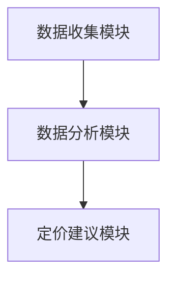
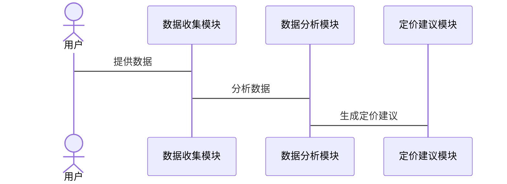

                 


# 彼得·林奇对公司定价能力的评估标准

> **关键词**: 彼得·林奇，定价能力，成本控制，市场定价，竞争定价，投资分析

> **摘要**: 本文深入探讨了彼得·林奇对公司定价能力的评估标准，分析了定价能力的核心概念、数学模型、系统架构设计、项目实战以及最佳实践。通过具体案例和代码实现，详细阐述了定价能力的评估方法，帮助投资者和企业管理者更好地理解和应用这些标准。

---

## 第1章: 定价能力的核心概念与背景

### 1.1 定价能力的定义与内涵

#### 1.1.1 定价能力的定义
定价能力是指企业在市场中制定合理价格，以实现利润最大化的同时满足市场需求的能力。彼得·林奇认为，定价能力是评估企业竞争力的重要指标，直接影响企业的盈利能力和发展潜力。

#### 1.1.2 定价能力的核心要素
定价能力的核心要素包括成本控制、市场定价能力和竞争定价能力：
- **成本控制**：企业能否以最低成本生产产品或提供服务。
- **市场定价**：企业能否根据市场需求调整价格。
- **竞争定价**：企业能否在竞争激烈的市场中制定具有竞争力的价格。

#### 1.1.3 定价能力与企业绩效的关系
定价能力直接影响企业的收入、利润和市场份额。强大的定价能力能够帮助企业在市场中占据优势，提高利润率和客户满意度。

---

### 1.2 彼得·林奇的定价能力评估背景

#### 1.2.1 彼得·林奇与投资分析
彼得·林奇是美国著名投资专家，以其在共同基金领域的卓越表现闻名。他在投资分析中强调对企业定价能力的评估，认为定价能力是企业长期盈利能力的关键因素。

#### 1.2.2 定价能力在投资分析中的重要性
定价能力是企业在市场中的核心竞争力。彼得·林奇认为，能够有效定价的企业往往具有更强的市场地位和盈利能力。

#### 1.2.3 彼得·林奇定价能力评估的理论基础
彼得·林奇的定价能力评估基于成本加成定价法和市场定价法，结合企业的成本结构、市场需求和竞争环境进行综合分析。

---

## 第2章: 定价能力的评估框架

### 2.1 定价能力的评估维度

#### 2.1.1 成本控制能力
成本控制能力是定价能力的基础。企业需要准确计算生产成本，并通过优化流程降低成本。

#### 2.1.2 市场定价能力
市场定价能力是指企业根据市场需求调整价格的能力。彼得·林奇强调，企业需要了解市场动态和消费者需求，制定灵活的价格策略。

#### 2.1.3 竞争定价能力
竞争定价能力是指企业在竞争市场中制定具有竞争力价格的能力。彼得·林奇认为，企业需要分析竞争对手的定价策略，制定合理的市场价格。

### 2.2 彼得·林奇的定价能力评估标准

#### 2.2.1 产品定价能力
产品定价能力是指企业根据产品特性制定合理价格的能力。彼得·林奇认为，企业需要考虑产品成本、市场需求和竞争环境。

#### 2.2.2 市场定价能力
市场定价能力是指企业在不同市场条件下制定价格的能力。彼得·林奇强调，企业需要根据不同市场的特点制定差异化的定价策略。

#### 2.2.3 竞争定价能力
竞争定价能力是指企业在竞争市场中制定具有竞争力价格的能力。彼得·林奇认为，企业需要通过分析竞争对手的价格策略，制定合理的市场价格。

---

## 第3章: 定价能力的数学模型与算法

### 3.1 定价能力的数学模型

#### 3.1.1 成本加成定价模型
成本加成定价模型是基于企业生产成本制定价格的方法。公式如下：
$$ P = C \times (1 + m) $$
其中，\( C \) 为单位成本，\( m \) 为加成比例。

#### 3.1.2 市场定价模型
市场定价模型是基于市场需求和竞争环境制定价格的方法。公式如下：
$$ P = D - C $$
其中，\( D \) 为需求价格弹性，\( C \) 为单位成本。

#### 3.1.3 竞争定价模型
竞争定价模型是基于竞争对手的价格制定价格的方法。公式如下：
$$ P = P_{\text{competitor}} \times (1 - \epsilon) $$
其中，\( P_{\text{competitor}} \) 为竞争对手价格，\( \epsilon \) 为价格差异比例。

### 3.2 定价能力的算法实现

#### 3.2.1 成本加成定价算法
```python
def cost_pluspricing(cost, markup):
    return cost * (1 + markup)
```

#### 3.2.2 市场定价算法
```python
def marketpricing(demand, cost):
    return demand - cost
```

#### 3.2.3 竞争定价算法
```python
def competitipricing(compete_price, epsilon):
    return compete_price * (1 - epsilon)
```

---

## 第4章: 定价能力的系统架构设计

### 4.1 系统功能设计

#### 4.1.1 数据收集模块
数据收集模块负责收集企业的成本数据、市场需求数据和竞争对手价格数据。

#### 4.1.2 数据分析模块
数据分析模块对收集的数据进行分析，计算成本加成、需求弹性等指标。

#### 4.1.3 定价建议模块
定价建议模块根据分析结果生成定价建议，并输出最优价格。

### 4.2 系统架构设计

#### 4.2.1 系统架构图


#### 4.2.2 模块交互流程


---

## 第5章: 定价能力的项目实战

### 5.1 项目环境安装

#### 5.1.1 系统环境要求
- Python 3.8 或更高版本
- pip 包管理工具

#### 5.1.2 工具安装与配置
安装必要的Python库：
```bash
pip install numpy pandas matplotlib
```

### 5.2 核心代码实现

#### 5.2.1 成本加成定价算法实现
```python
import numpy as np

def cost_pluspricing(cost, markup):
    return cost * (1 + markup)

# 示例数据
cost = np.array([10, 15, 20])
markup = 0.2

prices = cost_pluspricing(cost, markup)
print(prices)
```

#### 5.2.2 市场定价算法实现
```python
import pandas as pd

def marketpricing(demand, cost):
    return demand - cost

# 示例数据
demand = pd.Series([100, 200, 300])
cost = pd.Series([50, 60, 70])

prices = marketpricing(demand, cost)
print(prices)
```

#### 5.2.3 竞争定价算法实现
```python
def competitipricing(compete_price, epsilon):
    return compete_price * (1 - epsilon)

# 示例数据
compete_price = [80, 90, 100]
epsilon = 0.1

prices = competitipricing(compete_price, epsilon)
print(prices)
```

---

## 第6章: 定价能力评估的最佳实践

### 6.1 定价能力评估的关键点

#### 6.1.1 成本控制的重要性
企业需要通过优化生产流程降低成本，提高定价能力。

#### 6.1.2 市场分析的准确性
准确的市场分析是制定合理价格的基础。

#### 6.1.3 竞争策略的有效性
企业需要根据竞争环境制定合理的定价策略。

### 6.2 定价能力评估的注意事项

#### 6.2.1 数据质量的重要性
数据质量直接影响定价能力的评估结果。

#### 6.2.2 模型选择的合理性
选择合适的数学模型是提高定价能力的关键。

#### 6.2.3 持续优化的必要性
企业需要不断优化定价策略，以应对市场变化。

---

## 作者信息

作者：AI天才研究院/AI Genius Institute & 禅与计算机程序设计艺术 /Zen And The Art of Computer Programming

---

以上就是《彼得·林奇对公司定价能力的评估标准》的完整目录和文章内容。

