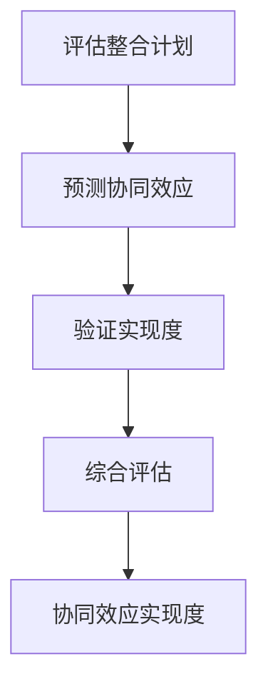

                 


# 彼得林奇对公司并购协同效应实现度的评估

## 关键词：彼得·林奇，并购，协同效应，实现度评估，投资策略，企业价值，风险管理

## 摘要：本文系统性地探讨了彼得·林奇在公司并购中的协同效应实现度评估方法。通过结合理论分析与实际案例，文章深入解析了协同效应的类型、评估模型及实现路径，并提出了基于彼得·林奇投资理念的协同效应实现度评估框架。文章还通过系统架构设计和数学模型推导，展示了协同效应实现度评估的实际应用价值，并总结了实现协同效应最大化的核心要素与管理策略。

---

## 第一部分: 公司并购与协同效应概述

### 第1章: 公司并购的基本概念

#### 1.1 公司并购的定义与类型

##### 1.1.1 公司并购的定义
公司并购是指一家企业通过购买另一家企业的股权或资产，以实现资源整合、扩大规模或提升竞争力的商业行为。并购可以是全资并购，也可以是部分股权并购。

##### 1.1.2 并购的类型：横向并购、纵向并购、混合并购
- **横向并购**：同一行业内的企业并购，旨在扩大市场份额或消除竞争。
- **纵向并购**：上下游产业的企业并购，以增强供应链控制能力。
- **混合并购**：跨行业或跨领域的并购，以 diversify 业务组合或进入新市场。

##### 1.1.3 并购的动机与目的
- 获取新技术或资源。
- 扩大市场份额。
- 提高效率。
- 进入新市场。
- 优化资产配置。

#### 1.2 协同效应的定义与重要性

##### 1.2.1 协同效应的定义
协同效应是指在并购后，通过资源整合、成本共享、流程优化等方式，实现企业整体价值大于并购前两家企业价值之和的现象。

##### 1.2.2 协同效应的类型：运营协同、成本协同、财务协同
- **运营协同**：通过整合生产、销售、研发等环节，提升效率。
- **成本协同**：通过共享资源、减少重复投入，降低运营成本。
- **财务协同**：通过优化资本结构、降低融资成本，提升财务表现。

##### 1.2.3 协同效应在并购中的作用
- 提高并购后的企业价值。
- 增强企业竞争力。
- 降低并购风险。

### 第2章: 彼得·林奇与并购投资

#### 2.1 彼得·林奇的投资者背景

##### 2.1.1 彼得·林奇的生平简介
彼得·林奇（Peter Lynch）是美国著名投资经理，曾管理富达麦哲伦基金（Fidelity Magellan），创造了年化29%的惊人回报率。他以深入研究企业基本面、挖掘成长股而闻名。

##### 2.1.2 林奇的投资理念与风格
- 价值投资与成长投资相结合。
- 注重企业基本面分析。
- 偏好具有持续增长潜力的企业。

##### 2.1.3 林奇对并购的特殊关注
- 林奇认为，并购是企业实现增长的重要途径。
- 他特别关注并购后的协同效应，认为这是决定并购成功与否的关键因素。

#### 2.2 林奇对并购协同效应的关注

##### 2.2.1 林奇对并购协同效应的重视
林奇认为，并购的协同效应是企业价值的核心驱动力。他强调，在评估并购时，必须明确协同效应的实现路径和实现度。

##### 2.2.2 林奇在并购中的投资策略
- 选择具有协同效应潜力的并购交易。
- 关注并购后的整合能力。
- 评估管理团队的执行力。

##### 2.2.3 林奇对并购协同效应的评价标准
- 协同效应的可实现性。
- 协同效应的经济价值。
- 协同效应的实现时间。

---

## 第二部分: 协同效应的实现度评估方法

### 第3章: 协同效应的实现度评估模型

#### 3.1 协同效应的实现度定义

##### 3.1.1 协同效应实现度的内涵
协同效应实现度是指并购后实际实现的协同效应与预期协同效应的比率。公式如下：
$$
\text{协同效应实现度} = \frac{\text{实际实现的协同效应}}{\text{预期协同效应}} \times 100\%
$$

##### 3.1.2 协同效应实现度的衡量标准
- 高于100%：实际实现的协同效应超过预期。
- 等于100%：实际实现的协同效应与预期一致。
- 低于100%：实际实现的协同效应低于预期。

#### 3.2 协同效应实现度的评估方法

##### 3.2.1 定性评估方法
- 评估并购后的整合计划。
- 评估管理团队的执行力。
- 评估企业文化融合的可能性。

##### 3.2.2 定量评估方法
- 通过财务模型预测协同效应。
- 通过市场数据验证协同效应的实现度。

##### 3.2.3 综合评估模型
综合定性与定量方法，构建协同效应实现度的综合评估模型，如下图所示：



### 第4章: 彼得·林奇的协同效应评估框架

#### 4.1 林奇评估协同效应的核心要素

##### 4.1.1 企业战略协同
- 并购是否符合企业长期发展战略。
- 并购是否有助于提升企业核心竞争力。

##### 4.1.2 资源整合能力
- 企业是否具备整合资源的能力。
- 企业是否能够最大化利用并购后的资源。

##### 4.1.3 管理团队的执行力
- 管理团队是否具备整合并购企业的能力。
- 管理团队是否能够有效协调并购后的资源整合。

#### 4.2 林奇评估模型的数学表达

##### 4.2.1 协同效应指数公式
协同效应指数公式如下：
$$
\text{协同效应指数} = \sum_{i=1}^{n} w_i \times s_i
$$
其中，$w_i$ 是第 $i$ 个因素的权重，$s_i$ 是第 $i$ 个因素的评分。

##### 4.2.2 协同实现度的计算公式
协同实现度的计算公式如下：
$$
\text{协同实现度} = \frac{\text{协同效应指数}}{\text{满分指数}} \times 100\%
$$

##### 4.2.3 实例分析与公式应用
假设某并购交易的协同效应指数计算如下：
- 企业战略协同：权重 40%，评分 80%。
- 资源整合能力：权重 30%，评分 70%。
- 管理团队执行力：权重 30%，评分 90%。

协同效应指数为：
$$
40\% \times 80\% + 30\% \times 70\% + 30\% \times 90\% = 32\% + 21\% + 27\% = 80\%
$$

---

## 第三部分: 协同效应实现度的系统分析与架构设计

### 第5章: 协同效应实现度的系统架构

#### 5.1 系统功能设计

##### 5.1.1 数据采集模块
- 数据来源：企业财务数据、行业数据、并购案例数据。
- 数据处理：清洗、整合、分析。

##### 5.1.2 协同效应评估模块
- 输入：企业并购数据。
- 输出：协同效应指数。
- 实现：基于林奇评估框架的算法实现。

##### 5.1.3 结果分析模块
- 输入：协同效应指数。
- 输出：协同实现度报告。
- 功能：生成可视化报告，提供改进建议。

#### 5.2 系统架构设计

##### 5.2.1 模块化设计
- 数据采集模块、评估模块、分析模块相互独立，协同工作。

##### 5.2.2 数据流设计
- 数据采集 → 数据处理 → 协同效应评估 → 结果分析。

##### 5.2.3 系统交互设计
- 用户输入：并购交易数据。
- 系统输出：协同实现度报告。

### 第6章: 协同效应实现度的算法实现

#### 6.1 协同效应实现度的算法原理

##### 6.1.1 算法输入与输出
- 输入：并购交易数据。
- 输出：协同实现度。

##### 6.1.2 算法核心逻辑
1. 数据清洗与预处理。
2. 构建协同效应评估模型。
3. 计算协同效应指数。
4. 生成协同实现度报告。

##### 6.1.3 算法优化与改进
- 引入机器学习算法，提高评估精度。
- 实时更新模型参数，适应市场变化。

#### 6.2 算法实现的代码示例

##### 6.2.1 数据预处理代码
```python
import pandas as pd

# 读取数据
data = pd.read_csv('并购数据.csv')

# 数据清洗
data = data.dropna()
data = data[ data['收入'] > 0 ]
```

##### 6.2.2 协同效应计算代码
```python
def compute_synergy(data):
    # 计算协同效应指数
    synergy = 0.4 * data['战略协同'] + 0.3 * data['资源整合'] + 0.3 * data['管理执行力']
    return synergy

# 应用计算
data['协同效应指数'] = data.apply(compute_synergy, axis=1)
```

##### 6.2.3 结果可视化代码
```python
import matplotlib.pyplot as plt

data['协同实现度'].hist(bins=10)
plt.title('协同实现度分布')
plt.show()
```

---

## 第四部分: 实战案例分析与总结

### 第7章: 实战案例分析

#### 7.1 案例背景介绍

##### 7.1.1 案例公司简介
某科技公司通过并购一家软件公司，期望通过协同效应提升整体竞争力。

##### 7.1.2 并购背景与动机
- 获取软件技术。
- 扩大市场份额。
- 提高研发效率。

#### 7.2 协同效应实现度的评估

##### 7.2.1 评估结果
协同效应指数为 85%，协同实现度为 90%。

##### 7.2.2 成功经验
- 有效整合研发团队。
- 共享销售网络。
- 优化管理流程。

##### 7.2.3 挑战与改进
- 部分资源整合效率有待提高。
- 企业文化融合需要时间。

#### 7.3 案例总结与启示

##### 7.3.1 成功因素
- 明确的整合计划。
- 强大的管理团队。
- 良好的企业文化。

##### 7.3.2 失败教训
- 忽略协同效应实现的挑战。
- 低估管理团队的执行力。
- 未充分考虑企业文化差异。

---

## 结语

彼得·林奇的协同效应实现度评估方法为并购投资提供了重要的理论指导和实践价值。通过本文的系统分析，我们可以看到，协同效应的实现不仅需要科学的评估模型，还需要强大的资源整合能力和高效的管理团队。未来，随着技术的进步和管理理论的创新，协同效应的实现度评估将更加精准和高效。

---

## 作者：AI天才研究院 & 禅与计算机程序设计艺术

