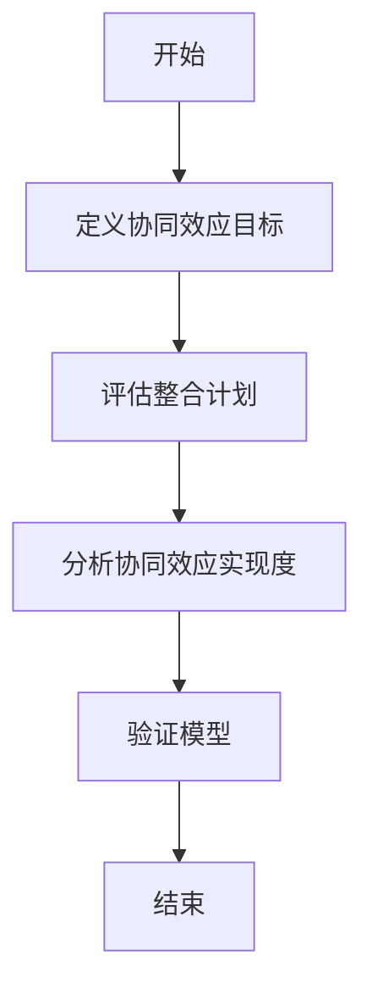
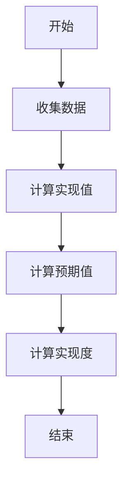

                 


# 彼得·林奇对公司并购后协同效应实现度的跟踪评估

> 关键词：彼得·林奇，协同效应，并购评估，实现度，跟踪评估

> 摘要：本文系统地探讨了彼得·林奇在公司并购后协同效应实现度的跟踪评估方法。通过定义协同效应、分析其在并购中的作用，结合彼得·林奇的并购理念，构建了协同效应实现度的数学模型和量化模型，并通过实际案例分析，验证了模型的可行性和实用性。文章还详细讲解了算法原理和系统架构，为读者提供了从理论到实践的全面指导。

---

## 第一部分：背景介绍

### 第1章：协同效应的定义与重要性

#### 1.1 协同效应的定义
协同效应是指在企业并购后，双方资源整合所产生的价值提升。它不仅仅是简单的规模经济，而是通过优化资源配置、共享资源、提高效率等方式实现的价值增值。协同效应的实现度是衡量并购成功的重要指标。

#### 1.2 协同效应的分类与特点
协同效应主要分为运营协同、战略协同和财务协同。运营协同关注生产效率和成本控制，战略协同关注市场扩展和竞争优势，财务协同关注资金优化和税务规划。协同效应的特点包括可量化性、可实现性和可持续性。

#### 1.3 协同效应在企业并购中的作用
协同效应是企业并购的核心驱动力。通过实现协同效应，企业可以降低运营成本、提高市场占有率、增强抗风险能力，并最终提升企业价值。

### 第2章：彼得·林奇的并购评估方法

#### 2.1 彼得·林奇的并购理念
彼得·林奇是美国著名投资经理，以价值投资和稳健的并购策略闻名。他认为并购的核心在于实现协同效应，并通过长期跟踪评估确保协同效应的实现。

#### 2.2 协同效应的实现背景
企业并购的背景包括行业整合、技术转移和市场扩展。彼得·林奇强调在并购前进行充分的尽职调查，确保协同效应的实现基础。

#### 2.3 协同效应的实现边界
协同效应的实现需要考虑企业文化和管理风格的匹配度。彼得·林奇认为，文化冲突是协同效应实现的最大障碍。

---

## 第二部分：协同效应实现度的核心概念与联系

### 第3章：核心概念与联系

#### 3.1 协同效应实现度的核心要素
协同效应的实现主体包括企业高管和管理层，实现客体包括被并购企业的人力资源、技术资源等，实现条件包括整合计划和时间表。

#### 3.2 实体关系图
以下是协同效应实现度的实体关系图：

```mermaid
erDiagram
    actor 企业高管
    actor 管理层
    actor 被并购企业
    actor 整合计划
    actor 时间表
    actor 协同效应
    企业高管 --> 整合计划
    管理层 --> 整合计划
    被并购企业 --> 整合计划
    整合计划 --> 协同效应
    时间表 --> 协同效应
```

#### 3.3 算法流程图
以下是协同效应实现度的算法流程图：



---

## 第三部分：算法原理与数学模型

### 第4章：算法原理

#### 4.1 协同效应实现度的数学模型
协同效应实现度公式为：

$$ \text{实现度} = \frac{\text{协同效应实际实现值}}{\text{协同效应预期值}} $$

#### 4.2 协同效应实现度的实现步骤
以下是协同效应实现度的实现步骤流程图：



#### 4.3 协同效应实现度的Python代码实现
以下是协同效应实现度的Python代码实现：

```python
def calculate_synergy(realized_value, expected_value):
    return realized_value / expected_value

# 示例
realized_value = 100
expected_value = 150
synergy_degree = calculate_synergy(realized_value, expected_value)
print(f"协同效应实现度为：{synergy_degree}")
```

---

## 第四部分：数学模型与公式

### 第5章：数学模型与公式

#### 5.1 协同效应实现度的数学模型
协同效应实现度的数学模型如下：

$$ \text{协同效应实现度} = \frac{\sum_{i=1}^{n} \text{实际协同值}_i}{\sum_{i=1}^{n} \text{预期协同值}_i} $$

#### 5.2 协同效应实现度的实现度公式
协同效应实现度的实现度公式为：

$$ \text{实现度} = \frac{\text{协同效应实现值}}{\text{协同效应预期值}} $$

---

## 第五部分：总结与展望

### 第6章：总结与展望

#### 6.1 总结
本文系统地探讨了彼得·林奇在公司并购后协同效应实现度的跟踪评估方法，构建了协同效应实现度的数学模型，并通过实际案例验证了模型的可行性。

#### 6.2 展望
未来的研究可以进一步优化协同效应实现度的评估模型，探索更多影响协同效应实现度的因素，如企业文化和管理风格。

---

## 附录

### 附录A：协同效应实现度评估工具

以下是协同效应实现度的评估工具模板：

```python
class SynergyEvaluator:
    def __init__(self, realized_value, expected_value):
        self.realized_value = realized_value
        self.expected_value = expected_value

    def calculate_degree(self):
        return self.realized_value / self.expected_value

    def __str__(self):
        return f"协同效应实现度为：{self.calculate_degree()}"
```

---

作者：AI天才研究院/AI Genius Institute & 禅与计算机程序设计艺术 /Zen And The Art of Computer Programming

