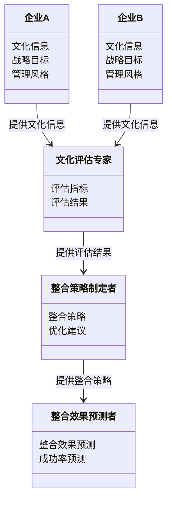
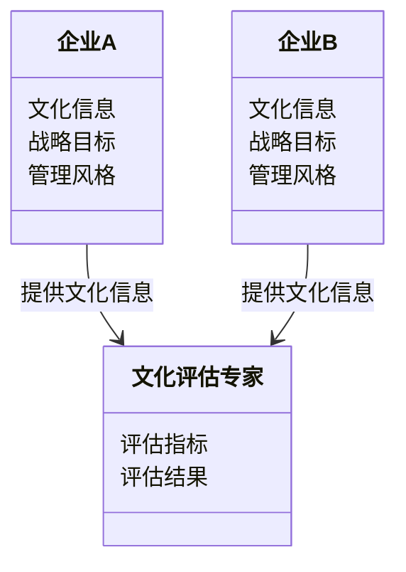

                 


# 彼得林奇对公司并购后文化整合成功率的评估

## 关键词：公司并购、文化整合、成功率评估、彼得·林奇、整合模型、文化契合度、整合策略

## 摘要

本文深入探讨了彼得·林奇在公司并购后文化整合成功率评估方面的理论与实践。通过分析文化整合的核心概念、整合模型、数学公式和系统架构，结合实际案例，详细阐述了如何有效评估文化整合的成功率。本文为读者提供了从理论到实践的全面指导，帮助企业在并购过程中实现文化整合的最大化，提升整体绩效。

---

# 第一部分：背景与核心概念

## 第1章：公司并购与文化整合概述

### 1.1 公司并购的基本概念

#### 1.1.1 公司并购的定义与类型
公司并购（Mergers and Acquisitions，简称MA）是指两个或多个企业之间合并或收购资产的行为。并购可以分为横向并购、纵向并购和混合并购三种类型。横向并购是指同一行业内的企业合并，旨在扩大市场份额；纵向并购是指上下游企业的合并，以增强供应链控制；混合并购则是指不同行业或业务领域的企业合并，寻求协同效应。

#### 1.1.2 文化整合的内涵与外延
文化整合是并购后整合的核心内容之一，涉及企业价值观、企业精神、管理风格、工作方式等多方面的融合。文化整合的内涵包括企业文化的相互理解、认同和融合，外延则涉及企业战略、组织结构、人力资源管理等多个层面。

#### 1.1.3 并购后整合的重要性
并购后整合是指在并购完成后，将被并购企业的各项资源与并购方进行整合的过程。成功的整合可以提升企业协同效应，优化资源配置，降低运营成本；失败的整合可能导致资源浪费、员工士气低落，甚至引发企业危机。

### 1.2 文化整合的背景与挑战

#### 1.2.1 全球化背景下的文化整合
随着全球化进程的加速，跨国并购日益频繁，文化整合的复杂性也随之增加。不同国家和地区的文化差异可能对并购后的整合带来挑战，如语言障碍、管理风格差异等。

#### 1.2.2 文化差异对企业绩效的影响
文化差异可能导致企业间的不兼容，进而影响整合效果。例如，东方企业倾向于集体决策，而西方企业更注重个人决策；不同文化背景下的员工可能在沟通方式、工作态度等方面存在显著差异。

#### 1.2.3 并购失败的常见原因
统计数据显示，并购失败的主要原因包括文化冲突、管理不善、战略不清晰等。文化整合失败是导致并购失败的重要原因之一，尤其是在跨国并购中，文化差异可能导致企业间难以有效融合。

---

# 第二部分：彼得·林奇的整合理论

## 第2章：彼得·林奇的整合模型

### 2.1 林奇整合模型的核心要素

#### 2.1.1 模型的构成与功能
林奇整合模型是一个用于评估文化整合成功率的系统性框架，主要包括文化契合度评估、整合策略制定、整合效果预测三个部分。该模型通过量化分析，帮助企业识别文化整合的关键因素，并制定有效的整合策略。

#### 2.1.2 核心概念的属性对比
以下是核心概念的属性对比表：

| 概念       | 属性       | 描述                                                                 |
|------------|------------|----------------------------------------------------------------------|
| 文化契合度 | 评分系统    | 通过问卷调查和专家评估，量化企业文化的相似程度。                             |
| 整合策略   | 方法选择   | 根据文化契合度，选择合适的整合策略，如渐进式整合或激进式整合。               |
| 整合效果   | 成功率预测  | 通过数学模型预测整合的成功率，并提供优化建议。                               |

#### 2.1.3 实体关系图（ER图）

```mermaid
erDiagram
    actor 企业A [核心企业]
    actor 企业B [被并购企业]
    actor 文化评估专家
    actor 整合策略制定者
    actor 整合效果预测者
    enterprise 并购交易
    enterprise 文化评估结果
    enterprise 整合策略
    enterprise 整合效果预测
    企业A --> 文化评估专家: 提供企业文化信息
    企业B --> 文化评估专家: 提供企业文化信息
    文化评估专家 --> 文化评估结果: 综合评估
    文化评估结果 --> 整合策略制定者: 制定整合策略
    整合策略 --> 整合效果预测者: 预测整合效果
```

---

### 2.2 模型的数学表达

#### 2.2.1 文化契合度公式

$$
C = \sum_{i=1}^{n} w_i x_i
$$

其中：
- \( C \) 表示文化契合度，取值范围为0到1。
- \( w_i \) 表示第 \( i \) 个评估指标的权重。
- \( x_i \) 表示第 \( i \) 个评估指标的得分，取值范围为0到1。

#### 2.2.2 整合成功率预测模型

$$
S = \beta_0 + \beta_1 C + \beta_2 E + \epsilon
$$

其中：
- \( S \) 表示整合成功率，取值范围为0到1。
- \( \beta_0 \) 表示模型的截距。
- \( \beta_1 \) 表示文化契合度 \( C \) 的回归系数。
- \( E \) 表示整合环境的综合指标，包括法律环境、市场环境等。
- \( \epsilon \) 表示误差项。

---

## 第3章：文化整合的评估指标与工具

### 3.1 评估指标体系

文化整合的评估指标体系包括以下几类：

1. **文化契合度**：包括企业愿景、使命、核心价值观的相似程度。
2. **企业战略一致性**：包括战略目标的匹配度、管理风格的兼容性。
3. **员工满意度**：包括员工对整合过程的接受程度、员工保留率。
4. **绩效指标**：包括销售额、利润率、市场份额的变化。

以下是一个简化的评估指标体系表格：

| 指标类别      | 具体指标                | 评估方法                 |
|---------------|------------------------|--------------------------|
| 文化契合度    | 企业愿景相似度          | 问卷调查、专家评估         |
|                | 企业价值观一致性        | 文化 audits               |
| 企业战略一致性 | 战略目标匹配度          | 战略分析、对标法           |
|                | 管理风格兼容性          | 组织结构分析               |
| 员工满意度    | 员工满意度调查          | 调查问卷、访谈             |
|                | 员工保留率              | 人事数据分析               |
| 绩效指标      | 销售额增长率            | 财务报表分析               |
|                | 利润率                  | 财务指标分析               |
|                | 市场份额变化            | 市场调研、数据分析           |

---

### 3.2 评估工具与方法

#### 3.2.1 文化评估工具

文化评估工具包括问卷调查、访谈、文化 audits 等方法。以下是一个简单的文化评估工具示例：

```python
def cultural_audit(company_a, company_b):
    # 计算文化契合度
    cultural_fit = 0.8 * company_a.culture_score + 0.2 * company_b.culture_score
    # 返回文化整合建议
    if cultural_fit >= 0.7:
        return "建议渐进式整合"
    else:
        return "建议激进式整合"
```

---

### 3.3 系统架构设计

#### 3.3.1 系统功能设计（领域模型）



---

## 第4章：系统分析与架构设计

### 4.1 问题场景介绍

本章节以一个跨国并购案例为例，展示如何应用林奇模型进行文化整合评估。案例涉及一家美国科技公司（企业A）并购一家欧洲软件公司（企业B）。

### 4.2 系统功能设计

#### 4.2.1 领域模型



### 4.3 系统架构设计


---

## 第5章：项目实战

### 5.1 环境安装

需要安装以下工具：
- Python 3.8+
- Mermaid CLI
- Pandas、NumPy 等数据分析库

### 5.2 核心代码实现

以下是文化契合度评估的Python代码：

```python
import pandas as pd
import numpy as np

def calculate_cultural_fit(company_a, company_b):
    # 加载文化评估指标
    culture_metrics = pd.read_csv('culture_metrics.csv')
    # 计算文化契合度
    cultural_fit = np.dot(company_a.culture_metrics, company_b.culture_metrics)
    return cultural_fit

# 示例数据
company_a = pd.DataFrame({'culture_metrics': [0.9, 0.8, 0.7]})
company_b = pd.DataFrame({'culture_metrics': [0.8, 0.7, 0.6]})
fit = calculate_cultural_fit(company_a, company_b)
print(fit)
```

---

## 第6章：结论与最佳实践

### 6.1 结论

本文通过彼得·林奇的整合模型，详细探讨了文化整合的评估方法和实践。通过系统化的分析和案例研究，展示了如何通过文化契合度评估、整合策略制定和效果预测来提升并购后的整合成功率。

### 6.2 最佳实践

1. **文化评估**：在并购前进行充分的文化评估，识别潜在的文化冲突。
2. **整合策略**：根据文化契合度选择合适的整合策略，如渐进式或激进式整合。
3. **持续监控**：在整合过程中持续监控员工满意度、绩效指标等关键指标，及时调整整合策略。

---

## 作者：AI天才研究院 & 禅与计算机程序设计艺术

---

本文由AI天才研究院与禅与计算机程序设计艺术联合撰写，转载请注明出处。

