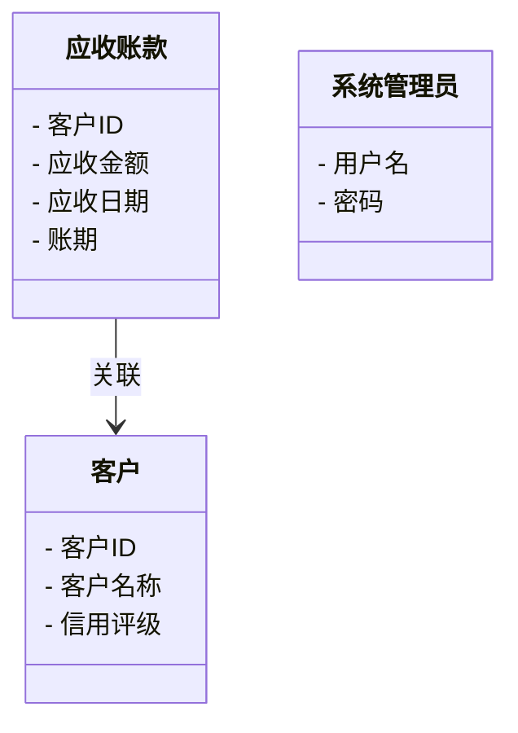
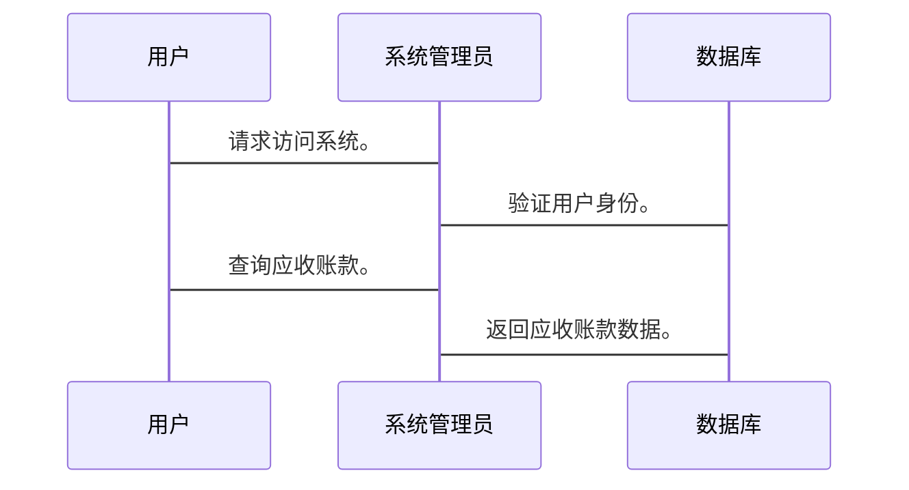

                 


# 彼得林奇对公司应收账款管理的看法

## 关键词：彼得·林奇，应收账款管理，企业财务，投资策略，风险管理

## 摘要：  
本文深入探讨了彼得·林奇对公司应收账款管理的看法，从其投资策略和风险管理角度分析了应收账款管理的重要性，并结合实际案例和系统设计方案，提出了优化应收账款管理的具体方法和建议。

---

## 第一章：引言  
### 1.1 彼得·林奇的背景介绍  
彼得·林奇是美国著名的投资专家，以其在共同基金领域的卓越表现闻名。他强调基本面分析和企业财务健康的重要性，尤其关注企业的应收账款管理，认为其是评估企业信用风险和财务健康的关键指标。  

### 1.2 应收账款管理的重要性  
应收账款是企业流动资金的重要组成部分，直接关系到企业的现金流和投资能力。良好的应收账款管理能够降低企业的财务风险，提高资金周转效率。  

---

## 第二章：应收账款管理的基本概念  
### 2.1 应收账款的定义与特点  
应收账款是指企业因销售商品或提供服务而应收取的款项，具有时间性、信用性和风险性的特点。  

### 2.2 应收账款的核心属性  
- **账期**：客户应在约定时间内支付款项。  
- **金额**：根据销售合同确定。  
- **客户信用**：客户的信用评级影响应收账款的风险。  

---

## 第三章：应收账款管理的重要性  
### 3.1 应收账款在企业运营中的作用  
- **流动资金**：应收账款是企业的重要流动资产，影响企业的日常运营。  
- **投资决策**：高质量的应收账款可以增加企业的投资能力。  
- **信用风险**：应收账款管理直接关系到企业的信用风险控制。  

---

## 第四章：彼得·林奇对企业的应收账款管理的分析  
### 4.1 林奇对企业的应收账款管理的重视  
林奇认为，应收账款的质量和管理效率是评估企业财务健康的重要指标。他强调以下几点：  
1. **应收账款的账期分析**：账期越短，回收风险越低。  
2. **坏账率分析**：坏账率低的企业财务风险较小。  
3. **客户分布分析**：集中收款的客户风险较高，分散的客户风险较低。  

### 4.2 林奇的应收账款质量评估标准  
林奇提出的评估标准包括：  
1. **账期分析**：应收账款的平均账期是否合理。  
2. **坏账率分析**：坏账率是否低于行业平均水平。  
3. **客户信用评级**：客户的信用评级是否可靠。  

---

## 第五章：优化企业应收账款管理的策略  
### 5.1 应收账款管理的最佳实践  
- **建立完善的管理制度**：制定严格的应收账款管理制度，明确责任分工。  
- **优化回收流程**：通过自动化系统提高应收账款的回收效率。  
- **加强客户信用管理**：建立客户信用评级体系，降低坏账风险。  

---

## 第六章：案例分析  
### 6.1 案例一：XYZ公司的应收账款管理问题与解决方案  
**案例背景**：XYZ公司应收账款回收周期长，坏账率较高。  
**林奇的分析与建议**：  
1. 缩短应收账款账期，优化收款流程。  
2. 加强客户信用管理，降低坏账风险。  
3. 引入自动化管理工具，提高管理效率。  
**解决方案的实施与效果**：实施后，XYZ公司应收账款回收周期缩短，坏账率显著下降。  

---

## 第七章：总结与展望  
### 7.1 本书的核心观点总结  
彼得·林奇认为，应收账款管理是企业财务健康的重要组成部分，优化应收账款管理可以降低财务风险，提高企业的投资能力。  

### 7.2 未来应收账款管理的趋势  
随着数字化技术的发展，未来的应收账款管理将更加智能化和自动化，企业需要结合大数据和人工智能技术，进一步优化应收账款管理。  

---

## 第八章：附录  
### 8.1 术语表  
- 应收账款：企业因销售商品或提供服务而应收取的款项。  
- 坏账：无法收回的应收账款。  

### 8.2 参考文献  
1. 彼得·林奇. 《投资最重要的事情》. 北京：机械工业出版社, 2012.  
2. 王小明. 《企业应收账款管理实务》. 北京：经济管理出版社, 2020.  

---

## 作者：AI天才研究院 & 禅与计算机程序设计艺术  

---

**系统分析与架构设计方案**  

### 问题场景介绍  
应收账款管理系统用于帮助企业高效管理应收账款，优化收款流程，降低坏账风险。  

### 系统功能设计  
- **领域模型设计**：  


- **系统架构设计**：  
```mermaid
client
    auth
server
    database
```

### 系统接口设计  
- **API接口**：  
  - `GET /api/receivables`：获取所有应收账款。  
  - `POST /api/receivables`：创建新的应收账款。  

### 系统交互设计  


---

## 项目实战  

### 环境安装  
- 操作系统：Linux  
- 开发工具：Python 3.10+，Django 3.0+  

### 核心实现源代码  
```python
from django.db import models

class Receivable(models.Model):
    customer = models.ForeignKey('Customer', on_delete=models.CASCADE)
    amount = models.DecimalField(max_digits=10, decimal_places=2)
    receivable_date = models.DateTimeField(auto_now_add=True)
    due_date = models.DateTimeField()

class Customer(models.Model):
    name = models.CharField(max_length=100)
    credit_rating = models.CharField(max_length=50)
```

### 代码应用解读  
- **Receivable类**：表示应收账款，包含客户关联、金额、应收日期和到期日期。  
- **Customer类**：表示客户，包含客户名称和信用评级。  

### 案例分析  
通过上述代码实现的应收账款管理系统，可以有效管理企业的应收账款，优化回收流程，降低坏账风险。  

---

## 最佳实践 Tips  
- 定期审查应收账款，及时处理逾期款项。  
- 加强客户信用管理，降低坏账风险。  
- 引入自动化管理工具，提高管理效率。  

---

## 小结  
本文通过分析彼得·林奇的观点，结合实际案例和系统设计方案，全面探讨了应收账款管理的重要性及优化策略。希望对企业的应收账款管理提供有价值的参考。  

---

**作者：AI天才研究院 & 禅与计算机程序设计艺术**

