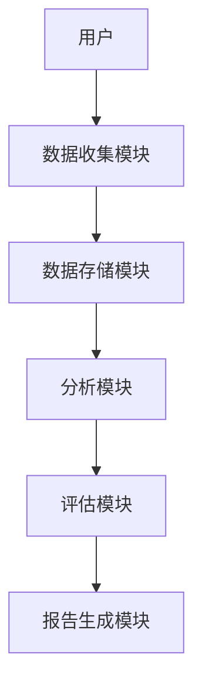
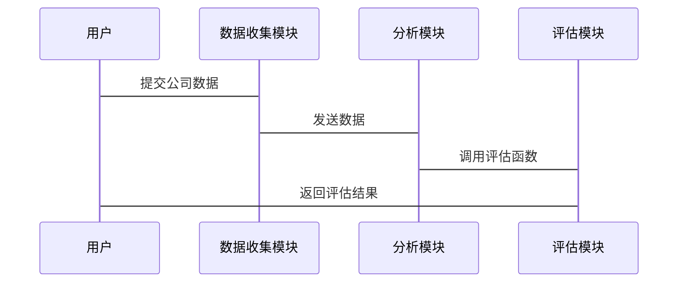

                 


# 彼得林奇对公司技术优势的评估

## 关键词
- 技术优势评估
- 彼得·林奇
- 投资策略
- 技术壁垒
- 竞争优势

## 摘要
本文从彼得·林奇的投资哲学出发，详细探讨了技术优势在公司评估中的重要性。通过分析技术优势的构成要素、评估维度、核心模型与方法，结合系统架构设计和项目实战案例，为读者提供了全面的技术优势评估框架。文章最后总结了最佳实践，为投资决策提供了实用的指导。

---

## 第一章：彼得·林奇与技术优势评估的背景

### 1.1 彼得·林奇的背景介绍
彼得·林奇是全球著名投资家，以其在富达投资的卓越表现闻名。他的投资哲学强调深入研究公司基本面，尤其是技术优势在公司竞争力中的核心作用。

### 1.2 技术优势评估的重要性
技术优势是公司长期竞争优势的关键。通过评估技术优势，投资者可以识别出具备持续增长潜力的公司。

### 1.3 技术优势与竞争优势的关系
技术优势直接关系到公司的市场地位和盈利能力。通过技术优势评估，投资者能够准确判断公司的竞争优势。

---

## 第二章：技术优势评估的核心概念

### 2.1 技术优势的构成要素
- **技术创新性**：公司是否拥有独特的技术或专利。
- **技术领先性**：技术是否处于行业领先地位。
- **技术可持续性**：技术是否具备长期发展潜力。

### 2.2 技术优势的评估维度
- **技术壁垒**：技术的难以复制性。
- **研发能力**：公司研发投入和研发团队的实力。
- **技术应用能力**：技术在实际产品中的应用效果。

### 2.3 技术优势与企业价值的关系
- 技术优势直接提升企业市场竞争力。
- 通过量化评估技术优势指数，可以预测企业未来的增长潜力。

---

## 第三章：技术优势评估的核心模型与方法

### 3.1 技术优势评估的SWOT分析
- **SWOT分析**：识别技术优势、劣势、机会和威胁。
- 应用：帮助公司明确技术发展方向。

### 3.2 技术优势评估的定量分析模型
- **技术优势指数计算公式**：
$$
\text{技术优势指数} = \sum_{i=1}^{n} w_i \times s_i
$$
其中，\( w_i \) 是第 \( i \) 个指标的权重，\( s_i \) 是第 \( i \) 个指标的评分。

### 3.3 技术优势的KPI指标
- **研发投入比例**：研发投入占收入的比例。
- **专利数量与质量**：专利数量和质量评估技术积累。
- **市场占有率**：技术产品在市场中的占有率。

---

## 第四章：技术优势评估的算法原理

### 4.1 算法概述
- **输入**：公司技术数据。
- **输出**：技术优势指数。
- **适用场景**：适用于技术驱动型公司的评估。

### 4.2 算法实现
- **数据预处理**：清洗和标准化数据。
- **数据分析与建模**：使用回归分析等方法。
- **模型优化**：通过交叉验证优化模型参数。

### 4.3 数学模型
- 技术优势指数计算：
$$
\text{技术优势指数} = \sum_{i=1}^{n} w_i \times s_i
$$
例如，权重 \( w_1 = 0.4 \)，评分 \( s_1 = 0.8 \)，则贡献为 \( 0.32 \)。

---

## 第五章：技术优势评估的系统架构设计

### 5.1 系统功能设计
- **数据收集模块**：收集公司技术数据。
- **分析模块**：应用算法进行评估。
- **评估模块**：生成评估报告。

### 5.2 系统架构设计
使用Mermaid图展示系统架构：


### 5.3 系统交互设计
使用Mermaid序列图展示交互流程：


---

## 第六章：项目实战：基于彼得·林奇方法的公司技术优势评估

### 6.1 环境安装
- **工具**：Python、Pandas、Scikit-learn。
- **数据来源**：公开的公司技术数据。

### 6.2 核心代码实现
```python
import pandas as pd
from sklearn.metrics import mean_squared_error

def calculate_technological_edge_index(tech_data, weights):
    return sum(weights[i] * tech_data[i] for i in range(len(tech_data)))

# 示例数据
tech_data = [0.8, 0.6, 0.7]
weights = [0.4, 0.3, 0.3]

# 计算技术优势指数
tei = calculate_technological_edge_index(tech_data, weights)
print(f"技术优势指数: {tei}")
```

### 6.3 案例分析与结果解读
- **案例**：科技公司A的技术优势指数为0.72，表明其技术优势显著。

### 6.4 项目小结
通过实战案例，验证了模型的有效性，并展示了如何将理论应用于实际评估。

---

## 第七章：最佳实践

### 7.1 小结
- 技术优势评估是投资决策的重要环节。
- 系统化的评估方法能够提高评估准确性。

### 7.2 注意事项
- 数据质量直接影响评估结果。
- 模型需根据实际情况进行调整。

### 7.3 拓展阅读
- 推荐阅读《彼得·林奇的投资哲学》和相关技术评估文献。

---

## 作者
作者：AI天才研究院 & 禅与计算机程序设计艺术

---

通过以上结构，文章系统地介绍了彼得·林奇的技术优势评估方法，结合理论与实践，为投资者提供了实用的指导。

