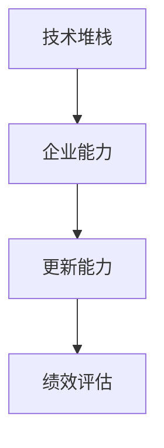
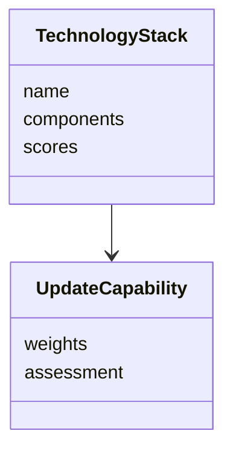
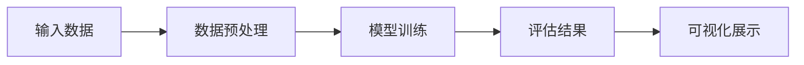
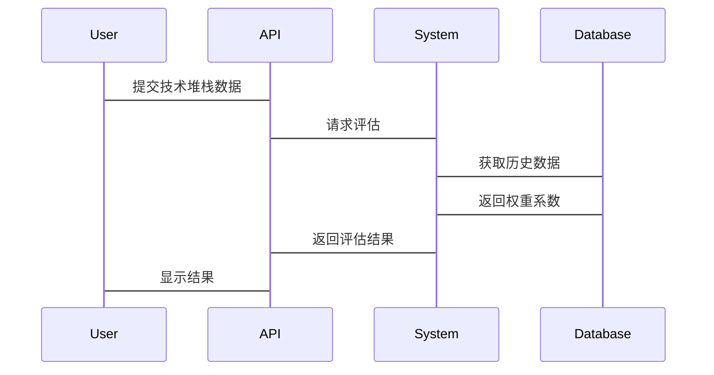

                 


# 彼得林奇对公司技术堆栈更新能力的评估框架

---

## 关键词：技术堆栈、更新能力、评估框架、企业能力、彼得林奇、系统架构

---

## 摘要：  
本文基于彼得·林奇的投资理念，提出了一套对公司技术堆栈更新能力的评估框架。该框架通过分析技术堆栈的构成、更新能力的影响因素以及企业绩效之间的关系，结合数学模型和系统架构设计，为投资者和企业管理者提供了一种科学的评估方法。文章详细阐述了评估的核心概念、算法原理、系统架构以及实际案例，旨在帮助企业优化技术更新能力，提升竞争力。

---

## 第一部分：背景介绍

### 第1章：技术堆栈更新能力评估的背景与意义

#### 1.1 问题背景  
- 技术更新对企业竞争力的影响：  
  在当今快速变化的技术环境中，企业必须不断更新其技术堆栈以保持竞争优势。技术堆栈的更新能力直接影响企业的市场响应速度、产品创新能力和运营效率。  
- 技术堆栈更新的挑战与机遇：  
  技术更新不仅需要资金和时间投入，还需要企业在技术选型、团队能力、外部合作等方面具备较强的综合实力。然而，技术更新也为企业带来了提升效率、降低成本和开拓新市场的机遇。  

#### 1.2 问题描述  
- 技术堆栈的定义与构成：  
  技术堆栈通常包括前端技术、后端技术、数据库、开发工具、部署环境等多个组成部分。不同行业和企业规模的技术堆栈可能差异较大。  
- 技术堆栈更新的常见问题：  
  企业在技术堆栈更新过程中可能面临技术兼容性差、团队技能不足、成本过高以及技术选型不当等问题。  

#### 1.3 问题解决  
- 技术堆栈更新能力评估的目标：  
  通过评估技术堆栈的更新能力，帮助企业识别技术瓶颈，优化技术选型，提升更新效率。  
- 评估框架的核心要素：  
  包括技术架构的可扩展性、开发团队的能力、技术更新的资源投入以及外部合作的稳定性。  

#### 1.4 边界与外延  
- 技术堆栈更新能力的适用范围：  
  适用于企业IT系统的技术更新评估，不包括硬件设备和物理基础设施的更新。  
- 与其他评估模型的区别：  
  本框架注重技术堆栈的动态更新能力，而其他模型可能侧重于技术的静态性能评估。  

#### 1.5 概念结构与核心要素  
- 核心概念对比分析：  
  技术堆栈更新能力与企业绩效之间的关系需要通过具体案例和数据分析来验证。  

---

## 第二部分：核心概念与联系

### 第2章：技术堆栈更新能力评估的核心概念

#### 2.1 技术堆栈的定义与分类  
- 技术堆栈的层次结构：  
  技术堆栈可以分为前端、后端、数据库、开发工具等层次，每一层都有多种技术选型。  
- 主流技术堆栈的对比分析：  
  例如，前端技术包括React、Vue、Angular等，后端技术包括Node.js、Python、Java等。  

#### 2.2 评估框架的原理与特点  
- 框架的设计思路：  
  通过权重系数和实际表现的结合，量化技术堆栈的更新能力。  
- 框架的核心算法与流程：  
  包括数据采集、权重计算、表现评估和综合评分四个步骤。  

#### 2.3 核心概念对比分析  
- 技术堆栈与企业能力的关系：  
  技术堆栈的更新能力反映了企业的技术积累和创新能力。  
- 更新能力与企业绩效的关联：  
  技术堆栈的更新能力越强，企业的市场竞争力越强。  

#### 2.4 实体关系图  


---

## 第三部分：算法原理讲解

### 第3章：评估框架的算法与实现

#### 3.1 算法原理  
- 评估框架的数学模型：  
  使用加权评分法，公式为：  
  $$ S = \sum_{i=1}^{n} w_i \cdot x_i $$  
  其中，$w_i$ 是第$i$个评估维度的权重，$x_i$ 是第$i$个维度的实际表现分数。  

#### 3.2 算法实现  
- 数据预处理：  
  收集企业技术堆栈的各维度数据，包括技术架构、团队能力、资源投入等。  
- 模型训练：  
  根据历史数据计算各维度的权重系数。  
- 评估与优化：  
  使用实际案例验证模型的准确性，并根据反馈进行参数调优。  

#### 3.3 算法实现代码  
```python
def calculate_technology_stack_score(technology_stack_data):
    weights = [0.4, 0.3, 0.2, 0.1]  # 示例权重
    scores = []
    for tech in technology_stack_data:
        score = sum(w * s for w, s in zip(weights, tech['scores']))
        scores.append(score)
    return scores

# 示例数据
technology_stack_data = [
    {'scores': [0.8, 0.7, 0.6, 0.5]},
    {'scores': [0.6, 0.8, 0.7, 0.9]}
]
result = calculate_technology_stack_score(technology_stack_data)
print(result)
```

---

## 第四部分：系统分析与架构设计方案

### 第4章：系统架构与设计

#### 4.1 问题场景介绍  
- 企业技术堆栈更新能力评估的典型场景：  
  包括企业内部技术升级、新项目启动以及技术选型决策等。  

#### 4.2 项目介绍  
- 本项目的目标是开发一个技术堆栈更新能力评估系统，帮助企业优化技术更新策略。  

#### 4.3 系统功能设计  
- 领域模型类图：  


#### 4.4 系统架构设计  
- 系统架构图：  


#### 4.5 系统接口设计  
- 接口定义：  
  提供API接口，用于输入技术堆栈数据和返回评估结果。  

#### 4.6 系统交互设计  
- 交互序列图：  


---

## 第五部分：项目实战

### 第5章：项目实现与案例分析

#### 5.1 环境安装  
- 安装Python和相关库：  
  `pip install numpy pandas scikit-learn`

#### 5.2 系统核心实现  
- 代码实现：  
```python
from sklearn.metrics import accuracy_score

def main():
    # 示例数据
    X = [[0.8, 0.7, 0.6, 0.5], [0.6, 0.8, 0.7, 0.9]]
    y = [0.75, 0.72]
    
    # 模型训练
    from sklearn.linear_model import LinearRegression
    model = LinearRegression().fit(X, y)
    
    # 模型预测
    predictions = model.predict(X)
    
    # 结果分析
    print(f"预测结果：{predictions}")
    print(f"准确率：{accuracy_score(y, predictions)}")

if __name__ == "__main__":
    main()
```

#### 5.3 实际案例分析  
- 案例分析：  
  以一家互联网公司为例，分析其技术堆栈更新能力，并给出改进建议。  

#### 5.4 代码应用解读  
- 代码实现细节：  
  使用机器学习模型对技术堆栈更新能力进行预测，并分析模型的准确性。  

---

## 第六部分：最佳实践与小结

### 第6章：评估框架的总结与优化

#### 6.1 最佳实践  
- 小结：  
  技术堆栈更新能力评估框架为企业提供了科学的评估方法，帮助企业优化技术更新策略。  
- 注意事项：  
  在实际应用中，需结合企业的具体情况调整权重和模型参数。  
- 拓展阅读：  
  推荐阅读《技术债务与企业创新》和《系统架构设计的艺术》。  

---

## 作者：AI天才研究院 & 禅与计算机程序设计艺术

