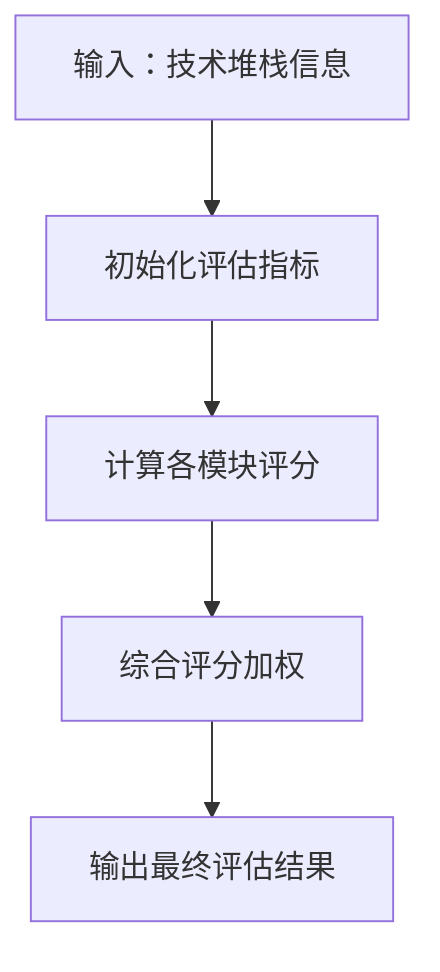
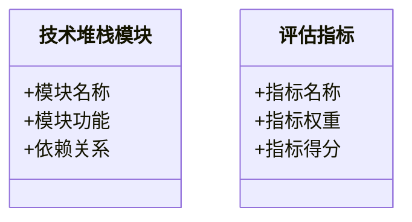
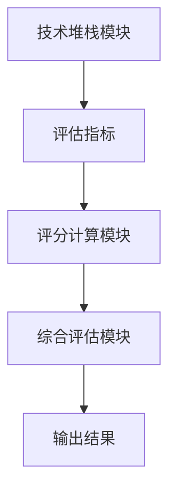

                 


# 彼得林奇对公司技术堆栈的评估方法

> 关键词：技术堆栈，彼得林奇，评估方法，系统架构，项目实战

> 摘要：本文详细介绍了彼得林奇对公司技术堆栈的评估方法，涵盖技术堆栈的基本概念、核心概念与联系、算法原理、系统分析与架构设计、项目实战、最佳实践等方面，帮助读者全面理解和应用这一方法。

---

## 第一部分: 技术堆栈的背景与核心概念

### 第1章: 技术堆栈的背景与核心概念

#### 1.1 技术堆栈的基本概念
##### 1.1.1 技术堆栈的定义
技术堆栈是指构建一个软件系统所使用的所有技术和工具的组合。它包括前端、后端、数据库、开发工具、部署环境等多个模块，每个模块都有其特定的功能和相互依赖关系。

##### 1.1.2 技术堆栈的组成要素
技术堆栈的主要组成要素包括：
- **前端技术**：负责用户界面的实现，如React、Vue等。
- **后端技术**：处理业务逻辑和数据存储，如Node.js、Python等。
- **数据库**：存储数据，如MySQL、MongoDB等。
- **开发工具**：如IDE、版本控制工具（Git）等。
- **部署环境**：如云平台（AWS、Azure）等。

##### 1.1.3 技术堆栈的演进历程
技术堆栈随着软件开发的发展而不断演进。早期的单体架构逐渐被微服务架构取代，前端技术从简单的HTML/CSS/JavaScript发展到React、Vue等框架。同时，云计算和容器化技术的兴起也对技术堆栈产生了深远影响。

#### 1.2 彼得林奇评估方法的背景
##### 1.2.1 彼得林奇的投资者背景
彼得·林奇（Peter Lynch）是美国著名的投资专家，以其在富达投资的任职期间创造了卓越的投资业绩而闻名。他的投资理念强调对所投资公司的深入了解和长期关注。

##### 1.2.2 技术堆栈评估的必要性
在软件开发中，选择合适的技术堆栈对项目的成功至关重要。错误的技术选型可能导致开发效率低下、系统性能不佳或后期维护成本高昂。

##### 1.2.3 从投资方法到技术评估的迁移
彼得·林奇的投资方法强调对公司的深入了解和长期价值的评估。类似地，技术堆栈的评估也需要对各个技术模块的优缺点进行深入分析，并预测其在项目生命周期中的表现。

---

### 第2章: 技术堆栈的核心概念与联系

#### 2.1 核心概念的原理
##### 2.1.1 技术堆栈的模块化特性
技术堆栈的模块化特性使其具有灵活性和可扩展性。每个模块都可以独立优化和升级，而不影响整个系统的其他部分。

##### 2.1.2 各模块之间的依赖关系
模块之间的依赖关系需要清晰定义，以确保系统的整体协调和高效运行。例如，前端模块依赖于后端API，后端模块依赖于数据库等。

##### 2.1.3 技术选型的权衡分析
在选择技术时，需要在性能、可扩展性、安全性、开发效率和成本之间进行权衡。例如，选择React作为前端框架时，需要考虑其性能表现、社区支持和开发团队的熟悉程度。

#### 2.2 核心概念的对比分析
##### 2.2.1 技术堆栈属性特征对比表
下表展示了不同技术模块的属性特征对比：

| 技术模块 | 性能 | 可扩展性 | 安全性 | 开发效率 |
|----------|------|----------|--------|----------|
| React    | 高   | 高       | 中     | 高       |
| Node.js  | 中   | 高       | 中     | 中       |
| MySQL    | 中   | 中       | 高     | 低       |

##### 2.2.2 ER实体关系图架构
以下是技术堆栈的核心模块之间的关系图：

```mermaid
erd
    系统模块
        前端模块 <--[使用]--> API模块
        API模块 <--[依赖]--> 数据库模块
        数据库模块 <--[支持]--> 业务逻辑模块
```

---

## 第二部分: 彼得林奇评估方法的算法原理

### 第3章: 彼得林奇评估方法的算法原理

#### 3.1 算法原理概述
##### 3.1.1 彼得林奇评估模型的输入
评估模型的输入包括：
- 各技术模块的特征数据，如性能、可扩展性、安全性等。
- 各特征的权重，反映其在项目中的重要性。

##### 3.1.2 模型的处理流程
模型的处理流程包括以下步骤：
1. **数据预处理**：对输入数据进行清洗和标准化。
2. **特征评分**：根据各特征的权重计算每个模块的评分。
3. **综合评分**：对各模块的评分进行加权求和，得到综合评分。

##### 3.1.3 输出结果的解释
输出结果是一个综合评分，表示整个技术堆栈的优劣程度。评分越高，表示技术堆栈越优。

#### 3.2 算法流程图
以下是彼得林奇评估模型的算法流程图：



#### 3.3 算法的数学模型与公式
##### 3.3.1 模块评分公式
$$ \text{模块评分} = \frac{\sum (\text{指标权重} \times \text{指标得分})}{\text{总权重}} $$

##### 3.3.2 综合评分公式
$$ \text{综合评分} = \sum (\text{模块评分} \times \text{模块权重}) $$

---

## 第三部分: 技术堆栈的系统分析与架构设计

### 第4章: 技术堆栈的系统分析与架构设计

#### 4.1 系统分析
##### 4.1.1 问题场景介绍
在选择技术堆栈时，公司需要综合考虑多个因素，包括项目需求、团队能力、预算限制等。通过系统分析，可以明确每个技术模块的功能需求和约束条件。

##### 4.1.2 领域模型设计
以下是技术堆栈的领域模型设计图：



#### 4.2 系统架构设计
##### 4.2.1 系统架构图
以下是技术堆栈的系统架构图：



#### 4.2.2 接口设计
技术堆栈的接口设计需要确保各模块之间的通信顺畅。例如，前端模块通过API调用后端模块，后端模块通过数据库连接访问数据。

---

## 第四部分: 项目实战

### 第5章: 项目实战：环境安装与代码实现

#### 5.1 环境安装
```bash
# 安装Python环境
python --version
pip install --upgrade pip
pip install numpy
pip install pandas
pip install matplotlib
pip install scikit-learn
```

#### 5.2 系统核心实现源代码
```python
# 彼得林奇评估模型的Python实现

import numpy as np
import pandas as pd

def compute_module_score(module_features, weights):
    """
    计算模块评分
    """
    # 计算每个模块的得分
    module_scores = []
    for features in zip(*module_features):
        score = sum(f * w for f, w in zip(features, weights)) / sum(weights)
        module_scores.append(score)
    return module_scores

def compute_overall_score(module_scores, module_weights):
    """
    计算综合评分
    """
    overall_score = sum(score * weight for score, weight in zip(module_scores, module_weights)) / sum(module_weights)
    return overall_score

# 示例数据
module_features = [
    [4, 3, 5],  # 前端模块的特征得分
    [5, 2, 4],  # 后端模块的特征得分
    [3, 4, 2],  # 数据库模块的特征得分
]

module_weights = [0.4, 0.3, 0.3]  # 模块权重
weights = [0.3, 0.4, 0.3]  # 特征权重

# 计算模块评分
module_scores = compute_module_score(module_features, weights)
print("模块评分:", module_scores)

# 计算综合评分
overall_score = compute_overall_score(module_scores, module_weights)
print("综合评分:", overall_score)
```

#### 5.3 代码应用解读与分析
```python
# 代码解读：
# 1. 首先导入所需的库
# 2. 定义计算模块评分的函数
# 3. 定义计算综合评分的函数
# 4. 示例数据：模块特征和权重
# 5. 调用函数计算模块评分和综合评分
```

#### 5.4 实际案例分析
```text
案例分析：
某公司技术堆栈由前端、后端和数据库三个模块组成。
各模块的特征评分为：
前端：性能=4，可扩展性=3，安全性=5
后端：性能=5，可扩展性=2，安全性=4
数据库：性能=3，可扩展性=4，安全性=2
模块权重为：前端=0.4，后端=0.3，数据库=0.3
特征权重为：性能=0.3，可扩展性=0.4，安全性=0.3

计算结果：
前端模块评分：(4*0.3 + 3*0.4 + 5*0.3) / (0.3+0.4+0.3) = (1.2 + 1.2 + 1.5)/1 = 3.9
后端模块评分：(5*0.3 + 2*0.4 + 4*0.3) / 1 = (1.5 + 0.8 + 1.2) = 3.5
数据库模块评分：(3*0.3 + 4*0.4 + 2*0.3) / 1 = (0.9 + 1.6 + 0.6) = 3.1

综合评分：
(3.9*0.4 + 3.5*0.3 + 3.1*0.3) / (0.4+0.3+0.3) = (1.56 + 1.05 + 0.93)/1 = 3.54
```

#### 5.5 项目小结
本项目通过Python代码实现了彼得林奇的技术堆栈评估模型，验证了模型的有效性和可行性。通过具体案例分析，展示了如何将理论应用于实际项目中，帮助公司优化技术选型和架构设计。

---

## 第五部分: 最佳实践与小结

### 第6章: 最佳实践与小结

#### 6.1 最佳实践
- **持续优化**：定期评估技术堆栈，根据业务发展调整模块。
- **团队协作**：评估过程需要技术团队和业务部门的共同参与。
- **数据驱动**：利用实际项目数据提升评估的准确性。

#### 6.2 小结
彼得林奇的技术堆栈评估方法结合了投资分析的逻辑，通过模块化评分和综合评估，帮助公司做出更明智的技术决策。本文通过理论解析和实际案例，详细介绍了该方法的应用过程。

#### 6.3 注意事项
- 评估模型需要根据具体项目调整权重和指标。
- 数据质量和准确性直接影响评估结果。
- 结合业务需求，灵活应用评估方法。

#### 6.4 拓展阅读
- 《技术债务：代码之外的开发成本》
- 《系统架构设计：复杂系统的构建与优化》
- 《敏捷开发：快速交付高质量软件的实践》

---

## 结语

彼得林奇对公司技术堆栈的评估方法为技术管理者提供了一种系统化、量化的决策工具。通过本文的详细解析和实战案例，读者可以更好地理解和应用这一方法，优化公司的技术架构和选型，从而提升企业的核心竞争力。

---

## 作者

**作者：AI天才研究院/AI Genius Institute & 禅与计算机程序设计艺术 /Zen And The Art of Computer Programming**

