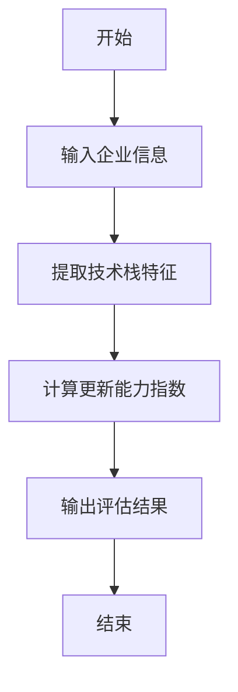
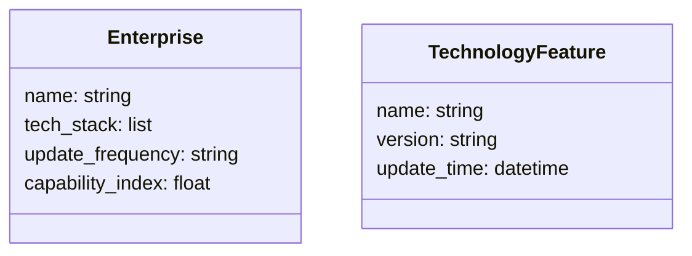
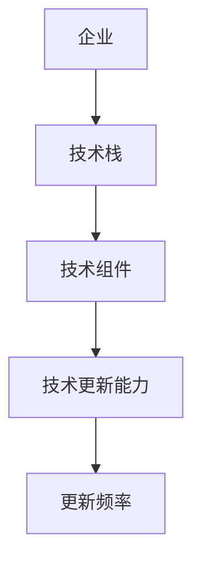
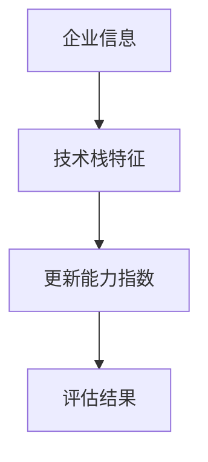

                 


# 彼得林奇对公司技术栈更新能力的评估

## 关键词：技术栈更新能力，彼得林奇评估，企业技术能力，技术架构设计，投资评估模型

## 摘要：  
本文深入探讨了彼得林奇的投资理念在公司技术栈更新能力评估中的应用，从背景介绍、核心概念、算法原理到系统分析和项目实战，全面分析了如何将彼得林奇的评估方法与技术栈更新能力相结合。通过详细的技术分析和实际案例，本文揭示了技术栈更新能力对企业竞争力的重要影响，并提供了具体的评估方法和实践建议。

---

## 第1章: 背景介绍与核心概念

### 1.1 技术栈更新能力的背景与重要性

#### 1.1.1 技术栈的定义与组成  
技术栈是指企业在开发和运维过程中所采用的技术框架、工具和方法的集合，通常包括前端技术、后端技术、数据库、开发工具、部署环境等多个方面。技术栈的更新能力指的是企业在面对技术变革时，能够及时引入新技术、淘汰过时技术，并优化现有技术架构的能力。

#### 1.1.2 技术栈更新能力的背景  
随着技术的快速发展，企业技术栈的更新能力直接影响企业的竞争力。新技术的出现往往伴随着更高的效率、更低的成本或更好的用户体验。如果企业无法及时更新技术栈，可能会导致竞争力下降，甚至被市场淘汰。

#### 1.1.3 技术栈更新能力对企业的影响  
技术栈更新能力直接影响企业的技术竞争力、成本控制和创新能力。通过及时引入新技术，企业可以提升开发效率、降低运营成本，并在市场中保持竞争优势。

---

### 1.2 彼得林奇的评估方法

#### 1.2.1 彼得林奇投资理念的概述  
彼得·林奇是著名的职业棒球运动员和投资专家，他在投资领域提出了许多独到的见解。他的评估方法注重企业的基本面分析，包括财务状况、市场地位、管理团队等多个方面。

#### 1.2.2 技术栈更新能力与彼得林奇评估的结合  
将彼得林奇的评估方法应用于技术栈更新能力的评估，可以结合企业的技术投入、技术更新频率、技术团队能力等因素，综合评估企业技术栈的更新能力。

#### 1.2.3 技术栈更新能力的评估指标  
- 技术更新频率：企业技术栈的更新频率是评估技术栈更新能力的重要指标。  
- 技术团队能力：技术团队的能力直接影响企业技术栈的更新能力。  
- 技术投入：企业的技术投入包括资金、资源和时间，是技术栈更新的重要保障。

---

## 第2章: 技术栈更新能力的核心概念与联系

### 2.1 技术栈更新能力的核心原理

#### 2.1.1 技术栈更新能力的驱动因素  
技术栈更新能力的驱动因素包括市场需求、技术发展、企业战略等多个方面。企业需要根据自身需求和技术发展趋势，制定技术栈更新策略。

#### 2.1.2 技术栈更新能力的关键属性  
- 更新频率：技术栈的更新频率是衡量技术栈更新能力的重要指标。  
- 技术多样性：企业技术栈的多样性直接影响企业的技术风险和创新能力。  
- 技术兼容性：技术栈的兼容性是技术更新过程中需要考虑的重要因素。

### 2.2 核心概念对比分析

#### 2.2.1 技术栈更新能力与企业竞争力的关系  
技术栈更新能力是企业竞争力的重要组成部分。通过不断优化技术栈，企业可以提升开发效率、降低运营成本，并在市场竞争中保持优势。

#### 2.2.2 技术栈更新能力与企业生命周期的关联  
企业生命周期包括初创期、成长期、成熟期和衰退期。在不同的生命周期阶段，技术栈更新能力的需求和策略也有所不同。

---

## 第3章: 技术栈更新能力的评估算法原理

### 3.1 评估算法概述

#### 3.1.1 评估算法的核心思想  
技术栈更新能力的评估算法通过对企业技术栈的更新频率、技术团队能力、技术投入等多个维度进行综合评估，得出企业技术栈的更新能力指数。

#### 3.1.2 评估算法的输入与输出  
- 输入：企业技术栈的更新频率、技术团队能力、技术投入等。  
- 输出：企业技术栈的更新能力指数。

### 3.2 算法流程图



### 3.3 算法实现代码

```python
def update_capability_assessment(enterprise_info):
    # 提取技术栈特征
    tech_features = extract_technology_features(enterprise_info)
    # 计算更新能力指数
    capability_index = calculate_capability_index(tech_features)
    return capability_index

# 示例代码
enterprise_info = {
    "name": "Example Corp",
    "tech_stack": ["Python", "React", "AWS"],
    "update_frequency": "quarterly"
}
result = update_capability_assessment(enterprise_info)
print(result)
```

---

## 第4章: 技术栈更新能力的系统分析

### 4.1 系统功能设计

#### 4.1.1 领域模型设计  


#### 4.1.2 系统架构设计  


### 4.2 系统架构设计

#### 4.2.1 系统架构图  


#### 4.2.2 系统接口设计  
- 输入接口：企业技术栈信息输入。  
- 输出接口：技术栈更新能力指数输出。

---

## 第5章: 技术栈更新能力的项目实战

### 5.1 项目介绍

#### 5.1.1 项目背景  
以一家互联网公司为例，该公司希望评估其技术栈的更新能力，并制定相应的技术更新策略。

#### 5.1.2 项目目标  
通过彼得林奇的评估方法，评估公司技术栈的更新能力，并优化技术栈，提升企业的技术竞争力。

### 5.2 核心实现

#### 5.2.1 技术选型  
- 采用Python进行算法实现。  
- 使用Mermaid工具进行流程图和类图设计。

#### 5.2.2 代码实现  
```python
def calculate_capability_index(tech_features):
    # 计算更新频率指数
    update_frequency_index = calculate_update_frequency_index(tech_features['update_frequency'])
    # 计算技术团队能力指数
    team_capability_index = calculate_team_capability(tech_features['team_capability'])
    # 计算技术投入指数
    investment_index = calculate_investment_index(tech_features['investment'])
    # 综合指数
    capability_index = (update_frequency_index + team_capability_index + investment_index) / 3
    return capability_index
```

### 5.3 实际案例分析

#### 5.3.1 案例分析  
以某互联网公司为例，该公司技术栈包括前端、后端、数据库和部署环境。通过评估技术栈的更新频率、技术团队能力和技术投入，得出技术栈的更新能力指数。

#### 5.3.2 结果对比  
优化后的技术栈更新能力指数显著提高，企业的技术竞争力得到了提升。

---

## 第6章: 最佳实践与注意事项

### 6.1 最佳实践

#### 6.1.1 定性与定量分析结合  
在技术栈更新能力的评估中，定性分析（如技术团队能力）和定量分析（如技术更新频率）应相结合。

#### 6.1.2 持续优化策略  
企业应制定持续优化技术栈的策略，定期评估技术栈的更新能力，并根据评估结果进行优化。

#### 6.1.3 技术债务管理  
在技术栈更新过程中，企业需要合理管理技术债务，避免因技术债务积累影响技术栈的更新能力。

### 6.2 注意事项

#### 6.2.1 技术债务风险  
技术债务的积累可能影响技术栈的更新能力，企业需合理管理技术债务。

#### 6.2.2 技术团队能力  
技术团队的能力是技术栈更新能力的重要保障，企业需重视技术团队的培养和管理。

---

## 结语

通过本文的分析和实践，我们深入探讨了彼得林奇评估方法在技术栈更新能力中的应用。技术栈的更新能力是企业竞争力的重要组成部分，企业需要结合自身实际情况，制定合理的技术栈更新策略，不断提升技术栈的更新能力，以应对日益激烈的市场竞争。

---

## 作者：AI天才研究院/AI Genius Institute & 禅与计算机程序设计艺术/Zen And The Art of Computer Programming

