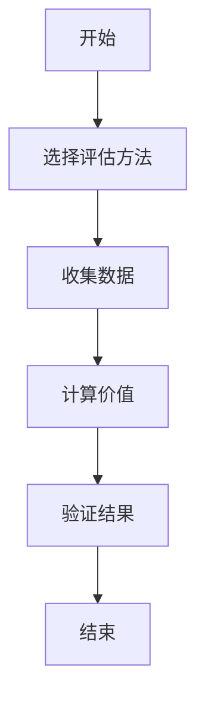
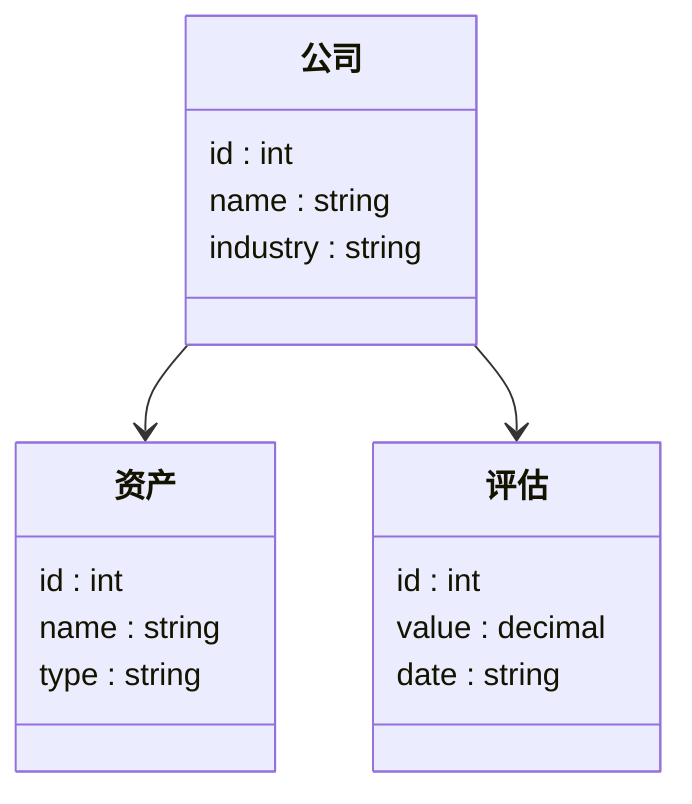

                 


# 彼得林奇对公司无形资产价值的量化分析方法

> 关键词：彼得林奇、无形资产、价值量化、投资分析、企业评估

> 摘要：本文详细探讨了彼得·林奇对公司无形资产价值的量化分析方法，从理论到实践，系统性地介绍了无形资产的定义、分类、评估方法以及实际案例分析。通过本文，读者可以全面了解如何将无形资产的价值量化，并将其应用于企业评估和投资决策中。

---

# 第一部分: 背景介绍

## 第1章: 无形资产的定义与分类

### 1.1 无形资产的定义

#### 1.1.1 无形资产的定义与特征

无形资产是指企业拥有或控制的，没有实物形态的长期资产。它们通常包括专利权、商标权、版权、商誉、客户关系、品牌价值等。与有形资产不同，无形资产的价值主要体现在其对企业的未来收益能力上。

- **定义**：无形资产是企业长期资产的一部分，具有不可触摸性和长期性。
- **特征**：
  - 非实物性：无形资产没有实体形态。
  - 长期性：无形资产的使用寿命通常较长。
  - 创新性：许多无形资产是创新的成果。
  - 可转移性：某些无形资产可以通过转让产生价值。

#### 1.1.2 无形资产的分类与属性

无形资产可以分为以下几类：

1. **知识产权类**：
   - 专利权：保护发明的技术方案。
   - 商标权：保护品牌标识。
   - 著作权：保护文学、艺术和科学作品。

2. **商誉类**：
   - 整体商誉：企业整体价值超过有形净资产的部分。
   - 可识别商誉：可单独识别的商誉部分。

3. **客户关系类**：
   - 客户忠诚度。
   - 客户数据库价值。

4. **品牌价值类**：
   - 品牌知名度。
   - 品牌影响力。

#### 1.1.3 无形资产与有形资产的区别

| 属性 | 无形资产 | 有形资产 |
|------|----------|----------|
| 存在形式 | 抽象、非实体 | 具体、实体 |
| 生命周期 | 长期 | 可变 |
| 评估难度 | 高 | 较低 |
| 对企业价值影响 | 高 | 中 |

---

## 第2章: 无形资产价值量化分析的背景与必要性

### 2.1 无形资产价值量化分析的背景

#### 2.1.1 当前经济环境下的无形资产价值问题

在现代经济中，无形资产的价值越来越重要。例如，科技公司（如谷歌、苹果）的核心价值往往来源于其专利和技术，而非其有形资产。随着知识经济的发展，无形资产在企业价值中的占比越来越高。

#### 2.1.2 无形资产价值量化分析的现状

目前，许多企业在评估自身价值时，往往忽视了无形资产的重要性。这种忽视可能导致企业低估自身价值，影响投资决策和融资能力。

#### 2.1.3 彼得·林奇对无形资产价值分析的贡献

彼得·林奇是美国著名投资经理人，以其对基本面分析的深入研究而闻名。他强调企业核心竞争力的重要性，而核心竞争力往往体现在无形资产上。林奇的分析方法为无形资产的价值量化提供了重要的理论基础。

### 2.2 无形资产价值量化分析的必要性

#### 2.2.1 企业价值评估中的无形资产因素

企业的整体价值 = 有形资产价值 + 无形资产价值 + 其他因素

#### 2.2.2 投资决策中的无形资产考量

投资者在选择投资标的时，往往需要评估企业的核心竞争力，而核心竞争力的体现之一就是无形资产的价值。

#### 2.2.3 无形资产价值量化对企业的实际意义

- **优化资产配置**：通过量化分析，企业可以更好地分配资源。
- **提升投资决策**：投资者可以根据无形资产价值判断企业潜力。
- **增强竞争力**：通过优化无形资产，企业可以提升市场地位。

---

# 第二部分: 核心概念与联系

## 第3章: 无形资产价值量化的核心概念

### 3.1 无形资产价值量化的基本原理

#### 3.1.1 无形资产价值的构成要素

无形资产的价值构成包括以下几个方面：

1. **未来现金流**：无形资产能够为企业带来的未来现金流。
2. **折现率**：用于计算未来现金流现值的贴现率。
3. **使用寿命**：无形资产的使用寿命影响其价值评估。

#### 3.1.2 无形资产价值的评估方法

常用的方法包括：

1. **加权评分法**：根据多个指标对无形资产进行评分，再进行加权计算。
2. **DCF模型**：通过现金流折现计算无形资产的现值。

#### 3.1.3 无形资产价值与企业整体价值的关系

企业整体价值 = 有形资产价值 + 无形资产价值 + 其他因素

---

## 第4章: 核心概念的属性特征对比

### 4.1 无形资产与有形资产的对比分析

#### 4.1.1 无形资产与有形资产的属性对比

| 属性 | 无形资产 | 有形资产 |
|------|----------|----------|
| 存在形式 | 抽象 | 具体 |
| 生命周期 | 长 | 短 |
| 评估难度 | 高 | 低 |

---

## 第5章: 实体关系图与流程图

### 5.1 无形资产价值量化分析的实体关系图

```mermaid
erDiagram
    company {
        id : int
        name : string
        industry : string
    }
    asset {
        id : int
        name : string
        type : string
    }
    valuation {
        id : int
        value : decimal
        date : string
    }
    company -asset
    company -valuation
```

---

### 5.2 无形资产价值量化分析的流程图



---

## 第6章: 算法原理讲解

### 6.1 加权评分法

#### 6.1.1 加权评分法的原理

加权评分法是一种常用的无形资产价值评估方法。其基本原理是根据多个评估指标对资产进行评分，再根据各指标的权重计算综合得分。

#### 6.1.2 加权评分法的步骤

1. **确定评估指标**：如创新能力、市场影响力、技术先进性等。
2. **确定权重**：根据各指标的重要性分配权重。
3. **评分**：对每个指标进行打分（1-10分）。
4. **计算加权得分**：加权得分 = Σ（指标得分 × 权重）。

#### 6.1.3 加权评分法的Python实现

```python
def weighted_score评估():
    指标 = ['创新能力', '市场影响力', '技术先进性']
    权重 = {'创新能力': 0.4, '市场影响力': 0.3, '技术先进性': 0.3}
    评分 = {'创新能力': 8, '市场影响力': 7, '技术先进性': 6}
    总得分 = 0
    for 指标 in 指标:
        总得分 += 评分[指标] * 权重[指标]
    return 总得分

print(weighted_score评估())  # 输出加权得分
```

---

## 第7章: 系统分析与架构设计方案

### 7.1 问题场景介绍

企业需要对无形资产进行价值量化，以支持投资决策和资产评估。

### 7.2 系统功能设计

#### 7.2.1 领域模型



---

## 第8章: 项目实战

### 8.1 环境安装

需要安装Python和相关库（如pandas、numpy）。

---

## 第9章: 最佳实践

### 9.1 小结

通过本文的分析，我们可以看出，彼得·林奇的无形资产价值量化方法在现代企业评估中具有重要的意义。

