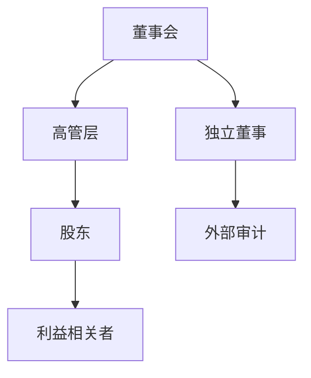

                 


# 彼得林奇对公司治理的要求

## 关键词
- 彼得林奇
- 公司治理
- 投资理念
- 股东权益
- 管理层监督

## 摘要
彼得林奇作为一位著名的投资经理，他对公司治理的要求深刻影响了他的投资决策。本文从公司治理的基本概念出发，分析彼得林奇的投资理念，探讨他在公司治理中的关注点，包括董事会结构、高管责任、股东权益保护等方面。通过建立数学模型和系统架构，详细讲解如何评估公司治理的优劣，并结合实际案例，展示彼得林奇的要求在投资中的应用。最后，总结最佳实践，为投资者提供实用的建议。

---

## 第一部分: 公司治理与彼得林奇投资理念的背景

### 第1章: 公司治理的基本概念与重要性

#### 1.1 公司治理的定义与核心要素

##### 1.1.1 公司治理的定义
公司治理是指公司内部和外部利益相关者之间通过合理分配权力和责任，确保公司有效运作、实现长期目标的制度和机制。其核心在于平衡股东、董事会、高管、利益相关者等多方利益，确保公司透明、公正、高效地运行。

##### 1.1.2 公司治理的核心要素
公司治理涉及多个关键要素，包括：
1. **董事会结构**：董事会是公司治理的核心，负责制定战略、监督高管和评估绩效。
2. **高管责任**：高管层负责执行董事会的决策，确保公司日常运作高效。
3. **股东权益**：股东是公司的主要出资者，有权参与公司重大决策和监督管理层。
4. **利益相关者保护**：公司需关注员工、客户、债权人等其他利益相关者的权益。
5. **透明与披露**：公司需定期披露财务和运营信息，增强透明度，赢得信任。

##### 1.1.3 公司治理的边界与外延
公司治理的边界主要在于公司内部管理和外部监管。其外延涉及法律、道德、文化等多个方面，不同国家和地区的法律环境会影响公司治理的具体实践。

#### 1.2 彼得林奇与公司治理的关联

##### 1.2.1 彼得林奇的背景与投资理念
彼得林奇是美国著名的投资经理，以其在富达投资管理公司的长期任职中表现出色而闻名。他的投资理念强调长期价值投资，注重公司基本面分析和管理层质量。他认为，优秀的管理层和良好的公司治理是公司长期成功的关键。

##### 1.2.2 彼得林奇对公司治理的关注点
彼得林奇在选择投资标的时，非常关注公司的治理结构。他认为，一个有效的治理结构能够确保管理层的利益与股东的利益一致，减少代理成本，并提高公司运营效率。具体关注点包括：
1. **董事会构成**：董事会应由经验丰富、独立的董事组成，能够有效监督高管。
2. **高管激励机制**：高管的薪酬应与公司绩效挂钩，避免短期行为。
3. **股东权利保护**：公司应尊重股东的投票权和知情权，确保股东能够有效监督公司。

##### 1.2.3 公司治理在投资中的重要性
公司治理是彼得林奇投资决策中的重要考量因素。他认为，良好的公司治理能够降低投资风险，提高公司的长期盈利能力。具体来说，良好的公司治理能够：
- 提高管理层的透明度和责任感。
- 减少内部关联交易和利益输送。
- 提升公司的财务健康状况和抗风险能力。

---

## 第二部分: 彼得林奇的投资策略与公司治理要求

### 第2章: 彼得林奇的投资策略与公司治理要求

#### 2.1 彼得林奇的投资策略概述

##### 2.1.1 彼得林奇的投资风格
彼得林奇的投资风格以长期价值投资为主，注重对公司基本面的深入分析。他认为，投资成功的前提是选择具有持续竞争优势、管理层优秀且公司治理良好的公司。

##### 2.1.2 彼得林奇的选股标准
彼得林奇的选股标准包括：
1. **公司财务健康**：关注公司的盈利能力、资产负债率和现金流状况。
2. **管理层素质**：选择经验丰富、诚信可靠的管理层。
3. **行业地位**：选择在行业中具有竞争优势的公司。
4. **公司治理**：关注公司治理结构是否透明、高效。

##### 2.1.3 彼得林奇对管理层的信任与监督
彼得林奇认为，投资者应对管理层保持信任，但同时需要通过董事会和股东大会等方式进行有效监督。他强调，管理层的利益应与股东的利益保持一致。

#### 2.2 彼得林奇对公司治理的具体要求

##### 2.2.1 董事会的构成与职责
彼得林奇要求公司董事会应具备以下特点：
1. **独立性**：董事会成员应独立于管理层，避免利益冲突。
2. **专业性**：董事会成员应具备行业经验和专业技能，能够对公司战略和运营提出建设性意见。
3. **监督职能**：董事会负责监督高管的绩效，评估公司治理的有效性。

##### 2.2.2 高管的薪酬与激励机制
彼得林奇认为，高管的薪酬应与公司绩效挂钩，避免短期行为。他支持以下激励机制：
1. **股票期权**：通过授予高管股票期权，使其利益与公司股价挂钩。
2. **绩效奖金**：根据公司绩效和高管个人表现发放奖金。
3. **长期激励**：通过长期激励计划，鼓励高管关注公司的长期发展。

##### 2.2.3 股东权益的保护措施
彼得林奇强调，公司应采取措施保护股东的权益，包括：
1. **股东投票权**：确保股东在股东大会中享有平等的投票权。
2. **信息披露**：定期披露公司财务和运营信息，增强透明度。
3. **股东监督**：通过股东大会和董事会，确保股东能够有效监督公司治理。

### 第3章: 公司治理的核心概念与原理

#### 3.1 公司治理的核心概念

##### 3.1.1 股东与董事会的关系
股东是公司的所有者，董事会是股东的代表，负责管理和监督公司运营。董事会应忠实履行股东的委托，确保公司利益最大化。

##### 3.1.2 高管的职责与权力
高管层负责执行董事会的决策，管理日常运营，确保公司战略目标的实现。高管的权力来源于董事会的授权，需定期向董事会报告工作。

##### 3.1.3 利益相关者的权益平衡
公司治理不仅涉及股东和董事会，还包括员工、客户、债权人等其他利益相关者。公司应通过合理机制平衡各方利益，实现共赢。

#### 3.2 公司治理的原理与机制

##### 3.2.1 股权结构与控制权分配
股权结构直接影响公司的控制权分配。合理的股权结构能够确保股东的权益，避免一股独大或股权分散的问题。

##### 3.2.2 监督机制的建立与运行
公司治理需要有效的监督机制，包括内部审计、独立董事和外部审计等。这些机制能够确保公司运营的合规性和透明度。

##### 3.2.3 信息披露与透明度
公司应定期披露财务和运营信息，增强透明度，赢得投资者和公众的信任。透明的信息披露有助于投资者评估公司治理的优劣。

### 第4章: 彼得林奇视角下的公司治理评估指标

#### 4.1 公司治理评估的核心指标

##### 4.1.1 股东权益回报率（ROE）
ROE是衡量公司财务绩效的重要指标，计算公式为：
$$ROE = \frac{\text{净利润}}{\text{股东权益}}$$
高ROE表明公司能够有效利用股东资金创造利润。

##### 4.1.2 资产回报率（ROA）
ROA是衡量公司资产使用效率的指标，计算公式为：
$$ROA = \frac{\text{净利润}}{\text{总资产}}$$
高ROA表明公司能够有效利用资产创造利润。

##### 4.1.3 管理层的稳定性与决策能力
管理层的稳定性与决策能力直接影响公司的长期发展。稳定的管理层能够制定和执行长期战略，提升公司竞争力。

#### 4.2 彼得林奇对公司治理的数学模型与公式

##### 4.2.1 股东权益回报率计算公式
$$ROE = \frac{\text{净利润}}{\text{股东权益}}$$
例如，某公司净利润为1000万元，股东权益为5000万元，其ROE为：
$$ROE = \frac{1000}{5000} = 0.2 \text{即} 20\%$$

##### 4.2.2 资产回报率计算公式
$$ROA = \frac{\text{净利润}}{\text{总资产}}$$
例如，某公司净利润为800万元，总资产为4000万元，其ROA为：
$$ROA = \frac{800}{4000} = 0.2 \text{即} 20\%$$

##### 4.2.3 管理层决策的权重分析
管理层决策的权重可以通过以下公式计算：
$$\text{决策权重} = \frac{\text{决策影响程度} \times \text{决策概率}}{\sum (\text{决策影响程度} \times \text{决策概率})}$$
例如，某决策对利润的影响程度为80%，概率为90%，其决策权重为：
$$\text{决策权重} = \frac{80\% \times 90\%}{\sum (决策影响程度 \times 决策概率)}$$

### 第5章: 公司治理的系统分析与架构设计

#### 5.1 系统分析与问题场景

##### 5.1.1 公司治理的系统目标
公司治理系统的目标是通过优化公司结构、流程和机制，确保公司高效运作、利益相关者权益最大化。

##### 5.1.2 公司治理的系统边界
公司治理系统的边界包括公司内部管理、董事会运作、高管职责、股东监督等。

##### 5.1.3 公司治理的系统功能模块
公司治理系统主要功能模块包括：
1. 董事会管理模块
2. 高管监督模块
3. 股东权益保护模块
4. 信息披露模块

#### 5.2 系统架构设计

##### 5.2.1 系统架构的模块划分
公司治理系统架构分为以下模块：
1. 董事会管理模块
2. 高管监督模块
3. 股东权益保护模块
4. 信息披露模块

##### 5.2.2 系统架构的Mermaid图


##### 5.2.3 系统交互流程
公司治理系统的交互流程包括：
1. 董事会制定战略和监督高管。
2. 高管执行战略并定期向董事会报告。
3. 股东通过股东大会行使监督权。
4. 独立董事和外部审计提供独立监督和评估。

### 第6章: 项目实战与案例分析

#### 6.1 项目实战

##### 6.1.1 环境配置
选择一家上市公司作为案例，分析其公司治理结构和绩效。

##### 6.1.2 核心代码实现
以下是一个公司治理评估的Python代码示例：

```python
def calculate_roe(net_profit, equity):
    return net_profit / equity

def calculate_roa(net_profit, total_assets):
    return net_profit / total_assets

# 示例数据
net_profit = 10000000  # 净利润（元）
equity = 50000000     # 股东权益（元）
total_assets = 40000000  # 总资产（元）

# 计算ROE和ROA
roe = calculate_roe(net_profit, equity)
roa = calculate_roa(net_profit, total_assets)

print(f"ROE: {roe:.2f}%")
print(f"ROA: {roa:.2f}%")
```

##### 6.1.3 代码应用解读
通过上述代码，我们可以计算公司的ROE和ROA，评估其财务绩效和公司治理效果。

##### 6.1.4 案例分析
以某公司为例，分析其公司治理结构，评估其ROE和ROA，判断其治理效果。

### 第7章: 最佳实践与总结

#### 7.1 最佳实践

##### 7.1.1 关键点总结
- 重视公司治理结构的优化。
- 确保董事会独立性和专业性。
- 建立有效的监督和激励机制。

##### 7.1.2 注意事项
- 避免一股独大或股权过于分散。
- 加强信息披露和透明度。
- 定期评估公司治理效果。

##### 7.1.3 拓展阅读
建议阅读彼得林奇的相关书籍和公司治理的经典文献，深入理解其理论和实践。

---

## 作者：AI天才研究院/AI Genius Institute & 禅与计算机程序设计艺术 /Zen And The Art of Computer Programming

---

本文通过详细分析彼得林奇对公司治理的要求，结合公司治理的核心概念、数学模型和系统架构，为投资者提供了实用的指导和建议。希望本文能够帮助读者更好地理解公司治理的重要性，并在投资实践中加以应用。

