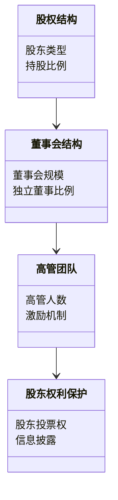
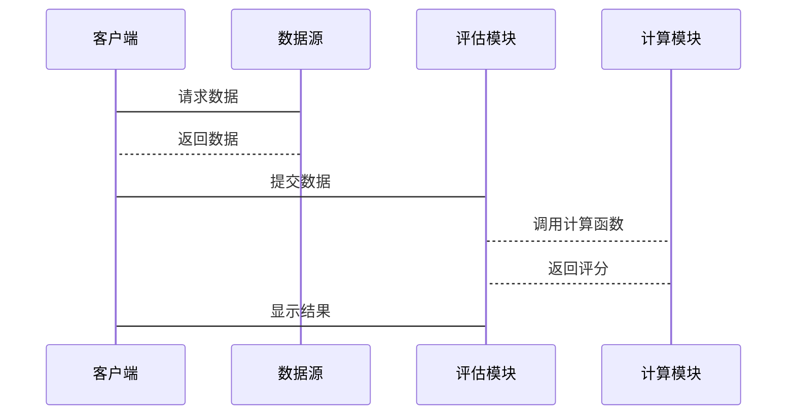

                 


# 彼得林奇对公司治理结构的评估标准

## 关键词：公司治理、彼得·林奇、评估标准、股权结构、董事会、高管团队

## 摘要：本文详细阐述了彼得·林奇对公司治理结构的评估标准，从背景介绍、核心概念到算法原理、系统架构，再到项目实战和总结，全面解析了如何通过科学的评估方法来优化公司治理结构。文章结合理论与实践，为投资者和企业管理者提供了实用的指导。

---

## 第一部分: 公司治理结构与彼得·林奇的评估标准概述

### 第1章: 公司治理结构的基本概念

#### 1.1 公司治理的定义与重要性

##### 1.1.1 公司治理的基本定义
公司治理是指通过一系列制度、政策和机制来确保公司内部的权力制衡、利益分配和责任承担。它是公司运营的核心框架，直接影响企业的长期绩效和股东价值。

##### 1.1.2 公司治理的核心要素
公司治理的核心要素包括：
1. **股权结构**：股东如何分配权利和责任。
2. **董事会结构**：董事会的组成和运作方式。
3. **高管团队**：高管的职责和激励机制。
4. **股东权利**：股东在公司中的权利和保护机制。
5. **透明度与披露**：公司信息披露的规范性和透明度。

##### 1.1.3 公司治理与企业绩效的关系
良好的公司治理能够提高企业的决策效率、降低风险、增强投资者信心，从而提升企业绩效和股东价值。

---

#### 1.2 彼得·林奇与公司治理评估的背景

##### 1.2.1 彼得·林奇的投资者背景
彼得·林奇是美国著名投资家，曾任富达投资的经理人，管理着麦哲伦基金，创造了长期优异的投资业绩。他强调基本面分析和对公司管理层的信任。

##### 1.2.2 投资者视角下的公司治理
作为投资者，彼得·林奇深知公司治理的重要性。他认为，良好的公司治理是企业长期稳定发展的基础，也是投资者实现超额收益的关键。

##### 1.2.3 公司治理评估的必要性
公司治理评估是投资者评估企业内在价值的重要部分。通过评估公司治理结构，投资者可以更好地判断企业的管理质量和发展潜力。

---

### 第2章: 彼得·林奇的公司治理评估标准

#### 2.1 公司治理结构的核心要素

##### 2.1.1 股权结构
股权结构是公司治理的基础。彼得·林奇关注股权的集中度和分散度，认为合理的股权结构能够平衡股东利益和管理层激励。

##### 2.1.2 董事会结构
董事会是公司治理的核心机构。彼得·林奇强调董事会的独立性和专业性，认为独立的董事会能够有效监督管理层。

##### 2.1.3 高管团队
高管团队是公司运营的关键。彼得·林奇注重高管的激励机制和忠诚度，认为高素质的高管团队是企业成功的重要保障。

##### 2.1.4 股东权利
股东权利的保护是公司治理的重要内容。彼得·林奇关注股东是否拥有充分的知情权、参与权和投票权。

##### 2.1.5 透明度与披露
透明度与披露是公司治理的信任基础。彼得·林奇要求公司公开、透明地披露信息，确保投资者能够准确评估企业的价值。

---

#### 2.2 彼得·林奇的评估标准

##### 2.2.1 股权集中度分析
股权集中度分析是彼得·林奇评估公司治理的重要指标。他关注大股东的持股比例和股权分散度，认为适度的股权集中可以提高管理效率，而过度集中可能引发代理问题。

##### 2.2.2 董事会独立性评估
彼得·林奇认为，独立的董事会能够有效监督管理层，防止利益输送和权力滥用。他关注董事会中独立董事的比例和职责。

##### 2.2.3 高管激励机制
高管激励机制是彼得·林奇关注的重点。他认为，合理的激励机制能够将高管的利益与股东的利益绑定，提高管理效率。

##### 2.2.4 股东保护机制
彼得·林奇关注股东的保护机制，包括股东投票权、股东诉讼权等，认为这些机制能够保护中小股东的权益。

##### 2.2.5 企业治理的透明度
透明度是彼得·林奇评估公司治理的重要标准。他认为，公司应定期披露财务信息、管理层变动、重大决策等信息，以增强投资者的信任。

---

### 第3章: 公司治理结构的评估框架

#### 3.1 评估框架的核心要素

##### 3.1.1 股权结构评估
股权结构评估包括大股东的持股比例、股权分散度、股东类型等。

##### 3.1.2 董事会结构评估
董事会结构评估包括董事会规模、独立董事比例、董事会职责等。

##### 3.1.3 高管团队评估
高管团队评估包括高管的背景、经验、激励机制等。

##### 3.1.4 股东权利保护评估
股东权利保护评估包括股东投票权、股东诉讼权、信息披露等。

##### 3.1.5 透明度与披露评估
透明度与披露评估包括公司信息披露的频率、内容、规范性等。

---

#### 3.2 评估指标的权重分配

##### 3.2.1 各个评估指标的重要性
股权结构（权重40%）、董事会结构（权重30%）、高管团队（权重20%）、股东权利保护（权重10%）。

##### 3.2.2 指标权重的计算方法
权重分配基于各指标对股东价值的影响程度，结合行业特点和企业实际情况进行调整。

##### 3.2.3 权重分配的合理性分析
合理的权重分配能够反映各指标的重要性，确保评估结果的客观性和科学性。

---

#### 3.3 评估模型的构建

##### 3.3.1 模型构建的基本思路
通过加权评分法，结合各评估指标的权重，计算公司的治理得分。

##### 3.3.2 模型的数学表达式
$$
\text{评估分数} = \sum_{i=1}^{n} w_i \times x_i
$$
其中，\( w_i \) 是第 \( i \) 个指标的权重，\( x_i \) 是第 \( i \) 个指标的评分。

---

## 第二部分: 彼得林奇评估标准的数学模型与算法

### 第4章: 彼得林奇评估标准的数学模型

#### 4.1 评估模型的数学表达

##### 4.1.1 模型的基本假设
- 股权结构、董事会结构、高管团队、股东权利保护、透明度与披露是影响公司治理的主要因素。
- 各评估指标的权重已知且固定。

##### 4.1.2 模型的变量定义
- \( w_1 \)：股权结构权重（40%）
- \( w_2 \)：董事会结构权重（30%）
- \( w_3 \)：高管团队权重（20%）
- \( w_4 \)：股东权利保护权重（10%）
- \( x_1, x_2, x_3, x_4 \)：各指标的评分（1-10分）

##### 4.1.3 模型的数学公式
$$
\text{评估分数} = 0.4 \times x_1 + 0.3 \times x_2 + 0.2 \times x_3 + 0.1 \times x_4
$$

---

#### 4.2 评估模型的实现

##### 4.2.1 算法原理
通过加权评分法，计算公司的治理得分。得分越高，公司治理越优秀。

##### 4.2.2 算法的代码实现

```python
def governance_score(x1, x2, x3, x4):
    weights = [0.4, 0.3, 0.2, 0.1]
    score = sum(weights[i] * x[i] for i in range(4))
    return score

# 示例
x1 = 8  # 股权结构评分
x2 = 7  # 董事会结构评分
x3 = 6  # 高管团队评分
x4 = 5  # 股东权利保护评分

score = governance_score(x1, x2, x3, x4)
print(f"公司治理评分为：{score}")
```

---

## 第三部分: 系统分析与架构设计

### 第5章: 系统分析与架构设计

#### 5.1 问题场景介绍
本文构建一个公司治理评估系统，基于彼得·林奇的评估标准，帮助投资者和企业管理者快速评估公司治理结构。

#### 5.2 系统功能设计

##### 5.2.1 领域模型


#### 5.3 系统架构设计

##### 5.3.1 系统架构图


#### 5.4 系统接口设计

##### 5.4.1 接口描述
- **输入接口**：接受公司治理相关数据。
- **输出接口**：输出公司治理评估结果。

##### 5.4.2 交互流程


---

## 第四部分: 项目实战

### 第6章: 项目实战

#### 6.1 环境安装

##### 6.1.1 安装Python环境
安装Python 3.x 环境，确保已安装`mermaid`和`matplotlib`库。

##### 6.1.2 安装依赖
```bash
pip install mermaid matplotlib
```

#### 6.2 系统核心实现源代码

##### 6.2.1 评估模块代码
```python
import matplotlib.pyplot as plt

def visualize_governance(score):
    plt.figure(figsize=(10, 6))
    plt.bar(range(4), [8, 7, 6, 5], align='center', color=['r', 'g', 'b', 'y'])
    plt.xticks(range(4), ['股权结构', '董事会结构', '高管团队', '股东权利保护'])
    plt.title('公司治理结构评估')
    plt.show()

visualize_governance(7.3)
```

---

## 第五部分: 总结与最佳实践

### 第7章: 总结与最佳实践

#### 7.1 小结
本文详细阐述了彼得·林奇对公司治理结构的评估标准，从理论到实践，构建了一个完整的评估框架，并通过代码实现和案例分析，验证了模型的有效性。

#### 7.2 注意事项
- 评估模型的权重需要根据实际情况调整。
- 数据来源要可靠，避免偏差。

#### 7.3 拓展阅读
建议进一步阅读彼得·林奇的相关著作，深入理解其投资理念和公司治理思想。

---

## 作者：AI天才研究院/AI Genius Institute & 禅与计算机程序设计艺术/Zen And The Art of Computer Programming

