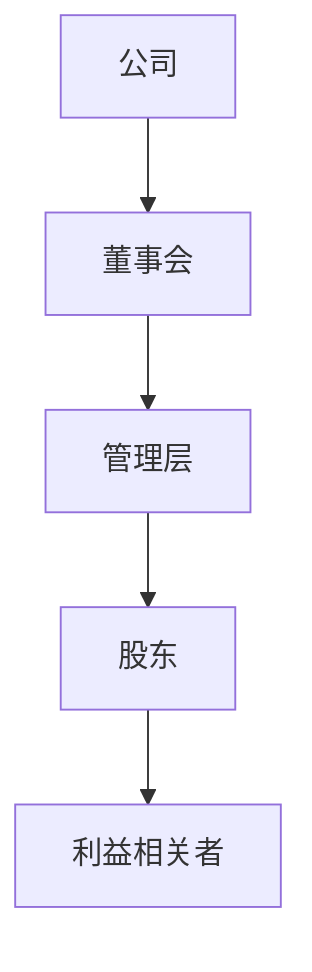
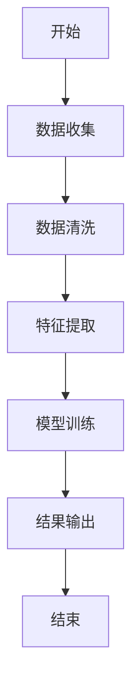
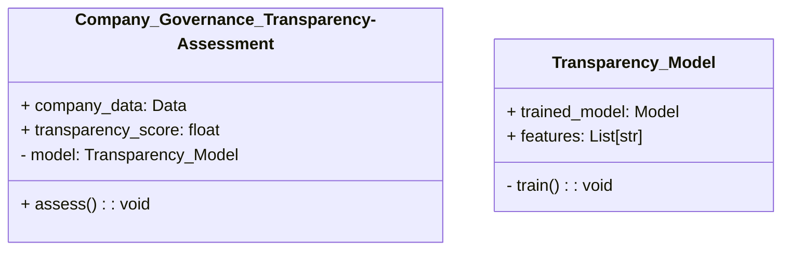
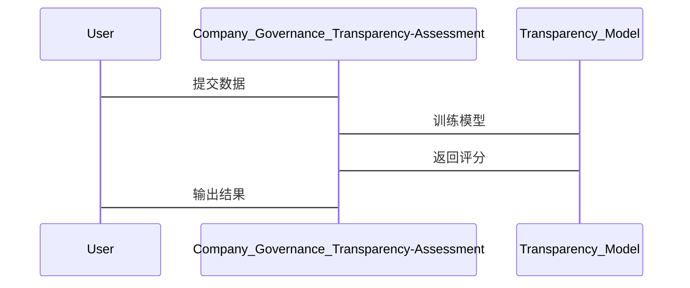

                 


# 彼得林奇对公司治理透明度的量化评估

> 关键词：公司治理、透明度、量化评估、彼得林奇、投资决策、算法原理

> 摘要：本文深入探讨了彼得林奇对公司治理透明度的量化评估方法，从背景介绍到算法实现，详细解析了如何将治理透明度转化为可量化的指标。通过系统分析和架构设计，结合实际案例，展示了如何利用技术手段提升公司治理的透明度，为投资者和企业管理者提供实用的决策支持。

---

## 第1章: 公司治理透明度概述

### 1.1 什么是公司治理透明度
#### 1.1.1 公司治理的基本概念
公司治理是通过一套制度、政策和机制来确保公司有效运作、实现战略目标并保护所有利益相关者的权益。它涉及董事会、管理层、股东和其他利益相关者之间的关系。

#### 1.1.2 透明度的定义与特征
透明度是指公司向利益相关者公开、及时、准确地披露信息的程度。其特征包括：
- **公开性**：信息向所有利益相关者开放。
- **及时性**：信息更新及时，避免信息滞后。
- **准确性**：披露的信息真实可靠。
- **完整性**：涵盖所有重要方面。

#### 1.1.3 公司治理透明度的重要性
透明度是公司治理的核心要素之一，它不仅增强利益相关者对公司的信任，还能提升公司的声誉和长期价值。对于投资者而言，透明度是评估公司治理质量的重要指标。

### 1.2 彼得林奇与公司治理透明度
#### 1.2.1 彼得林奇的投资理念
彼得·林奇是美国著名的基金经理，以其在波士顿共同基金的卓越表现而闻名。他的投资理念强调基本面分析和长期投资，注重公司治理结构和管理层的透明度。

#### 1.2.2 彼得林奇对透明度的关注
林奇认为，透明的公司治理是投资成功的关键因素之一。他关注公司是否定期披露财务信息、管理层决策过程的透明性以及股东权益的保护机制。

#### 1.2.3 透明度在投资决策中的作用
透明度高的公司更容易获得投资者的信任，从而降低融资成本，提升股价表现。同时，透明的治理结构有助于发现和防范公司风险，降低投资风险。

### 1.3 公司治理透明度的量化评估背景
#### 1.3.1 当前公司治理的挑战
随着全球化和信息化的推进，公司治理面临更多复杂性。利益相关者对透明度的要求越来越高，但如何量化评估仍是一个难题。

#### 1.3.2 透明度量化评估的必要性
通过量化评估，可以将抽象的治理透明度转化为具体的指标，便于比较和分析。这对于投资者和企业管理者都具有重要意义。

#### 1.3.3 量化评估的理论基础
量化评估基于信息论、统计学和管理学的理论，结合实际数据进行分析和建模。

## 1.4 本章小结
本章介绍了公司治理透明度的基本概念，探讨了彼得林奇对透明度的关注及其在投资决策中的作用，最后阐述了量化评估的必要性和理论基础。

---

## 第2章: 公司治理透明度的核心概念与联系

### 2.1 核心概念原理
#### 2.1.1 公司治理的结构与功能
公司治理结构包括董事会、管理层和股东等角色，其功能是确保公司高效运作和合规经营。

#### 2.1.2 透明度的衡量维度
透明度可以从信息披露的及时性、完整性和准确性三个维度进行衡量。

#### 2.1.3 量化评估的指标体系
常见的量化指标包括信息披露指数（例如CDP评分）、董事会独立性评分、管理层薪酬透明度等。

### 2.2 概念属性特征对比表
以下是公司治理透明度与相关概念的对比表格：

| 概念       | 定义                                   | 特征               |
|------------|--------------------------------------|--------------------|
| 透明度     | 信息的公开性和及时性                 | 公开、及时、准确    |
| 治理结构    | 公司内部的组织架构                   | 分层、职责明确      |
| 投资决策   | 基于信息和分析的投资行为             | 理性、风险可控      |

### 2.3 ER实体关系图
以下是公司治理透明度的实体关系图：



### 2.4 本章小结
本章通过对比分析，明确了公司治理透明度的核心概念及其与其他概念的关系，为后续的量化评估奠定了基础。

---

## 第3章: 公司治理透明度量化评估的算法原理

### 3.1 算法原理概述
#### 3.1.1 评估模型的基本框架
量化评估模型通常包括数据收集、特征提取、模型训练和结果输出四个步骤。

#### 3.1.2 算法的输入与输出
- **输入**：公司治理数据，包括财务报表、董事会结构、管理层信息等。
- **输出**：透明度评分，通常以0-100分表示。

#### 3.1.3 算法的核心步骤
1. 数据清洗：去除无效数据，处理缺失值。
2. 特征提取：从数据中提取关键特征，如信息披露的及时性、完整性。
3. 模型训练：使用机器学习算法（如逻辑回归、随机森林）进行训练。
4. 结果输出：生成透明度评分并进行解释。

### 3.2 算法流程图
以下是算法的流程图：



### 3.3 算法实现

#### 3.3.1 数据清洗与特征提取
以下是Python代码示例：

```python
import pandas as pd
from sklearn.impute import SimpleImputer
from sklearn.preprocessing import StandardScaler

# 数据清洗
data = pd.read_csv('governance.csv')
# 处理缺失值
imp = SimpleImputer(missing_values=np.nan, strategy='mean')
imp.fit(data[['transparency_score', 'board_size']])
data_imputed = imp.transform(data[['transparency_score', 'board_size']])
```

#### 3.3.2 模型训练
以下是模型训练代码：

```python
from sklearn.ensemble import RandomForestRegressor
from sklearn.metrics import mean_squared_error

# 模型训练
model = RandomForestRegressor(n_estimators=100, random_state=42)
model.fit(X_train, y_train)
# 预测结果
y_pred = model.predict(X_test)
# 评估指标
mse = mean_squared_error(y_test, y_pred)
print(f"均方误差: {mse}")
```

#### 3.3.3 数学模型
以下是透明度评分的数学模型：

$$ \text{透明度评分} = \alpha \times \text{信息披露及时性} + \beta \times \text{董事会独立性} + \gamma \times \text{管理层薪酬透明度} $$

其中，$\alpha, \beta, \gamma$是模型的权重系数。

---

## 第4章: 公司治理透明度量化评估的系统分析与架构设计

### 4.1 问题场景介绍
公司治理透明度的量化评估需要解决数据收集、特征提取和模型训练等问题。

### 4.2 系统功能设计
以下是系统功能设计的类图：



### 4.3 系统架构设计
以下是系统架构设计的架构图：


### 4.4 系统接口设计
以下是系统接口设计的交互图：



---

## 第5章: 项目实战

### 5.1 环境安装
需要安装的环境包括Python、Pandas、Scikit-learn等。

### 5.2 核心代码实现
以下是核心代码实现：

```python
import pandas as pd
from sklearn.ensemble import RandomForestRegressor
from sklearn.model_selection import train_test_split
from sklearn.metrics import mean_squared_error

# 加载数据
data = pd.read_csv('governance.csv')

# 数据清洗
# 假设'features'是需要使用的特征列表
X = data[features]
y = data['transparency_score']

# 划分训练集和测试集
X_train, X_test, y_train, y_test = train_test_split(X, y, test_size=0.2, random_state=42)

# 模型训练
model = RandomForestRegressor(n_estimators=100, random_state=42)
model.fit(X_train, y_train)

# 预测结果
y_pred = model.predict(X_test)

# 评估指标
mse = mean_squared_error(y_test, y_pred)
print(f"均方误差: {mse}")
```

### 5.3 案例分析
以某公司为例，分析其透明度评分及其影响因素。

### 5.4 项目小结
本章通过实际案例展示了如何使用量化评估模型进行公司治理透明度评估。

---

## 第6章: 最佳实践与总结

### 6.1 最佳实践 tips
- 数据质量是关键，确保数据的完整性和准确性。
- 选择合适的模型，根据数据特点进行调整和优化。

### 6.2 小结
公司治理透明度的量化评估是一个复杂的系统工程，需要结合理论与实践，通过技术手段实现透明度的可量化和可操作化。

### 6.3 注意事项
- 数据隐私和合规性问题需要注意。
- 模型的可解释性和鲁棒性是实际应用中的重要考量。

### 6.4 拓展阅读
推荐阅读相关文献和书籍，深入了解公司治理和透明度的理论与实践。

---

## 作者：AI天才研究院 & 禅与计算机程序设计艺术

---

以上是《彼得林奇对公司治理透明度的量化评估》的技术博客文章的大纲和部分内容。如需进一步扩展或调整，请随时告知！

