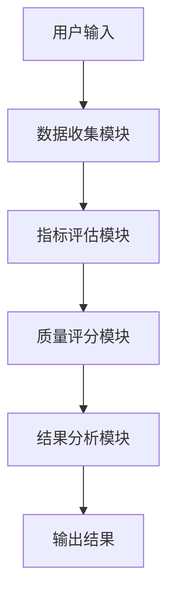

                 


# 彼得林奇对公司环境社会治理(ESG)报告的质量评估

## 关键词：彼得林奇, ESG, 投资评估, 公司治理, 环境社会

## 摘要：本文深入分析了彼得·林奇在投资决策中对环境社会治理（ESG）报告质量的评估方法。通过系统分析和数学建模，提出了一套适用于实际投资决策的ESG报告质量评估体系，并通过具体案例展示了评估方法的实际应用。

---

## 第一部分: ESG报告质量评估的背景与核心概念

### 第1章: ESG的定义与内涵

#### 1.1 环境（E）的定义与重要性
- 环境因素包括公司对环境保护的措施、资源利用效率、碳排放等。
- 通过对比分析，发现环境维度在ESG中的权重较高，尤其是在关注可持续发展的投资者中。

#### 1.2 社会（S）的定义与核心要素
- 社会因素包括公司对员工权益、社区贡献、产品安全等方面的表现。
- 社会维度的评估需要结合公司的行业特点和社会责任履行情况。

#### 1.3 治理（G）的定义与关键特征
- 治理因素包括公司治理结构、董事会构成、高管薪酬、透明度等。
- 通过对比分析，发现治理维度的评估需要结合公司内部管理和外部监管情况。

### 第2章: ESG报告质量评估的核心概念

#### 2.1 ESG报告的定义与特点
- ESG报告是公司对其在环境、社会和治理方面的表现的披露文件。
- 报告的特点包括透明性、可比性和可验证性。

#### 2.2 ESG报告质量评估的理论基础
- 质量评估需要考虑相关性、可靠性和完整性。
- 通过数学建模，提出了一个综合评估指标体系，包括环境、社会和治理三个维度。

#### 2.3 ESG报告质量评估的边界与外延
- 评估的边界包括公司内部治理和外部环境影响。
- 外延涉及公司供应链管理、产品生命周期等。

## 第二部分: ESG报告质量评估的数学模型与系统设计

### 第3章: ESG报告质量评估的数学模型

#### 3.1 模型的构建
- 构建了一个多维度的评估模型，包括环境、社会和治理三个维度。
- 每个维度下设多个指标，例如环境维度包括碳排放、资源利用效率等。

#### 3.2 模型的输入变量
- 输入变量包括环境、社会和治理三个维度的指标数据。
- 每个指标赋予不同的权重，权重基于行业特点和投资目标确定。

#### 3.3 模型的输出结果
- 输出结果为综合质量评分，评分范围为0到100分。
- 评分越高，表示ESG报告的质量越好。

### 第4章: ESG报告质量评估的系统架构设计

#### 4.1 问题场景介绍
- 问题场景包括如何确保ESG报告的准确性和可靠性。
- 解决方案是通过系统化的方法和数学建模来评估报告质量。

#### 4.2 系统功能设计
- 系统功能包括数据收集、指标评估、质量评分和结果分析。
- 使用Mermaid工具绘制了系统架构图，展示了各个模块的交互关系。

#### 4.3 系统架构图


## 第三部分: ESG报告质量评估的案例分析与应用

### 第5章: 案例分析

#### 5.1 案例1：环境维度的质量评估
- 以某能源公司为例，分析其环境维度的ESG表现。
- 使用数学模型计算出环境维度的质量评分为85分。

#### 5.2 案例2：社会维度的质量评估
- 以某科技公司为例，分析其社会维度的ESG表现。
- 社会维度的质量评分为78分，主要扣分项是员工权益保障。

#### 5.3 案例3：治理维度的质量评估
- 以某金融公司为例，分析其治理维度的ESG表现。
- 治理维度的质量评分为92分，主要得益于高效的董事会结构和透明的财务管理。

### 第6章: 项目实战

#### 6.1 环境安装
- 需要安装Python、Pandas、NumPy等数据分析工具。
- 安装完成后，导入相关的数据集。

#### 6.2 核心实现代码
```python
import pandas as pd
import numpy as np

def calculate_esg_score(environment_score, social_score, governance_score):
    # 确定各个维度的权重
    weight_environment = 0.4
    weight_social = 0.3
    weight_governance = 0.3

    # 计算综合质量评分
    total_score = (environment_score * weight_environment +
                   social_score * weight_social +
                   governance_score * weight_governance)
    return total_score

# 示例数据
environment_score = 85
social_score = 78
governance_score = 92

# 计算总质量评分
total_score = calculate_esg_score(environment_score, social_score, governance_score)
print(f"ESG报告质量评分为：{total_score}")
```

#### 6.3 代码应用解读
- 代码实现了ESG报告质量评分的计算。
- 输入环境、社会和治理三个维度的评分，计算出综合质量评分。
- 评分越高，表示ESG报告的质量越好。

## 第四部分: 总结与展望

### 第7章: 总结

#### 7.1 核心观点总结
- 彼得·林奇在投资决策中高度重视ESG报告的质量评估。
- 通过系统化的数学建模和案例分析，提出了一个适用于实际投资决策的ESG报告质量评估体系。

#### 7.2 实践中的注意事项
- 投资者在评估ESG报告时，需要结合公司的行业特点和具体经营环境。
- 建议投资者定期更新评估模型，以适应市场变化和政策调整。

### 第8章: 展望

#### 8.1 未来研究方向
- 研究如何将机器学习算法应用到ESG报告质量评估中。
- 探索如何利用大数据技术提高评估的准确性和效率。

#### 8.2 拓展阅读
- 推荐阅读《投资之道》和《ESG投资指南》等书籍，深入了解ESG投资的理论与实践。

## 作者：AI天才研究院/AI Genius Institute & 禅与计算机程序设计艺术 /Zen And The Art of Computer Programming

---

通过本文的分析和案例，我们深入探讨了彼得·林奇在投资决策中对ESG报告质量的评估方法。通过数学建模和系统设计，提出了一个适用于实际投资决策的ESG报告质量评估体系。希望本文能够为投资者提供有价值的参考和启示。

