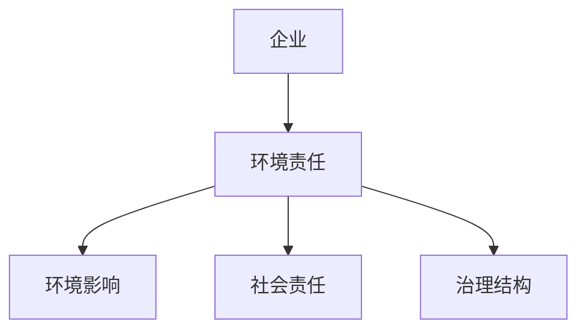
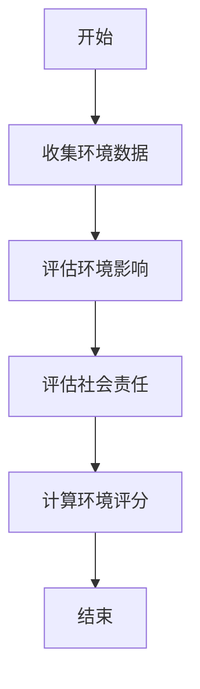
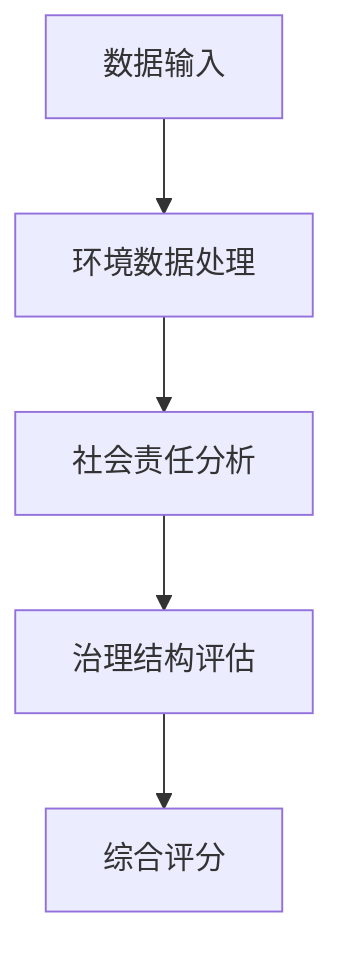

                 


# 彼得林奇对公司环境责任的评估

## 关键词：彼得·林奇，环境责任，公司评估，投资策略，ESG，可持续发展，风险管理

## 摘要：彼得·林奇以其独特的方法评估公司的环境责任，将环境、社会和治理（ESG）因素纳入投资决策。本文详细探讨了环境责任的核心概念、评估方法、算法原理以及实际案例，展示了环境责任评估如何影响投资策略。

---

# 第1章 公司环境责任评估的背景介绍

## 1.1 环境责任评估的定义与核心概念

### 1.1.1 环境责任的定义

环境责任是指公司在经营过程中对环境造成的影响及相应的责任，包括减少污染、节约资源和应对气候变化等方面。

### 1.1.2 公司环境责任的核心要素

- 环境影响：公司对自然资源的消耗和排放。
- 社会责任：公司在社会中的角色和影响。
- 治理结构：公司内部的管理机制。

### 1.1.3 环境责任与企业可持续发展的关系

环境责任是企业实现可持续发展的重要组成部分，直接影响企业的长期竞争力。

---

## 1.2 彼得·林奇与环境责任评估

### 1.2.1 彼得·林奇的投资者背景

彼得·林奇以其基本面分析闻名，注重公司的财务健康和管理层能力。

### 1.2.2 环境责任评估在投资中的重要性

环境责任影响公司的风险和收益，是投资决策的重要因素。

### 1.2.3 彼得·林奇的环境责任评估方法

林奇通过分析公司的环境政策、资源消耗和治理结构来评估环境责任。

---

## 1.3 环境责任评估的背景与意义

### 1.3.1 当前环境问题对企业的影响

环境问题可能导致法规风险和运营成本增加。

### 1.3.2 环境责任评估对企业竞争力的作用

通过优化环境表现，企业可以提升品牌形象和市场竞争力。

### 1.3.3 环境责任评估的全球发展趋势

全球对可持续发展的关注增加，推动环境责任评估的重要性。

---

# 第2章 环境责任评估的核心概念

## 2.1 环境责任评估的维度

### 2.1.1 环境责任的三个维度

- 环境：资源消耗、排放。
- 社会：员工权益、社区影响。
- 治理：管理透明度、董事会结构。

### 2.1.2 ESG的定义与区别

ESG指环境、社会和治理三个维度的综合评估。

### 2.1.3 环境责任与企业社会责任（CSR）的关系

环境责任是CSR的重要组成部分，关注企业的环境影响。

---

## 2.2 环境责任评估的理论框架

### 2.2.1 环境责任评估的理论基础

包括生态经济学和企业伦理学。

### 2.2.2 彼得·林奇的环境责任评估模型

林奇模型包括环境影响评分、社会责任评分和治理评分。

### 2.2.3 环境责任评估的核心要素对比表

| 要素 | 定义 | 影响 |
|------|------|------|
| 环境 | 资源消耗、排放 | 直接影响环境评分 |
| 社会 | 员工权益、社区影响 | 影响社会责任评分 |
| 治理 | 管理透明度、董事会结构 | 影响治理评分 |

---

## 2.3 环境责任评估的ER实体关系图



---

## 2.4 本章小结

环境责任评估涉及多维度分析，彼得·林奇的方法结合了环境、社会和治理因素，帮助企业优化表现。

---

# 第3章 环境责任评估的算法与数学模型

## 3.1 环境责任评估的算法概述

### 3.1.1 环境责任评估的主要算法

包括环境评分系统、决策树分析等。

---

## 3.2 彼得·林奇环境责任评估模型的数学公式

### 3.2.1 环境责任评分公式

$$ \text{环境责任评分} = \frac{\text{环境表现} + \text{社会责任表现}}{2} $$

---

## 3.3 环境责任评估的算法流程图



---

## 3.4 环境责任评估的Python实现

### 3.4.1 环境评分系统

```python
def calculate_environment_score(environment_impact, social_responsibility):
    return (environment_impact + social_responsibility) / 2
```

---

## 3.5 本章小结

通过数学模型和算法，彼得·林奇将环境责任评估系统化，帮助投资者做出更明智的决策。

---

# 第4章 彼得·林奇的环境责任评估体系

## 4.1 林奇环境责任评估体系的特点

### 4.1.1 全面性

涵盖环境、社会和治理三个维度。

### 4.1.2 可操作性

提供具体的评估指标和方法。

---

## 4.2 环境责任评估的系统架构

### 4.2.1 系统功能设计

包括数据收集、分析和评分模块。

### 4.2.2 系统架构图



---

## 4.3 本章小结

彼得·林奇的环境责任评估体系通过系统化的方法，帮助企业优化环境表现，提升投资价值。

---

# 第5章 环境责任评估的实际案例分析

## 5.1 微软公司的环境责任评估

### 5.1.1 微软的环境政策和承诺

包括碳中和目标和可持续发展计划。

### 5.1.2 微软的环境评分

通过模型计算得出微软的环境责任评分为高分。

---

## 5.2 亚马逊的环境责任评估

### 5.2.1 亚马逊的环境影响

包括碳排放和能源使用。

### 5.2.2 亚马逊的环境责任评分

根据模型计算得出亚马逊的环境责任评分。

---

## 5.3 案例分析总结

通过实际案例分析，展示环境责任评估的实际应用和影响。

---

# 第6章 环境责任评估对投资策略的影响

## 6.1 环境责任评估与投资决策

### 6.1.1 环境责任评估对投资策略的指导作用

帮助投资者选择更具可持续性的公司。

### 6.1.2 环境责任评估的长期投资价值

通过优化环境表现，提升企业的长期竞争力。

---

## 6.2 环境责任评估的未来发展趋势

### 6.2.1 全球可持续发展趋势

环境责任评估的重要性将不断增加。

### 6.2.2 技术进步对环境责任评估的推动

人工智能和大数据技术将提升环境责任评估的准确性。

---

## 6.3 本章小结

环境责任评估对投资策略具有重要影响，是未来投资决策的关键因素。

---

# 第7章 总结与展望

## 7.1 全书总结

彼得·林奇的环境责任评估方法为投资者提供了新的视角，帮助企业优化环境表现。

## 7.2 投资建议

建议投资者将环境责任评估纳入投资决策，关注企业的可持续发展。

## 7.3 未来研究方向

进一步研究环境责任评估的数学模型和技术创新。

---

# 第8章 最佳实践 tips

## 8.1 评估环境责任的注意事项

确保数据的准确性和模型的合理性。

## 8.2 环境责任评估的常见误区

避免仅关注环境因素，忽视社会和治理因素。

## 8.3 提升环境责任评估能力的建议

加强数据收集和分析能力，利用技术工具提高效率。

---

# 作者

作者：AI天才研究院/AI Genius Institute & 禅与计算机程序设计艺术 /Zen And The Art of Computer Programming

