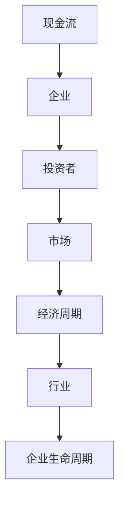
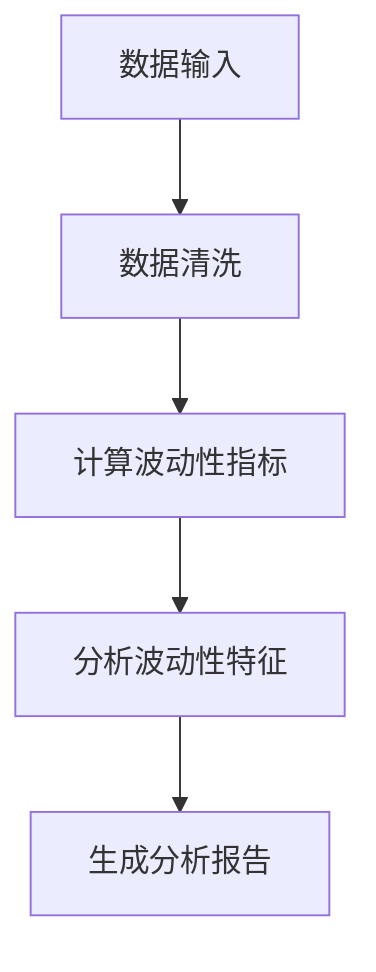
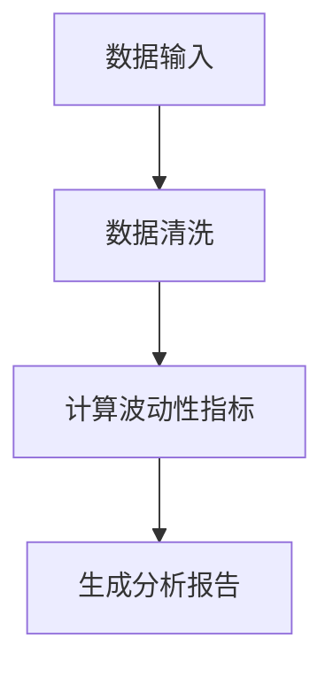
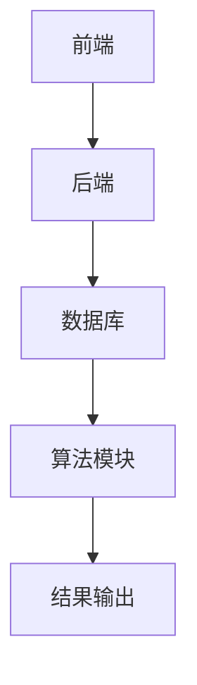

                 


# 彼得林奇对公司现金流波动性的分析

> 关键词：彼得·林奇，现金流波动性，投资分析，企业价值，现金流分析

> 摘要：本文深入探讨了彼得·林奇对公司现金流波动性的分析方法及其在投资决策中的应用。通过分析现金流波动性的定义、核心概念、数学模型和实际案例，本文详细阐述了如何通过现金流波动性评估企业价值和投资风险。同时，结合系统架构设计和Python代码实现，本文为读者提供了从理论到实践的完整指导。

---

## 第一部分: 彼得林奇投资理念与现金流分析概述

### 第1章: 彼得林奇投资理念与现金流分析概述

#### 1.1 彼得林奇投资理念的核心要素

彼得·林奇是美国著名的投资家，以其独特的投资理念和对现金流分析的深入研究而闻名。他的投资哲学强调对企业基本面的深入分析，尤其是对现金流的关注。现金流是企业生存和发展的血液，现金流的波动性直接反映了企业的财务健康状况和市场风险。

**1.1.1 彼得林奇的投资哲学**

彼得·林奇的投资哲学可以总结为以下几点：
1. **长期投资**：他主张长期持有优质股票，而不是频繁交易。
2. **基本面分析**：他强调对企业财务报表的深入分析，尤其是现金流。
3. **价值投资**：他寻找那些被市场低估的企业，并长期持有。

**1.1.2 现金流在投资分析中的重要性**

现金流是企业运营的核心，它反映了企业的盈利能力和偿债能力。彼得·林奇认为，现金流分析是评估企业价值的关键指标之一。现金流的稳定性、增长性和波动性直接关系到企业的投资价值。

**1.1.3 现金流波动性与企业价值的关系**

现金流波动性是指企业在一定时间内现金流的变化程度。波动性低的企业通常具有更强的财务稳定性，而波动性高的企业可能面临更大的市场风险。

---

#### 1.2 现金流波动性的定义与特征

**1.2.1 现金流波动性的定义**

现金流波动性是指企业在一定时间内的现金流变化程度。它可以通过标准差、方差或波动率等统计指标来衡量。

**1.2.2 现金流波动性的主要特征**

- **稳定性**：现金流波动性低的企业通常具有稳定的收入来源。
- **周期性**：现金流波动性可能与经济周期或行业周期相关。
- **风险性**：现金流波动性高的企业面临更大的财务风险。

**1.2.3 现金流波动性与企业风险的关系**

现金流波动性高的企业通常面临更大的市场风险和财务风险。这是因为现金流的波动性反映了企业对市场变化的敏感性。

---

#### 1.3 彼得林奇现金流分析的核心框架

**1.3.1 现金流分析的基本框架**

彼得·林奇的现金流分析框架包括以下几个步骤：
1. **数据收集**：收集企业的历史现金流数据。
2. **波动性计算**：计算现金流的波动率。
3. **波动性分析**：分析现金流波动性与企业价值的关系。

**1.3.2 现金流波动性分析的步骤**

1. 确定分析的时间范围。
2. 收集企业现金流数据。
3. 计算现金流的波动率。
4. 分析波动率与企业价值的关系。

**1.3.3 现金流波动性分析的边界与外延**

现金流波动性分析的边界包括：
- 数据范围：现金流的时间范围和频率。
- 方法论：使用的统计方法和模型。

现金流波动性分析的外延包括：
- 行业分析：不同行业现金流波动性的差异。
- 市场分析：整体市场波动性对单个企业的影响。

---

#### 1.4 本章小结

本章主要介绍了彼得·林奇的投资理念，重点分析了现金流波动性在投资分析中的重要性。现金流波动性是衡量企业财务稳定性和风险的重要指标，彼得·林奇通过现金流波动性分析，帮助投资者更好地评估企业价值和投资风险。

---

## 第二部分: 现金流波动性分析的核心概念与联系

### 第2章: 现金流波动性分析的核心原理

#### 2.1 现金流波动性分析的数学模型

现金流波动性可以通过统计学方法进行建模。以下是常用的数学模型：

**2.1.1 现金流波动性的数学表达**

现金流的波动率可以通过标准差来衡量：
$$ \sigma = \sqrt{\frac{1}{n}\sum_{i=1}^{n}(x_i - \mu)^2} $$
其中，$\mu$是现金流的平均值，$x_i$是每个时间点的现金流。

**2.1.2 现金流波动性的统计特征**

- 平均值：$\mu = \frac{1}{n}\sum_{i=1}^{n}x_i$
- 方差：$\sigma^2 = \frac{1}{n}\sum_{i=1}^{n}(x_i - \mu)^2$
- 标准差：$\sigma = \sqrt{\sigma^2}$

**2.1.3 现金流波动性的概率分布**

现金流的波动性通常服从正态分布，但也可能受到其他因素的影响。

#### 2.2 现金流波动性与企业价值的关系

**2.2.1 现金流波动性对企业价值的影响**

现金流波动性低的企业通常具有更高的投资价值，因为它们的财务稳定性更高。

**2.2.2 现金流波动性与企业风险的关系**

现金流波动性高的企业面临更大的市场风险和财务风险。

**2.2.3 现金流波动性与企业成长性的结合**

现金流波动性与企业成长性密切相关。成长型企业通常具有较高的现金流波动性，因为它们在扩展过程中需要更多的资金投入。

#### 2.3 现金流波动性分析的ER实体关系图

以下是现金流波动性分析的ER实体关系图：



---

### 第3章: 现金流波动性分析的算法实现

#### 3.1 现金流波动性分析的算法流程

以下是现金流波动性分析的算法流程：



#### 3.2 现金流波动性分析的Python实现

以下是现金流波动性分析的Python代码实现：

```python
import pandas as pd
import numpy as np

# 假设我们有一个现金流数据集
data = {
    '现金流': [100, 120, 90, 110, 130, 80, 100]
}

df = pd.DataFrame(data)

# 计算平均值
mu = df['现金流'].mean()

# 计算方差
variance = np.sum((df['现金流'] - mu) ** 2) / len(df)

# 计算标准差
std_dev = np.sqrt(variance)

print(f"平均值: {mu}")
print(f"方差: {variance}")
print(f"标准差: {std_dev}")
```

---

## 第三部分: 现金流波动性分析的系统设计与项目实战

### 第4章: 现金流波动性分析的系统架构设计

#### 4.1 项目介绍

本项目旨在构建一个现金流波动性分析系统，帮助投资者评估企业的财务稳定性。

#### 4.2 系统功能设计

以下是系统的功能设计：



#### 4.3 系统架构设计

以下是系统的架构设计：



---

### 第5章: 现金流波动性分析的项目实战

#### 5.1 环境安装

需要安装以下Python库：
- pandas
- numpy
- matplotlib

#### 5.2 核心实现源代码

以下是现金流波动性分析的核心代码：

```python
import pandas as pd
import numpy as np
import matplotlib.pyplot as plt

# 假设我们有一个现金流数据集
data = {
    '现金流': [100, 120, 90, 110, 130, 80, 100]
}

df = pd.DataFrame(data)

# 计算平均值
mu = df['现金流'].mean()

# 计算方差
variance = np.sum((df['现金流'] - mu) ** 2) / len(df)

# 计算标准差
std_dev = np.sqrt(variance)

# 可视化
plt.hist(df['现金流'], bins=5)
plt.title('现金流分布')
plt.xlabel('现金流')
plt.ylabel('频数')
plt.show()
```

#### 5.3 代码应用解读与分析

上述代码首先计算了现金流的平均值、方差和标准差，然后通过直方图展示了现金流的分布情况。这可以帮助投资者更好地理解现金流的波动性。

---

### 第6章: 总结与展望

#### 6.1 本章小结

现金流波动性是衡量企业财务稳定性和风险的重要指标。彼得·林奇通过现金流波动性分析，帮助投资者更好地评估企业价值和投资风险。

#### 6.2 未来研究方向

未来的研究可以进一步探讨现金流波动性与其他财务指标的关系，以及如何通过机器学习方法提高现金流波动性分析的准确性。

---

## 作者信息

作者：AI天才研究院/AI Genius Institute & 禅与计算机程序设计艺术 /Zen And The Art of Computer Programming

---

以上是《彼得林奇对公司现金流波动性的分析》的完整目录和文章内容。

