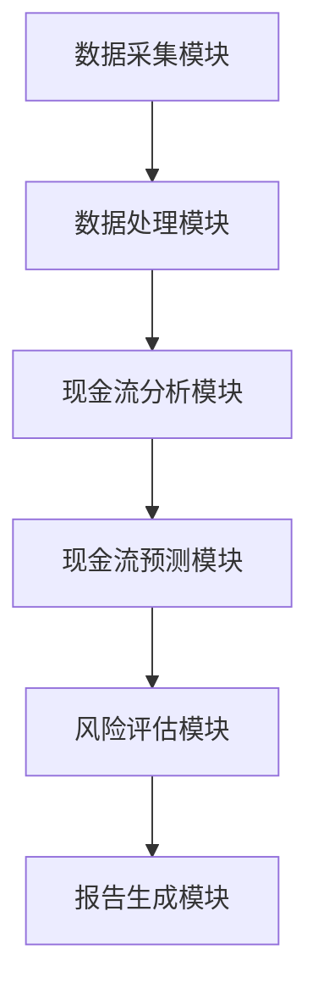

                 

# 彼得林奇对公司现金流管理的看法

## 关键词：
现金流管理, 彼得·林奇, 现金流分析, DCF模型, 投资策略, 风险管理

## 摘要：
现金流管理是企业财务管理的核心，彼得·林奇作为投资大师，提出了独特的现金流管理方法。本文深入探讨现金流管理的核心概念、彼得·林奇的现金流管理思想、现金流预测与估值、投资策略、风险管理，以及系统架构与实现。通过理论分析和实际案例，帮助读者全面理解现金流管理的重要性及其在投资中的应用。

---

## 正文：

### 第1章 现金流管理的核心概念与背景

#### 1.1 现金流管理的基本概念

现金流是指企业在一定会计期间内，通过经营、投资和融资活动所形成的现金流入和流出。现金流管理的目标是确保企业有足够的资金支持运营，同时最大化企业价值。

**现金流的分类**：
- **经营活动现金流**：企业日常运营产生的现金流。
- **投资活动现金流**：企业投资于长期资产或出售投资产生的现金流。
- **筹资活动现金流**：企业通过融资活动获得或偿还债务产生的现金流。

#### 1.2 现金流管理的重要性

现金流是企业的生命线。现金流管理的重要性体现在以下几个方面：
- **维持企业运营**：确保企业有足够的现金支付日常开支。
- **支持企业扩张**：为企业提供资金用于投资和扩张。
- **降低财务风险**：通过合理管理现金流，降低企业面临财务危机的风险。

#### 1.3 彼得·林奇与现金流管理

彼得·林奇是美国著名投资经理，曾管理麦哲伦基金，取得了卓越的投资业绩。他强调现金流在企业估值中的重要性，认为现金流是企业价值的核心驱动力。

---

### 第2章 彼得·林奇的现金流管理方法

#### 2.1 现金流管理的基本原则

彼得·林奇提出以下三条现金流管理的基本原则：
1. **现金流来源的多样性**：避免依赖单一现金流来源，分散风险。
2. **现金流的稳定性**：确保现金流的稳定性，避免过大波动。
3. **现金流的可预测性**：通过分析历史数据和市场趋势，提高现金流预测的准确性。

#### 2.2 现金流管理的核心工具与方法

彼得·林奇常用以下方法进行现金流管理：
1. **现金流分析**：通过分析企业的现金流状况，评估企业的财务健康状况。
2. **现金流预测**：基于历史数据和市场趋势，预测未来现金流。
3. **DCF模型**：使用现金流折现法（DCF模型）对企业价值进行评估。

#### 2.3 现金流管理的动态调整

彼得·林奇强调现金流管理的动态性，建议企业根据市场变化和自身情况，定期调整现金流管理策略。

---

### 第3章 现金流预测与估值

#### 3.1 现金流预测的方法

现金流预测是现金流管理的重要组成部分。彼得·林奇常用以下方法进行现金流预测：
1. **定性分析**：分析企业的商业模式、市场地位、竞争优势等因素。
2. **定量分析**：基于历史数据，使用统计方法预测未来现金流。

#### 3.2 现金流预测的数学模型

现金流预测的数学模型可以表示为：
$$
CF_t = \alpha \cdot X_t + \beta \cdot Y_t + \epsilon_t
$$
其中：
- $CF_t$ 表示第$t$期的现金流。
- $X_t$ 和 $Y_t$ 表示影响现金流的因素。
- $\alpha$ 和 $\beta$ 表示回归系数。
- $\epsilon_t$ 表示误差项。

#### 3.3 DCF模型的应用

DCF模型是企业估值的重要工具。彼得·林奇常用DCF模型对企业价值进行评估。DCF模型的基本公式为：
$$
企业价值 = \sum_{t=1}^{n} \frac{CF_t}{(1 + r)^t} + \frac{TV}{(1 + r)^n}
$$
其中：
- $CF_t$ 表示第$t$期的自由现金流。
- $r$ 表示折现率。
- $TV$ 表示终值。

---

### 第4章 现金流管理的系统架构与实现

#### 4.1 现金流管理系统的功能模块

现金流管理系统主要包括以下几个功能模块：
1. **数据采集模块**：采集企业的财务数据。
2. **现金流分析模块**：对现金流进行分析和评估。
3. **现金流预测模块**：基于历史数据预测未来现金流。
4. **风险评估模块**：评估现金流管理中的风险。

#### 4.2 现金流管理系统的架构设计

现金流管理系统的架构设计如下：

#### 4.3 现金流管理系统的接口设计

现金流管理系统的接口设计需要考虑以下几点：
1. **标准化接口**：确保不同模块之间的接口标准化。
2. **安全性**：保证数据传输的安全性。
3. **可扩展性**：方便未来功能的扩展。

---

### 第5章 现金流管理的最佳实践与案例分析

#### 5.1 现金流管理的实战案例

彼得·林奇的经典案例：
- **案例一**：通过分析现金流，发现某企业的价值被低估。
- **案例二**：通过预测现金流，规避某企业的财务风险。

#### 5.2 现金流管理的行业应用

现金流管理在不同行业的应用有所不同，但核心思想是相通的。例如，在制造业，现金流管理可以帮助企业优化库存管理；在科技行业，现金流管理可以帮助企业合理分配研发资金。

---

## 结论

现金流管理是企业财务管理的核心，彼得·林奇通过其独特的现金流管理方法，为企业价值评估提供了新的视角。本文从现金流管理的核心概念、彼得·林奇的现金流管理思想、现金流预测与估值、投资策略、风险管理，以及系统架构与实现等方面进行了详细探讨。通过理论分析和实际案例，帮助读者全面理解现金流管理的重要性及其在投资中的应用。

---

## 作者

作者：AI天才研究院/AI Genius Institute & 禅与计算机程序设计艺术 /Zen And The Art of Computer Programming

