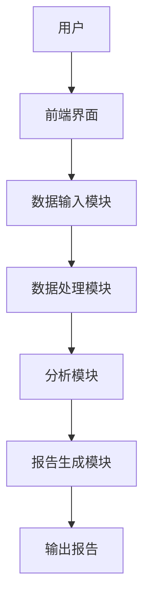
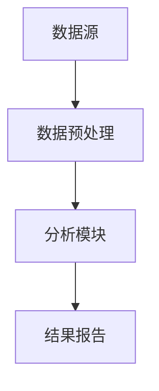

                 


# 彼得林奇对公司现金流质量的季节性分析

> 关键词：现金流质量，季节性分析，彼得·林奇，投资分析，财务健康

> 摘要：本文深入分析了彼得·林奇对公司现金流质量的季节性分析方法，探讨了现金流质量的核心概念、季节性波动的原理、现金流质量的量化评估方法以及如何结合季节性因素进行投资决策。通过实际案例分析和系统设计，展示了现金流质量分析在投资中的重要性。

---

## 第一章 现金流质量分析的背景与重要性

### 1.1 现金流质量分析的定义与核心概念

#### 1.1.1 现金流的定义与分类
现金流是企业在一定时期内通过各项经济活动所获得的现金流入和流出的总和。现金流可以分为以下几类：
- **经营活动现金流**：企业日常经营活动中产生的现金流。
- **投资活动现金流**：企业投资活动（如购买或出售资产）产生的现金流。
- **筹资活动现金流**：企业通过筹资活动（如发行债券或股票）获得的现金流。

#### 1.1.2 现金流质量的内涵与外延
现金流质量是指企业现金流的稳定性和可持续性。高质量的现金流意味着企业能够通过经营活动持续产生稳定的现金流，而低质量的现金流则可能依赖于外部融资或其他不稳定的来源。

#### 1.1.3 现金流与企业价值的关系
现金流是企业价值的核心驱动因素之一。高质量的现金流通常意味着企业具有较强的盈利能力、良好的财务健康状况和持续的增长潜力。

### 1.2 季节性分析的定义与应用

#### 1.2.1 季节性分析的定义
季节性分析是指通过对历史数据的分析，识别出现金流波动的周期性特征，并预测未来现金流的变化趋势。

#### 1.2.2 季节性分析在财务分析中的作用
季节性分析可以帮助投资者更好地理解企业的经营状况，识别潜在的风险和机会，并为投资决策提供依据。

#### 1.2.3 现金流质量与季节性分析的关系
现金流的质量会受到季节性波动的影响。通过季节性分析，可以更准确地评估现金流的质量，从而做出更合理的投资决策。

### 1.3 彼得·林奇与现金流质量分析

#### 1.3.1 彼得·林奇的投资理念
彼得·林奇是美国著名的投资专家，他认为企业的现金流是衡量企业价值的重要指标。他强调通过分析企业的现金流质量来评估其投资价值。

#### 1.3.2 现金流质量在林奇分析体系中的地位
在林奇的分析体系中，现金流质量是评估企业财务健康状况和投资价值的核心指标之一。

#### 1.3.3 季节性分析在林奇投资策略中的应用
林奇通过季节性分析，识别出企业现金流的周期性波动，并利用这些信息进行投资决策。

### 1.4 本章小结
本章介绍了现金流质量分析的背景、核心概念以及季节性分析的定义和应用。同时，探讨了彼得·林奇的投资理念及其对现金流质量分析的重视。

---

## 第二章 现金流质量的核心要素

### 2.1 现金流质量的核心要素

#### 2.1.1 现金流来源的多样性
现金流的来源越多样化，企业的财务风险越小。高质量的现金流来源于经营活动，而不是依赖于外部融资。

#### 2.1.2 现金流波动的周期性
现金流的波动具有周期性，通过季节性分析可以识别出这些周期性波动，并进行预测。

#### 2.1.3 现金流与企业盈利的关系
现金流与企业盈利密切相关，高质量的现金流意味着企业具有较强的盈利能力。

### 2.2 现金流质量的分类与特征

#### 2.2.1 高质量现金流的特征
- 现金流稳定且可持续。
- 经营活动现金流占比较高。
- 现金流与企业盈利匹配。

#### 2.2.2 低质量现金流的特征
- 现金流波动较大。
- 经营活动现金流占比较低。
- 现金流与企业盈利不匹配。

#### 2.2.3 现金流质量的评价标准
- 经营活动现金流净额。
- 现金流与净利润的比率。
- 现金流的可持续性。

### 2.3 现金流质量与财务健康的关系

#### 2.3.1 现金流质量对财务健康的影响
高质量的现金流能够增强企业的财务健康状况，降低财务风险。

#### 2.3.2 现金流质量与企业风险的关系
低质量的现金流可能导致企业面临更大的财务风险。

#### 2.3.3 现金流质量与企业价值的关系
高质量的现金流通常意味着更高的企业价值。

### 2.4 本章小结
本章分析了现金流质量的核心要素，探讨了现金流质量的分类与特征，并进一步阐述了现金流质量与财务健康、企业风险和企业价值的关系。

---

## 第三章 现金流季节性波动的原理

### 3.1 现金流波动的周期性分析

#### 3.1.1 现金流波动的周期性特征
现金流的波动通常具有周期性，可以通过季节性分析识别这些周期性特征。

#### 3.1.2 现金流波动的驱动因素
现金流波动的驱动因素包括市场需求、企业经营周期、行业特点等。

#### 3.1.3 现金流波动的预测方法
通过历史数据分析和季节性模型，可以预测未来现金流的波动趋势。

### 3.2 现金流季节性分析的数学模型

#### 3.2.1 季节性分解模型
季节性分解模型可以将现金流分解为趋势、周期性和随机性三部分。

#### 3.2.2 季节性指数模型
季节性指数模型通过计算各季节的指数，反映现金流在不同季节的波动情况。

#### 3.2.3 线性回归模型
线性回归模型可以通过历史数据拟合现金流的季节性趋势。

### 3.3 现金流季节性分析的算法实现

#### 3.3.1 季节性分解算法
```python
import pandas as pd
import numpy as np

def seasonal_decomposition(data, freq):
    # 数据分解
    trend = data.rolling(freq).mean()
    seasonal = data - trend
    return seasonal
```

#### 3.3.2 季节性指数算法
```python
def calculate_seasonal_index(data, freq):
    # 计算季节性指数
    seasonal_index = data.pivot_table('value', 'period').apply(lambda x: x/x.sum(), axis=1)
    return seasonal_index
```

### 3.4 本章小结
本章分析了现金流波动的周期性特征，探讨了季节性分析的数学模型和算法实现。

---

## 第四章 现金流质量的量化评估方法

### 4.1 现金流质量的量化指标

#### 4.1.1 现金流质量指数
$$ \text{现金流质量指数} = \frac{\text{经营活动现金流净额}}{\text{净利润}} $$

#### 4.1.2 现金流健康评分模型
$$ \text{现金流健康评分} = 0.5 \times \text{现金流稳定性} + 0.5 \times \text{现金流可持续性} $$

### 4.2 现金流质量的评估步骤

#### 4.2.1 数据收集
收集企业的历史财务数据，包括经营活动现金流、净利润等。

#### 4.2.2 数据预处理
对数据进行清洗和标准化处理，确保数据的准确性和一致性。

#### 4.2.3 模型训练
使用机器学习算法训练现金流质量评估模型。

#### 4.2.4 模型验证
通过历史数据验证模型的准确性，并进行优化。

### 4.3 本章小结
本章探讨了现金流质量的量化评估方法，包括现金流质量指数和健康评分模型，并详细说明了评估的步骤。

---

## 第五章 彼得·林奇的现金流分析框架

### 5.1 彼得·林奇的现金流分析框架

#### 5.1.1 投资策略
林奇通过分析企业的现金流质量，选择具有持续增长潜力的企业进行投资。

#### 5.1.2 现金流分析模型
林奇使用现金流质量指数和季节性分析模型进行投资决策。

### 5.2 现金流分析的实战案例

#### 5.2.1 案例分析
以某企业为例，分析其经营活动现金流净额和净利润的关系。

#### 5.2.2 季节性分析
通过历史数据，识别出企业现金流的季节性波动特征。

### 5.3 本章小结
本章介绍了彼得·林奇的现金流分析框架，并通过实际案例展示了如何应用季节性分析进行投资决策。

---

## 第六章 系统设计与实现

### 6.1 系统需求分析

#### 6.1.1 功能需求
- 现金流数据输入与管理。
- 季节性分析模型实现。
- 现金流质量评估报告生成。

#### 6.1.2 用户需求
- 投资者需要实时监控现金流质量。
- 企业财务人员需要进行现金流分析。

### 6.2 系统架构设计

#### 6.2.1 系统架构图


#### 6.2.2 数据流图


### 6.3 系统实现

#### 6.3.1 数据接口设计
- 数据输入接口：支持CSV和Excel格式。
- 数据输出接口：支持PDF和HTML格式。

#### 6.3.2 系统功能模块
- 数据管理模块：数据输入、清洗和存储。
- 分析模块：季节性分析、现金流质量评估。
- 报告生成模块：生成分析报告。

### 6.4 本章小结
本章详细设计了现金流质量分析系统的架构和功能模块，并讨论了系统的实现方法。

---

## 第七章 项目实战

### 7.1 环境搭建

#### 7.1.1 工具安装
- Python 3.8以上版本。
- Pandas、NumPy、Matplotlib库。

#### 7.1.2 数据来源
- 使用公开企业的财务数据进行分析。

### 7.2 数据预处理

#### 7.2.1 数据清洗
- 去除缺失值。
- 处理异常值。

#### 7.2.2 数据标准化
- 对数据进行标准化处理，确保分析结果的准确性。

### 7.3 模型实现

#### 7.3.1 季节性分析代码
```python
import pandas as pd
import matplotlib.pyplot as plt

data = pd.read_csv('cash_flow.csv')
data.plot()
plt.show()
```

#### 7.3.2 现金流质量评估代码
```python
def calculate_cash_flow_quality(data):
    quality_index = data['经营活动现金流净额'] / data['净利润']
    return quality_index
```

### 7.4 结果分析

#### 7.4.1 季节性波动分析
通过图表展示现金流的季节性波动特征。

#### 7.4.2 现金流质量评估
计算现金流质量指数，并根据指数值对企业进行分类。

### 7.5 本章小结
本章通过实际案例展示了现金流质量分析的全过程，包括数据预处理、模型实现和结果分析。

---

## 第八章 进阶内容与总结

### 8.1 现金流质量分析的前沿趋势

#### 8.1.1 人工智能在现金流分析中的应用
- 使用机器学习算法进行现金流预测。
- 利用自然语言处理技术分析企业财务报告。

#### 8.1.2 区块链技术在现金流管理中的应用
- 区块链技术可以提高现金流管理的透明度和安全性。

### 8.2 现金流质量分析的最佳实践

#### 8.2.1 数据质量管理
- 确保数据的准确性和完整性。
- 定期更新数据。

#### 8.2.2 模型优化
- 根据实际情况调整模型参数。
- 不断优化分析方法。

### 8.3 本章小结
本章探讨了现金流质量分析的前沿趋势和最佳实践，并总结了全文的主要内容。

---

## 作者信息

作者：AI天才研究院/AI Genius Institute & 禅与计算机程序设计艺术/Zen And The Art of Computer Programming

---

以上是文章的完整目录和内容框架。希望这篇文章能够帮助读者更好地理解彼得·林奇的现金流质量分析方法，并在实际投资中加以应用。

