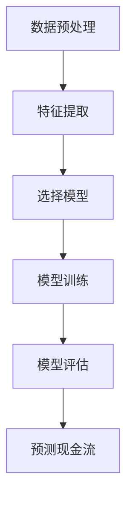
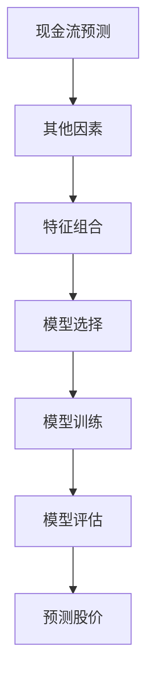
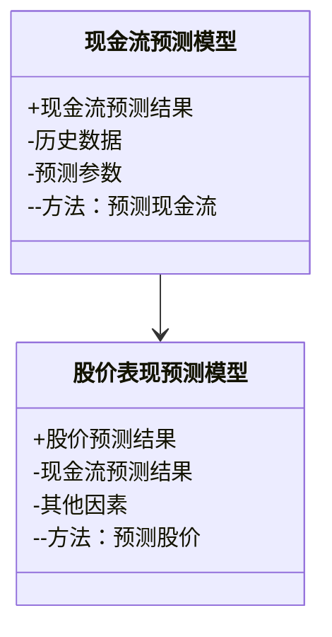
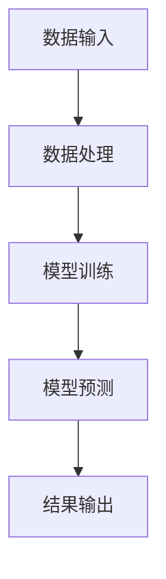
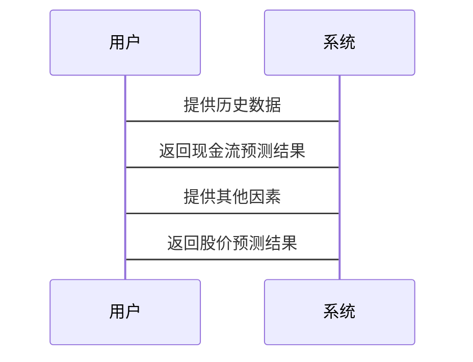

                 


# 彼得林奇对公司现金流预测准确性与股价表现关系的研究

## 关键词：现金流预测，股价表现，彼得林奇，预测准确性，投资策略

## 摘要：  
现金流预测的准确性对股价表现有显著影响，本文通过分析彼得林奇的研究，探讨现金流预测与股价表现的关系，提出提升现金流预测准确性的方法，并结合实际案例，展示了如何通过现金流预测优化股价表现预测模型。

---

# 第一部分: 背景介绍

## 第1章: 现金流预测准确性与股价表现的背景

### 1.1 问题背景

#### 1.1.1 现金流预测的定义与重要性
现金流预测是指通过分析历史数据和市场趋势，预测未来一段时间内公司现金流入和流出的情况。现金流是企业运营的核心，其预测准确性直接影响企业的财务决策和投资价值。

#### 1.1.2 股价表现的核心影响因素
股价表现受多种因素影响，包括公司业绩、市场情绪、宏观经济环境等。其中，现金流是反映公司财务健康状况的重要指标，直接影响投资者对公司的估值。

#### 1.1.3 现金流预测与股价表现的关系
现金流预测的准确性能够帮助投资者更好地理解公司未来的财务状况，从而更准确地预测股价走势。现金流预测的误差可能导致股价预测的偏差。

### 1.2 问题描述

#### 1.2.1 现金流预测准确性的影响因素
现金流预测的准确性受历史数据质量、市场波动、公司内部管理等多种因素影响。

#### 1.2.2 股价表现预测的波动性与预测难度
股价受市场情绪、宏观经济政策等不可控因素影响，预测难度较大。现金流预测的准确性能够部分缓解这种不确定性。

#### 1.2.3 现金流预测准确性与股价表现的关系
现金流预测的准确性直接影响投资者对公司的信心，从而影响股价表现。

### 1.3 问题解决

#### 1.3.1 现金流预测准确性提升的方法
通过改进预测模型、引入机器学习算法等方法，提升现金流预测的准确性。

#### 1.3.2 股价表现预测的模型构建
基于现金流预测结果，构建股价表现预测模型，结合其他因素进行综合预测。

#### 1.3.3 现金流预测准确性与股价表现的协同优化
通过优化现金流预测模型，提升股价表现预测的准确性，实现两者协同优化。

### 1.4 边界与外延

#### 1.4.1 现金流预测的适用范围
现金流预测适用于企业财务规划、投资决策等领域，但需考虑市场环境的不确定性。

#### 1.4.2 股价表现预测的局限性
股价受市场情绪和外部因素影响较大，预测模型无法完全消除不确定性。

#### 1.4.3 现金流预测准确性与股价表现关系的边界条件
现金流预测准确性与股价表现的关系需考虑市场环境、公司基本面等多方面因素。

### 1.5 核心概念结构与要素

#### 1.5.1 现金流预测的核心要素
现金流预测模型、历史数据、预测方法、预测结果。

#### 1.5.2 股价表现的核心要素
股价走势、市场情绪、公司业绩、宏观经济指标。

#### 1.5.3 两者关系的核心结构
现金流预测准确性 → 股价表现 → 投资决策。

---

# 第二部分: 核心概念与联系

## 第2章: 现金流预测准确性与股价表现的核心概念

### 2.1 现金流预测准确性原理

#### 2.1.1 现金流预测的原理与方法
现金流预测基于历史数据和市场趋势，采用统计模型或机器学习算法进行预测。

#### 2.1.2 现金流预测的准确性评估指标
均方误差（MSE）、平均绝对误差（MAE）、R²值等。

### 2.2 股价表现预测的原理

#### 2.2.1 股价表现的影响因素
公司业绩、市场情绪、宏观经济指标、行业竞争状况。

#### 2.2.2 股价表现预测的模型与方法
线性回归、时间序列分析、机器学习算法等。

### 2.3 现金流预测与股价表现的关系

#### 2.3.1 现金流预测准确性对股价表现的影响
现金流预测准确性越高，股价表现预测越准确。

#### 2.3.2 股价表现预测的波动性与现金流预测的关系
现金流预测能够减少股价表现预测的不确定性。

#### 2.3.3 现金流预测准确性与股价表现关系的数学表达
$$\text{股价表现预测} = f(\text{现金流预测准确性}, \text{其他因素})$$

---

# 第三部分: 算法原理讲解

## 第3章: 现金流预测准确性与股价表现的算法原理

### 3.1 现金流预测的算法流程



### 3.2 现金流预测的数学模型

$$\text{现金流预测} = \beta_0 + \beta_1x_1 + \beta_2x_2 + \cdots + \beta_nx_n + \epsilon$$

### 3.3 股价表现预测的算法流程



### 3.4 股价表现预测的数学模型

$$\text{股价预测} = \alpha_0 + \alpha_1\text{现金流预测} + \alpha_2\text{其他因素} + \delta$$

---

# 第四部分: 系统分析与架构设计

## 第4章: 系统分析与架构设计方案

### 4.1 问题场景介绍

#### 4.1.1 项目介绍
构建一个基于现金流预测的股价表现预测系统。

### 4.2 系统功能设计

#### 4.2.1 领域模型


### 4.3 系统架构设计



### 4.4 系统接口设计

#### 4.4.1 系统交互流程



---

# 第五部分: 项目实战

## 第5章: 项目实战

### 5.1 环境安装

#### 5.1.1 安装Python
安装Python 3.x版本，建议使用Anaconda。

#### 5.1.2 安装依赖库
安装numpy、pandas、scikit-learn等库。

### 5.2 系统核心实现源代码

#### 5.2.1 现金流预测代码

```python
import numpy as np
import pandas as pd
from sklearn.linear_model import LinearRegression

def predict_cash_flow(data):
    model = LinearRegression()
    model.fit(data[['revenue', 'expenses']], data['cash_flow'])
    return model.predict(data[['revenue', 'expenses']])
```

#### 5.2.2 股价表现预测代码

```python
def predict_stock_price(cash_flow_pred, other_factors):
    model = LinearRegression()
    model.fit(pd.DataFrame(other_factors), cash_flow_pred)
    return model.predict(other_factors)
```

### 5.3 代码应用解读与分析

#### 5.3.1 现金流预测结果分析
通过历史数据训练模型，预测未来现金流，评估模型准确性。

#### 5.3.2 股价表现预测结果分析
结合现金流预测结果和其他因素，预测股价走势，分析预测误差。

### 5.4 实际案例分析和详细讲解剖析

#### 5.4.1 案例介绍
以某公司为例，分析现金流预测与股价表现的关系。

#### 5.4.2 数据收集与处理
收集公司历史财务数据和股价数据，进行数据清洗和特征提取。

#### 5.4.3 模型训练与预测
使用历史数据训练现金流预测模型，预测未来现金流，再结合其他因素预测股价。

### 5.5 项目小结

#### 5.5.1 项目总结
通过现金流预测优化股价表现预测模型，提升预测准确性。

#### 5.5.2 项目成果
展示了现金流预测在股价表现预测中的重要性。

---

# 第六部分: 最佳实践

## 第6章: 最佳实践

### 6.1 小结

#### 6.1.1 现金流预测准确性的重要性
现金流预测准确性直接影响股价表现预测结果。

#### 6.1.2 提升预测准确性的方法
改进模型、引入外部数据、实时更新预测结果。

### 6.2 注意事项

#### 6.2.1 数据质量的重要性
确保数据准确性和完整性。

#### 6.2.2 模型选择的合理性
根据数据特点选择合适的模型。

#### 6.2.3 结果解释的清晰性
确保预测结果能够被投资者理解和应用。

### 6.3 拓展阅读

#### 6.3.1 推荐书籍
《彼得林奇的成功投资》。

#### 6.3.2 推荐论文
“现金流预测与股价表现的关系”相关研究。

---

作者：AI天才研究院/AI Genius Institute & 禅与计算机程序设计艺术 /Zen And The Art of Computer Programming

