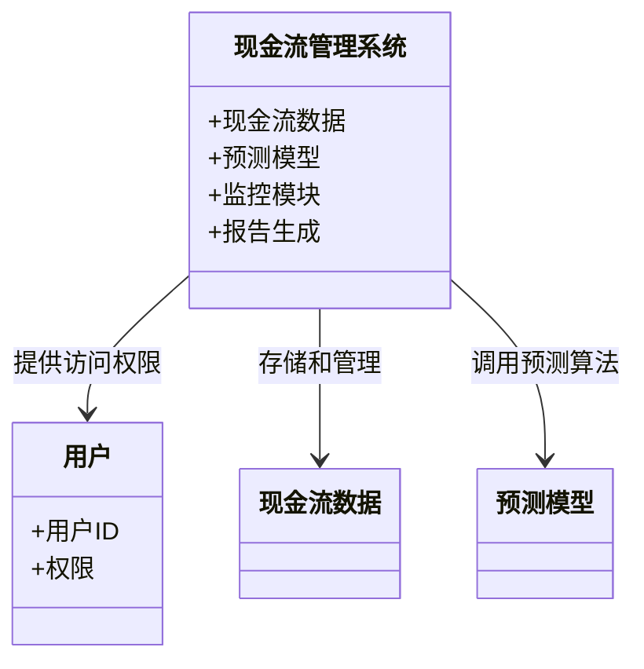
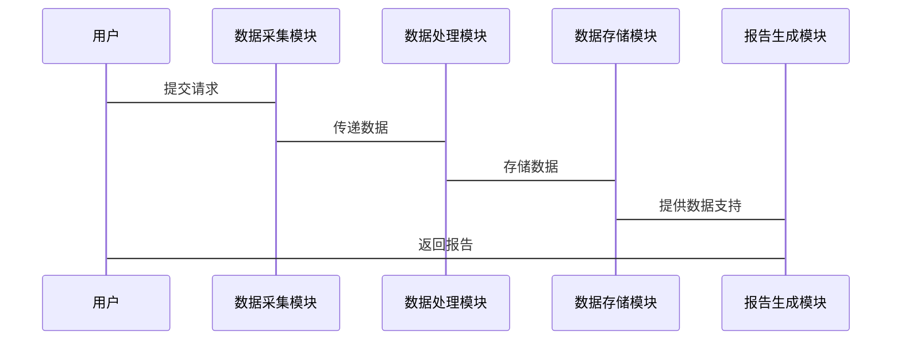

                 


# 彼得林奇对公司现金管理效率的看法

## 关键词：现金管理效率，彼得·林奇，现金流，投资策略，财务分析

## 摘要：  
本文从彼得·林奇的投资理念出发，深入探讨现金管理效率在公司运营中的重要性。通过分析现金流预测的数学模型、现金流管理系统架构以及项目实战案例，结合理论与实践，全面解析如何通过高效现金管理提升企业价值。

---

# 第一部分: 引言

# 第1章: 现金管理效率的重要性

## 1.1 现金管理效率的定义

### 1.1.1 现金管理的基本概念  
现金管理是指对企业的现金流入和流出进行计划、监控和控制的过程，旨在最大化现金流的价值，降低财务风险。现金流是企业的生命线，是企业运营的核心资源。

### 1.1.2 现金管理效率的衡量标准  
现金管理效率可以通过以下指标衡量：  
1. 现金持有成本：包括机会成本、管理成本和短缺成本。  
2. 现金转化周期：从现金流入到现金流出的时间间隔。  
3. 现金流预测的准确性：预测值与实际值的偏差程度。  

### 1.1.3 现金管理效率与企业价值的关系  
高效的现金管理可以优化企业的资金使用效率，降低融资成本，提高投资回报率，从而增强企业价值。  

## 1.2 彼得·林奇与现金管理效率

### 1.2.1 彼得·林奇的投资理念  
彼得·林奇是全球著名投资经理，他强调基本面分析和长期投资。他认为，企业的现金流是衡量公司健康状况的重要指标，也是投资决策的核心依据。  

### 1.2.2 现金管理在投资决策中的作用  
现金管理不仅是企业内部财务管理的重要环节，也是投资者评估公司价值的关键因素。通过分析现金流，投资者可以判断企业的盈利能力和偿债能力。  

### 1.2.3 彼得·林奇对现金管理效率的看法  
彼得·林奇认为，高效的现金管理能够确保企业在资金需求高峰期具备足够的流动性，同时避免过多的现金闲置。他强调，现金流预测的准确性是实现高效现金管理的前提。  

## 1.3 本章小结  
本章介绍了现金管理效率的基本概念和衡量标准，并结合彼得·林奇的投资理念，强调了现金管理在企业运营和投资决策中的重要性。  

---

# 第二部分: 现金管理效率的核心概念与联系

# 第2章: 现金流管理与企业运营

## 2.1 现金流管理的基本原理

### 2.1.1 现金流的来源与用途  
现金流入主要包括销售收入、投资收益和融资活动的净流入；现金流出主要包括购买原材料、支付工资、偿还债务等。  

### 2.1.2 现金流的时间价值  
现金流的时间价值是指资金随着时间的推移而产生的价值变化。可以通过现值和终值公式进行计算。  

### 2.1.3 现金流的风险管理  
现金流风险管理包括识别、评估和应对现金流波动带来的风险，如市场风险、信用风险和流动性风险。  

## 2.2 现金流与企业价值的关系

### 2.2.1 现金流对企业财务健康的影响  
健康的现金流是企业财务健康的重要指标，能够反映企业的盈利能力和偿债能力。  

### 2.2.2 现金流与企业投资能力的关联  
充裕的现金流为企业提供了进行新项目投资的能力，从而推动企业成长。  

### 2.2.3 现金流与企业融资能力的关联  
良好的现金流记录可以增强投资者和债权人的信心，从而降低融资成本，提高融资能力。  

## 2.3 现金流管理的核心目标

### 2.3.1 现金流的流动性管理  
确保企业在任何时候都能满足资金需求，避免现金流断裂。  

### 2.3.2 现金流的收益性管理  
通过优化现金流管理，提高资金使用效率，实现最大化的投资回报。  

### 2.3.3 现金流的风险管理  
通过风险控制，降低现金流波动对企业财务健康的影响。  

## 2.4 本章小结  
本章从现金流管理的基本原理出发，分析了现金流与企业价值的关系，并总结了现金流管理的核心目标。  

---

# 第三部分: 现金管理效率的数学模型与算法

# 第3章: 现金流预测的数学模型

## 3.1 现金流预测的基本方法

### 3.1.1 时间序列分析  
时间序列分析是一种基于历史数据预测未来趋势的方法。常用模型包括ARIMA和指数平滑法。  

### 3.1.2 回归分析  
回归分析通过建立自变量和因变量之间的关系模型，预测未来的现金流。  

### 3.1.3 预测模型的选择与评估  
选择合适的预测模型需要考虑数据特征、模型复杂度和预测准确性。常用评估指标包括均方误差（MSE）和R平方值。  

## 3.2 现金流预测的算法实现

### 3.2.1 ARIMA模型的实现  
ARIMA模型是一种常用的时间序列预测模型，适用于具有趋势和季节性的数据。  

### 3.2.2 LSTM模型的实现  
长短期记忆网络（LSTM）是一种深度学习模型，适用于处理复杂的时序数据。  

### 3.2.3 线性回归模型的实现  
线性回归模型通过最小二乘法拟合数据，适用于简单的线性关系。  

## 3.3 现金流预测的优化方法

### 3.3.1 参数优化  
通过调整模型参数，提高预测的准确性。  

### 3.3.2 模型集成  
将多个模型的预测结果进行集成，降低预测误差。  

### 3.3.3 离群值处理  
识别并处理异常数据点，提高模型的稳定性。  

## 3.4 本章小结  
本章介绍了现金流预测的基本方法和算法实现，强调了参数优化和模型集成在提高预测准确性中的作用。  

---

# 第四部分: 现金流管理系统架构

## 4.1 现金流管理系统的功能设计

### 4.1.1 系统功能模块  
- 数据采集模块：采集企业的财务数据。  
- 预测模块：基于历史数据进行现金流预测。  
- 监控模块：实时监控现金流状况。  
- 报告生成模块：生成现金流分析报告。  

### 4.1.2 系统功能设计的ER类图  


## 4.2 系统架构设计

### 4.2.1 系统架构的分层设计  


### 4.2.2 系统架构的模块交互  


## 4.3 本章小结  
本章详细描述了现金流管理系统的功能设计和架构设计，并通过图表展示了系统的模块交互流程。  

---

# 第五部分: 项目实战

## 5.1 现金流预测系统的开发

### 5.1.1 环境安装  
- 安装Python和相关库（如pandas、numpy、scikit-learn）。  

### 5.1.2 核心代码实现  

#### 现金流预测模型的实现  
```python
# 现金流预测模型的实现
import pandas as pd
from sklearn.linear_model import LinearRegression
from sklearn.metrics import mean_squared_error

# 加载数据
data = pd.read_csv('cash_flow.csv')

# 分割数据
X = data[['收入', '支出']]
y = data['净现金流']

# 建立模型
model = LinearRegression()
model.fit(X, y)

# 预测
y_pred = model.predict(X)

# 评估
mse = mean_squared_error(y, y_pred)
print(f"均方误差：{mse}")
```

#### 系统交互流程的实现  


### 5.1.3 代码解读与分析  
上述代码实现了基于线性回归的现金流预测模型，并通过均方误差评估模型的预测准确性。  

### 5.1.4 案例分析  
以某制造企业为例，利用历史销售数据和支出数据，预测未来三个月的现金流。  

## 5.2 本章小结  
本章通过实际案例展示了现金流预测系统的开发过程，包括环境搭建、代码实现和系统交互设计。  

---

# 第六部分: 结论

## 6.1 最佳实践 tips  
- 定期监控现金流状况，及时调整管理策略。  
- 结合历史数据和市场趋势，提高现金流预测的准确性。  
- 合理配置资金，平衡流动性和收益性。  

## 6.2 小结  
本文从彼得·林奇的投资理念出发，系统地探讨了现金管理效率的核心概念、数学模型和系统架构，并通过项目实战展示了现金流管理系统的开发过程。  

## 6.3 注意事项  
- 现金流预测模型需要不断优化，以适应市场变化。  
- 现金流管理系统的安全性需要高度重视，防止数据泄露和篡改。  

## 6.4 拓展阅读  
- 彼得·林奇的《投资学基础》  
- 《现金流预测的高级算法》  

---

# 作者：AI天才研究院/AI Genius Institute & 禅与计算机程序设计艺术 /Zen And The Art of Computer Programming

