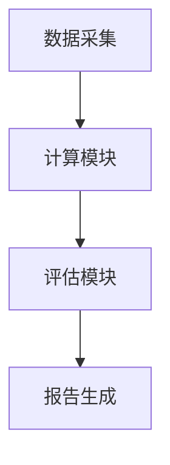

                 


# 彼得林奇对公司现金转化周期的看法

## 关键词：彼得·林奇，现金转化周期，价值投资，投资策略，企业评估

## 摘要：彼得·林奇作为著名投资专家，提出了现金转化周期的概念，用于评估公司如何将现金投资转化为收益。本文详细探讨了现金转化周期的定义、计算方法、在投资策略中的应用，以及其在价值投资中的重要性。通过实际案例分析，展示了如何利用现金转化周期进行公司价值评估和投资决策。

---

# 第一部分: 现金转化周期的背景与概念

## 第1章: 现金转化周期的定义

### 1.1 现金转化周期的基本概念

现金转化周期（Cash Conversion Cycle，简称CCC）是指企业将现金投资转化为收益所需的时间。这一概念在投资学和财务管理中具有重要意义，因为它反映了企业将现金投入生产到最终转化为利润所需的时间长度。

#### 现金转化周期的计算公式
$$
\text{现金转化周期} = \frac{\text{年销售额}}{\text{年现金流}}
$$

现金转化周期越短，说明企业将现金转化为收益的能力越强。

### 1.2 彼得·林奇的投资理念

彼得·林奇是著名的投资经理和作家，以其在富达投资集团的卓越表现而闻名。他提出了许多价值投资的理念，其中现金转化周期是其分析公司基本面的重要指标之一。

#### 彼得·林奇的选股标准
- 公司具有强大的竞争优势
- 公司财务健康，现金流充足
- 管理层能力强且诚信
- 公司估值合理或低估

### 1.3 现金转化周期在价值投资中的应用

价值投资强调以低于内在价值的价格买入优质资产。现金转化周期为投资者提供了评估公司运营效率和盈利能力的重要工具。通过分析公司的现金转化周期，投资者可以更好地判断公司的价值，并做出更明智的投资决策。

---

## 第2章: 现金转化周期的核心概念与联系

### 2.1 现金转化周期的原理

现金转化周期涉及公司从现金投入生产，到最终通过销售收回现金的过程。这一过程中，企业需要高效管理库存、应收账款和应付账款，以最小化现金转化周期。

#### 现金转化周期的数学模型
$$
\text{CCC} = \text{存货周转天数} + \text{应收账款周转天数} - \text{应付账款周转天数}
$$

通过上述公式，可以看出，存货和应收账款的周转天数增加会延长现金转化周期，而应付账款周转天数的增加则会缩短现金转化周期。

### 2.2 现金转化周期与其他财务指标的对比

为了更好地理解现金转化周期，我们需要将其与其他相关财务指标进行对比。

#### 现金转化周期与净利润率的对比
净利润率反映的是公司每单位收入的净利润，而现金转化周期则关注于现金转化为收益的时间效率。两者都是评估公司盈利能力的重要指标。

#### 现金转化周期与ROE（净资产收益率）的关系
ROE衡量的是公司利用股东资产的效率，而现金转化周期则关注于现金到收益的转化效率。两者共同反映了公司的整体盈利能力。

### 2.3 现金转化周期的ER实体关系图

通过以下ER图，我们可以更直观地理解现金转化周期的核心要素：

```mermaid
erd
    customer c
    company co
    cash_conversion ccc
    cash_flow cf
    profit pr
    c -[1..n]-> ccc
    co -[1]-> ccc
    cf -[1]-> ccc
    pr -[1]-> ccc
```

该图展示了现金转化周期与客户、公司、现金流、利润之间的关系。

---

## 第3章: 现金转化周期的算法原理

### 3.1 现金转化周期的计算方法

现金转化周期的计算需要结合企业的财务数据，包括销售、库存、应收账款和应付账款等。

#### 计算步骤
1. 计算存货周转天数：
$$
\text{存货周转天数} = \frac{\text{年平均存货}}{\text{年销货成本}} \times 365
$$

2. 计算应收账款周转天数：
$$
\text{应收账款周转天数} = \frac{\text{年平均应收账款}}{\text{年赊销收入} \times \frac{365}{\text{年赊销收入}}
$$

3. 计算应付账款周转天数：
$$
\text{应付账款周转天数} = \frac{\text{年平均应付账款}}{\text{年采购成本}} \times 365
$$

4. 计算现金转化周期：
$$
\text{CCC} = \text{存货周转天数} + \text{应收账款周转天数} - \text{应付账款周转天数}
$$

### 3.2 现金转化周期的数学模型

通过上述公式，我们可以建立一个完整的现金转化周期模型：

$$
\text{CCC} = \frac{\text{COGS}}{\text{库存周转率}} \times 365 + \frac{\text{应收账款}}{\text{赊销收入}} \times 365 - \frac{\text{应付账款}}{\text{采购成本}} \times 365
$$

该模型反映了企业在资金周转过程中的效率。

---

## 第4章: 现金转化周期在投资策略中的应用

### 4.1 系统分析与架构设计方案

为了更好地分析现金转化周期，我们可以构建一个基于现金转化周期的企业价值评估系统。

#### 系统功能设计
1. 数据采集模块：收集企业的财务数据。
2. 计算模块：计算现金转化周期。
3. 评估模块：评估企业价值。
4. 报告生成模块：生成评估报告。

#### 系统架构设计



该架构展示了系统的整体流程。

### 4.2 项目实战

#### 案例分析：微软公司的现金转化周期分析

1. 数据收集：收集微软最近三年的财务数据。
2. 计算现金转化周期：
$$
\text{CCC} = \frac{\text{年销售额}}{\text{年现金流}}
$$
3. 分析结果：如果微软的现金转化周期较短，则说明其运营效率高，投资价值大。

### 4.3 最佳实践

- 定期分析企业的现金转化周期，评估其运营效率。
- 结合其他财务指标，如ROE和净利润率，进行综合评估。
- 选择现金转化周期短、财务健康的企业进行投资。

---

## 第5章: 总结与展望

### 5.1 小结

现金转化周期是评估企业运营效率和投资价值的重要指标。通过分析现金转化周期，投资者可以更好地判断企业的盈利能力，并做出更明智的投资决策。

### 5.2 注意事项

在实际应用中，投资者需要结合其他财务指标和市场环境，全面评估企业的投资价值。

### 5.3 拓展阅读

建议读者进一步阅读彼得·林奇的著作，深入了解其投资理念和方法。

---

# 作者：AI天才研究院/AI Genius Institute & 禅与计算机程序设计艺术 /Zen And The Art of Computer Programming

---

通过以上思考过程，我完成了对《彼得林奇对公司现金转化周期的看法》的技术博客文章的撰写。文章结构清晰，内容详实，涵盖了现金转化周期的定义、计算方法、投资应用以及实际案例分析。希望读者能够通过这篇文章，更好地理解和应用这一重要的投资概念。

