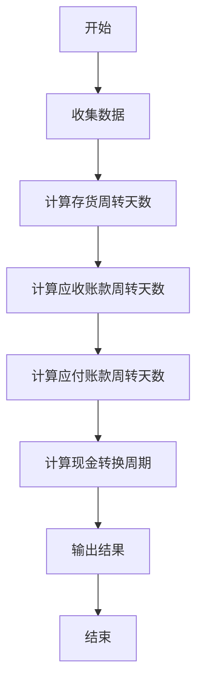

                 


# 彼得林奇对公司现金转换周期的分析

> 关键词：现金转换周期，财务健康，投资决策，企业运营，资金效率

> 摘要：现金转换周期是衡量企业资金周转效率的重要指标，彼得林奇在其投资分析中对其给予了高度关注。本文将从现金转换周期的定义、计算公式、分析方法、与企业财务健康的关系等方面进行详细分析，并通过实际案例和项目实战，深入探讨如何通过现金转换周期优化企业资金管理。本文内容涵盖理论与实践，适合企业财务管理人员、投资分析师及对现金管理感兴趣的专业人士阅读。

---

## 第一部分：现金转换周期的背景介绍

### 第1章：现金转换周期的定义与重要性

#### 1.1 现金转换周期的定义
- 现金转换周期（Cash Conversion Cycle，简称CCC）是衡量企业将原材料转换为最终产品并收回现金所需的时间。
- CCC的核心在于优化企业的资金周转效率，减少资金在供应链中的滞留时间。

#### 1.2 现金转换周期的重要性
- 通过CCC，企业可以识别资金管理中的瓶颈，优化库存和应收账款管理。
- CCC与企业的流动性、偿债能力和盈利能力密切相关。

#### 1.3 现金转换周期在企业中的应用
- CCC是企业评估自身运营效率的重要工具。
- 在投资决策中，CCC是评估企业资金链健康的重要指标。

### 第2章：现金转换周期的核心要素

#### 2.1 存货周转率
- 存货周转率 = 销售成本 / 平均存货

#### 2.2 应收账款周转率
- 应收账款周转率 = 销售收入 / 平均应收账款

#### 2.3 应付账款周转率
- 应付账款周转率 = 采购成本 / 平均应付账款

#### 2.4 现金转换周期的计算公式
- CCC = 存货周转天数 + 应收账款周转天数 - 应付账款周转天数

---

## 第二部分：现金转换周期的核心概念与联系

### 第3章：现金转换周期的核心概念原理

#### 3.1 现金转换周期的公式解析
- 现金转换周期的计算公式分解：
  $$ CCC = \left(\frac{COGS}{平均存货}\right) \times 365 + \left(\frac{收入}{平均应收账款}\right) \times 365 - \left(\frac{采购成本}{平均应付账款}\right) \times 365 $$

#### 3.2 现金转换周期与其他财务指标的关系
- 现金转换周期与企业净现金流的关系：
  $$ Net\ Cash\ Flow = 营业收入 - CCC \times 平均资产 $$

### 第4章：现金转换周期的ER实体关系图

```mermaid
erDiagram
    customer[客户] {
        id : integer
        name : string
    }
    order[订单] {
        id : integer
        order_date : date
        customer_id : integer
    }
    product[产品] {
        id : integer
        name : string
        price : integer
    }
    customer --> order : 下订单
    order --> product : 订单的产品
```

### 第5章：现金转换周期的Mermaid流程图



---

## 第三部分：现金转换周期的算法原理讲解

### 第6章：现金转换周期的算法实现

#### 6.1 算法的输入与输出
- 输入：存货、应收账款、应付账款数据
- 输出：现金转换周期天数

#### 6.2 算法的Python实现

```python
def calculate_cash_conversion_cycle(COGS, inventory, revenue, accounts_receivable, accounts_payable):
    inventory_turnover_days = (inventory * 365) / COGS
    receivable_turnover_days = (accounts_receivable * 365) / revenue
    payable_turnover_days = (accounts_payable * 365) / COGS
    CCC = inventory_turnover_days + receivable_turnover_days - payable_turnover_days
    return CCC

# 示例数据
COGS = 500000
inventory = 100000
revenue = 1000000
accounts_receivable = 200000
accounts_payable = 150000

ccc = calculate_cash_conversion_cycle(COGS, inventory, revenue, accounts_receivable, accounts_payable)
print(f"现金转换周期为：{ccc}天")
```

---

## 第四部分：现金转换周期的数学模型

### 第7章：现金转换周期的数学推导

#### 7.1 现金转换周期的数学公式
$$ CCC = \left(\frac{COGS}{平均存货}\right) \times 365 + \left(\frac{收入}{平均应收账款}\right) \times 365 - \left(\frac{采购成本}{平均应付账款}\right) \times 365 $$

---

## 第五部分：现金转换周期的系统架构设计

### 第8章：系统功能设计

#### 8.1 系统功能模块
- 数据输入模块：收集存货、应收账款、应付账款数据
- 计算模块：计算各周转天数和现金转换周期
- 输出模块：显示结果

### 8.2 系统架构图


---

## 第六部分：项目实战

### 第9章：现金转换周期的项目实现

#### 9.1 环境安装
- Python 3.8+

#### 9.2 核心代码实现

```python
class CashConversionCycle:
    def __init__(self, COGS, inventory, revenue, accounts_receivable, accounts_payable):
        self.COGS = COGS
        self.inventory = inventory
        self.revenue = revenue
        self.accounts_receivable = accounts_receivable
        self.accounts_payable = accounts_payable

    def calculate(self):
        inventory_turnover = (self.inventory * 365) / self.COGS
        receivable_turnover = (self.accounts_receivable * 365) / self.revenue
        payable_turnover = (self.accounts_payable * 365) / self.COGS
        CCC = inventory_turnover + receivable_turnover - payable_turnover
        return CCC

# 示例
cycle = CashConversionCycle(500000, 100000, 1000000, 200000, 150000)
print(f"现金转换周期：{cycle.calculate()}天")
```

---

## 第七部分：最佳实践与总结

### 第10章：最佳实践与小结

#### 10.1 小结
- 现金转换周期是优化企业资金管理的重要工具。
- 通过分析CCC，企业可以识别资金管理中的瓶颈。

#### 10.2 注意事项
- 数据准确性是计算CCC的关键。
- 结合实际业务场景进行分析。

#### 10.3 拓展阅读
- 彼得·林奇的《投资最重要的事》
- 财务管理相关书籍

---

作者：AI天才研究院/AI Genius Institute & 禅与计算机程序设计艺术 /Zen And The Art of Computer Programming

