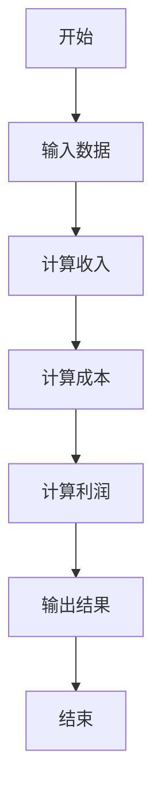
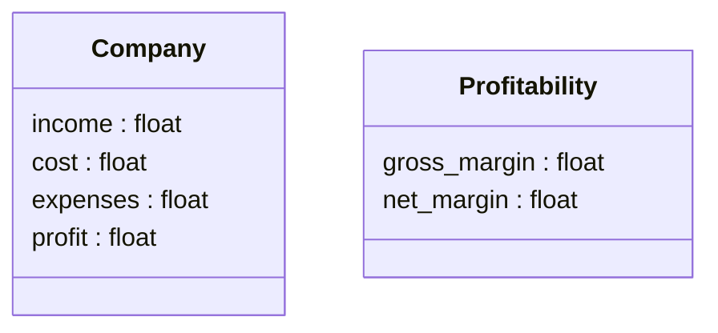
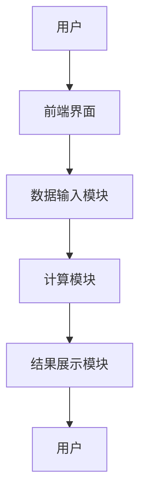

                 


# 彼得林奇对公司盈利模式可持续性的判断

## 关键词：彼得林奇，盈利模式，可持续性，投资策略，价值分析，公司分析

## 摘要：  
本文通过分析彼得·林奇的投资理念和方法，探讨他如何判断公司盈利模式的可持续性。文章首先介绍彼得·林奇的背景和投资哲学，接着详细阐述盈利模式的核心概念，包括定义、分类及其与企业价值的关系。然后，分析影响盈利模式可持续性的关键因素，如市场需求、成本结构和竞争优势。文章进一步通过数学模型和ER图展示盈利模式的内在联系，并结合算法流程图和Python代码，详细讲解盈利预测模型的构建方法。最后，通过系统架构设计和项目实战，展示如何在实际中应用这些方法，以确保盈利模式的持续性。本文旨在帮助投资者和企业管理者更好地理解彼得·林奇的判断方法，并将其应用于实际操作中。

---

# 第一部分：彼得·林奇对公司盈利模式可持续性的背景介绍

## 第1章：彼得·林奇的背景与投资理念

### 1.1 彼得·林奇的生平简介  
- **1.1.1** 彼得·林奇的早期经历  
  - 出生与教育背景：彼得·林奇于1948年出生于美国波士顿，拥有麻省理工学院（MIT）的化学工程学士学位和耶鲁大学商学院的MBA学位。  
  - 早期职业经历：他在1971年加入富达投资集团（Fidelity Investments），并迅速崭露头角，成为该公司最成功的基金经理之一。  

- **1.1.2** 彼得·林奇的投资成就  
  - 林奇管理的麦哲伦基金（Fidelity Magellan）在1977年至1990年期间创造了年均29%的回报率，远超同期标普500指数的回报率。  
  - 他被认为是20世纪最伟大的投资者之一，尤其擅长挑选被低估的股票并长期持有。  

- **1.1.3** 彼得·林奇的投资哲学  
  - 价值投资的核心思想：寻找那些基本面良好、管理优秀、具有强大竞争优势的公司。  
  - 林奇强调深入研究公司基本面，尤其是盈利模式的可持续性，而不是盲目追随市场趋势。  

### 1.2 彼得·林奇的投资理念  
- **1.2.1** 价值投资的核心思想  
  - 林奇认为，投资的本质是寻找那些市场价格低于内在价值的公司。  
  - 他特别关注企业的盈利能力、财务健康状况和竞争优势。  

- **1.2.2** 林奇的投资风格与特点  
  - 他偏好那些具有强大护城河（ competitive moat）的公司，这些公司能够在长期竞争中保持优势。  
  - 林奇强调对公司管理层的信任，认为管理层的素质和决策能力直接影响公司的长期表现。  

- **1.2.3** 林奇对市场波动的看法  
  - 他认为市场波动是投资者的机遇，而非风险。在市场恐慌时买入优质股票，而在市场狂热时保持冷静。  

---

## 第2章：公司盈利模式的定义与分析

### 2.1 盈利模式的核心概念  
- **2.1.1** 盈利模式的定义  
  - 盈利模式是公司通过销售产品或服务获得收入，并通过成本控制和优化实现利润的商业模式。  

- **2.1.2** 盈利模式的构成要素  
  - 收入来源：包括产品销售收入、服务收入、利息收入等。  
  - 成本结构：包括直接成本、间接成本、运营成本等。  
  - 盈利能力：净利润率、毛利率等关键指标。  

- **2.1.3** 盈利模式与企业价值的关系  
  - 盈利模式的可持续性直接决定了企业的长期价值。  

### 2.2 盈利模式的分类与特点  
- **2.2.1** 盈利模式的分类  
  - 产品驱动型：依赖产品的销售和边际成本优势。  
  - 服务驱动型：依赖服务的边际成本优势。  
  - 订阅驱动型：依赖持续的订阅收入。  

- **2.2.2** 不同盈利模式的特点对比  
  | 盈利模式 | 收入来源 | 成本结构 | 盈利能力 |  
  |----------|----------|----------|----------|  
  | 产品驱动型 | 产品销售 | 制造成本 | 边际成本低 |  
  | 服务驱动型 | 服务收入 | 运营成本 | 边际成本低 |  
  | 订阅驱动型 | 订阅收入 | 订阅成本 | 稳定性高 |  

- **2.2.3** 盈利模式的优劣势分析  
  - 产品驱动型：初期利润高，但依赖于产品的市场周期。  
  - 服务驱动型：利润较为稳定，但初始成本较高。  
  - 订阅驱动型：收入来源稳定，但依赖客户忠诚度。  

---

## 第3章：影响盈利模式可持续性的关键因素

### 3.1 市场需求的稳定性  
- **3.1.1** 市场需求的核心影响  
  - 市场需求的稳定性和增长性直接影响公司的收入来源。  

- **3.1.2** 不同行业的需求差异  
  - 高科技行业需求波动大，而公用事业行业需求相对稳定。  

- **3.1.3** 市场周期性对盈利模式的影响  
  - 经济周期波动可能影响公司的盈利能力和市场需求。  

### 3.2 成本结构的优化  
- **3.2.1** 成本结构对企业盈利的影响  
  - 成本控制是提高净利润率的关键。  

- **3.2.2** 成本控制的关键策略  
  - 技术创新：通过自动化和数字化降低成本。  
  - 供应链优化：通过全球化采购降低成本。  

- **3.2.3** 技术进步对成本结构的优化作用  
  - 信息技术的进步可以帮助企业实现更高效的生产流程。  

### 3.3 核心竞争优势  
- **3.3.1** 核心竞争力的定义与作用  
  - 核心竞争力是指公司在行业中独特的竞争优势，如技术、品牌、专利等。  

- **3.3.2** 构建核心竞争优势的策略  
  - 投资研发：通过技术创新建立技术壁垒。  
  - 品牌建设：通过营销和客户关系管理增强品牌影响力。  

- **3.3.3** 竞争优势的持续性分析  
  - 可持续的竞争优势需要不断创新和适应市场变化。  

---

## 第4章：彼得·林奇盈利模式分析的核心概念

### 4.1 盈利模式的核心要素  
- **4.1.1** 收入来源  
  - 收入来源的多样性和稳定性是判断盈利模式可持续性的关键。  

- **4.1.2** 成本结构  
  - 成本结构的优化直接影响公司的利润率。  

- **4.1.3** 盈利能力  
  - 净利润率、毛利率等指标是衡量盈利模式健康性的关键。  

### 4.2 盈利模式的数学模型与公式  
- **4.2.1** 净利润公式  
  $$ \text{净利润} = \text{收入} - \text{成本} - \text{费用} $$  

- **4.2.2** 毛利率计算  
  $$ \text{毛利率} = \frac{\text{收入} - \text{成本}}{\text{收入}} $$  

- **4.2.3** 净利润率分析  
  $$ \text{净利润率} = \frac{\text{净利润}}{\text{收入}} $$  

---

## 第5章：盈利模式的ER实体关系图

```mermaid
erDiagram
    customer[顾客] {
        id : int
        name : string
        transaction_id : int
    }
    product[产品] {
        id : int
        name : string
        price : float
    }
    order[订单] {
        id : int
        customer_id : int
        product_id : int
        order_date : date
    }
    sales[销售] {
        id : int
        order_id : int
        revenue : float
        cost : float
    }
    customer_order_discount[折扣] {
        id : int
        order_id : int
        discount : float
    }
    customer_order_shipping[物流] {
        id : int
        order_id : int
        shipping_cost : float
    }
    customer_order_tax[税费] {
        id : int
        order_id : int
        tax : float
    }
    customer_order_payment[支付] {
        id : int
        order_id : int
        payment_method : string
    }
    customer_order_status[订单状态] {
        id : int
        order_id : int
        status : string
    }
    customer_order_history[订单历史] {
        id : int
        order_id : int
        history_date : date
        history_desc : string
    }
```

---

## 第6章：彼得·林奇盈利模式的算法原理

### 6.1 盈利预测模型的构建  
- **6.1.1** 算法流程图  


- **6.1.2** Python源代码  
```python
def calculate_profit(income, cost, expenses):
    profit = income - cost - expenses
    return profit

# 示例数据
income = 1000000
cost = 600000
expenses = 200000
profit = calculate_profit(income, cost, expenses)
print(f"净利润为：{profit}")
```

- **6.1.3** 数学公式  
$$ \text{净利润} = \text{收入} - \text{成本} - \text{费用} $$  

---

## 第7章：系统分析与架构设计方案

### 7.1 问题场景介绍  
- 系统目标：构建一个能够分析公司盈利模式可持续性的模型。  
- 问题域：公司盈利模式的分析与优化。  

### 7.2 系统功能设计  
- **7.2.1** 功能模块  
  - 数据输入：收入、成本、费用等数据的输入。  
  - 模型计算：基于数学模型计算净利润率、毛利率等指标。  
  - 结果展示：以图表形式展示分析结果。  

- **7.2.2** 领域模型  


### 7.3 系统架构设计  


---

## 第8章：项目实战

### 8.1 环境安装  
- 安装Python和相关库（如Pandas、Matplotlib）。  

### 8.2 核心实现  
```python
import pandas as pd
import matplotlib.pyplot as plt

def analyze_profitability(data):
    data['gross_margin'] = data['收入'] - data['成本']
    data['net_margin'] = data['gross_margin'] - data['费用']
    plt.plot(data['年份'], data['net_margin'], label='净利润率')
    plt.xlabel('年份')
    plt.ylabel('净利润率')
    plt.legend()
    plt.show()

# 示例数据
data = {
    '年份': [2018, 2019, 2020, 2021],
    '收入': [1000, 1200, 1400, 1600],
    '成本': [600, 700, 800, 900],
    '费用': [200, 250, 300, 350]
}
analyze_profitability(data)
```

### 8.3 案例分析  
- 以某公司2018-2021年的财务数据为例，分析其盈利模式的可持续性。  

### 8.4 总结  
- 通过实际案例分析，验证彼得·林奇盈利模式分析方法的有效性。  

---

## 第9章：总结与展望

### 9.1 最佳实践  
- 定期审查公司的成本结构和收入来源。  
- 关注市场需求的变化，及时调整盈利模式。  

### 9.2 小结  
- 彼得·林奇通过深入分析公司的盈利模式，判断其可持续性，并据此进行投资决策。  

### 9.3 注意事项  
- 盈利模式的分析需要结合企业的实际情况，不能孤立进行。  
- 市场环境的变化可能影响盈利模式的可持续性，需要持续监控和调整。  

### 9.4 拓展阅读  
- 建议进一步阅读彼得·林奇的《巴菲特选股术》和《投资的真相》。  

---

## 作者：AI天才研究院/AI Genius Institute & 禅与计算机程序设计艺术 /Zen And The Art of Computer Programming

