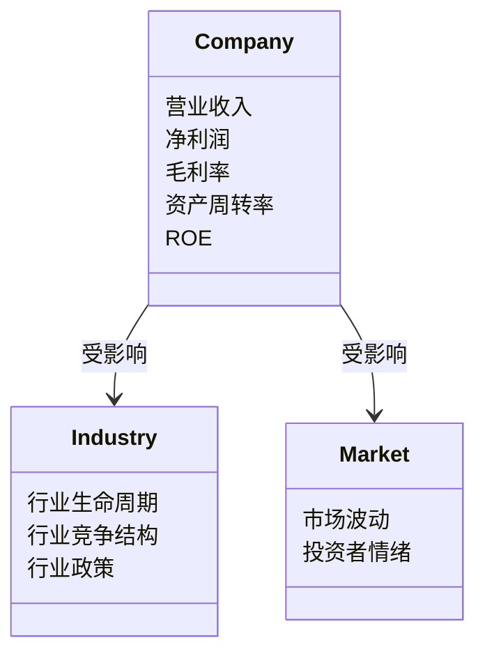

                 


# 彼得林奇对公司盈利质量的分析

> 关键词：彼得·林奇，盈利质量，投资分析，财务指标，公司估值

> 摘要：本文将详细介绍彼得·林奇对公司盈利质量的分析方法，从背景介绍到核心概念，再到数学模型和实际案例，系统地讲解如何通过盈利质量分析来评估公司的投资价值。

---

## 第1章: 盈利质量分析的背景与重要性

### 1.1 盈利质量的定义与背景

#### 1.1.1 盈利质量的定义
盈利质量是指公司在一定时期内实现的利润与其收入和资产的匹配程度。它不仅关注利润的绝对数值，还关注利润的来源、持续性和稳定性。

#### 1.1.2 盈利质量分析的重要性
在投资决策中，盈利质量是评估公司长期发展潜力的重要指标。通过分析盈利质量，投资者可以更好地判断公司的盈利能力和抗风险能力。

#### 1.1.3 彼得·林奇对盈利质量分析的贡献
彼得·林奇是全球著名投资专家，他提出的盈利质量分析方法被广泛应用于公司估值和投资决策中。他认为，公司盈利质量的核心在于利润的来源和持续性。

---

### 1.2 彼得·林奇的投资理念

#### 1.2.1 林奇的投资风格
林奇以“价值投资”闻名，他注重公司基本面分析，尤其是盈利能力、成长性和财务健康状况。

#### 1.2.2 林奇对公司的估值方法
林奇通过分析公司的财务报表，尤其是利润表和资产负债表，来评估公司的盈利质量和估值水平。

#### 1.2.3 林奇对市场波动的应对策略
林奇认为市场波动是投资的敌人，他建议投资者关注公司基本面，避免被短期市场波动影响。

---

## 第2章: 盈利质量分析的核心要素

### 2.1 盈利来源的多样性

#### 2.1.1 收入来源的分析
收入来源的多样性和稳定性是衡量公司盈利质量的重要指标。例如，如果一家公司主要依赖单一产品，其盈利质量可能较差。

#### 2.1.2 成本结构的影响
成本控制是影响公司盈利能力的关键因素。林奇特别关注公司的毛利率和成本结构的稳定性。

#### 2.1.3 资产质量与盈利能力的关系
资产质量高的公司通常具有更强的盈利能力。林奇通过分析资产周转率和ROE（净资产收益率）来评估资产质量。

---

### 2.2 盈利质量的关键指标

#### 2.2.1 净利润与营业收入的对比
净利润是公司盈利能力的核心指标，而营业收入是公司收入能力的体现。通过对比净利润和营业收入，可以评估公司的盈利效率。

#### 2.2.2 毛利率与净利率的分析
毛利率反映公司产品或服务的盈利能力，净利率反映公司整体盈利能力。林奇认为，毛利率和净利率的合理区间是评估公司盈利质量的重要依据。

#### 2.2.3 资产周转率与ROE的计算
资产周转率衡量公司资产的使用效率，ROE（净资产收益率）衡量公司股东投资回报能力。林奇认为，资产周转率和ROE是评估公司财务健康状况的重要指标。

---

### 2.3 盈利质量的可持续性

#### 2.3.1 盈利模式的稳定性
盈利模式的稳定性是公司长期发展的关键。林奇通过分析行业趋势和公司竞争优势，评估盈利模式的可持续性。

#### 2.3.2 行业周期对盈利质量的影响
行业周期波动会影响公司的盈利质量。林奇建议投资者关注行业周期，选择在周期波动中仍能保持较高盈利能力的公司。

#### 2.3.3 公司竞争优势的持续性
竞争优势是公司长期盈利的核心。林奇通过分析公司的市场地位、技术创新和成本优势，评估竞争优势的持续性。

---

## 第3章: 彼得·林奇的盈利质量分析框架

### 3.1 林奇的多因素分析模型

#### 3.1.1 收入与利润的关系
收入是利润的基础，利润是收入的净体现。林奇通过分析收入和利润的关系，评估公司的盈利效率。

#### 3.1.2 成本控制与利润增长
成本控制是影响利润增长的关键因素。林奇通过分析成本结构和毛利率变化，评估成本控制能力。

#### 3.1.3 资产与负债的平衡
资产与负债的平衡是公司财务健康的重要指标。林奇通过分析资产负债率和流动比率，评估公司的财务风险。

---

### 3.2 林奇的杜邦分析法

#### 3.2.1 净资产收益率（ROE）的分解
ROE是衡量公司财务效率的重要指标，杜邦分析法将其分解为净利润率、资产周转率和权益乘数的乘积。

#### 3.2.2 资产周转率与销售净利率的关系
资产周转率衡量公司资产的使用效率，销售净利率衡量公司收入的盈利能力。林奇通过分析这两者的乘积，评估公司整体盈利能力。

#### 3.2.3 杜邦分析法的步骤与应用
杜邦分析法的步骤包括：计算ROE、分解ROE为三部分、分析各部分的变化趋势。

---

### 3.3 林奇的行业分析方法

#### 3.3.1 行业生命周期对盈利质量的影响
行业生命周期分为导入期、成长期、成熟期和衰退期。林奇通过分析行业所处的生命周期阶段，评估盈利质量的变化趋势。

#### 3.3.2 行业竞争结构与企业盈利能力
行业竞争结构影响公司的盈利空间。林奇通过分析行业集中度、进入壁垒和替代品威胁，评估行业竞争结构对盈利质量的影响。

#### 3.3.3 行业政策变化对盈利质量的影响
行业政策变化是影响公司盈利质量的重要外部因素。林奇通过分析政策变化对行业和公司的影响，评估盈利质量的潜在变化。

---

## 第4章: 盈利质量分析的数学模型与公式

### 4.1 净利润与营业收入的计算公式

#### 4.1.1 净利润的计算公式
$$ \text{净利润} = \text{营业收入} - \text{营业成本} - \text{税金及附加} - \text{销售费用} - \text{管理费用} - \text{研发费用} $$

#### 4.1.2 净利率的计算公式
$$ \text{净利率} = \frac{\text{净利润}}{\text{营业收入}} \times 100\% $$

#### 4.1.3 毛利率的计算公式
$$ \text{毛利率} = \frac{\text{营业收入} - \text{营业成本}}{\text{营业收入}} \times 100\% $$

---

## 第5章: 盈利质量分析的系统架构设计

### 5.1 系统功能设计

#### 5.1.1 领域模型（Mermaid 类图）


#### 5.1.2 系统架构设计（Mermaid 架构图）


---

## 第6章: 项目实战

### 6.1 环境安装

#### 6.1.1 安装Python
```bash
pip install numpy pandas matplotlib
```

#### 6.1.2 安装Mermaid
```bash
npm install -g mermaid-cli
```

---

### 6.2 核心实现代码

#### 6.2.1 计算杜邦分析的Python代码
```python
import pandas as pd

def dupont_analysis(company_financials):
    net_profit = company_financials['净利润']
    revenue = company_financials['营业收入']
    assets = company_financials['资产']
    equity = company_financials['股东权益']
    
    roe = (net_profit / equity) * 100
    net_profit_margin = (net_profit / revenue) * 100
    asset_turnover = revenue / assets
    return {
        'ROE (%)': roe,
        '净利润率 (%)': net_profit_margin,
        '资产周转率': asset_turnover
    }

# 示例数据
financials = {
    '净利润': 100,
    '营业收入': 500,
    '资产': 2000,
    '股东权益': 1000
}

# 执行分析
dupont_result = dupont_analysis(financials)
print(dupont_result)
```

---

### 6.3 案例分析

#### 6.3.1 案例背景
假设我们分析一家制造业公司，其财务数据如下：
- 营业收入：500万元
- 净利润：100万元
- 资产：2000万元
- 股东权益：1000万元

#### 6.3.2 分析结果
通过杜邦分析，我们得到：
- ROE = 10%
- 净利润率 = 20%
- 资产周转率 = 0.25

#### 6.3.3 结论
这家公司的ROE较低，可能由于资产周转率较低或净利润率较低。进一步分析发现，资产周转率低可能是由于资产规模过大或资产利用效率低下。

---

## 第7章: 最佳实践与小结

### 7.1 最佳实践

#### 7.1.1 定期更新财务数据
公司财务数据会随着市场变化而更新，投资者需要定期更新数据，重新评估盈利质量。

#### 7.1.2 结合行业分析
盈利质量分析需要结合行业分析，了解行业周期和竞争结构对盈利质量的影响。

#### 7.1.3 风险控制
投资者应根据市场波动和公司财务状况，合理控制投资风险。

---

### 7.2 小结

彼得·林奇的盈利质量分析方法为投资者提供了一套系统化的分析框架。通过分析公司财务数据、行业趋势和市场环境，投资者可以更好地评估公司的投资价值。未来，随着市场环境的变化，盈利质量分析方法也需要不断优化和创新。

---

作者：AI天才研究院/AI Genius Institute & 禅与计算机程序设计艺术 /Zen And The Art of Computer Programming

