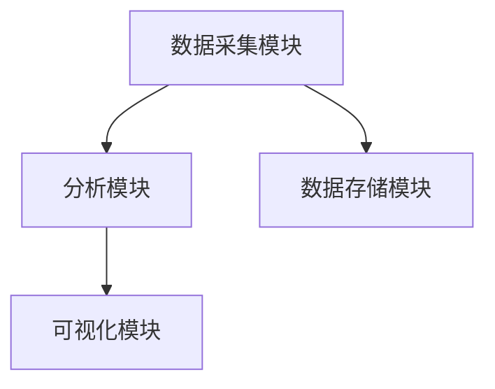

                 


# 彼得林奇对公司盈利质量的深度分析

## 关键词：彼得林奇，盈利质量，投资分析，财务指标，公司评估

## 摘要：本文深入分析了彼得林奇的盈利质量分析方法，探讨了如何通过核心财务指标评估公司的盈利健康状况，结合实际案例和系统设计，提供了专业的投资分析工具和方法。

---

## # 第一部分：引言

## # 第1章：盈利质量的重要性

### ## 1.1 盈利质量的核心概念

#### ### 1.1.1 盈利质量的定义

盈利质量是指公司在一定时期内实现的利润的质量，不仅关注利润的数量，更关注利润的来源、结构和可持续性。它衡量了公司盈利的健康程度，是评估公司长期价值的重要指标。

#### ### 1.1.2 盈利质量与企业价值的关系

盈利质量直接影响企业的市场价值。高盈利质量的公司通常具有更强的盈利能力、更稳定的现金流和更好的成长潜力，从而获得更高的市场估值。

#### ### 1.1.3 彼得林奇的分析方法论

彼得·林奇强调通过深入分析公司的财务报表和行业地位，识别高盈利质量的公司。他关注公司的收入来源、成本控制和竞争优势，以判断其盈利的可持续性。

### ## 1.2 盈利质量的背景与演变

#### ### 1.2.1 传统盈利分析的局限性

传统盈利分析往往只关注净利润等单一指标，忽视了收入质量、成本结构和现金流等因素的影响。

#### ### 1.2.2 现代盈利质量分析的发展

现代分析方法结合了多维度的财务指标和非财务因素，如行业趋势、管理团队和竞争优势，以全面评估公司的盈利质量。

#### ### 1.2.3 彼得林奇的贡献与影响

彼得林奇通过实践和研究，总结出一套基于盈利质量的分析框架，帮助投资者识别出具有持续盈利能力的优秀公司。

---

## # 第2章：盈利质量的核心要素

### ## 2.1 收入质量的分析

#### ### 2.1.1 收入来源的多样性

公司收入来源的多样性和稳定性是衡量收入质量的重要指标。多样化的收入来源可以降低公司对单一市场的依赖风险。

#### ### 2.1.2 收入可持续性的评估

通过分析收入的增长趋势、客户依赖度和市场前景，评估公司的收入是否具有可持续性。

#### ### 2.1.3 收入结构的优化

优化收入结构，提高高毛利产品的占比，降低低毛利业务的影响，是提升收入质量的关键。

### ## 2.2 利润质量的分析

#### ### 2.2.1 利润来源的分析

分析利润的主要来源，如主营业务利润、投资收益等，判断利润的可持续性和稳定性。

#### ### 2.2.2 利润质量的核心指标

包括净利润率、毛利率、营业利润率等指标，用于评估利润的质量和结构。

#### ### 2.2.3 利润可持续性的评估

通过分析公司的成本控制能力、行业竞争状况和市场地位，评估利润的可持续性。

### ## 2.3 现金流质量的分析

#### ### 2.3.1 现金流的构成与分类

现金流分为经营活动、投资活动和筹资活动三类，经营活动现金流是公司盈利质量的核心指标。

#### ### 2.3.2 现金流质量的评估指标

包括现金流与利润的匹配度、自由现金流等，用于评估公司的盈利质量和资金流动性。

#### ### 2.3.3 现金流与企业价值的关系

健康的现金流是公司长期发展的基石，能够支持公司的扩张、偿还债务和分红。

---

## # 第3章：盈利质量的评估指标与方法

### ## 3.1 盈利能力指标

#### ### 3.1.1 净利润与营业收入比率（ROE）

ROE = 净利润 / 平均股东权益 × 100%

ROE衡量了公司使用股东资金的效率，高ROE通常意味着公司具有较强的盈利能力。

#### ### 3.1.2 净利润增长率

净利润增长率 = （本年净利润 - 上年净利润）/ 上年净利润 × 100%

净利润增长率反映了公司盈利能力的提升情况。

#### ### 3.1.3 毛利率与净利率

毛利率 = （营业收入 - 营业成本） / 营业收入 × 100%

净利率 = 净利润 / 营业收入 × 100%

毛利率和净利率分别衡量了公司在成本控制和整体盈利能力方面的表现。

### ## 3.2 盈利质量的综合评估

#### ### 3.2.1 盈利质量的多维度评估模型

综合考虑收入质量、利润质量和现金流质量，构建多维度的评估模型，以全面评估公司的盈利质量。

#### ### 3.2.2 盈利质量的行业差异分析

不同行业的盈利质量评估标准和重点有所不同，需要结合行业特点进行分析。

#### ### 3.2.3 盈利质量的周期性分析

分析公司在经济周期中的盈利表现，判断其盈利质量的稳定性和可持续性。

---

## # 第4章：彼得林奇的盈利质量分析框架

### ## 4.1 彼得林奇的分析方法

彼得林奇通过分析公司的财务报表，重点关注收入来源、成本结构和竞争优势，判断公司的盈利质量和成长潜力。

### ## 4.2 彼得林奇的盈利质量分析框架

#### ### 4.2.1 公司基本面分析

分析公司的行业地位、竞争优势、管理团队和财务健康状况，判断其长期盈利能力。

#### ### 4.2.2 财务指标分析

通过分析ROE、ROA、毛利率等关键财务指标，评估公司的盈利质量和效率。

#### ### 4.2.3 竞争环境分析

研究公司所处行业的竞争格局，判断其市场地位和竞争优势，从而评估盈利的可持续性。

---

## # 第5章：彼得林奇盈利质量分析的实战案例

### ## 5.1 案例分析：苹果公司

#### ### 5.1.1 苹果公司的收入质量分析

苹果的收入主要来自产品销售和服务业，收入来源多样且稳定。

#### ### 5.1.2 苹果公司的利润质量分析

苹果的高毛利率和持续增长的净利润率体现了其强大的盈利能力。

#### ### 5.1.3 苹果公司的现金流分析

健康的现金流支持了公司的研发和扩张，保障了其长期发展。

### ## 5.2 案例分析：谷歌公司

#### ### 5.2.1 谷歌公司的收入质量分析

收入主要来自广告和云计算业务，收入结构多元化，抗风险能力强。

#### ### 5.2.2 谷歌公司的利润质量分析

高毛利率和稳定的净利润增长体现了其优秀的盈利质量。

#### ### 5.2.3 谷歌公司的现金流分析

强大的现金流支持了公司的技术创新和市场拓展。

---

## # 第6章：系统架构与技术实现

### ## 6.1 系统架构设计

#### ### 6.1.1 系统功能设计

- 数据采集模块：收集公司的财务数据。
- 分析模块：计算关键财务指标，评估盈利质量。
- 可视化模块：生成图表和报告，辅助决策。

#### ### 6.1.2 系统架构图



### ## 6.2 技术实现

#### ### 6.2.1 数据采集模块

使用Python的pandas库和API接口，从财务报表中提取数据。

#### ### 6.2.2 分析模块

通过编写Python脚本，计算ROE、ROA等关键指标，并评估盈利质量。

#### ### 6.2.3 可视化模块

使用Matplotlib生成图表，展示财务数据和分析结果。

---

## # 第7章：项目实战

### ## 7.1 项目概述

开发一个基于彼得林奇盈利质量分析框架的自动化分析系统，帮助投资者快速评估公司的盈利质量。

### ## 7.2 环境安装

安装Python、pandas、Matplotlib等工具，并配置相应的开发环境。

### ## 7.3 核心代码实现

```python
import pandas as pd
import matplotlib.pyplot as plt

# 数据加载
df = pd.read_csv('financial_data.csv')

# 计算ROE
roe = df['净利润'] / df['平均股东权益'] * 100

# 可视化
plt.plot(df['公司名称'], roe, 'b-')
plt.title('ROE Analysis')
plt.xlabel('公司名称')
plt.ylabel('ROE (%)')
plt.show()
```

### ## 7.4 代码解读与分析

上述代码从CSV文件中加载财务数据，计算ROE指标，并生成可视化图表。通过分析ROE的趋势，投资者可以评估公司的盈利质量。

### ## 7.5 实际案例分析

以苹果和谷歌为例，分析其ROE和毛利率，评估盈利质量。

### ## 7.6 项目小结

通过项目实战，验证了彼得林奇分析框架的有效性，并展示了如何利用技术手段提升盈利质量的评估效率。

---

## # 第8章：总结与展望

### ## 8.1 总结

本文深入探讨了彼得林奇的盈利质量分析方法，结合实际案例和系统设计，为投资者提供了专业的工具和方法。

### ## 8.2 投资建议

投资者应综合考虑公司的收入质量、利润质量和现金流质量，选择具有高盈利质量的公司进行投资。

### ## 8.3 注意事项

在实际操作中，应结合市场环境和行业特点，动态调整分析指标和权重，以提高分析的准确性和有效性。

### ## 8.4 拓展阅读

推荐进一步阅读彼得·林奇的相关书籍，深入学习盈利质量分析的理论和实践。

---

## # 作者：AI天才研究院/AI Genius Institute & 禅与计算机程序设计艺术 /Zen And The Art of Computer Programming

---

通过以上思考过程，我们可以系统地构建《彼得林奇对公司盈利质量的深度分析》的目录大纲，并逐步展开每个部分的内容，确保文章结构清晰、逻辑严谨，为读者提供有价值的投资分析工具和方法。

