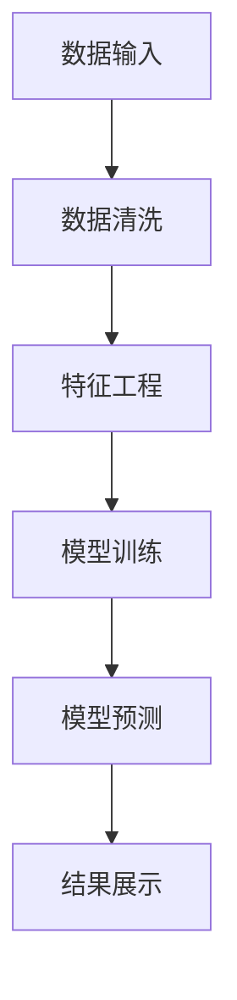

                 


# 彼得林奇对公司盈利预测准确性的分析

> 关键词：彼得林奇，盈利预测，投资分析，算法原理，系统设计，项目实战

> 摘要：本文深入分析了彼得·林奇对公司盈利预测的准确性进行分析的核心方法，从盈利预测的基本概念、核心原理、算法实现、系统架构到项目实战，全面展开探讨。通过详细的理论分析和实际案例，揭示了盈利预测在投资决策中的重要作用，以及如何通过科学的方法提高预测的准确性。

---

## 第一部分: 盈利预测与投资分析基础

### 第1章: 盈利预测的基本概念与重要性

#### 1.1 盈利预测的定义与核心要素

**盈利预测**是通过对公司历史财务数据、市场环境、行业趋势等多方面因素的分析，对未来一定时期内公司的盈利状况进行估计的过程。其核心要素包括：

- **营业收入预测**：基于市场需求和公司产品竞争力的预测。
- **成本预测**：包括原材料成本、人工成本等的估算。
- **利润预测**：通过收入减去成本和费用，得出净利润的预测。
- **时间范围**：通常为1年、3年或5年的中期预测。

#### 1.2 盈利预测的重要性与应用场景

盈利预测在投资决策中具有不可替代的作用：

- **投资者决策支持**：帮助投资者评估公司的未来盈利能力，判断其投资价值。
- **公司战略规划**：企业通过盈利预测制定预算和战略目标。
- **资本市场定价**：分析师和投资者通过盈利预测为股票定价提供依据。

彼得·林奇作为价值投资的代表人物，其盈利预测方法以基本面分析为核心，注重对公司财务数据的深入挖掘和行业趋势的把握。

---

### 第2章: 盈利预测的核心概念与联系

#### 2.1 盈利预测的核心原理

盈利预测的原理基于财务报表分析和市场分析的结合：

- **财务报表分析**：通过利润表、资产负债表、现金流量表等财务数据，分析公司的盈利能力、财务状况和现金流健康程度。
- **市场分析**：结合行业趋势、宏观经济环境和市场供需关系，预测公司未来的市场表现。

#### 2.2 盈利预测方法对比分析

| **预测方法** | **描述** | **优点** | **缺点** |
|--------------|----------|----------|----------|
| **定量分析** | 基于历史数据和数学模型进行预测 | 精度高，可量化 | 忽略了市场情绪和突发事件的影响 |
| **定性分析** | 基于行业趋势、公司管理团队等因素进行预测 | 考虑非财务因素，更全面 | 主观性强，难以量化 |
| **混合分析** | 结合定量和定性因素的综合预测方法 | 兼具两者的优点 | 实施难度较高，需要大量数据支持 |

#### 2.3 盈利预测的ER实体关系图

```mermaid
erDiagram
    company {
        key id: integer
        name: string
        industry: string
        revenue: float
        profit: float
        cost: float
        year: integer
    }
    market {
        id: integer
        name: string
        trend: string
        competitors: integer
    }
    prediction {
        id: integer
        company_id: integer
        predicted_profit: float
        year: integer
        accuracy: float
    }
    company --> market: operates in
    company --> prediction: has prediction
```

---

### 第3章: 盈利预测的算法原理与数学模型

#### 3.1 盈利预测的算法原理

**线性回归模型**是盈利预测中最常用的算法之一。其基本思想是通过历史数据建立变量之间的线性关系，预测未来值。

#### 3.2 盈利预测的数学模型与公式

- **线性回归模型公式**：$$ y = \beta_0 + \beta_1x + \epsilon $$

  其中，$y$ 是目标变量（净利润），$x$ 是自变量（如收入、成本），$\beta_0$ 是截距，$\beta_1$ 是回归系数，$\epsilon$ 是误差项。

- **多元回归模型公式**：$$ y = \beta_0 + \beta_1x_1 + \beta_2x_2 + \dots + \beta_nx_n + \epsilon $$

  其中，$x_1, x_2, \dots, x_n$ 是多个自变量（如收入、成本、销售费用等）。

- **预测误差计算公式**：$$ \text{MSE} = \frac{1}{n}\sum_{i=1}^{n}(y_i - \hat{y}_i)^2 $$

  其中，$y_i$ 是实际值，$\hat{y}_i$ 是预测值，$n$ 是数据点数量。

#### 3.3 盈利预测的算法实现与案例分析

```python
import pandas as pd
import numpy as np
from sklearn.linear_model import LinearRegression
from sklearn.metrics import mean_squared_error

# 示例数据加载
data = pd.DataFrame({
    'Revenue': [100, 150, 200, 250, 300],
    'Cost': [50, 70, 90, 110, 130],
    'Profit': [50, 80, 110, 140, 170]
})

# 数据清洗与特征工程
X = data[['Revenue', 'Cost']]
y = data['Profit']

# 模型训练
model = LinearRegression()
model.fit(X, y)

# 预测
predicted_profit = model.predict(X)
print("预测利润:", predicted_profit)

# 误差计算
mse = mean_squared_error(y, predicted_profit)
print("均方误差:", mse)
```

---

## 第二部分: 盈利预测的系统设计与实现

### 第4章: 盈利预测系统的架构设计

#### 4.1 系统功能设计

- **数据输入模块**：接收公司历史财务数据和市场数据。
- **模型计算模块**：基于选择的算法（如线性回归、随机森林）进行预测。
- **结果输出模块**：展示预测结果和误差分析。

#### 4.2 系统架构设计



---

### 第5章: 盈利预测的项目实战

#### 5.1 项目背景与目标

以某公司为例，基于过去5年的财务数据，预测未来3年的净利润。

#### 5.2 项目实现步骤

1. **数据收集**：收集公司过去5年的Revenue、Cost、Profit等数据。
2. **数据清洗**：处理缺失值和异常值。
3. **特征工程**：提取关键特征，如收入增长率、成本控制率。
4. **模型训练**：使用线性回归模型进行训练。
5. **模型预测**：预测未来3年的净利润。
6. **结果分析**：对比实际值与预测值，计算误差。

#### 5.3 项目小结

通过该项目，我们验证了线性回归模型在盈利预测中的有效性，同时也发现了一些改进空间，例如引入更多特征变量和优化模型选择。

---

## 第三部分: 总结与注意事项

### 第6章: 总结与注意事项

#### 6.1 总结

盈利预测是投资决策中不可或缺的一部分，彼得·林奇的分析方法为我们提供了宝贵的思路。通过定量分析与定性分析的结合，可以提高预测的准确性。

#### 6.2 小结与注意事项

- 数据质量是预测准确性的重要保障。
- 模型选择需要根据实际情况灵活调整。
- 需要关注市场环境的变化对预测结果的影响。

#### 6.3 拓展阅读

- 《彼得·林奇的选股艺术》
- 《机器学习在金融中的应用》

---

**作者：AI天才研究院/AI Genius Institute & 禅与计算机程序设计艺术 /Zen And The Art of Computer Programming**

