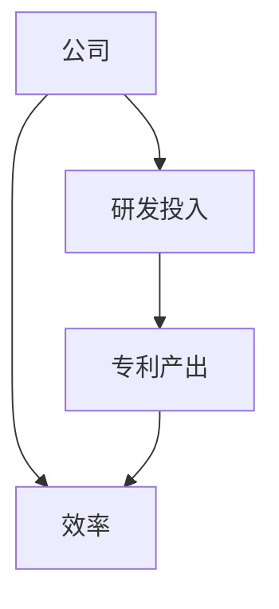
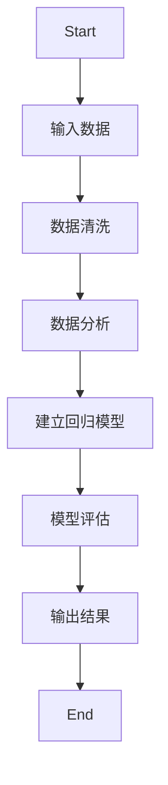
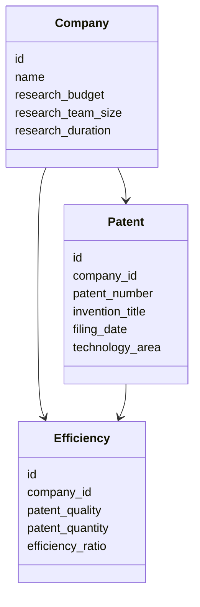
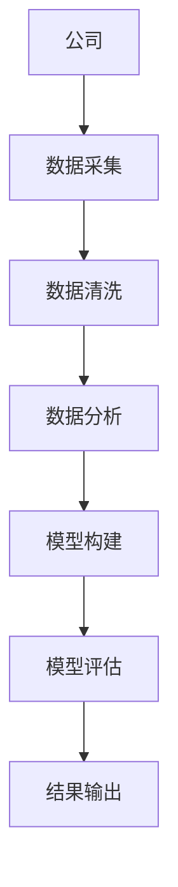

                 


# 彼得林奇对公司研发投入与专利产出效率的评估

---

## 关键词：公司研发投入、专利产出效率、研发投入评估、专利产出模型、研发与专利关系

---

## 摘要：  
本文从公司研发投入与专利产出效率的评估入手，通过背景介绍、核心概念、算法原理、系统架构、项目实战和最佳实践等多维度展开分析。结合多元回归分析算法，构建专利产出效率的评估模型，并通过系统架构设计实现模型的落地应用。最后，通过实际案例分析，总结企业在研发投入与专利产出效率管理中的最佳实践，为企业制定创新战略提供参考。

---

## 第一部分: 公司研发投入与专利产出效率评估的背景与核心概念

### 第1章: 研发投入与专利产出效率的背景介绍

#### 1.1 问题背景与问题描述  
现代企业竞争的核心在于技术创新，而技术创新离不开持续的研发投入。专利作为技术创新的重要成果，不仅是企业技术实力的体现，也是市场竞争的核心武器。然而，企业在研发投入与专利产出效率之间往往存在不平衡现象：部分企业研发投入巨大，但专利产出效率低下；另一些企业研发投入有限，却能高效产出高质量专利。这种不平衡现象直接影响企业的技术创新能力和市场竞争力。  

**问题解决：**  
本文旨在构建一个评估模型，帮助企业量化研发投入与专利产出效率之间的关系，识别影响专利产出效率的关键因素，从而优化研发投入结构，提升专利产出效率。  

**边界与外延：**  
本文主要关注企业内部的研发投入与专利产出效率的关系，不涉及外部市场竞争和专利侵权等外部因素。  

**核心要素：**  
- 研发投入：包括研发人员数量、研发资金投入、研发时间等。  
- 专利产出效率：指单位研发投入所产生的专利数量和质量。  

#### 1.2 研发投入与专利产出效率的核心概念与联系  
研发投入是企业创新的“投入”，而专利产出效率是创新的“产出”。两者之间存在正相关关系，但并非线性关系。企业需要通过科学的评估模型，找到研发投入与专利产出效率之间的最佳平衡点。  

---

## 第2章: 研发投入与专利产出效率的核心概念与联系  

### 2.1 核心概念的原理与特征  

#### 2.1.1 研发投入的属性特征  
| 属性 | 描述 |  
|------|------|  
| 投入金额 | 研发资金的投入量 |  
| 人员数量 | 研发团队规模 |  
| 时间周期 | 研发项目的时间长度 |  
| 技术领域 | 研发方向和技术领域 |  

#### 2.1.2 专利产出的属性特征  
| 属性 | 描述 |  
|------|------|  
| 专利数量 | 单位时间内的专利申请数量 |  
| 专利质量 | 专利的技术创新性和保护范围 |  
| 专利领域 | 专利覆盖的技术领域 |  

#### 2.1.3 两者之间的关系与结构  
通过多元回归分析，可以量化研发投入各因素对专利产出效率的影响权重。例如，研发资金投入对专利数量的影响可能大于研发人员数量对专利质量的影响。  

### 2.2 概念属性对比分析  

#### 2.2.1 概念属性对比表格  
| 概念 | 投入属性 | 产出属性 |  
|------|----------|----------|  
| 研发投入 | 投入金额 | 专利数量 |  
|        | 人员数量 | 专利质量 |  
|        | 时间周期 | 专利领域 |  

#### 2.2.2 实体关系图  


---

## 第三部分: 研发投入与专利产出效率评估的算法原理  

### 第3章: 研发投入与专利产出效率的评估模型  

#### 3.1 算法原理与流程  

##### 3.1.1 多元回归分析的基本原理  
多元回归分析是一种统计学方法，用于研究多个自变量（研发投入）对因变量（专利产出效率）的影响。其基本假设包括：  
- 线性关系：因变量与自变量之间存在线性关系。  
- 独立性：自变量之间相互独立。  
- 正态性：残差服从正态分布。  

##### 3.1.2 算法流程图  


---

### 第4章: 系统分析与架构设计方案  

#### 4.1 问题场景与项目介绍  
企业希望通过研发投入与专利产出效率的评估模型，优化研发资源配置，提升专利产出效率。  

#### 4.2 系统功能设计  

##### 4.2.1 领域模型设计  


#### 4.3 系统架构设计  

##### 4.3.1 系统架构图  


---

### 第5章: 项目实战  

#### 5.1 环境安装与数据准备  

##### 5.1.1 环境安装  
```bash
pip install pandas numpy scikit-learn
```

##### 5.1.2 数据准备  
假设我们有一个包含以下字段的数据集：  
- company_id：公司ID  
- research_budget：研发预算（万元）  
- research_team_size：研发团队人数  
- research_duration：研发周期（月）  
- patent_number：专利数量  
- patent_quality：专利质量（评分）  

#### 5.2 核心代码实现  

##### 5.2.1 数据清洗与预处理  
```python
import pandas as pd
import numpy as np
from sklearn.model_selection import train_test_split
from sklearn.linear_model import LinearRegression
from sklearn.metrics import mean_squared_error

# 数据加载与预处理
df = pd.read_csv('data.csv')
df.dropna(inplace=True)  # 删除缺失值
df = pd.get_dummies(df)  # 虚拟变量编码
```

##### 5.2.2 模型构建与训练  
```python
# 定义特征与目标变量
X = df.drop('patent_quality', axis=1)
y = df['patent_quality']

# 划分训练集与测试集
X_train, X_test, y_train, y_test = train_test_split(X, y, test_size=0.2, random_state=42)

# 模型训练
model = LinearRegression()
model.fit(X_train, y_train)

# 模型评估
y_pred = model.predict(X_test)
mse = mean_squared_error(y_test, y_pred)
print(f"均方误差：{mse}")
```

##### 5.2.3 模型解读与优化  
回归系数表示每个自变量对专利质量的影响程度。例如，研发预算的回归系数为0.6，表示研发预算每增加1万元，专利质量评分预计增加0.6分。  

---

## 第四部分: 最佳实践与总结  

### 第6章: 最佳实践  

#### 6.1 小结  
通过构建多元回归模型，企业可以量化研发投入各因素对专利产出效率的影响，从而优化研发资源配置，提升专利产出效率。  

#### 6.2 注意事项  
- 数据质量：确保数据的完整性和准确性。  
- 模型适用性：根据企业实际情况调整模型参数。  
- 持续优化：定期更新模型，跟踪评估效果。  

#### 6.3 拓展阅读  
- 《专利管理与企业创新策略》  
- 《研发管理的实践与案例分析》  

---

## 作者：AI天才研究院/AI Genius Institute & 禅与计算机程序设计艺术 /Zen And The Art of Computer Programming  

---

**本文完**

