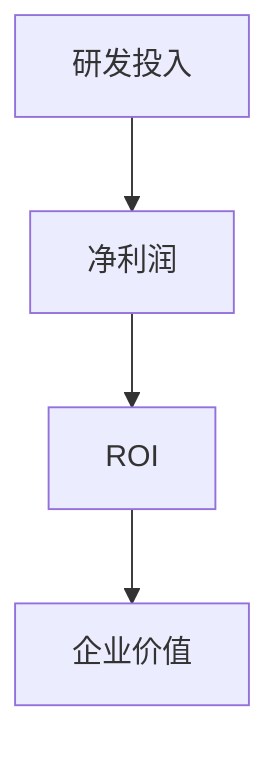
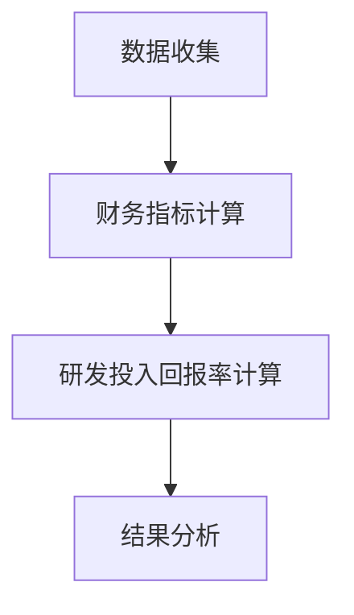
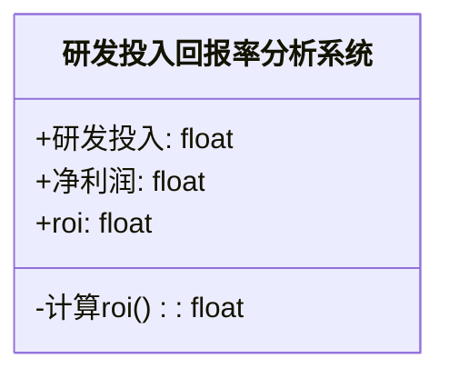
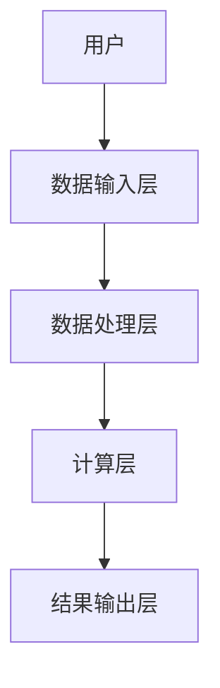

                 


# 彼得林奇对公司研发投入回报率的分析

> 关键词：彼得·林奇，研发投入回报率，投资分析，企业价值，财务指标

> 摘要：本文深入分析了彼得·林奇对公司研发投入回报率的分析方法，探讨了研发投入回报率的定义、计算方式、影响因素及其在投资决策中的应用。通过理论分析和实际案例，揭示了如何通过研发投入回报率评估企业的投资价值，为投资者提供了实用的分析框架和投资建议。

---

# 第一部分: 背景介绍

## 第1章: 研发投入回报率的背景与重要性

### 1.1 研发投入回报率的核心概念

#### 1.1.1 研发投入回报率的定义与内涵
研发投入回报率（Return on Research Investment, RORI）是衡量企业研发投入与其带来的净利润之间关系的重要指标。它反映了企业在研发领域的资金使用效率，是评估企业技术创新能力和投资价值的关键指标。

- 研发投入回报率的定义：RORI = 净利润 / 研发投入
- 彼得·林奇对研发投入回报率的定义：企业通过研发投入所产生的超额收益与研发投入的比率。

#### 1.1.2 研发投入回报率的重要性
- 研发投入回报率对企业价值的影响：高研发投入回报率意味着企业在技术创新和市场竞争力方面具有优势，能够为股东创造更高的价值。
- 研发投入回报率对投资者决策的影响：投资者通过分析企业的研发投入回报率，可以评估企业的投资价值和成长潜力。
- 研发投入回报率与企业长期发展的关系：长期高研发投入回报率的企业往往能够在行业中保持领先地位，实现可持续发展。

### 1.2 彼得·林奇的背景与投资理念

#### 1.2.1 彼得·林奇的生平简介
- 彼得·林奇（Peter Lynch）是美国著名投资经理人，以其在共同基金领域的卓越表现闻名。他在富达投资管理公司的麦哲伦基金任职期间，创造了年均29%的复合回报率。
- 彼得·林奇的投资理念强调长期价值投资，注重企业基本面分析，尤其是企业的成长性和盈利能力。

#### 1.2.2 彼得·林奇的投资风格
- 价值投资：彼得·林奇注重寻找那些被市场低估的企业，尤其是那些具有强大竞争优势和成长潜力的企业。
- 成长型企业：他倾向于投资那些在行业中具有领先地位，并且能够持续创新和增长的企业。
- 研发投入回报率：彼得·林奇认为，企业的研发投入回报率是衡量企业技术创新能力和投资价值的重要指标。

### 1.3 研发投入回报率的分析框架

#### 1.3.1 研发投入回报率的分析维度
- 研发投入的强度：企业的研发投入占总收入的比例。
- 研发投入的效率：单位研发投入带来的净利润。
- 研发投入的成果：研发成果对市场竞争力和企业价值的影响。

#### 1.3.2 彼得·林奇的分析方法
- 投入产出分析法：通过分析企业的研发投入与净利润之间的关系，评估企业的研发效率和投资回报。
- 行业比较法：将企业的研发投入回报率与其竞争对手或行业平均水平进行比较，识别企业的相对优势。
- 长期跟踪法：通过长期跟踪企业的研发投入和回报情况，评估企业的持续创新能力和发展潜力。

---

# 第二部分: 核心概念与联系

## 第2章: 研发投入回报率的核心原理

### 2.1 研发投入回报率的数学模型

#### 2.1.1 研发投入回报率的计算公式
$$ ROI = \frac{\text{净利润}}{\text{研发投入}} $$

- 净利润：企业扣除所有费用后的净利润。
- 研发投入：企业在研发活动中的总投入。

#### 2.1.2 研发投入回报率的属性特征对比

| 属性           | 特征对比                        |
|----------------|---------------------------------|
| 计算方式       | 净利润 / 研发投入              |
| 时间范围       | 可以是季度、半年度或年度数据    |
| 影响因素       | 研发效率、市场需求、竞争环境    |

---

### 2.2 研发投入回报率的ER实体关系图



---

## 第3章: 研发投入回报率的算法原理

### 3.1 算法原理概述

#### 3.1.1 算法流程


#### 3.1.2 算法实现
```python
def calculate roi(research_investment, net_profit):
    return net_profit / research_investment

# 示例数据
research_investment = 100  # 研发投入（百万美元）
net_profit = 50            # 净利润（百万美元）

roi = calculate_roi(research_investment, net_profit)
print(f"研发投入回报率：{roi:.2f}")
```

---

## 第4章: 系统分析与架构设计

### 4.1 系统功能设计

#### 4.1.1 领域模型


#### 4.1.2 系统架构


---

## 第5章: 项目实战

### 5.1 环境安装与数据准备

#### 5.1.1 环境安装
- Python 3.x
- pandas, numpy, matplotlib

#### 5.1.2 数据准备
```python
import pandas as pd

# 示例数据
data = {
    '公司': ['苹果', '微软', '谷歌'],
    '研发投入': [99.78, 173.26, 207.26],
    '净利润': [94.76, 553.29, 138.92]
}

df = pd.DataFrame(data)
print(df)
```

### 5.2 核心实现

#### 5.2.1 计算研发投入回报率
```python
import pandas as pd

def calculate_roi(row):
    return row['净利润'] / row['研发投入']

df['roi'] = df.apply(calculate_roi, axis=1)
print(df)
```

#### 5.2.2 可视化分析
```python
import matplotlib.pyplot as plt

plt.figure(figsize=(10, 6))
plt.bar(df['公司'], df['roi'], label='roi')
plt.title('公司研发投入回报率对比')
plt.xlabel('公司')
plt.ylabel('回报率')
plt.legend()
plt.show()
```

---

## 第6章: 总结与展望

### 6.1 总结
- 本文深入分析了彼得·林奇对公司研发投入回报率的分析方法。
- 通过理论分析和实际案例，揭示了如何通过研发投入回报率评估企业的投资价值。
- 为投资者提供了实用的分析框架和投资建议。

### 6.2 展望
- 未来可以结合更多财务指标和市场数据，建立更加全面的企业价值评估模型。
- 进一步研究人工智能和大数据技术在研发投入回报率分析中的应用。

---

# 作者：AI天才研究院/AI Genius Institute & 禅与计算机程序设计艺术 /Zen And The Art of Computer Programming

