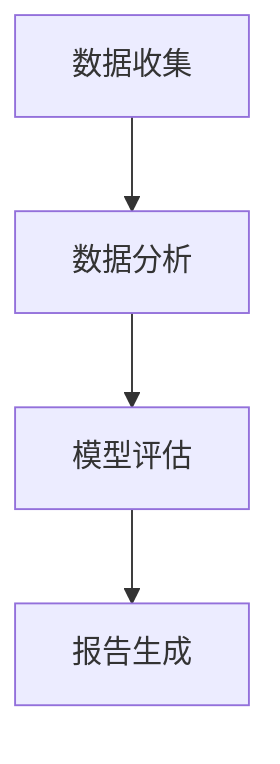

                 

# 彼得林奇对公司研发投入的评估方法

> 关键词：彼得·林奇，研发投入，公司估值，投资策略，创新评估

> 摘要：本文深入分析了彼得·林奇在评估公司研发投入方面的独特方法，探讨了研发投入在公司价值评估中的重要性，并结合实际案例和系统架构，详细阐述了如何通过定量和定性分析来评估研发投资的效率和回报。

---

## 第一章：彼得·林奇投资理念概述

### 1.1 彼得·林奇的背景与投资风格

#### 1.1.1 彼得·林奇的生平简介
彼得·林奇（Peter Lynch）是美国著名的投资家和基金经理，以其在富达投资管理公司的卓越表现而闻名。他管理的麦哲伦基金在1977年至1990年间取得了年均29%的回报率，远超市场平均水平。

#### 1.1.2 林奇投资理念的核心思想
林奇的投资理念强调“买得好，而不是买得多”。他主张通过深入研究公司基本面，特别是公司的财务状况、管理层能力和竞争优势，来选择具有长期增长潜力的公司。

#### 1.1.3 林奇对研发投入的关注点
林奇认为，公司的研发投入是未来增长的核心驱动力。他特别关注公司研发投入的效率和产出，即研发投入是否能够转化为创新产品和市场份额的扩大。

---

### 1.2 研发投入在公司价值评估中的重要性

#### 1.2.1 研发投入的定义与分类
研发投入通常包括公司在研发活动中的所有支出，如 salaries, materials, 和设备费用。根据时间范围，研发投入可以分为短期和长期两类。

#### 1.2.2 研发投入对创新能力和竞争力的影响
研发投入是公司创新能力的直接体现。通过持续的研发投入，公司可以开发新产品、改进技术，从而增强市场竞争力。

#### 1.2.3 研发投入与公司长期增长的关系
长期的研发投入能够为公司创造持续的收入增长和利润。尤其是在技术驱动的行业，如科技、制药和软件行业，研发投入的重要性更加凸显。

---

## 第二章：研发投入的评估维度与指标

### 2.1 研发投入的定性评估维度

#### 2.1.1 研发团队的能力与稳定性
研发团队的能力直接影响研发投入的效率。稳定的团队有助于保持研发项目的连续性，从而提高研发成功的概率。

#### 2.1.2 研发项目的战略重要性
评估研发项目的战略重要性是确定研发投入优先级的关键因素。战略重要性高的项目通常对公司的未来增长具有决定性影响。

#### 2.1.3 研发成果的市场潜力
市场潜力决定了研发成果的商业价值。具有较大市场潜力的成果能够为公司带来更多的收入和利润。

---

### 2.2 研发投入的定量评估指标

#### 2.2.1 研发投入占总收入的比例
研发投入占总收入的比例是衡量公司研发投入强度的重要指标。通常，高科技公司该比例较高，而传统行业较低。

#### 2.2.2 研发投入的回报率（ROI）
研发投资回报率是评估研发投入效率的关键指标。通过对比研发投入与产生的收益，可以衡量研发投资的盈利能力。

#### 2.2.3 研发周期与成本控制
研发周期和成本控制是评估研发效率的重要因素。缩短研发周期和降低研发成本可以提高研发投入的效率。

---

## 第三章：研发投入与财务表现的关系

### 3.1 研发投入对收入增长的影响

#### 3.1.1 研发投入与收入增长的正相关性
在高科技行业，研发投入与收入增长呈正相关关系。增加研发投入通常能够带来收入的增长。

#### 3.1.2 不同行业研发投入对收入的影响差异
不同行业的研发投入对收入的影响差异显著。例如，软件行业研发投入对收入的影响较大，而传统制造业则相对较小。

#### 3.1.3 研发投入的边际效应
随着研发投入的增加，边际收益逐渐递减。因此，公司需要在研发投入和边际收益之间找到平衡点。

---

### 3.2 研发投入对利润与估值的影响

#### 3.2.1 研发投入对利润率的短期与长期影响
短期内，研发投入可能会降低利润率，因为研发支出增加。但长期来看，高效的研发投入能够提高利润率。

#### 3.2.2 研发投入对市盈率与市净率的影响
高研发投入的公司通常具有较高的市盈率和市净率，因为市场预期这些公司具有更强的盈利能力。

#### 3.2.3 投资者对研发投入的估值偏好
投资者倾向于高研发投入的公司，因为这些公司具有更强的创新能力和增长潜力。

---

## 第四章：彼得林奇的研发投入评估方法

### 4.1 林奇的“三阶段”评估法

#### 4.1.1 初步筛选阶段
林奇在初步筛选阶段关注公司的研发投入强度和管理层对研发的重视程度。

#### 4.1.2 深入分析阶段
在深入分析阶段，林奇会评估研发项目的具体目标、技术可行性以及市场潜力。

#### 4.1.3 综合评估阶段
最后，林奇会结合定量和定性分析，评估研发投入的整体效率和回报潜力。

---

### 4.2 林奇的“研发投入产出比”模型

#### 4.2.1 模型的构建与公式
研发投入产出比（ROI） = （研发成果的收入增长 / 研发投入）× 100%

#### 4.2.2 模型的适用场景与限制
该模型适用于高科技行业，但对传统行业可能不太适用，因为不同行业的研发投入性质差异较大。

#### 4.2.3 模型的优化与改进
为了提高模型的准确性，可以引入更多因素，如研发周期和市场竞争状况。

---

## 第五章：研发投入评估的系统架构与流程

### 5.1 系统分析与架构设计

#### 5.1.1 系统目标与范围
系统的目标是评估公司的研发投入效率和回报潜力。

#### 5.1.2 系统功能模块划分
系统功能模块包括数据收集、分析模型、结果输出和报告生成。

#### 5.1.3 系统架构图（Mermaid）

---

### 5.2 研发投入评估的流程

#### 5.2.1 数据收集
收集公司的财务报表、研发投入明细和研发成果。

#### 5.2.2 数据分析
使用定量分析工具（如回归分析）和定性分析方法（如SWOT分析）。

#### 5.2.3 模型评估
构建评估模型，计算研发投入产出比和ROI。

#### 5.2.4 报告生成
生成评估报告，提出改进建议。

---

## 第六章：项目实战——基于林奇方法的案例分析

### 6.1 案例背景
假设我们评估一家科技公司，分析其研发投入效率和回报潜力。

### 6.2 数据收集与分析
收集过去5年的研发投入和收入数据，计算研发投入占总收入比例和ROI。

### 6.3 系统实现
使用Python编写评估模型，计算研发投入产出比。

### 6.4 案例结果
结果显示，该公司的研发投入效率较高，具备较大的增长潜力。

### 6.5 小结
通过林奇的评估方法，我们可以有效识别高潜力的研发项目。

---

## 第七章：总结与展望

### 7.1 全文总结
本文详细介绍了彼得·林奇的公司研发投入评估方法，并通过系统架构和案例分析，展示了如何应用这些方法。

### 7.2 未来展望
未来，随着人工智能和大数据技术的发展，研发投入评估将更加精准和高效。

---

## 附录

### 附录A：术语表
- ROI：研发投资回报率
- SWOT分析：优势、劣势、机会、威胁分析

### 附录B：参考文献
- 林奇, P. (1989). 《彼得·林奇的成功投资策略》

---

## 作者：AI天才研究院

---

以上是《彼得林奇对公司研发投入的评估方法》的完整目录和内容概览。如果您需要进一步扩展某个部分或添加更多细节，请随时告诉我。

