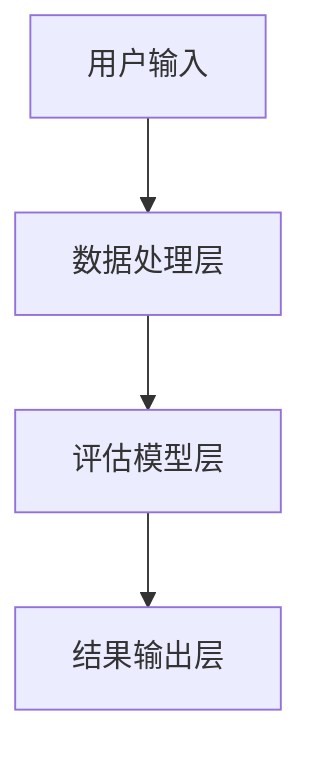

                 


# 彼得林奇对公司研发投入结构的评估

> 关键词：彼得林奇，研发投入，公司评估，投资策略，财务分析

> 摘要：本文详细分析了彼得·林奇在评估公司研发投入结构方面的独特方法和见解，结合实际案例，探讨了如何通过研发投入结构的分析来评估公司的投资价值。文章从研发投入的定义与重要性、彼得林奇的投资理念、研发投入结构评估的核心概念、数学模型与算法、系统架构设计，到实际案例分析，层层深入，为读者提供了全面的视角来理解公司研发投入结构的评估。

---

# 引言

## 1. 研发投入的定义与重要性

### 1.1 研发投入的定义

研发投入（R&D，Research and Development）是指企业在研究、开发和创新活动中的资金投入。它是企业技术创新的核心驱动力，也是企业长期竞争力的重要来源。研发投入可以分为内部研发投入和外部研发投入，前者指企业自行进行的研发活动，后者则是通过购买技术或服务等方式进行的研发投入。

### 1.2 研发投入的分类与特点

研发投入可以从多个维度进行分类，例如按行业、按阶段、按目标等。常见的分类包括：

- **基础研究**：旨在探索未知领域，推动基础科学的进步。
- **应用研究**：旨在解决实际问题，将研究成果转化为实际应用。
- **产品开发**：旨在开发具体的产品或服务，直接为企业创造价值。

### 1.3 研发投入在企业中的战略地位

研发投入不仅是企业技术创新的核心，也是企业长期发展的重要战略。通过合理的研发投入结构，企业可以提升技术水平、增强市场竞争力、实现可持续发展。然而，研发投入的结构是否合理、是否高效，直接关系到企业的投资回报。

---

## 2. 彼得·林奇的背景与投资理念

### 2.1 彼得·林奇的投资者简介

彼得·林奇（Peter Lynch）是全球最著名的投资经理之一，以其在富达麦哲伦基金（Fidelity Magellan）的卓越表现而闻名。他在任职期间（1977年-1990年）创造了年平均收益率29%的惊人成绩。林奇的投资哲学强调长期投资、基本面分析和对行业趋势的深刻理解。

### 2.2 彼得·林奇的投资理念

林奇的投资理念可以用“三重奏”来概括：

- **长期投资**：林奇反对频繁交易，主张长期持有优质股票。
- **价值发现**：林奇注重挖掘那些被市场低估的公司，尤其是具有强大基本面和良好管理的公司。
- **行业趋势**：林奇善于分析行业发展趋势，选择那些处于上升周期的行业中的优秀公司。

---

## 3. 研发投入结构评估的核心概念

### 3.1 研发投入结构的定义与构成

研发投入结构是指企业在不同研发阶段的资金分配比例，包括基础研究、应用研究和产品开发等部分。一个合理的研发投入结构应该既能满足企业当前的技术需求，又能为未来的创新发展奠定基础。

### 3.2 研发投入结构评估的指标体系

评估研发投入结构的关键指标包括：

- **研发强度（R&D Intensity）**：研发费用占企业总收入的比例。
- **研发人员占比**：研发人员数量占企业总员工数的比例。
- **研发投入产出比**：单位研发投入所产生的经济价值。

---

## 4. 彼得·林奇的公司研发投入评估方法

### 4.1 彼得·林奇的评估框架

林奇在评估公司研发投入时，注重以下几个方面：

- **研发投入的财务表现**：通过分析研发费用占总收入的比例、研发人员的占比等指标，评估企业的研发投入是否合理。
- **研发投入与未来收益的关系**：林奇认为，合理的研发投入应该能够为企业带来长期的收益增长。

### 4.2 彼得·林奇的评估工具与方法

林奇在评估公司研发投入时，常用以下工具和方法：

- **比率分析法**：通过计算研发强度（R&D Intensity）等指标，评估企业的研发投入是否合理。
- **周期性分析**：分析企业在不同经济周期中的研发投入变化，判断其研发投入的稳定性和可持续性。
- **行业对比分析**：将企业的研发投入指标与行业平均水平进行对比，找出差异和潜在问题。

---

# 研发投入结构评估的数学模型与算法

## 5. 研发投入结构评估的数学模型

### 5.1 净现值模型

净现值（Net Present Value, NPV）是评估研发投入项目的一种常用方法。其公式为：

$$ NPV = \sum_{t=0}^{n} \frac{C_t}{(1+r)^t} $$

其中，\( C_t \) 是第 \( t \) 年的现金流，\( r \) 是贴现率。

### 5.2 内部收益率模型

内部收益率（Internal Rate of Return, IRR）是另一个常用的评估指标。其公式为：

$$ IRR = r \text{ 使得 } \sum_{t=0}^{n} \frac{C_t}{(1+r)^t} = 0 $$

---

## 6. 系统架构设计与实现

### 6.1 问题场景介绍

本文旨在设计一个基于彼得·林奇投资理念的公司研发投入结构评估系统，帮助投资者快速识别具有潜力的公司。

### 6.2 系统功能设计

- **数据输入**：收集企业的财务数据、研发投入数据等。
- **模型计算**：使用净现值和内部收益率模型进行评估。
- **结果输出**：生成评估报告，提供投资建议。

### 6.3 系统架构设计



---

## 7. 项目实战：基于彼得·林奇方法的公司研发投入评估

### 7.1 环境安装与数据准备

假设我们选择一家科技公司作为案例。我们需要收集该公司的财务报表、研发投入数据等。

### 7.2 核心代码实现

```python
def calculate_npv(cash_flows, discount_rate):
    return sum(c / (1 + discount_rate) ** t for t, c in enumerate(cash_flows))

def calculate_irr(cash_flows):
    from scipy finance import irr
    return irr(cash_flows)
```

### 7.3 案例分析与结果解读

假设某科技公司的研发投入结构如下：

- 研发费用：$100万
- 总收入：$1000万
- 研发强度：10%

通过计算，我们发现该公司的研发投入强度低于行业平均水平，可能需要增加研发投入以提升竞争力。

---

## 8. 总结与展望

### 8.1 总结

本文通过分析彼得·林奇的投资理念，探讨了公司研发投入结构的评估方法。我们发现，合理的研发投入结构是企业长期发展的重要保障。

### 8.2 展望

未来，我们可以进一步研究如何结合人工智能技术，提升研发投入结构评估的效率和准确性。

---

# 作者

作者：AI天才研究院/AI Genius Institute  
禅与计算机程序设计艺术 /Zen And The Art of Computer Programming

