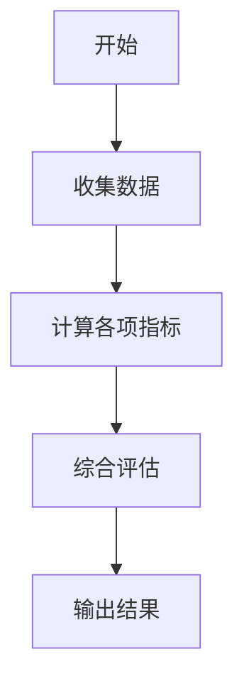
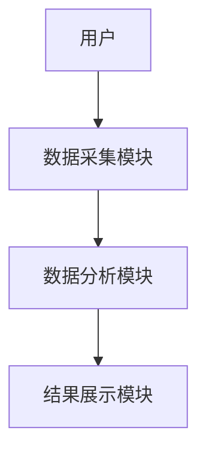
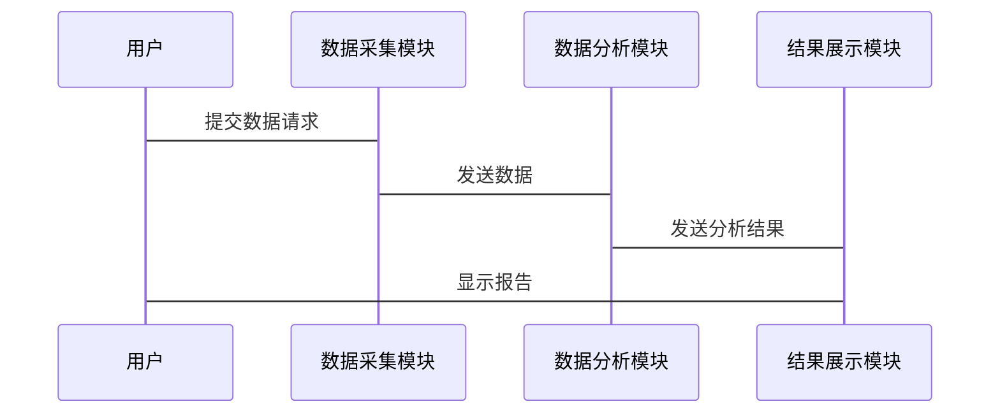

                 


# 彼得林奇对公司研发效率的跨期分析

## 关键词：彼得林奇、研发效率、跨期分析、投资分析、公司价值、效率评估、长期收益

## 摘要：  
本文通过彼得林奇的投资理念，深入分析了研发效率对公司的长期价值和跨期收益的影响。我们从研发效率的定义、评估维度、数学模型、系统架构等多个维度展开，构建了一个完整的研发效率跨期分析框架，并结合实际案例，详细阐述了如何通过优化研发效率来提升公司价值。文章最后总结了最佳实践和未来研究方向，为投资者和管理者提供了实用的指导。

---

## 第一部分: 研发效率与公司价值的跨期分析基础

## 第1章: 研发效率的定义与重要性

### 1.1 研发效率的核心概念

#### 1.1.1 研发效率的定义  
研发效率是指公司在一定时间内将研发资源转化为实际价值的能力，包括时间、成本、质量和创新成果等多个维度。研发效率越高，公司能够在更短的时间内推出更多优质产品，从而提升市场竞争力和公司价值。

#### 1.1.2 研发效率的多维度评估  
研发效率可以从以下几个维度进行评估：  
1. **时间效率**：研发项目完成的周期长度。  
2. **成本效率**：单位研发投入产出的价值。  
3. **创新效率**：研发成果的数量和质量。  
4. **资源效率**：研发团队的人员利用率。  

#### 1.1.3 研发效率与公司价值的关系  
研发效率直接影响公司的长期盈利能力。高效率的研发团队能够更快响应市场需求，降低研发成本，提高产品附加值，从而增强公司的核心竞争力和市场地位。

### 1.2 研发效率的跨期分析背景

#### 1.2.1 跨期分析的定义与特点  
跨期分析是指从短期和长期两个维度综合评估研发效率对公司价值的影响。短期分析关注研发投入的即时回报，长期分析则关注研发成果的持续价值创造。

#### 1.2.2 研发效率跨期分析的必要性  
跨期分析能够帮助公司平衡短期收益与长期投入，避免过度追求短期利益而忽视长期发展。

#### 1.2.3 跨期分析在公司研发管理中的应用  
跨期分析广泛应用于研发项目评估、投资决策和公司战略规划中，是企业实现可持续发展的关键工具。

### 1.3 彼得林奇投资理念与研发效率

#### 1.3.1 彼得林奇投资理念概述  
彼得林奇是著名投资专家，主张长期投资具有持续竞争优势的公司。他认为，公司研发效率是决定长期价值的重要因素。

#### 1.3.2 研发效率在彼得林奇投资模型中的地位  
彼得林奇认为，研发效率高的公司具有更强的创新能力，能够在竞争中保持领先地位，从而为股东创造长期价值。

#### 1.3.3 研发效率与公司长期价值的关系  
研发效率是公司长期价值的核心驱动力。高效率的研发能够快速响应市场变化，推出创新产品，从而提升公司市值和股东回报。

## 1.4 本章小结  
本章介绍了研发效率的核心概念、跨期分析的必要性，以及彼得林奇投资理念对研发效率的重视。通过跨期分析，我们可以更好地理解研发效率对长期价值的影响。

---

## 第2章: 研发效率的多维度评估模型

### 2.1 研发效率的评估维度

#### 2.1.1 研发投入强度  
研发投入强度是指公司每年的研发投入占总收入的比例。高投入不一定意味着高效率，但投入强度是评估研发效率的重要指标。

#### 2.1.2 研发周期与产出效率  
研发周期越短，产出效率越高。产出效率可以衡量单位时间内的研发成果数量和质量。

#### 2.1.3 研发成果转化率  
成果转化率是指研发成果转化为实际产品或服务的比例。高转化率意味着研发资源的高效利用。

### 2.2 研发效率的跨期评估指标

#### 2.2.1 短期研发效率KPI  
- 研发项目按时完成率  
- 单位时间研发成果数量  

#### 2.2.2 长期研发效率KPI  
- 研发投入的年均回报率  
- 长期研发投入的累计收益  

#### 2.2.3 跨期研发效率综合评价模型  
跨期研发效率综合评价模型结合了短期和长期指标，通过加权平均的方式得出综合评分。

### 2.3 研发效率评估的对比分析

#### 2.3.1 不同行业研发效率对比  
不同行业的研发效率差异显著。例如，科技行业通常研发投入较高，产出效率也较高。

#### 2.3.2 不同公司规模研发效率对比  
大型公司通常有更充足的研发资源，但中小型企业可能更灵活，效率更高。

#### 2.3.3 跨期研发效率趋势分析  
通过对比不同时间段的研发效率，可以发现公司的研发能力变化趋势，为未来决策提供依据。

## 2.4 本章小结  
本章从多维度分析了研发效率的评估指标，结合跨期分析，构建了综合评价模型，并通过对比分析帮助读者理解不同情况下研发效率的差异。

---

## 第3章: 研发效率的数学模型与算法原理

### 3.1 研发效率的量化模型

#### 3.1.1 研发效率的数学表达式  
$$研发效率 = \frac{研发成果}{研发投入}$$  

#### 3.1.2 研发效率与公司价值的关系模型  
$$公司价值 = f(研发效率, 市场需求, 竞争环境)$$  

#### 3.1.3 跨期研发效率的动态模型  
动态模型通过时间序列分析，捕捉研发效率的变化趋势。

### 3.2 研发效率的算法实现

#### 3.2.1 研发效率计算的步骤分解  
1. 收集研发数据。  
2. 计算各项指标。  
3. 综合评估得分。  

#### 3.2.2 研发效率评估的算法流程图  


#### 3.2.3 研发效率算法的Python实现代码  
```python
def calculate_research_efficiency(research_cost, research_output):
    return research_output / research_cost

# 示例数据
research_cost = 1000
research_output = 500
efficiency = calculate_research_efficiency(research_cost, research_output)
print(efficiency)
```

### 3.3 研发效率的数学公式推导

#### 3.3.1 研发效率计算公式  
$$效率 = \frac{成果}{投入}$$  

#### 3.3.2 跨期研发效率的数学模型  
$$E(t) = a \cdot t + b$$  

#### 3.3.3 研发效率与公司价值的关系式  
$$V = k \cdot E + c \cdot M$$  
其中，V为公司价值，E为研发效率，M为市场因素。

### 3.4 本章小结  
本章通过数学模型和算法原理，详细讲解了研发效率的量化方法，为后续分析提供了理论基础。

---

## 第4章: 研发效率的系统分析与架构设计

### 4.1 系统分析框架

#### 4.1.1 研发效率分析的系统边界  
系统边界包括研发数据采集、分析和结果展示三个部分。

#### 4.1.2 研发效率分析的系统功能模块  
- 数据采集模块：收集研发数据。  
- 数据分析模块：计算各项指标。  
- 结果展示模块：生成可视化报告。  

#### 4.1.3 研发效率分析的系统输入输出  
输入：研发成本、产出数据。输出：效率报告、分析结果。

### 4.2 系统架构设计

#### 4.2.1 研发效率分析系统的总体架构  


#### 4.2.2 数据采集模块设计  
数据采集模块负责从公司数据库中提取研发数据，包括时间、成本、产出等。

#### 4.2.3 数据分析模块设计  
数据分析模块利用算法对数据进行处理，计算各项指标并生成评估报告。

#### 4.2.4 结果展示模块设计  
结果展示模块以图表形式展示分析结果，方便用户理解和决策。

### 4.3 系统接口设计

#### 4.3.1 数据接口规范  
API接口用于模块之间的数据传递。

#### 4.3.2 API接口设计  
- GET /api/research_efficiency  
- POST /api/analyze  

#### 4.3.3 系统交互流程设计  


### 4.4 本章小结  
本章从系统架构的角度，详细设计了研发效率分析系统的各个模块，为实际应用提供了指导。

---

## 第5章: 研发效率的项目实战

### 5.1 环境安装

#### 5.1.1 安装Python环境  
安装Python 3.8以上版本，并安装必要的库，如Pandas、Matplotlib。

#### 5.1.2 安装数据分析工具  
安装Jupyter Notebook或其他数据分析工具。

### 5.2 核心实现

#### 5.2.1 数据采集模块实现  
编写代码从数据库中提取研发数据。

#### 5.2.2 数据分析模块实现  
利用Python对数据进行清洗、计算和建模。

#### 5.2.3 结果展示模块实现  
生成可视化图表，展示研发效率分析结果。

### 5.3 案例分析

#### 5.3.1 案例背景  
某科技公司过去五年的研发数据。

#### 5.3.2 数据分析  
计算各项指标，生成效率趋势图。

#### 5.3.3 分析结果  
效率逐年提升，但某些年份效率下降，需进一步优化。

### 5.4 本章小结  
通过实际案例，展示了研发效率分析系统的实现过程和应用效果。

---

## 结语  
研发效率是公司长期价值的核心驱动力。通过跨期分析和系统设计，我们可以更好地优化研发流程，提升公司竞争力。未来，随着技术进步和数据分析的深入，研发效率的评估和优化将更加精准和高效。

---

## 作者：AI天才研究院 & 禅与计算机程序设计艺术  
本文由AI天才研究院与禅与计算机程序设计艺术团队共同撰写，转载请注明出处。

