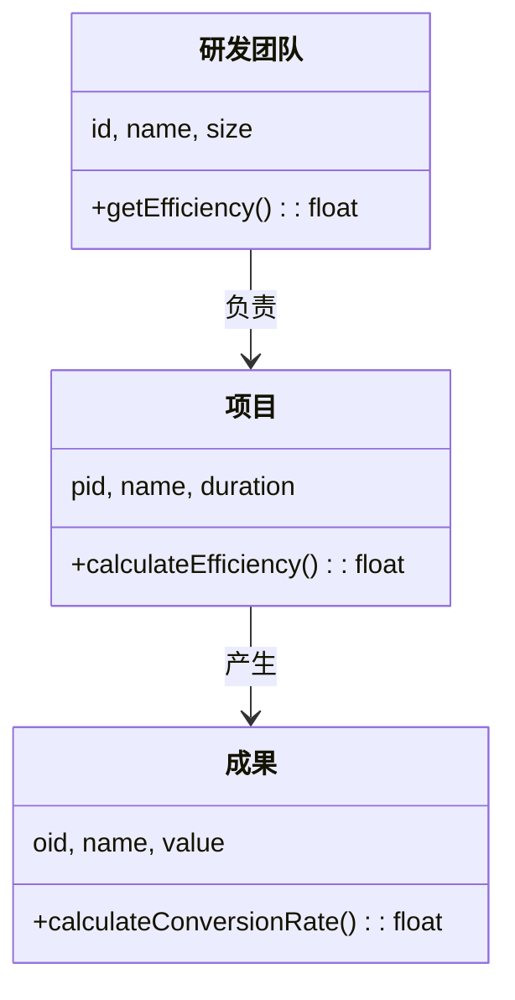

                 


# 彼得林奇对公司研发效率转化率的分析

---

## 关键词：
- 彼得·林奇
- 研发效率
- 转化率
- 研发管理
- 投资分析

---

## 摘要：
本文从彼得·林奇的投资分析视角，深入探讨研发效率和转化率的核心概念、算法原理、系统架构以及实际应用场景。通过对比分析研发效率与转化率的关联性，结合数学模型和系统设计，为企业提升研发效率和转化率提供实用的解决方案和最佳实践。

---

# 第一部分：引言

## 第1章：研发效率与转化率的定义与重要性

### 1.1 研发效率的定义与核心要素
#### 1.1.1 研发效率的定义
研发效率是衡量企业在研发活动中投入资源与产出成果的比例。其核心在于如何用最少的资源实现最大的创新产出。

#### 1.1.2 研发效率的核心要素
- 时间效率：从项目启动到交付的时间周期。
- 成本效率：研发投入与产出的经济效率。
- 人力资源效率：研发团队的工作效率和产出质量。

#### 1.1.3 研发效率与企业竞争力的关系
研发效率是企业技术创新的核心驱动力，直接影响企业的市场竞争力和长期盈利能力。

---

### 1.2 转化率的定义与应用场景
#### 1.2.1 转化率的定义
转化率是指将研发成果转化为实际市场价值的能力，通常以成功案例数与总案例数的比值表示。

#### 1.2.2 转化率在研发管理中的应用
- 技术成果转化：将研发成果转化为产品或服务。
- 市场转化：将技术产品转化为市场收益。

#### 1.2.3 转化率与企业目标的关系
高转化率意味着研发成果能够快速转化为市场价值，直接推动企业目标的实现。

---

### 1.3 彼得·林奇的分析方法与研究背景
#### 1.3.1 彼得·林奇的分析框架
彼得·林奇从投资回报的角度，将研发效率与企业价值增长紧密联系，提出了基于投资收益的分析框架。

#### 1.3.2 研发效率与转化率的关联性
研发效率是转化率的基础，而转化率是研发效率的最终体现。

#### 1.3.3 本章小结
本章通过定义和对比，明确了研发效率与转化率的核心概念，并引入彼得·林奇的分析框架，为后续分析奠定基础。

---

# 第二部分：研发效率与转化率的核心概念

## 第2章：研发效率与转化率的核心概念与联系

### 2.1 研发效率的核心概念
#### 2.1.1 研发效率的属性特征对比表
| 属性 | 时间效率 | 成本效率 | 人力资源效率 |
|------|----------|----------|---------------|
| 定义 | 时间周期 | 经济效率 | 团队产出质量 |
| 重点 | 项目进度 | 资金分配 | 团队能力提升 |

#### 2.1.2 研发效率的ER实体关系图
```mermaid
erDiagram
    研发团队 :id, name, size
    项目 :pid, name, duration
    成果 :oid, name, value
    研发团队 --> 项目 : 负责
    项目 --> 成果 : 产生
```

---

### 2.2 转化率的核心概念
#### 2.2.1 转化率的属性特征对比表
| 属性 | 技术成果转化 | 市场转化 |
|------|--------------|----------|
| 定义 | 成果转化为产品 | 产品转化为收益 |
| 重点 | 技术实现 | 市场推广 |

#### 2.2.2 转化率的ER实体关系图
```mermaid
erDiagram
    成果 :oid, name, value
    产品 :pid, name, price
    收益 :rid, name, amount
    成果 --> 产品 : 转化为
    产品 --> 收益 : 转化为
```

---

### 2.3 研发效率与转化率的关联性分析
#### 2.3.1 研发效率对转化率的影响
- 研发效率高，成果转化周期短，市场响应快。
- 研发效率低，成果转化成本高，市场竞争力弱。

#### 2.3.2 转化率对研发效率的反馈作用
- 高转化率表明研发成果符合市场需求，反馈提升研发效率。
- 低转化率提示研发方向偏离市场，反馈调整研发策略。

---

# 第三部分：研发效率与转化率的算法原理

## 第3章：研发效率与转化率的算法原理

### 3.1 研发效率的计算方法
#### 3.1.1 研发效率的数学模型
$$ \text{研发效率} = \frac{\text{研发成果价值}}{\text{研发投入资源}} $$

#### 3.1.2 算法实现的Python源代码示例
```python
def calculate_research_efficiency(value, cost):
    return value / cost

# 示例
value = 1000000  # 研发成果价值（元）
cost = 500000     # 研发投入成本（元）
efficiency = calculate_research_efficiency(value, cost)
print(f"研发效率为：{efficiency:.2f}")
```

---

### 3.2 转化率的计算方法
#### 3.2.1 转化率的数学模型
$$ \text{转化率} = \frac{\text{成功案例数}}{\text{总案例数}} $$

#### 3.2.2 算法实现的Python源代码示例
```python
def calculate_conversion_rate(success, total):
    return success / total

# 示例
success = 80  # 成功案例数
total = 100   # 总案例数
rate = calculate_conversion_rate(success, total)
print(f"转化率为：{rate:.2f}")
```

---

# 第四部分：研发效率与转化率的系统分析与架构设计

## 第4章：研发效率与转化率的系统分析与架构设计

### 4.1 问题场景介绍
以一家科技公司为例，分析其研发效率和转化率的现状及问题。

### 4.2 系统功能设计
#### 4.2.1 领域模型设计


---

### 4.3 系统架构设计
#### 4.3.1 系统架构图


---

## 第五部分：项目实战

## 第5章：研发效率与转化率的项目实战

### 5.1 环境安装
- 安装Python、Jupyter Notebook和相关库。

### 5.2 核心实现
```python
# 研发效率计算
def calculate_research_efficiency(value, cost):
    return value / cost

# 转化率计算
def calculate_conversion_rate(success, total):
    return success / total

# 示例数据
value = 1000000
cost = 500000
success = 80
total = 100

# 计算结果
efficiency = calculate_research_efficiency(value, cost)
rate = calculate_conversion_rate(success, total)

print(f"研发效率为：{efficiency:.2f}")
print(f"转化率为：{rate:.2f}")
```

---

## 第六部分：总结与最佳实践

## 第6章：总结与最佳实践

### 6.1 本章小结
通过彼得·林奇的分析框架，结合研发效率与转化率的数学模型和系统设计，为企业提供了提升研发效率和转化率的实用方法。

### 6.2 注意事项
- 数据采集的准确性和及时性。
- 系统设计的灵活性和可扩展性。

### 6.3 未来趋势
随着人工智能和大数据技术的发展，研发效率和转化率的分析将更加智能化和精准化。

---

## 参考文献
1. 彼得·林奇. 《投资最重要的事情》
2. 《企业研发管理》
3. Python官方文档

---

## 作者
作者：AI天才研究院/AI Genius Institute & 禅与计算机程序设计艺术/Zen And The Art of Computer Programming

