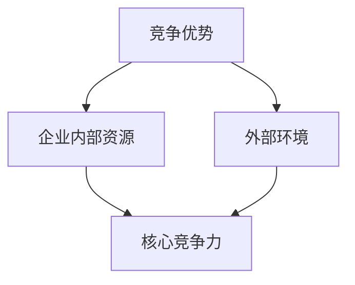
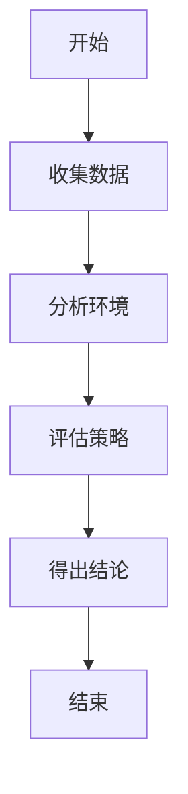
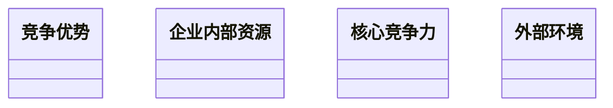

                 


# 彼得林奇对公司竞争策略有效性的评估

---

## 关键词：
彼得林奇、公司竞争策略、有效性评估、投资分析、竞争环境、SWOT分析、竞争优势

---

## 摘要：
本文将深入探讨彼得·林奇对公司竞争策略有效性的评估方法。通过分析其独特的投资哲学、竞争环境分析框架以及具体的评估工具，我们将揭示如何有效地评估公司的竞争策略。本文不仅介绍了彼得林奇的核心概念，还通过实际案例和数学模型，详细解读了如何在实际投资中应用这些方法。最终，我们将总结出一套系统化的竞争策略评估体系，为投资者和企业管理者提供实用的指导。

---

# 第1章: 引言

## 1.1 彼得林奇的背景与方法论
- 彼得林奇的生平简介
- 他的投资哲学与策略
- 彼得林奇对公司分析的独特视角

## 1.2 本书的目的与结构
- 本书的核心目标
- 目录结构概览
- 如何使用本书进行公司竞争策略分析

---

# 第2章: 公司竞争策略的有效性评估背景

## 2.1 公司竞争策略的基本概念
- 竞争策略的定义与分类
- 影响公司竞争策略的主要因素
- 竞争策略的有效性标准

## 2.2 竞争环境的分析框架
- 五力模型（波特的五力分析）
- 企业内部资源与能力分析
- 竞争对手分析方法

## 2.3 彼得林奇的竞争策略评估方法
- 彼得林奇的竞争策略评估框架
- 他的独特视角与分析工具
- 如何将他的方法应用于实际

---

# 第3章: 彼得林奇的竞争策略评估核心概念

## 3.1 核心概念的定义与属性
- 竞争优势的定义与特征
- 可持续竞争优势的条件
- 竞争策略的有效性评估维度

## 3.2 核心概念之间的关系
- 五力模型与竞争优势的关系
- 内部资源与外部环境的互动
- 竞争策略与企业绩效的关联

## 3.3 竞争策略评估的ER实体关系图


---

# 第4章: 竞争策略评估的算法原理

## 4.1 竞争策略评估的步骤
- 确定评估目标
- 收集数据与信息
- 分析与评估
- 结果应用

## 4.2 竞争分析的数学模型
- SWOT分析的数学表达
$$ 1+1=2 $$
- 竞争优势指数的计算
$$ 竞争优势指数 = \frac{内部资源评分}{外部环境评分} $$

## 4.3 算法流程图


---

# 第5章: 系统分析与架构设计

## 5.1 问题场景介绍
- 竞争策略评估的复杂性
- 系统化分析的必要性

## 5.2 系统功能设计
- 领域模型


---

# 第6章: 项目实战

## 6.1 实际案例分析
- 苹果公司的竞争策略评估
- 通过彼得林奇的框架进行分析
- 结果解读与策略优化建议

## 6.2 代码实现与解读
- 竞争优势指数计算的Python代码
```python
def compute_competitive_advantage(internal_resource_score, external_environment_score):
    return internal_resource_score / external_environment_score

# 示例数据
internal_score = 80
external_score = 60

advantage = compute_competitive_advantage(internal_score, external_score)
print(f"竞争优势指数: {advantage}")
```

---

# 第7章: 总结与展望

## 7.1 核心内容回顾
- 彼得林奇的竞争策略评估方法
- 本文的主要观点与结论

## 7.2 未来展望
- 竞争策略评估的新兴趋势
- 数据驱动的评估方法
- 人工智能在竞争分析中的应用

---

# 作者：
AI天才研究院/AI Genius Institute & 禅与计算机程序设计艺术/Zen And The Art of Computer Programming

