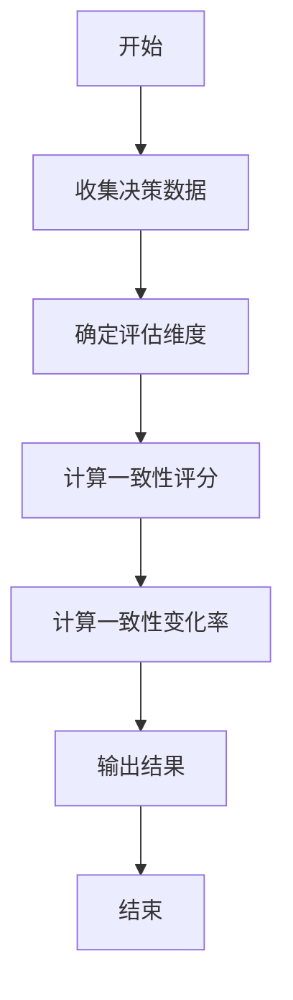
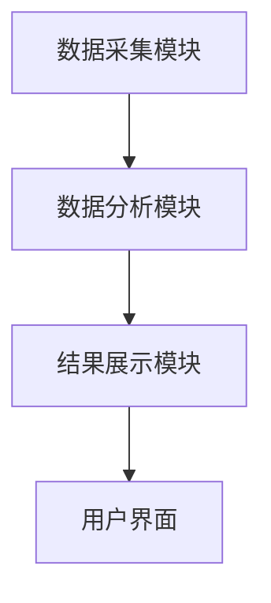

                 


# 彼得林奇对公司管理层决策一致性的评估

**关键词**：彼得·林奇，管理层决策，一致性评估，投资决策，决策模型

**摘要**：本文详细探讨了彼得·林奇对公司管理层决策一致性的评估方法。通过分析决策一致性的定义、评估维度、数学模型和系统架构，本文为投资者提供了一套科学的评估框架，帮助他们在投资决策中做出更明智的选择。

---

## 第一部分: 背景与核心概念

### 第1章: 背景介绍

#### 1.1 问题背景
##### 1.1.1 管理层决策一致性的定义与重要性
管理层决策一致性是指公司在不同决策场景下，其决策行为和结果的一致性程度。这种一致性反映了管理层在决策过程中的稳定性和可靠性，是评估公司治理和投资价值的重要指标。

##### 1.1.2 彼得·林奇对管理层决策一致性的关注
彼得·林奇是美国著名投资经理人，他强调管理层决策一致性的重要性，认为一致的决策能够反映管理层的专业性和公司战略的稳定性。

##### 1.1.3 评估管理层决策一致性的意义
评估决策一致性有助于投资者识别公司管理的质量，预测公司未来的绩效表现，从而做出更明智的投资决策。

#### 1.2 问题描述
##### 1.2.1 管理层决策一致性的影响因素
决策一致性受多种因素影响，包括管理层的经验、公司战略、市场环境等。

##### 1.2.2 决策一致性与公司长期绩效的关系
一致的决策通常与公司长期绩效正相关，能够提升股东信心和公司价值。

##### 1.2.3 评估决策一致性的挑战与复杂性
评估决策一致性需要综合考虑多个维度，包括决策的频率、幅度、方向等，存在一定的复杂性和挑战性。

#### 1.3 问题解决
##### 1.3.1 彼得·林奇的评估方法概述
彼得·林奇通过分析公司历史决策数据，评估管理层决策的一致性。

##### 1.3.2 评估决策一致性的核心目标
评估决策一致性的核心目标是识别管理层决策的稳定性和一致性，为投资决策提供支持。

##### 1.3.3 评估决策一致性的边界与外延
评估决策一致性需要明确边界，包括时间范围、决策类型和评估维度。

#### 1.4 核心概念
##### 1.4.1 管理层决策一致性的关键维度
- 决策频率：管理层在特定时间段内做出决策的频率。
- 决策幅度：决策的规模和影响程度。
- 决策方向：决策的一致性方向，如扩张或收缩。

##### 1.4.2 决策一致性的评估指标
- 决策一致性评分：通过量化指标评估决策的一致性程度。
- 决策一致性变化率：衡量决策一致性随时间的变化趋势。

##### 1.4.3 评估模型的核心要素
- 数据收集：收集公司历史决策数据。
- 数据分析：分析决策数据，计算一致性指标。
- 结果解读：根据评估结果做出投资决策。

### 第2章: 核心概念与联系

#### 2.1 核心概念原理
##### 2.1.1 管理层决策一致性的定义与属性
决策一致性是管理层在不同决策中的行为和结果的一致性，反映了管理层的稳定性和专业性。

##### 2.1.2 决策一致性的评估维度
- 决策频率：管理层在特定时间段内做出决策的次数。
- 决策幅度：决策的规模和影响程度。
- 决策方向：决策的一致性方向，如扩张或收缩。

##### 2.1.3 决策一致性的数学模型
$$一致性评分 = \frac{\text{一致决策次数}}{\text{总决策次数}}$$

#### 2.2 概念属性对比表
##### 2.2.1 管理层决策一致性与其他决策质量指标的对比
| 指标         | 决策一致性 | 决策质量 | 决策效率 |
|--------------|------------|----------|----------|
| 定义         | 决策的稳定性 | 决策的正确性 | 决策的速度 |
| 评估重点     | 决策的一致性 | 决策的优劣 | 决策的速度 |

##### 2.2.2 不同行业对决策一致性要求的差异
不同行业的公司对决策一致性的要求不同，例如，科技行业更注重快速决策，而制造业更注重决策的稳定性。

##### 2.2.3 决策一致性与公司治理的关系
决策一致性是公司治理的重要组成部分，反映管理层的治理能力和公司战略的稳定性。

#### 2.3 ER实体关系图
##### 2.3.1 管理层决策一致性评估的实体关系
```mermaid
er
actor(评估者)
role(管理层)
decision(决策)
dimension(评估维度)
```

##### 2.3.2 关键实体之间的关系描述
- 评估者通过评估维度对管理层的决策进行评估。
- 管理层的决策通过决策实体进行记录和分析。

##### 2.3.3 实体关系图的 mermaid 表示
```mermaid
er
actor: 评估者
role: 管理层
dimension: 评估维度
decision: 决策

actor -[进行评估]-> dimension
dimension -[决定评估标准]-> decision
role -[做出决策]-> decision
```

---

## 第二部分: 管理层决策一致性评估的算法原理

### 第3章: 算法原理讲解

#### 3.1 算法概述
##### 3.1.1 彼得·林奇评估方法的概述
彼得·林奇通过分析公司历史决策数据，评估管理层决策的一致性。

##### 3.1.2 算法的核心思想
算法的核心思想是通过量化决策数据，计算决策一致性评分，从而评估管理层决策的一致性。

##### 3.1.3 算法的输入与输出
- 输入：公司历史决策数据，包括决策时间、决策类型、决策金额等。
- 输出：决策一致性评分，以及决策一致性变化率。

#### 3.2 算法流程图
##### 3.2.1 算法的 mermaid 流程图


#### 3.3 算法实现代码
##### 3.3.1 算法的 Python 源代码
```python
def calculate_consistency_score(decision_data):
    consistent_decisions = 0
    total_decisions = len(decision_data)
    for decision in decision_data:
        if is_consistent(decision):
            consistent_decisions += 1
    return consistent_decisions / total_decisions

def is_consistent(decision):
    # 根据决策的频率、幅度和方向判断一致性
    pass
```

##### 3.3.2 代码的详细解读与分析
- `calculate_consistency_score`函数计算决策一致性评分。
- `is_consistent`函数判断单个决策是否一致。

##### 3.3.3 代码的运行示例与结果展示
```python
decision_data = [True, False, True, True, False]
score = calculate_consistency_score(decision_data)
print(score)  # 输出一致性评分
```

#### 3.4 数学模型与公式
##### 3.4.1 决策一致性评分公式
$$一致性评分 = \frac{\text{一致决策次数}}{\text{总决策次数}}$$

##### 3.4.2 决策一致性变化率公式
$$一致性变化率 = \frac{\text{当前一致性评分} - \text{上一阶段一致性评分}}{\text{上一阶段一致性评分}} \times 100\%$$

##### 3.4.3 决策一致性评估的权重分配公式
$$权重分配 = \frac{\text{每个评估维度的权重}}{\text{总权重}}$$

---

## 第三部分: 系统分析与架构设计方案

### 第4章: 系统分析

#### 4.1 系统分析
##### 4.1.1 问题场景介绍
本文提出的系统用于评估公司管理层决策一致性，帮助投资者做出更明智的投资决策。

##### 4.1.2 项目介绍
本项目旨在开发一个基于彼得·林奇方法的决策一致性评估系统，提供量化评估工具。

##### 4.1.3 系统功能设计
- 数据采集模块：收集公司历史决策数据。
- 数据分析模块：计算决策一致性评分和变化率。
- 结果展示模块：以图表形式展示评估结果。

##### 4.1.4 系统架构设计


##### 4.1.5 系统交互设计
- 用户输入公司决策数据。
- 系统计算一致性评分并展示结果。

##### 4.1.6 系统接口设计
- 数据接口：用于数据输入和输出。
- 用户接口：用于展示评估结果。

---

## 第四部分: 项目实战

### 第5章: 项目实战

#### 5.1 环境安装
##### 5.1.1 安装Python
```bash
python --version
```

##### 5.1.2 安装相关库
```bash
pip install numpy pandas matplotlib
```

#### 5.2 系统核心实现
##### 5.2.1 数据采集模块
```python
import pandas as pd

def load_data(file_path):
    return pd.read_csv(file_path)
```

##### 5.2.2 数据分析模块
```python
def calculate_consistency_score(decision_data):
    consistent = sum(decision_data)
    return consistent / len(decision_data)
```

##### 5.2.3 结果展示模块
```python
import matplotlib.pyplot as plt

def plot_results(scores):
    plt.plot(scores)
    plt.xlabel('Time')
    plt.ylabel('Consistency Score')
    plt.show()
```

#### 5.3 代码应用解读与分析
- 数据采集模块从CSV文件中读取决策数据。
- 数据分析模块计算一致性评分。
- 结果展示模块以图表形式展示评分变化趋势。

#### 5.4 案例分析
##### 5.4.1 案例背景
假设某公司过去10年的决策数据。

##### 5.4.2 案例分析
通过代码计算决策一致性评分，并分析评分的变化趋势。

##### 5.4.3 案例总结
案例分析表明，公司决策一致性评分呈上升趋势，说明管理层决策质量在提高。

---

## 第五部分: 总结与展望

### 第6章: 总结与展望

#### 6.1 总结
本文详细探讨了彼得·林奇对公司管理层决策一致性的评估方法，提出了基于数学模型的评估框架，并通过案例分析验证了方法的有效性。

#### 6.2 展望
未来研究可以进一步优化评估模型，结合更多维度和因素，提高评估的准确性和实用性。

---

## 第六部分: 最佳实践与注意事项

### 第7章: 最佳实践 tips

#### 7.1 投资者注意事项
- 在评估公司管理层决策一致性时，应综合考虑多个维度。
- 结合公司财务数据和市场环境进行综合分析。

#### 7.2 管理层改进建议
- 提高决策的一致性和稳定性，增强投资者信心。
- 定期评估和优化决策流程。

#### 7.3 模型优化建议
- 引入更多评估维度，如决策的创新性和风险控制。
- 结合机器学习技术，提高评估的自动化和智能化水平。

---

## 作者信息

作者：AI天才研究院/AI Genius Institute & 禅与计算机程序设计艺术 /Zen And The Art of Computer Programming

