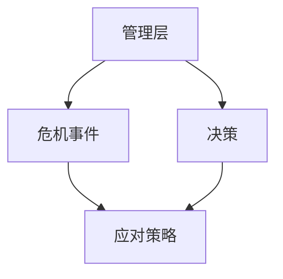
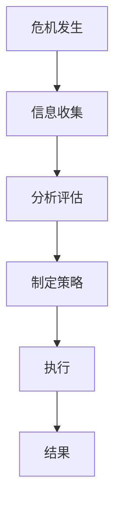
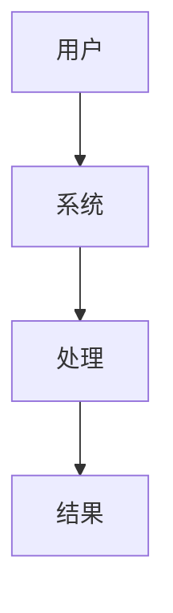

                 


# 彼得林奇对公司管理层危机处理能力的评估

## 关键词：  
彼得·林奇，危机处理能力，公司管理层，风险管理，领导力

## 摘要：  
本文深入分析了彼得·林奇在评估公司管理层危机处理能力方面的独特见解。通过结合实际案例和理论模型，探讨了管理层在危机中的决策能力、团队协作与沟通能力，以及如何通过系统化的评估方法来提升企业的危机应对能力。文章从背景介绍、核心概念、算法原理、数学模型、系统架构、项目实战等多个维度展开，最终得出了一套完整的评估体系和实践方案。

---

## 目录大纲：

### 第一部分: 背景介绍

#### 第1章: 危机处理能力的背景与重要性

##### 1.1 危机处理能力的定义与内涵  
- 危机的定义与特征  
- 危机处理能力的核心概念  
- 危机处理能力的重要性  

##### 1.2 公司管理层危机处理能力的背景  
- 危机对公司的影响  
- 管理层在危机中的角色  
- 评估危机处理能力的必要性  

#### 第2章: 彼得·林奇的危机处理评估方法  

##### 2.1 彼得·林奇的管理风格  
- 林奇的投资哲学  
- 林奇的危机处理原则  

##### 2.2 危机处理能力的评估维度  
- 管理层决策能力  
- 危机应对策略  
- 团队协作与沟通能力  

---

### 第二部分: 核心概念与联系

#### 第3章: 危机处理能力的核心要素  

##### 3.1 危机处理能力的构成要素  
- 信息收集与分析能力  
- 决策与执行能力  
- 应急预案与资源调配能力  

##### 3.2 核心概念的属性特征对比  
- 表格形式对比  
- 图形化展示  

#### 第4章: 实体关系图与流程图  

##### 4.1 实体关系图（ER图）  


##### 4.2 危机处理流程图  


---

### 第三部分: 算法原理讲解

#### 第5章: 危机处理能力评估算法  

##### 5.1 算法概述  
- 算法的核心思想  
- 算法的适用场景  

##### 5.2 算法流程图  


##### 5.3 算法实现  

###### 5.3.1 信息收集与分析  
- 数据采集方法  
- 数据分析技术  

###### 5.3.2 决策与执行  
- 算法步骤  
- 代码实现  

###### 5.3.3 结果评估  
- 评估指标  
- 评估方法  

---

### 第四部分: 数学模型

#### 第6章: 数学模型与公式  

##### 6.1 危机处理能力评分模型  
- 公式推导  
- 模型特点  

##### 6.2 典型案例分析  
- 案例背景  
- 案例分析  
- 模型应用  

##### 6.3 数学公式  
- 危机处理能力评分公式：  
  $$ 能力评分 = \sum (权重_i \times 评估指标_i) $$  
- 决策树模型公式：  
  $$ P(决策|结果) = \frac{P(结果|决策) \times P(决策)}{P(结果)} $$  

---

### 第五部分: 系统分析与架构设计方案

#### 第7章: 系统分析与架构设计  

##### 7.1 系统功能设计  
- 系统目标  
- 功能模块划分  

##### 7.2 系统架构设计  


##### 7.3 系统接口设计  
- 输入接口  
- 输出接口  

##### 7.4 系统交互流程图  


---

### 第六部分: 项目实战

#### 第8章: 项目实战与案例分析  

##### 8.1 项目背景与目标  
- 项目背景  
- 项目目标  

##### 8.2 环境安装与配置  
- 系统环境  
- 工具安装  

##### 8.3 核心代码实现  

###### 8.3.1 信息收集模块  
```python
def collect_info():
    # 数据采集逻辑
    pass
```

###### 8.3.2 决策模块  
```python
def decision-making():
    # 决策逻辑
    pass
```

##### 8.4 案例分析与解读  
- 案例背景  
- 案例分析  
- 结果解读  

##### 8.5 项目小结  
- 项目成果  
- 经验总结  

---

### 第七部分: 最佳实践

#### 第9章: 最佳实践与总结  

##### 9.1 评估过程中的注意事项  
- 数据准确性  
- 方法适用性  

##### 9.2 小结  
- 核心要点回顾  
- 展望未来  

##### 9.3 拓展阅读  
- 相关书籍推荐  
- 其他参考资料  

---

## 作者：AI天才研究院/AI Genius Institute & 禅与计算机程序设计艺术 /Zen And The Art of Computer Programming

