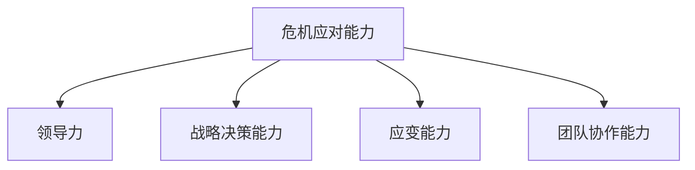

                 

# 彼得林奇对公司管理层危机应对能力的量化

---

## 关键词：彼得·林奇，危机应对能力，管理层，量化分析，投资策略，数学模型

---

## 摘要

本文深入分析了彼得·林奇对公司管理层危机应对能力的量化方法，结合其投资哲学和实际案例，探讨了如何通过量化模型评估管理层在危机中的表现。文章从危机应对能力的核心要素、量化指标、数学模型构建等方面展开，最终得出一套可用于投资决策的量化评估体系。通过对彼得·林奇投资策略的解析，本文揭示了危机应对能力在企业价值评估中的重要性，并提出了未来研究的方向。

---

## 第一部分: 引言

### 第1章: 彼得·林奇与公司管理层危机应对能力的背景

#### 1.1 彼得·林奇的背景与投资理念

彼得·林奇（Peter Lynch）是美国著名的职业基金经理，被誉为“最佳基金经理”之一。他在任职富达麦哲伦基金期间（1977-2000），通过卓越的投资策略为基金创造了高达30%的年平均收益率。林奇的投资哲学以“价值投资”为核心，强调对公司基本面、管理层能力和行业趋势的深入分析。他认为，成功的投资不仅需要对公司财务状况的了解，还需要对管理层能力的深刻洞察。

#### 1.2 管理层危机应对能力的重要性

在企业经营过程中，危机是不可避免的。无论是经济衰退、行业变革，还是突发事件，管理层的应对能力直接影响企业的生存与发展。林奇在其投资生涯中，多次强调管理层在危机中的表现是决定公司价值的关键因素。例如，在1987年美国股市崩盘和2000年互联网泡沫破灭期间，林奇通过分析管理层的危机应对能力，成功规避了多个高风险投资。

#### 1.3 本文的研究目标与框架

本文旨在量化管理层的危机应对能力，并将其纳入投资决策的评估体系。通过分析林奇的投资策略，结合现代量化分析方法，构建一套可用于实际操作的危机应对能力评估模型。本文的研究框架包括以下几个部分：
1. 危机应对能力的核心要素分析。
2. 危机应对能力的量化指标与数学模型。
3. 林奇投资策略中的危机应对能力应用。
4. 危机应对能力量化对投资决策的影响。

---

## 第二部分: 管理层危机应对能力的核心概念与量化方法

### 第2章: 管理层危机应对能力的核心要素

#### 2.1 危机应对能力的构成要素

危机应对能力是一个多维度的概念，涉及多个核心要素：
- **领导力**：管理层在危机中的决策能力和影响力。
- **战略决策能力**：在危机中制定并执行有效战略的能力。
- **应变能力**：快速反应和调整的能力。
- **团队协作能力**：危机中团队的协作效率和凝聚力。

#### 2.2 不同类型危机的应对特征

危机可以分为财务危机、行业危机、突发事件危机等多种类型。不同类型危机对管理层能力的要求有所不同：
- **财务危机**：需要管理层具备快速调整财务结构和优化资源配置的能力。
- **行业危机**：需要管理层具备战略调整和行业洞察力。
- **突发事件危机**：需要管理层具备快速反应和危机公关能力。

#### 2.3 核心概念的ER实体关系图

以下是危机应对能力的核心要素关系图：

---

### 第3章: 管理层危机应对能力的量化方法

#### 3.1 危机应对能力的量化指标

为了量化管理层的危机应对能力，我们需要选择合适的指标：
- **时间响应指标**：危机发生后，管理层采取行动的时间长短。
- **决策质量指标**：危机中的决策是否有效，是否符合公司利益。
- **资源调配指标**：危机中资源的分配效率和效果。
- **事后恢复指标**：危机过后，公司恢复的速度和效果。

#### 3.2 危机应对能力的数学模型

基于上述指标，我们可以构建一个危机应对能力指数模型：

$$
C = \frac{L + S + R + T}{4}
$$

其中：
- $C$ 表示危机应对能力指数。
- $L$ 表示领导力评分。
- $S$ 表示战略决策能力评分。
- $R$ 表示资源调配能力评分。
- $T$ 表示时间响应能力评分。

#### 3.3 危机应对能力的评估方法

1. **定性评估法**：通过访谈、案例分析等方式，对管理层的应对能力进行定性描述。
2. **定量评估法**：基于上述数学模型，对管理层的应对能力进行量化评分。
3. **综合评估法**：结合定性和定量方法，得出最终的评估结果。

---

## 第三部分: 彼得·林奇的投资策略与危机应对能力的结合

### 第4章: 彼得·林奇投资策略中的危机应对能力

#### 4.1 林奇投资策略的核心要素

- **价值投资**：寻找被市场低估的公司。
- **风险管理**：通过分散投资和严格筛选降低风险。
- **行业分析**：关注行业趋势和公司基本面。

#### 4.2 危机应对能力在林奇投资策略中的应用

林奇在其投资生涯中，通过分析管理层的危机应对能力，筛选出具备较强抗风险能力的公司。例如，在1987年股市崩盘期间，林奇通过分析管理层的应对能力，成功投资了多家在危机中表现优秀的公司。

#### 4.3 林奇对管理层危机应对能力的评估

林奇通过以下几个方面评估管理层的危机应对能力：
- 管理层在危机中的决策速度和质量。
- 管理层在危机中的资源调配能力。
- 管理层在危机中的团队协作能力。

### 第5章: 危机应对能力的量化与投资决策

#### 5.1 危机应对能力量化对投资决策的影响

- **危机应对能力高的公司**：具备较高的投资价值。
- **危机应对能力低的公司**：存在较高的投资风险。
- **危机应对能力的动态变化**：需要持续关注和评估。

#### 5.2 危机应对能力量化在投资组合中的应用

通过量化模型，投资者可以将危机应对能力作为重要的筛选指标，构建出具备较强抗风险能力的投资组合。

---

## 第四部分: 实际案例分析与结论

### 第6章: 实际案例分析

#### 6.1 互联网泡沫时期的危机应对能力评估

以互联网泡沫破灭为例，分析多家公司在危机中的管理层应对能力。

#### 6.2 911事件后的危机应对能力评估

分析企业在911事件后的管理层应对能力，以及这些能力如何影响企业的投资价值。

### 第7章: 结论与未来展望

#### 7.1 本文的总结

通过对彼得·林奇投资策略的分析，本文构建了一套管理层危机应对能力的量化模型，并验证了其在投资决策中的应用价值。

#### 7.2 未来研究方向

- 进一步完善危机应对能力的量化模型。
- 探索更多危机类型下的应对能力评估方法。
- 研究危机应对能力与企业长期绩效的关系。

---

## 作者：AI天才研究院/AI Genius Institute & 禅与计算机程序设计艺术 /Zen And The Art of Computer Programming

---

以上是《彼得林奇对公司管理层危机应对能力的量化》的技术博客文章的完整内容。

