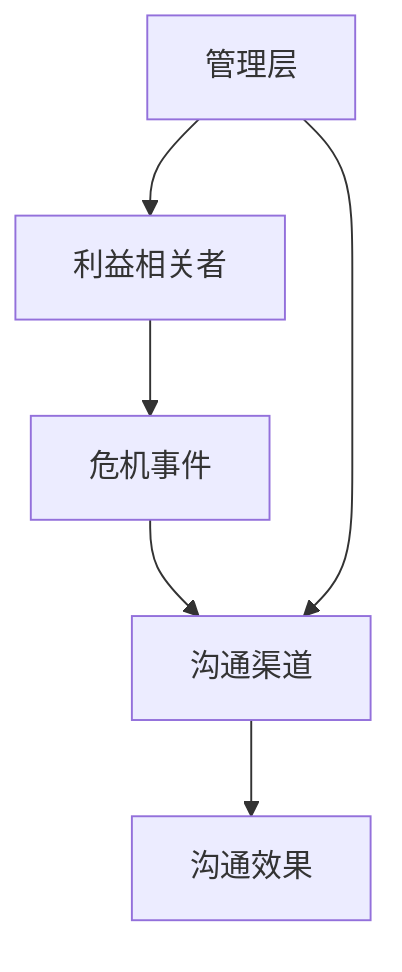
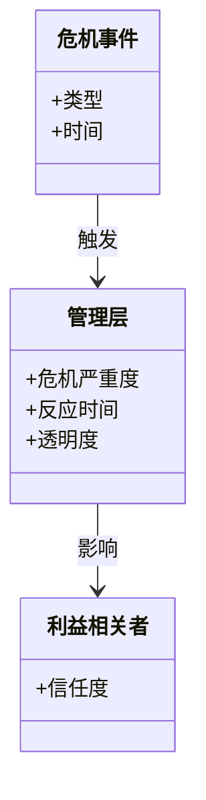
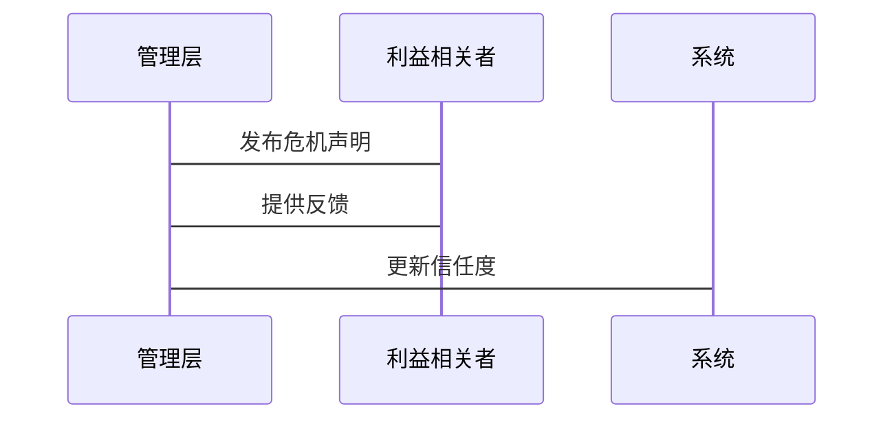

                 


# 彼得林奇对公司管理层危机沟通能力的案例研究

> 关键词：彼得·林奇，危机沟通能力，公司管理层，案例研究，投资哲学

> 摘要：本文通过分析彼得·林奇在投资管理中的危机沟通能力研究，探讨公司管理层在危机沟通中的关键能力，结合实际案例，提出提升危机沟通能力的方法与策略。

---

# 第一部分: 背景介绍

## 第1章: 管理层危机沟通能力的背景与重要性

### 1.1 危机沟通的定义与特点

#### 1.1.1 危机沟通的定义
危机沟通是指在组织面临突发危机时，管理层通过与利益相关者（如员工、股东、客户、媒体等）进行信息传递和情感交流，以减少负面影响、维护组织声誉和信任的过程。

#### 1.1.2 危机沟通的核心要素
- **信息传递的准确性**：确保信息的真实性和透明度，避免谣言和误解。
- **情感表达的恰当性**：在危机中，管理层的情感表达应既能安抚人心，又能展现领导力。
- **决策反馈的及时性**：管理层需快速响应危机，并向利益相关者反馈进展。

#### 1.1.3 危机沟通的分类与场景
- **内部危机沟通**：如公司内部丑闻、员工抗议等。
- **外部危机沟通**：如产品召回、财务丑闻等。
- **突发危机沟通**：如自然灾害、突发公共卫生事件等。

### 1.2 管理层危机沟通能力的重要性

#### 1.2.1 危机沟通对组织生存的影响
在危机中，有效的沟通可以避免信任危机，降低声誉损失，甚至在危机后恢复组织的信誉。

#### 1.2.2 危机沟通对管理层信任度的塑造
管理层在危机中的沟通方式直接影响利益相关者对管理层的信任度，信任度高的管理层更容易获得支持。

#### 1.2.3 危机沟通对利益相关者关系的维护
危机沟通是维护和修复利益相关者关系的关键，良好的沟通可以减少负面影响，增强关系的稳定性。

## 第2章: 彼得·林奇与公司管理层危机沟通能力研究

### 2.1 彼得·林奇的背景与投资理念

#### 2.1.1 彼得·林奇的个人简介
彼得·林奇是美国著名投资经理，曾管理富达麦哲伦基金，创造了卓越的投资业绩，被誉为“最伟大的共同基金经理”。

#### 2.1.2 林奇的投资哲学与方法
林奇的投资哲学强调深入研究公司基本面，关注管理层的诚信、决策能力和危机处理能力。

#### 2.1.3 林奇对管理层能力的重视
林奇认为，优秀的管理层不仅能在正常情况下推动公司发展，还能在危机中做出明智决策并有效沟通。

### 2.2 林奇研究公司危机沟通能力的方法

#### 2.2.1 案例研究法的定义与特点
案例研究法通过分析具体事件，提取一般性规律，适用于复杂的社会现象研究。

#### 2.2.2 林奇研究的样本选择标准
- 选择经历过重大危机的公司。
- 管理层在危机中的沟通表现有显著差异。
- 危机对公司的长期发展有重要影响。

#### 2.2.3 研究的局限性与适用范围
- 个案研究可能具有特殊性，难以推广。
- 适用于分析具体公司的危机沟通策略。

---

# 第二部分: 核心概念与联系

## 第3章: 危机沟通能力的核心概念与模型

### 3.1 危机沟通能力的构成要素

#### 3.1.1 信息传递的准确性
- **信息源的可靠性**：管理层需确保信息的真实性和准确性。
- **信息传递的渠道**：选择适当的沟通渠道，如新闻发布会、内部邮件等。
- **信息接收者的理解度**：确保信息被正确理解和接收。

#### 3.1.2 情感表达的恰当性
- **情感基调的把握**：在危机中，管理层应表现出足够的关切和决心。
- **语言与非语言表达**：包括措辞、语气、肢体语言等。
- **情感共鸣的建立**：通过共情赢得利益相关者的信任。

#### 3.1.3 决策反馈的及时性
- **决策透明度**：向利益相关者公开决策过程和依据。
- **反馈机制的建立**：及时收集反馈并调整沟通策略。
- **决策效果的评估**：通过反馈评估决策效果并优化后续沟通。

### 3.2 危机沟通能力的关键属性对比

#### 3.2.1 不同危机场景下的沟通策略对比
- **内部危机与外部危机**：内部危机更关注员工情绪，外部危机更关注公众形象。
- **短期危机与长期危机**：短期危机需要快速响应，长期危机需要持续沟通。
- **可预见危机与突发危机**：可预见危机需提前准备，突发危机需随机应变。

#### 3.2.2 管理层角色与利益相关者需求的对比
- **管理层角色**：决策者、领导者、沟通者。
- **利益相关者需求**：透明度、责任感、解决方案。

#### 3.2.3 危机沟通中的信息过滤与信息透明度对比
- **信息过滤**：管理层可能过滤负面信息，避免恐慌。
- **信息透明度**：高透明度有助于建立信任，但可能引发短期波动。

### 3.3 危机沟通能力的ER实体关系图



---

# 第三部分: 算法原理讲解

## 第4章: 危机沟通能力评估模型的构建

### 4.1 危机沟通能力评估模型的输入与输出

#### 4.1.1 输入变量
- 危机严重程度（严重度）：定量评估危机的影响范围和程度。
- 管理层反应速度（反应时间）：管理层在危机发生后的响应速度。
- 沟通透明度（透明度）：管理层在危机中公开信息的程度。

#### 4.1.2 输出变量
- 沟通效果评分（评分）：对管理层沟通效果的综合评价。
- 利益相关者信任度变化（信任度变化）：危机前后信任度的变化。

### 4.2 危机沟通能力评估模型的算法流程

#### 4.2.1 数据收集与预处理
- 数据来源：公司危机事件记录、新闻报道、利益相关者反馈。
- 数据清洗：去除无效数据，标准化数据格式。

#### 4.2.2 数据分析与特征提取
- 使用统计分析方法提取关键特征，如危机类型、管理层反应时间等。

#### 4.2.3 模型构建与优化
- 构建回归模型，使用最小二乘法优化参数。

### 4.3 危机沟通能力评估模型的数学公式

#### 4.3.1 沟通效果评分公式
$$
\text{评分} = \alpha \times \text{透明度} + \beta \times \text{反应时间} + \gamma \times \text{危机严重度}
$$

#### 4.3.2 利益相关者信任度变化公式
$$
\Delta \text{信任度} = \delta \times (\text{评分} - \text{基准评分})
$$

### 4.4 危机沟通能力评估模型的实现代码

#### 4.4.1 环境安装
```bash
pip install numpy pandas scikit-learn
```

#### 4.4.2 核心代码实现
```python
import numpy as np
from sklearn.linear_model import LinearRegression

# 示例数据
X = np.array([[0.7, 2, 3],  # 透明度、反应时间、危机严重度
              [0.5, 5, 4],
              [0.6, 3, 2]])
y = np.array([0.3, 0.2, 0.5])

# 模型训练
model = LinearRegression()
model.fit(X, y)

# 预测评分
new_X = np.array([[0.6, 4, 3]])
predicted_score = model.predict(new_X)
print("预测评分:", predicted_score)
```

#### 4.4.3 代码解读与分析
- 使用线性回归模型预测沟通效果评分，输入变量包括透明度、反应时间和危机严重度，输出为评分。

---

# 第四部分: 数学模型与公式

## 第5章: 数学模型与公式

### 5.1 危机沟通能力评估的数学模型

#### 5.1.1 危机沟通能力评估模型
$$
\text{评分} = \alpha \times \text{透明度} + \beta \times \text{反应时间} + \gamma \times \text{危机严重度}
$$

#### 5.1.2 利益相关者信任度变化模型
$$
\Delta \text{信任度} = \delta \times (\text{评分} - \text{基准评分})
$$

### 5.2 模型的优化与验证

#### 5.2.1 模型优化
- 调整参数α、β、γ，使预测评分与实际评分尽可能接近。

#### 5.2.2 模型验证
- 使用交叉验证评估模型的准确性。
- 检查模型的残差，确保模型无明显偏差。

---

# 第五部分: 系统分析与架构设计

## 第6章: 系统分析与架构设计方案

### 6.1 问题场景介绍

#### 6.1.1 系统目标
构建一个危机沟通能力评估系统，帮助公司管理层提升危机沟通能力。

#### 6.1.2 系统范围
涵盖危机识别、沟通策略制定、效果评估等功能。

### 6.2 系统功能设计

#### 6.2.1 领域模型


#### 6.2.2 系统架构设计


### 6.3 系统接口设计

#### 6.3.1 API接口
- `/api/crisis/add`：添加危机事件。
- `/api/management/update`：更新管理层信息。

### 6.4 系统交互设计

#### 6.4.1 序列图


---

# 第六部分: 项目实战

## 第7章: 项目实战

### 7.1 环境安装

#### 7.1.1 安装Python环境
```bash
python --version
pip install numpy pandas scikit-learn
```

### 7.2 系统核心实现

#### 7.2.1 危机沟通能力评估系统实现
```python
from sklearn.linear_model import LinearRegression

# 训练模型
model = LinearRegression()
model.fit(X_train, y_train)

# 预测结果
y_pred = model.predict(X_test)
```

#### 7.2.2 代码应用解读与分析
- 使用线性回归模型对危机沟通能力进行评估，输入为危机数据，输出为评分。

### 7.3 实际案例分析

#### 7.3.1 案例分析
分析某公司危机沟通的实例，评估管理层的沟通能力，提出改进建议。

#### 7.3.2 详细讲解剖析
通过具体案例，详细分析模型的应用过程和结果。

### 7.4 项目小结

#### 7.4.1 项目总结
总结项目成果，提出改进建议。

#### 7.4.2 项目经验
分享项目中的经验教训，为后续项目提供参考。

---

# 第七部分: 最佳实践

## 第8章: 最佳实践

### 8.1 小结

#### 8.1.1 核心观点总结
- 危机沟通能力是管理层的关键能力。
- 林奇的研究方法为评估危机沟通能力提供了新思路。

### 8.2 注意事项

#### 8.2.1 模型应用中的注意事项
- 数据质量对模型准确性影响重大。
- 模型需定期更新以适应新的危机场景。

#### 8.2.2 沟通中的注意事项
- 避免信息过滤，保持透明度。
- 突出情感表达，建立信任。

### 8.3 拓展阅读

#### 8.3.1 相关书籍
- 《彼得·林奇的投资哲学》
- 《危机沟通的艺术》

#### 8.3.2 相关研究论文
- 林奇关于危机沟通能力的案例研究论文。

---

# 结语

通过本文的详细分析，我们了解了彼得·林奇在研究公司管理层危机沟通能力方面的重要工作，并结合实际案例和数学模型，提出了提升危机沟通能力的方法与策略。希望本文能为管理层和投资者提供有价值的参考。

---

# 作者

作者：AI天才研究院/AI Genius Institute & 禅与计算机程序设计艺术 /Zen And The Art of Computer Programming

