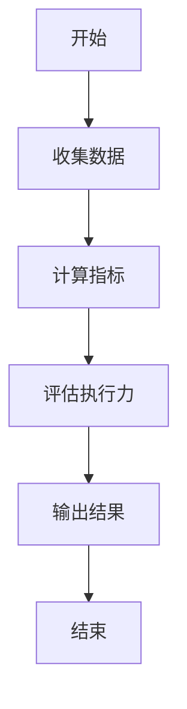
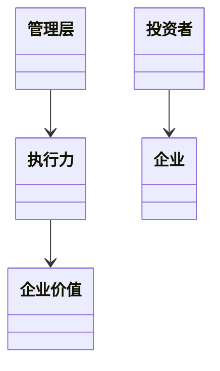

                 


# 彼得林奇对公司管理层执行力的评估

> 关键词：彼得林奇、公司管理层、执行力评估、投资分析、战略决策

> 摘要：本文通过分析彼得·林奇的管理与投资理念，结合实际案例，详细阐述了如何从投资分析的角度对管理层执行力进行评估。通过系统分析、算法设计、项目实战等多维度探讨，深入解析了企业价值与管理层执行力之间的关系，为企业管理者和投资者提供了实用的评估方法和工具。

---

# 第一部分: 背景介绍与核心概念

## 第1章: 背景介绍与问题背景

### 1.1 问题背景

#### 1.1.1 管理层执行力的重要性
在企业运营中，管理层的执行力是决定企业绩效的关键因素。一个高效的管理层能够将战略目标转化为实际成果，而执行力不足的管理层可能导致企业战略失败，影响企业价值。

#### 1.1.2 彼得·林奇与投资管理的关联
彼得·林奇是全球著名的职业基金经理，以其独特的投资理念和对管理层执行力的高度关注而闻名。他的投资成功不仅源于对市场的深刻理解，更源于对管理层执行力的精准评估。

#### 1.1.3 企业价值评估的核心要素
企业价值的核心在于管理层是否能够有效执行战略，合理配置资源，创造持续的业绩增长。因此，评估管理层执行力是企业价值评估的重要组成部分。

### 1.2 问题描述

#### 1.2.1 管理层执行力的定义
管理层执行力是指管理层将战略目标转化为具体行动，并最终实现预期绩效的能力。

#### 1.2.2 彼得·林奇的评估方法
彼得·林奇通过分析企业的财务数据、管理层决策能力和市场反应，对企业管理层的执行力进行综合评估。

#### 1.2.3 企业价值与管理层执行力的关系
企业价值与管理层执行力高度相关。执行力强的管理层能够提升企业绩效，进而提高企业价值。

## 第2章: 核心概念与联系

### 2.1 核心概念原理

#### 2.1.1 管理层执行力的构成要素
- **战略能力**：管理层制定和执行战略的能力。
- **决策能力**：管理层在关键决策中的表现。
- **团队管理**：管理层对团队的领导和管理能力。
- **应对能力**：管理层在面对挑战和危机时的反应速度和能力。

#### 2.1.2 彼得·林奇的评估模型
彼得·林奇的评估模型包括以下几个方面：
- **财务指标分析**：通过ROE、ROA等财务指标评估管理层的业绩表现。
- **管理层稳定性**：评估管理层的稳定性，避免因管理层变动影响企业绩效。
- **市场反馈**：通过市场对管理层的反应，间接评估执行力。

#### 2.1.3 企业价值与管理层执行力的数学关系
$$
\text{企业价值} = \text{管理层执行力} \times \text{战略能力} \times \text{市场环境}
$$

### 2.2 概念属性特征对比

| 概念 | 特征 | 描述 |
|------|------|------|
| 管理层执行力 | 战略能力 | 制定和执行战略的能力 |
|      | 决策能力 | 关键决策的表现 |
|      | 团队管理 | 领导和管理团队的能力 |
|      | 应对能力 | 危机处理能力 |

### 2.3 ER实体关系图
```mermaid
er
  actor 管理层
  actor 执行力
  actor 企业价值
  relation 执行力评估
  relation 企业绩效
  relation 管理层决策
```

---

# 第二部分: 算法原理与数学模型

## 第3章: 算法原理讲解

### 3.1 管理层执行力评估算法

#### 3.1.1 算法概述
通过收集和分析企业的财务数据、管理层决策记录和市场反馈，构建一个综合评估模型，量化管理层的执行力。

#### 3.1.2 算法步骤
1. 收集企业财务数据和管理层决策记录。
2. 计算关键财务指标（如ROE、ROA）。
3. 评估管理层的稳定性。
4. 结合市场反馈，综合评估管理层执行力。

#### 3.1.3 算法流程图


### 3.2 数学模型与公式

#### 3.2.1 管理层执行力评估公式
$$
\text{执行力} = \frac{\text{关键指标} \times \text{战略能力}}{\text{风险系数}}
$$

#### 3.2.2 关键指标计算
$$
\text{关键指标} = \sum_{i=1}^{n} w_i \times x_i
$$
其中，$w_i$ 是指标权重，$x_i$ 是指标值。

---

# 第三部分: 系统分析与架构设计

## 第4章: 系统分析与架构设计

### 4.1 问题场景介绍

#### 4.1.1 管理层执行力评估的场景
在企业价值评估中，管理层执行力是关键因素。投资者需要通过分析管理层的决策和执行能力，判断企业的潜在价值。

#### 4.1.2 系统目标与范围
构建一个基于彼得·林奇理念的管理层执行力评估系统，帮助投资者和企业管理者量化评估管理层的执行能力。

#### 4.1.3 用户需求分析
- 投资者需要了解管理层的执行能力，辅助投资决策。
- 企业管理者需要通过评估发现问题，优化管理流程。

### 4.2 功能设计

#### 4.2.1 领域模型


---

# 第四部分: 项目实战与应用

## 第5章: 项目实战与应用

### 5.1 环境安装与工具准备

#### 5.1.1 系统环境
- 操作系统：Linux/Windows/MacOS
- 开发工具：Python 3.9+
- 数据库：MySQL/PostgreSQL

#### 5.1.2 代码实现
```python
# 管理层执行力评估模型
def calculate_management_executive_efficiency(financial_data, management_stability):
    # 计算关键指标
    roe = financial_data['net_profit'] / financial_data['average_equity']
    roa = financial_data['net_profit'] / financial_data['average_assets']
    efficiency = (roe + roa) / 2 * management_stability
    return efficiency

# 示例数据
financial_data = {
    'net_profit': 1000000,
    'average_equity': 5000000,
    'average_assets': 4000000
}
management_stability = 0.85

# 评估结果
efficiency = calculate_management_executive_efficiency(financial_data, management_stability)
print(f"管理层执行力效率：{efficiency}")
```

---

# 第五部分: 最佳实践与总结

## 第6章: 最佳实践与总结

### 6.1 评估方法总结
- 关注财务指标，尤其是ROE和ROA。
- 评估管理层稳定性，避免频繁变动。
- 结合市场反馈，多维度评估执行力。

### 6.2 小结
通过彼得·林奇的管理与投资理念，结合系统分析和算法设计，我们可以有效评估管理层的执行力，为投资者和企业管理者提供决策支持。

### 6.3 注意事项
- 数据收集要准确，避免影响评估结果。
- 模型需要根据实际情况调整，不能生搬硬套。
- 风险评估要全面，考虑外部环境的影响。

### 6.4 拓展阅读
建议阅读彼得·林奇的《彼得·林奇的投资哲学》和《投资之道》等书籍，深入理解他的投资理念和管理哲学。

---

# 作者：AI天才研究院/AI Genius Institute & 禅与计算机程序设计艺术 /Zen And The Art of Computer Programming

