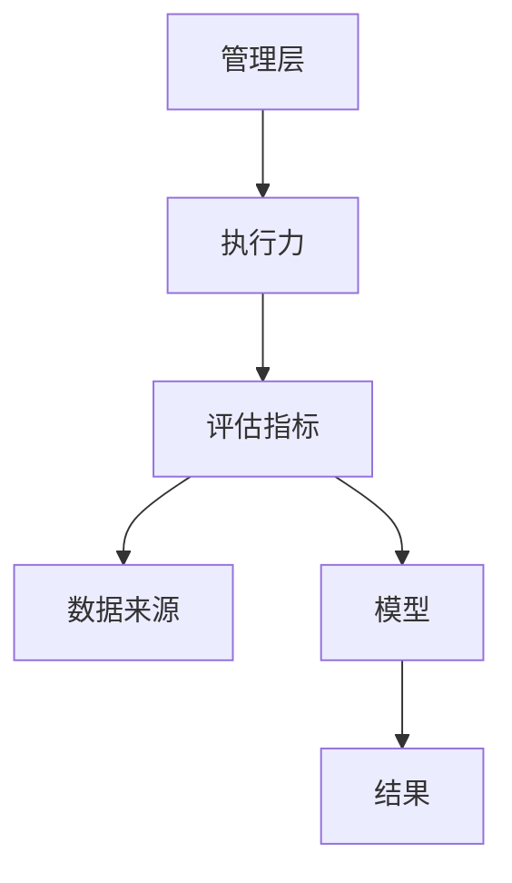
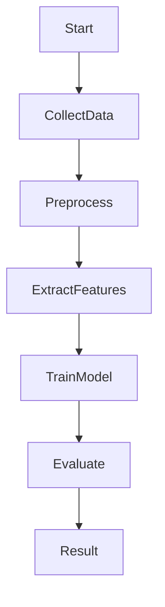
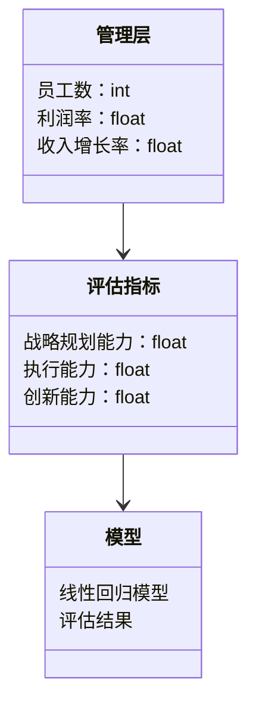
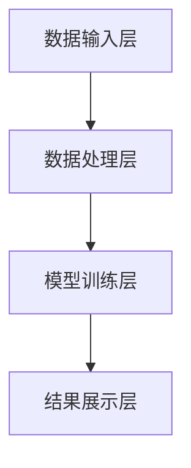

                 


# 彼得林奇对公司管理层执行力的量化评估

> 关键词：彼得林奇，管理层执行力，量化评估，数学模型，系统架构，Python代码，投资策略

> 摘要：本文从彼得林奇的投资理念出发，系统地探讨了如何对公司管理层的执行力进行量化评估。通过构建多维度的指标体系，结合统计分析和机器学习算法，提出了一套科学的评估方法。文章详细介绍了模型的构建过程，包括数据预处理、特征提取、模型训练和结果解读，并通过实际案例展示了如何将理论应用于实践。最后，本文总结了量化评估的意义和未来的研究方向。

---

## 第一部分: 背景介绍

### 第1章: 问题背景与描述

#### 1.1 管理层执行力的重要性
- 管理层执行力是公司成功的关键因素
- 彼得林奇对管理层执行力的重视
- 量化评估的必要性与优势

#### 1.2 当前评估方法的局限性
- 主观评估的不足
- 定性分析的局限性
- 数据驱动的评估方法的优势

#### 1.3 量化评估的目标
- 提供客观的评估标准
- 优化投资决策过程
- 为企业管理提供数据支持

### 第2章: 核心概念与联系

#### 2.1 核心概念原理
- 管理层执行力的定义
- 量化评估的逻辑框架
- 数据与模型的关系

#### 2.2 概念属性特征对比表格
- 表2.1 管理层执行力与财务表现对比

#### 2.3 ER实体关系图


---

## 第二部分: 核心算法与数学模型

### 第3章: 算法原理讲解

#### 3.1 评估模型构建
- 数据收集与预处理
- 特征提取与选择
- 模型训练与调优

#### 3.2 算法流程图


#### 3.3 Python代码实现
```python
import pandas as pd
from sklearn.model import LinearRegression

# 数据预处理
data = pd.read_csv('management_exec.csv')
data.dropna(inplace=True)

# 特征提取
features = ['revenue_growth', 'profit_margin', 'employee_retention']
target = 'execution_score'

# 模型训练
model = LinearRegression()
model.fit(data[features], data[target])

# 模型预测
predicted = model.predict(data[features])
```

### 第4章: 数学模型与公式

#### 4.1 指标体系构建
- 战略规划能力：$S = \sum_{i=1}^{n} w_i \cdot s_i$
- 执行能力：$E = \sum_{j=1}^{m} w_j \cdot e_j$
- 创新能力：$I = \sum_{k=1}^{l} w_k \cdot i_k$

#### 4.2 加权评分模型
$$
\text{总得分} = \frac{S + E + I}{3}
$$

#### 4.3 模型评估
- 回归模型的R平方值
- 分类模型的准确率
- 模型的泛化能力

---

## 第三部分: 系统分析与架构设计

### 第5章: 系统架构设计

#### 5.1 领域模型


#### 5.2 系统架构图


---

## 第四部分: 项目实战

### 第6章: 项目实战分析

#### 6.1 环境安装
```bash
pip install pandas scikit-learn matplotlib
```

#### 6.2 核心代码实现
```python
import pandas as pd
from sklearn.metrics import mean_squared_error
import matplotlib.pyplot as plt

# 数据加载与预处理
data = pd.read_csv('management_exec.csv')
data.dropna(inplace=True)

# 特征与目标分离
X = data[['revenue_growth', 'profit_margin', 'employee_retention']]
y = data['execution_score']

# 模型训练与评估
model = LinearRegression()
model.fit(X, y)
y_pred = model.predict(X)
print('均方误差:', mean_squared_error(y, y_pred))

# 可视化
plt.scatter(y, y_pred)
plt.xlabel('真实值')
plt.ylabel('预测值')
plt.show()
```

#### 6.3 案例分析与解读
- 数据预处理与特征选择的具体步骤
- 模型训练与调优的过程
- 结果分析与可视化解读

---

## 第五部分: 总结与展望

### 第7章: 最佳实践与小结

#### 7.1 小结
- 量化评估的核心步骤
- 算法与模型的选择
- 系统设计的关键点

#### 7.2 注意事项
- 数据质量的重要性
- 模型解释性的关注
- 实际应用中的灵活性

#### 7.3 未来展望
- 更多维度的指标引入
- 更复杂模型的应用
- 结合NLP技术的分析

---

## 作者

作者：AI天才研究院/AI Genius Institute  
联系邮箱：contact@ail天才研究院.com

