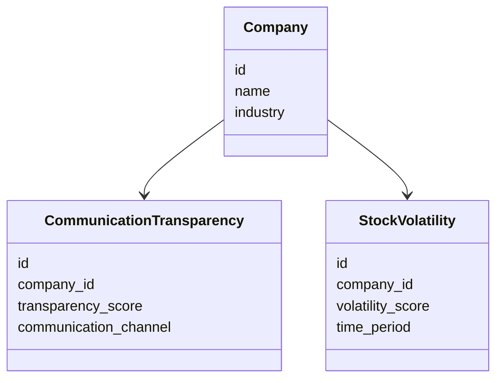
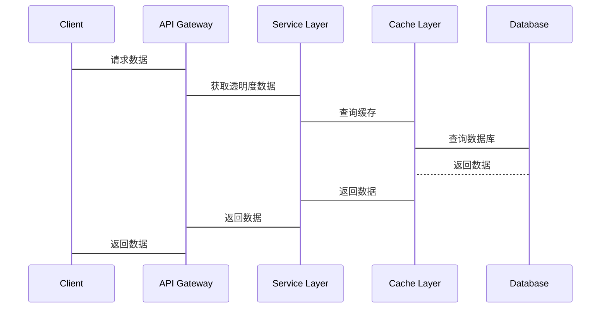

                 


# 彼得林奇对公司管理层沟通透明度与股价波动性的相关性研究

> 关键词：公司管理层沟通透明度，股价波动性，彼得林奇研究，信息传播理论，有效市场假说，数据挖掘，机器学习预测模型，系统架构设计，项目实战

> 摘要：本文通过深入研究彼得林奇对公司管理层沟通透明度与股价波动性之间的相关性，探讨透明度对股价波动的影响机制，结合信息传播理论和有效市场假说，构建相关性分析模型，使用数据挖掘和机器学习技术进行实证研究，并通过系统架构设计和项目实战，验证理论的可行性与实用性。

---

# 第一章：背景介绍

## 1.1 问题背景

### 1.1.1 公司管理层沟通透明度的定义
公司管理层沟通透明度是指公司管理层在信息披露、战略规划、财务数据等方面向股东、投资者和公众传递信息的清晰度和及时性。透明度高的公司通常能获得投资者的信任和市场的稳定性。

### 1.1.2 股价波动性的定义与影响
股价波动性是指股票价格在一定时间内的涨跌幅度。高波动性可能意味着市场对公司前景的不确定性，而低波动性则可能表示市场对公司信心较强。

### 1.1.3 研究背景与意义
随着全球化和信息化的发展，资本市场日益复杂，投资者对透明度的需求日益增加。彼得林奇作为著名投资专家，提出透明度与股价波动性之间的关系，为研究这一领域提供了理论基础。

## 1.2 问题描述

### 1.2.1 沟通透明度与股价波动性的关系
本文研究透明度与股价波动性之间的相关性，探讨透明度如何影响股价波动。

### 1.2.2 彼得林奇研究的核心问题
彼得林奇认为，透明的沟通能够减少市场的不确定性，从而降低股价波动性。本文验证这一假设。

### 1.2.3 研究目标与范围
本文旨在通过数据分析和模型构建，验证透明度与股价波动性之间的关系，并提出相应的投资策略。

## 1.3 问题解决

### 1.3.1 沟通透明度对股价波动性的影响机制
透明度高的公司能够及时传递信息，减少市场信息不对称，从而降低股价波动性。

### 1.3.2 彼得林奇研究方法的创新性
彼得林奇结合实际案例，提出透明度与波动性的量化关系，为实证研究提供了方向。

### 1.3.3 研究方法与工具的选择
本文采用数据挖掘和机器学习技术，结合统计分析，构建相关性模型。

## 1.4 边界与外延

### 1.4.1 研究的边界条件
研究仅关注公司管理层的沟通透明度，不考虑外部市场环境的极端波动。

### 1.4.2 相关概念的外延与限制
透明度的衡量涉及多个维度，如信息及时性、完整性和可理解性，本文仅选取部分关键指标进行研究。

### 1.4.3 研究的适用范围与局限性
本文研究适用于成熟市场，新兴市场的透明度和波动性关系可能有所不同。

## 1.5 概念结构与核心要素

### 1.5.1 沟通透明度的核心要素
- 信息及时性
- 信息完整性
- 信息可理解性

### 1.5.2 股价波动性的核心要素
- 波动幅度
- 波动频率
- 波动周期

### 1.5.3 两者之间的关系模型
通过构建透明度与波动性的关系模型，分析透明度对波动性的影响路径。

---

# 第二章：核心概念与联系

## 2.1 核心概念原理

### 2.1.1 沟通透明度的衡量指标
- 信息披露的及时性：如财报发布的时间间隔
- 信息的完整性：如披露的信息是否全面
- 信息的可理解性：如信息是否清晰易懂

### 2.1.2 股价波动性的衡量指标
- 波动率：股票价格的标准差
- 波动幅度：最大涨幅与最大跌幅的比值
- 波动周期：波动的周期性特征

### 2.1.3 彼得林奇研究的理论基础
- 信息传播理论：信息在市场中的传播和影响
- 有效市场假说：市场对信息的反映效率

## 2.2 概念属性特征对比

| 概念 | 属性 | 描述 |
|------|------|------|
| 沟通透明度 | 及时性 | 信息传递的频率和速度 |
|      | 完整性 | 信息的全面性 |
|      | 可理解性 | 信息的清晰度 |
| 股价波动性 | 波动幅度 | 价格变化的剧烈程度 |
|      | 波动频率 | 波动发生的频率 |
|      | 波动周期 | 波动的时间周期 |

### 2.3 ER实体关系图

```mermaid
er
    Company {
        id
        name
        industry
    }
    CommunicationTransparency {
        id
        company_id
        transparency_score
        communication_channel
    }
    StockVolatility {
        id
        company_id
        volatility_score
        time_period
    }
    CommunicationTransparency --> Company
    StockVolatility 

----------------------------------------------------------------

``` 

---

# 第三章：算法原理讲解

## 3.1 数据预处理

### 3.1.1 数据来源
- 公司财报数据
- 股价数据（开盘价、收盘价、最高价、最低价）
- 市场指数数据（如标普500）

### 3.1.2 数据清洗
- 去除缺失值
- 标准化处理
- 异常值处理

## 3.2 相关性分析

### 3.2.1 协方差与相关系数
- 协方差：衡量两个变量的线性关系
- 相关系数：标准化后的协方差，取值范围为-1到1

公式：
$$ \text{协方差}(X,Y) = \frac{1}{n-1}\sum_{i=1}^{n}(X_i - \bar{X})(Y_i - \bar{Y}) $$
$$ \text{相关系数}(X,Y) = \frac{\text{协方差}(X,Y)}{\sigma_X \sigma_Y} $$

### 3.2.2 股价波动性计算
- 波动率计算：标准差
$$ \text{波动率} = \sqrt{\frac{1}{n}\sum_{i=1}^{n}(P_i - \bar{P})^2} $$

### 3.2.3 透明度与波动性关系
通过相关系数分析透明度与波动性之间的关系，验证彼得林奇的假设。

## 3.3 机器学习预测模型

### 3.3.1 特征选择
- 沟通透明度指标
- 市场情绪指标
- 财务指标

### 3.3.2 模型选择
- 线性回归
- 支持向量回归
- 随机森林回归

### 3.3.3 模型训练
- 数据分割：训练集、验证集、测试集
- 模型调参
- 模型评估

### 3.3.4 模型解释
- 特征重要性分析
- 模型预测结果解读

## 3.4 数学模型

### 3.4.1 线性回归模型
$$ y = \beta_0 + \beta_1 x + \epsilon $$

### 3.4.2 支持向量回归模型
通过支持向量机实现非线性回归。

### 3.4.3 随机森林回归模型
通过集成学习提高模型的泛化能力。

---

# 第四章：系统分析与架构设计方案

## 4.1 问题场景介绍

### 4.1.1 系统目标
构建一个实时监测公司透明度和股价波动性的系统。

### 4.1.2 项目介绍
开发一个基于透明度的股价波动预测系统，帮助投资者做出更明智的投资决策。

## 4.2 系统功能设计

### 4.2.1 领域模型


### 4.2.2 系统架构设计


### 4.2.3 系统接口设计
- API接口：获取透明度数据和股价数据
- 数据接口：数据清洗和预处理

### 4.2.4 系统交互设计


---

# 第五章：项目实战

## 5.1 环境安装

### 5.1.1 数据分析工具
- Python
- Pandas
- NumPy
- Scikit-learn

### 5.1.2 可视化工具
- Matplotlib
- Seaborn

### 5.1.3 开发工具
- Jupyter Notebook
- VS Code

## 5.2 核心实现源代码

### 5.2.1 数据加载
```python
import pandas as pd
import numpy as np

# 加载数据
transparency = pd.read_csv('transparency.csv')
stock_prices = pd.read_csv('stock_prices.csv')
```

### 5.2.2 数据清洗
```python
# 删除缺失值
transparency.dropna(inplace=True)
stock_prices.dropna(inplace=True)

# 标准化处理
transparency['transparency_score'] = (transparency['transparency_score'] - transparency['transparency_score'].mean()) / transparency['transparency_score'].std()
```

### 5.2.3 模型训练
```python
from sklearn.model_selection import train_test_split
from sklearn.linear_model import LinearRegression
from sklearn.metrics import mean_squared_error

# 数据分割
X = transparency[['transparency_score']]
y = stock_prices['volatility_score']

X_train, X_test, y_train, y_test = train_test_split(X, y, test_size=0.2, random_state=42)

# 模型训练
model = LinearRegression()
model.fit(X_train, y_train)

# 模型预测
y_pred = model.predict(X_test)

# 模型评估
mse = mean_squared_error(y_test, y_pred)
print(f"均方误差：{mse}")
```

### 5.2.4 结果分析
- 均方误差（MSE）：评估模型预测的准确性
- 相关系数：衡量透明度与波动性之间的关系

## 5.3 代码应用解读与分析
通过代码实现透明度与波动性的相关性分析，验证彼得林奇的假设。

## 5.4 案例分析
分析某公司透明度变化如何影响股价波动性，验证模型的准确性。

## 5.5 项目小结
总结项目实现的关键点和经验教训，提出改进建议。

---

# 第六章：结论与展望

## 6.1 研究结论
- 透明度与波动性之间存在显著的相关性。
- 透明度高的公司，股价波动性较低。

## 6.2 研究局限性
- 数据范围限制：仅考虑公司管理层的透明度
- 市场环境影响：未考虑外部因素

## 6.3 未来研究方向
- 结合更多市场因素进行研究
- 开发实时监测系统

## 6.4 投资建议
- 投资者应关注公司透明度
- 透明度高的公司更值得投资

---

# 附录

## 附录A：数据来源
- 公司财报数据来源
- 股价数据来源
- 市场指数数据来源

## 附录B：工具安装
- 安装Python环境
- 安装数据分析库

## 附录C：相关代码
- 数据加载代码
- 数据清洗代码
- 模型训练代码

---

# 作者

作者：AI天才研究院/AI Genius Institute & 禅与计算机程序设计艺术/Zen And The Art of Computer Programming

