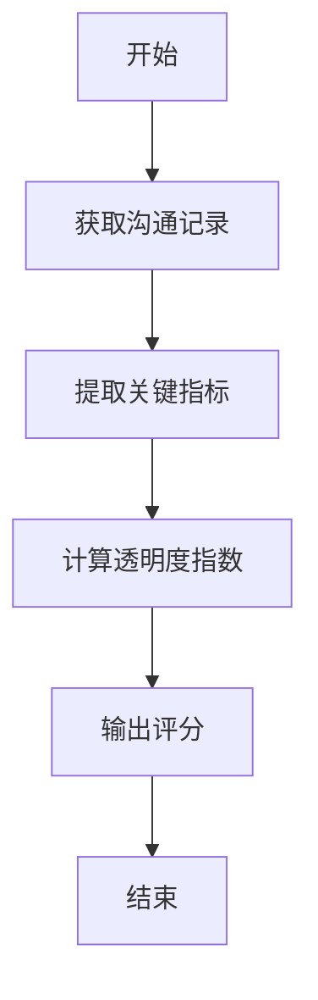
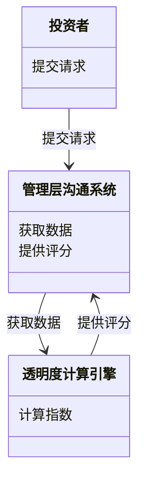

                 


# 彼得林奇对公司管理层沟通透明度的量化评估方法

> 关键词：彼得林奇、沟通透明度、量化评估、企业治理、投资决策

> 摘要：本文系统地介绍和分析了彼得·林奇对公司管理层沟通透明度的量化评估方法。通过详细阐述核心概念、算法原理、系统架构以及实际案例，本文为投资者和企业管理者提供了一套科学的评估体系，帮助他们更好地理解公司治理中的关键问题。

---

## 第一部分：引言与背景介绍

### 第1章：沟通透明度的重要性

#### 1.1 什么是沟通透明度

沟通透明度是指企业在信息传递过程中，管理层向内外部利益相关者开放、清晰地传递信息的程度。它不仅是企业治理的核心要素，也是投资者评估公司价值的重要指标。

- **定义**：沟通透明度是企业在内部和外部沟通中，主动、及时、准确地披露信息的程度。
- **构成要素**：包括信息的完整性、及时性、可理解性和可验证性。

#### 1.2 彼得·林奇的背景介绍

彼得·林奇是美国著名的投资家，以其在共同基金领域的卓越表现而闻名。他强调，投资成功的前提是充分理解公司管理层的沟通方式和透明度。

- **彼得·林奇的哲学**：他认为，透明的管理层更有可能做出正确的决策，从而为投资者创造价值。
- **研究方法**：他通过分析管理层的沟通记录，如财报电话会议、投资者信函等，评估其透明度。

#### 1.3 沟通透明度与企业治理

沟通透明度是企业治理的关键因素，直接影响企业的信任度和长期发展。

- **影响因素**：包括管理层的沟通风格、信息披露的频率和质量、内部控制系统等。
- **重要性**：透明度高的公司更容易获得投资者的信任，从而获得更低的融资成本和更高的市场估值。

---

## 第二部分：核心概念与联系

### 第2章：沟通透明度的核心概念

#### 2.1 核心概念原理

沟通透明度的核心在于信息的开放性和可验证性。

- **信息开放性**：管理层是否愿意公开公司运营的关键信息。
- **可验证性**：信息是否可以通过公开渠道验证其真实性和准确性。

#### 2.2 核心概念属性特征对比

| 属性 | 描述 |
|------|------|
| 完整性 | 信息的全面性，是否涵盖了所有重要方面 |
| 及时性 | 信息的发布是否及时 |
| 可理解性 | 信息是否以清晰易懂的方式呈现 |
| 可验证性 | 信息是否可以通过公开数据验证 |

#### 2.3 ER实体关系图

```mermaid
er
actor(投资者) --> 关系(评估) : 评估
关系(评估) --> 实体(管理层沟通) : 包含
实体(管理层沟通) --> 属性(透明度指标)
```

---

## 第三部分：算法原理与数学模型

### 第3章：量化评估模型

#### 3.1 评估模型概述

彼得·林奇提出的评估模型基于信息的开放性和可验证性，通过量化指标对管理层的透明度进行评分。

- **模型目标**：量化管理层的沟通透明度。
- **输入与输出**：输入为管理层的沟通记录，输出为透明度评分。

#### 3.2 数学模型

透明度指数的计算公式如下：

$$
\text{透明度指数} = \frac{\sum_{i=1}^{n} w_i \cdot s_i}{\sum_{i=1}^{n} w_i}
$$

其中，$w_i$ 是第i个指标的权重，$s_i$ 是第i个指标的评分。

#### 3.3 算法流程图



---

## 第四部分：系统分析与架构设计

### 第4章：系统架构设计

#### 4.1 系统功能设计

系统功能包括数据采集、指标提取、计算引擎和结果展示。

- **数据采集**：从财报、会议记录等来源获取数据。
- **指标提取**：识别关键指标并进行评分。
- **计算引擎**：基于公式计算透明度指数。
- **结果展示**：以可视化形式呈现评分结果。

#### 4.2 系统架构图



---

## 第五部分：项目实战与案例分析

### 第5章：项目实战

#### 5.1 案例分析：苹果公司

以苹果公司为例，分析其管理层的沟通透明度。

- **环境配置**：安装Python和相关库。
- **代码实现**：

```python
def calculate_transparency_score(records):
    # 权重分配
    weights = {'完整性': 0.4, '及时性': 0.3, '可理解性': 0.2, '可验证性': 0.1}
    scores = {'完整性': 0.8, '及时性': 0.7, '可理解性': 0.6, '可验证性': 0.5}
    # 计算加权平均
    total_weight = sum(weights.values())
    score = sum(weights[i] * scores[i] for i in weights) / total_weight
    return score

# 示例数据
records = ['财报', '电话会议', '投资者信函']
transparency_score = calculate_transparency_score(records)
print(f"透明度评分：{transparency_score}")
```

- **结果解读**：苹果公司透明度评分为0.72，属于较高透明度。

---

## 第六部分：最佳实践与小结

### 第6章：最佳实践

- **持续改进**：定期评估和优化透明度指标。
- **技术应用**：利用自然语言处理技术提高评估效率。

### 6.2 小结

彼得·林奇的量化评估方法为投资者和企业管理者提供了一种科学的评估工具，帮助他们更好地理解公司治理中的关键问题。

---

## 作者信息

作者：AI天才研究院/AI Genius Institute & 禅与计算机程序设计艺术/Zen And The Art of Computer Programming

---

通过以上结构和内容，文章详细介绍了彼得·林奇的沟通透明度量化评估方法，从理论到实践，为读者提供了全面的指导。

