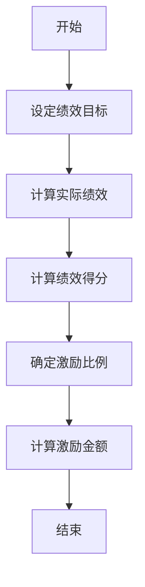

                 


# 彼得林奇对公司管理层薪酬结构的合理性评估

## 关键词：管理层薪酬结构、合理性评估、激励机制、彼得·林奇、公司治理、绩效评估

## 摘要：本文系统地探讨了如何评估公司管理层的薪酬结构是否合理。通过分析彼得·林奇的评估模型、激励机制设计、公平性评估等关键方面，结合实际案例和工具方法，为读者提供全面的分析框架。文章从背景介绍到实际操作，层层深入，旨在帮助读者理解并优化公司管理层的薪酬结构。

---

## 第1章：背景介绍

### 1.1 管理层薪酬结构的现状与问题

#### 1.1.1 现有薪酬结构的常见问题
- 薪酬与绩效脱节
- 激励不足或过度激励
- 短期目标优先，忽视长期发展

#### 1.1.2 薪酬结构不合理对公司的影响
- 影响员工积极性和创造力
- 导致管理决策短视
- 影响公司长期竞争力和股东价值

#### 1.1.3 问题背景与问题描述
- 问题背景：管理层薪酬结构的合理性是公司治理的重要组成部分。
- 问题描述：如何设计合理的薪酬结构，平衡激励与约束，实现公司与管理层的长期利益一致。

### 1.2 管理层薪酬结构的合理性评估的重要性

#### 1.2.1 评估的意义与目标
- 评估意义：确保薪酬结构的公平性、激励性和有效性。
- 评估目标：优化薪酬结构，提升公司绩效和员工满意度。

#### 1.2.2 评估对股东和员工的双重影响
- 对股东：确保股东价值最大化，避免管理层利益与股东利益冲突。
- 对员工：提升员工积极性和创造力，增强团队凝聚力。

#### 1.2.3 评估的边界与外延
- 评估边界：明确评估的范围和限制。
- 评估外延：考虑外部市场环境和内部组织结构的影响。

### 1.3 核心概念与联系

#### 1.3.1 核心概念原理
- 管理层薪酬结构：包括基本工资、奖金、股票期权等。
- 合理性评估：基于绩效、市场对标和内部公平性进行评估。

#### 1.3.2 核心概念属性特征对比表格
| 特性 | 合理性评估 | 不合理评估 |
|------|------------|------------|
| 绩效关联性 | 高         | 低         |
| 内部公平性 | 高         | 低         |
| 外部竞争力 | 高         | 低         |

#### 1.3.3 ER实体关系图架构（使用 Mermaid）

```mermaid
erDiagram
    CEO[首席执行官] {
        +int ID
        +string 姓名
        +float 工资
        +float 奖金
        +float 股票期权
    }
    股东[股东] {
        +int ID
        +string 姓名
        +float 持股比例
    }
    公司[公司] {
        +int ID
        +string 名称
        +float 总收入
        +float 净利润
    }
    CEO --> 公司: 管理
    股东 --> 公司: 拥有
    CEO --> 股东: 负责人
```

---

## 第2章：彼得林奇的评估模型

### 2.1 评估模型的组成部分

#### 2.1.1 绩效指标的选择
- 财务指标：净利润增长率、ROE（净资产收益率）。
- 非财务指标：员工满意度、创新产品数量。

#### 2.1.2 激励机制的设计
- 短期激励：奖金、绩效奖。
- 长期激励：股票期权、限制性股票。

#### 2.1.3 风险因素的考量
- 市场风险：宏观经济波动。
- 公司风险：内部管理问题。

### 2.2 模型的数学表达与公式

#### 2.2.1 绩效评估的数学模型
$$绩效得分 = \frac{实际绩效 - 基准绩效}{最大绩效 - 基准绩效} \times 100\%$$

#### 2.2.2 激励机制的公式推导
$$激励比例 = \frac{绩效得分 \times 目标激励比例}{1 + e^{-绩效得分}}$$

### 2.3 模型的流程图（使用 Mermaid）



---

## 第3章：管理层激励机制设计

### 3.1 激励机制的核心要素

#### 3.1.1 股权激励的实施
- 股票期权：赋予管理层在特定价格购买公司股票的权利。
- 限制性股票：授予管理层一定数量的公司股票，需满足特定条件。

#### 3.1.2 奖金结构的设计
- 基本奖金：基于绩效的基本奖励。
- 加成奖金：额外奖励优秀绩效。

#### 3.1.3 长期激励的策略
- 股票增值权：基于股票价格增长的奖励。
- 退休金计划：长期激励的一种形式。

### 3.2 激励机制的数学模型

#### 3.2.1 股权激励的计算公式
$$股权激励价值 = (股价上涨幅度 \times 股票数量) \times (1 - 税率)$$

#### 3.2.2 奖金分配的数学模型
$$奖金分配 = 绩效得分 \times 奖金池 \times 职位权重$$

---

## 第4章：薪酬结构的公平性评估

### 4.1 公平性评估的维度

#### 4.1.1 内部公平性评估
- 比较不同岗位的薪酬结构。
- 确保薪酬与岗位价值匹配。

#### 4.1.2 外部公平性评估
- 与同行业公司的薪酬水平对标。
- 确保公司薪酬具有竞争力。

### 4.2 公平性评估的工具与方法

#### 4.2.1 内部公平性评估工具
- 岗位价值评估矩阵。
- 薪酬结构对比图。

#### 4.2.2 外部公平性评估方法
- 市场薪酬数据调查。
- 行业薪酬基准报告。

---

## 第5章：案例分析与实际操作指南

### 5.1 案例分析

#### 5.1.1 某科技公司的薪酬结构评估
- 背景介绍：公司绩效优秀，但管理层与员工的薪酬差距过大。
- 评估过程：使用彼得林奇模型评估，发现激励机制设计不合理。
- 结论：调整激励机制，增加长期激励比例。

### 5.2 实际操作指南

#### 5.2.1 数据收集与分析
- 收集公司财务数据、绩效数据、薪酬数据。
- 分析数据，计算绩效得分和激励比例。

#### 5.2.2 模型应用与优化
- 应用彼得林奇模型进行评估。
- 根据评估结果优化薪酬结构。

---

## 第6章：评估中的关键问题与解决方案

### 6.1 关键问题

#### 6.1.1 数据收集的挑战
- 数据不完整。
- 数据偏差。

#### 6.1.2 模型选择的困难
- 模型适用性。
- 模型参数设置。

### 6.2 解决方案

#### 6.2.1 数据预处理
- 数据清洗。
- 数据标准化。

#### 6.2.2 模型优化
- 参数调整。
- 多模型对比。

---

## 第7章：工具与方法

### 7.1 工具介绍

#### 7.1.1 数据分析工具
- Excel：数据处理和图表生成。
- SPSS：统计分析。

#### 7.1.2 模型构建工具
- Python：使用Scikit-learn进行机器学习模型构建。
- R：统计分析和数据可视化。

### 7.2 方法步骤

#### 7.2.1 数据分析步骤
1. 数据清洗。
2. 数据建模。
3. 结果验证。

#### 7.2.2 模型优化步骤
1. 参数调优。
2. 模型验证。
3. 模型部署。

---

## 第8章：结论与展望

### 8.1 结论

- 彼得林奇模型在评估管理层薪酬结构合理性方面具有重要价值。
- 激励机制设计和公平性评估是关键环节。
- 数据分析和工具应用是评估的基础。

### 8.2 未来展望

- 研究动态：实时绩效评估和动态激励机制。
- 技术应用：人工智能在薪酬结构评估中的应用。

---

## 附录

### 附录A：相关法规与政策

- 《公司治理准则》。
- 《薪酬管理指南》。

### 附录B：工具资源

- 数据分析工具：Excel、Python。
- 统计分析工具：SPSS、R。

### 附录C：数据来源

- 市场调查数据。
- 行业基准报告。

---

## 作者：AI天才研究院/AI Genius Institute & 禅与计算机程序设计艺术 /Zen And The Art of Computer Programming

---

**注**：由于篇幅限制，本文仅提供目录大纲和部分章节内容，完整文章需根据此大纲扩展各章节内容，确保每部分内容详实、逻辑清晰。

