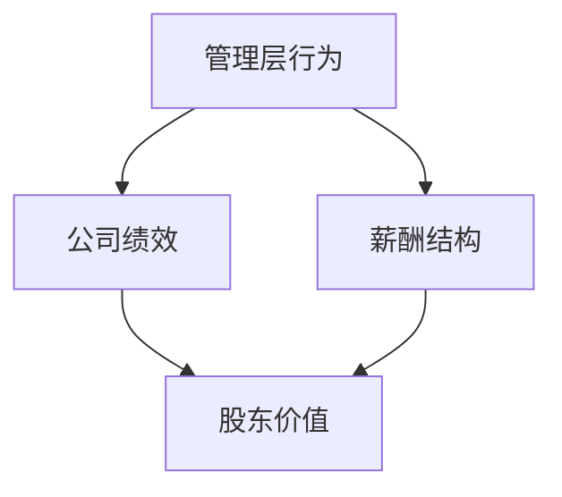
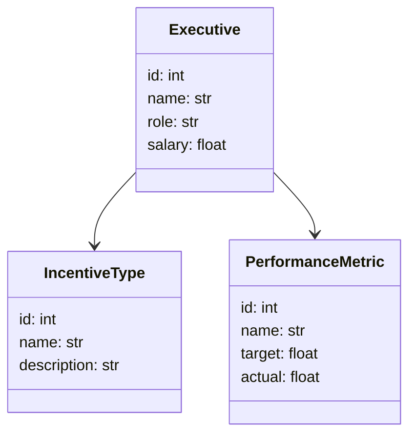
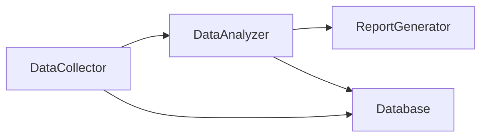
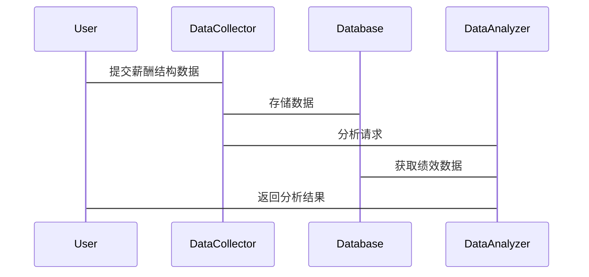
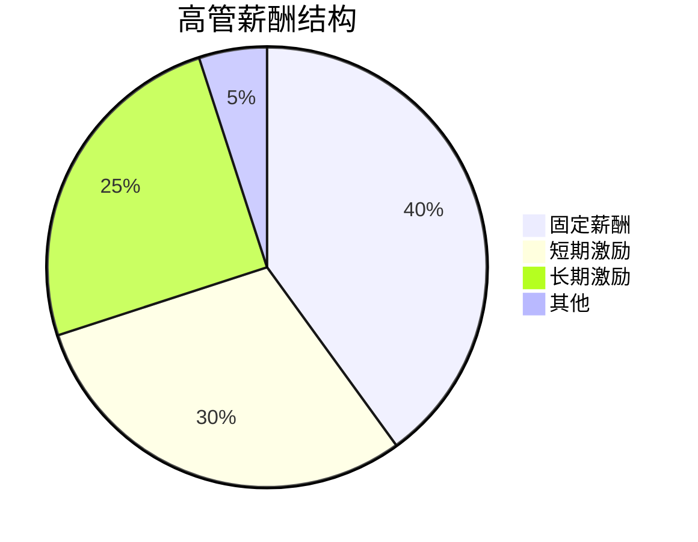

                 


# 彼得林奇对公司管理层薪酬结构的看法

## 关键词：彼得·林奇，公司治理，管理层薪酬结构，激励机制，投资分析

## 摘要：  
彼得·林奇，作为世界著名投资专家，对管理层薪酬结构有着独到的见解。本文从公司治理的角度出发，详细探讨了彼得·林奇的分析方法，分析了薪酬结构对公司绩效的影响，并提出了设计合理薪酬结构的原则和步骤。通过系统工程的方法，构建了薪酬结构分析框架，并结合实际案例，展示了如何将理论应用于实践。本文最后总结了彼得·林奇的主要观点，并展望了未来研究方向。

---

# 正文

## 第1章：引言

### 1.1 彼得·林奇的背景与研究动机  
彼得·林奇（Peter Lynch）是全球知名的投资专家，以其在共同基金领域的卓越表现而闻名。他在任职麦哲伦基金期间，取得了令人瞩目的投资业绩。林奇对管理层薪酬结构的关注源于他对公司治理的深刻理解。他认为，合理的薪酬结构能够激励管理层追求长期价值创造，而过度短期化的薪酬结构可能导致管理层短期行为，损害公司和股东利益。  

### 1.2 问题背景与重要性  
公司治理的核心在于解决“委托-代理”问题，即股东如何通过有效的激励机制让管理层为其利益最大化而努力。薪酬结构是公司治理的重要组成部分，直接影响管理层的行为动机。设计合理的薪酬结构需要考虑短期激励与长期激励的平衡、固定薪酬与可变薪酬的搭配，以及股权激励的有效性。  

### 1.3 本书结构安排  
本文将从理论、方法、实践三个层面展开，系统分析彼得·林奇的观点，并结合实际案例进行深入探讨。具体结构如下：  
- 第2章：公司治理与管理层激励机制概述  
- 第3章：彼得·林奇的分析方法  
- 第4章：实际应用与系统架构设计  
- 第5章：项目实战  
- 第6章：结论与展望  

---

## 第2章：公司治理与管理层激励机制概述

### 2.1 公司治理的基本概念  
公司治理是通过明确的制度安排，确保董事会和管理层代表股东利益，实现公司长期价值最大化。治理结构包括董事会、监事会、高管团队和股东等多方利益相关者。  

#### 核心概念对比表  
| **核心概念** | **定义** | **特点** |  
|--------------|----------|----------|  
| 代理理论      | 描述委托人与代理人之间的关系 | 强调信息不对称与激励机制 |  
| 委托-代理问题 | 委托人与代理人利益冲突 | 导致代理成本的产生 |  
| 激励机制      | 通过激励手段协调双方利益 | 包括物质激励与精神激励 |  

### 2.2 管理层激励机制的理论基础  
代理理论是公司治理的核心理论之一，认为有效的激励机制能够缓解委托-代理问题。短期激励与长期激励的结合是激励机制设计的重要原则。  

#### 数学模型：激励机制的期望收益公式  
$$ E = \alpha \cdot S + (1 - \alpha) \cdot L $$  
其中，$E$ 是激励收益，$\alpha$ 是短期激励权重，$S$ 是短期激励收益，$L$ 是长期激励收益。  

### 2.3 薪酬结构的基本要素  
薪酬结构包括固定薪酬、短期激励（如奖金）和长期激励（如股权激励）。固定薪酬保障基本生活需求，短期激励与年度绩效挂钩，长期激励绑定公司长期价值。  

---

## 第3章：彼得·林奇的分析方法

### 3.1 彼得·林奇的分析框架  
林奇从投资角度分析薪酬结构，关注管理层行为对公司绩效的影响。他通过案例分析，揭示了不合理薪酬结构可能导致的短期行为风险。  

#### 图形：彼得·林奇的分析框架  


### 3.2 关键指标分析  
林奇关注的关键指标包括：  
1. 股权激励的覆盖面与比例。  
2. 短期激励与长期激励的平衡。  
3. 薪酬结构的透明度与合理性。  

#### 代码示例：计算股权激励比例  
```python
def calculate_equity_incentive(shareholding_ratio, total_executives):
    incentive_ratio = (shareholding_ratio / total_executives) * 100
    return incentive_ratio

shareholding_ratio = 0.2
total_executives = 5
print(f"股权激励比例为：{calculate_equity_incentive(shareholding_ratio, total_executives)}%")
```

### 3.3 案例分析方法  
林奇通过分析实际案例，评估薪酬结构的有效性。例如，他研究了某科技公司高管的股权激励计划，发现激励比例过低，导致高管行为短视。  

---

## 第4章：实际应用与系统架构设计

### 4.1 系统功能设计  
设计合理的薪酬结构需要构建领域模型，包括高管、激励类型、绩效指标等实体。  

#### 图形：领域模型类图  


### 4.2 系统架构设计  
薪酬结构分析系统包括数据采集、分析、报告三个模块。  

#### 图形：系统架构图  


### 4.3 系统接口设计  
系统需要与公司绩效管理系统对接，获取高管绩效数据。  

#### 图形：系统交互流程图  


---

## 第5章：项目实战

### 5.1 环境安装  
需要安装Python、Pandas、Matplotlib等工具。  

### 5.2 核心代码实现  
```python
import pandas as pd
import matplotlib.pyplot as plt

# 数据加载
data = pd.read_csv('executive_compensation.csv')

# 可视化图表
data['year'].plot.hist(bins=10, alpha=0.7)
plt.title('高管薪酬分布')
plt.xlabel('年份')
plt.ylabel('人数')
plt.show()
```

### 5.3 案例分析  
以某公司高管薪酬数据为例，分析其薪酬结构的合理性。  

#### 图表：高管薪酬分布  


### 5.4 项目总结  
通过实战项目，验证了彼得·林奇分析方法的有效性，并提出了改进建议。

---

## 第6章：结论与展望

### 6.1 主要观点总结  
彼得·林奇认为，合理的薪酬结构应平衡短期与长期激励，确保管理层行为与股东利益一致。  

### 6.2 局限性分析  
林奇的分析方法主要基于财务数据，可能忽略非财务因素的影响。  

### 6.3 未来展望  
未来研究可以结合大数据和人工智能技术，构建更精准的薪酬结构分析模型。

---

## 作者：AI天才研究院/AI Genius Institute & 禅与计算机程序设计艺术 /Zen And The Art of Computer Programming

