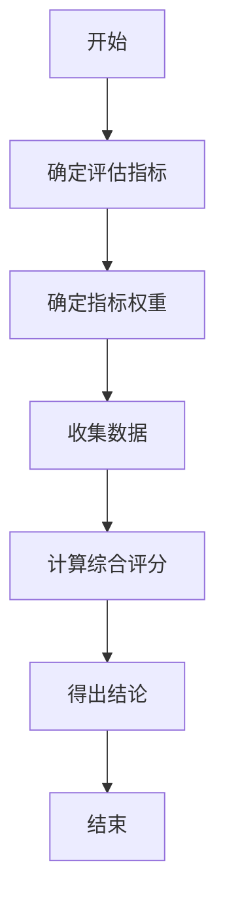

                 

# 彼得林奇对公司管理层质量的要求

> 关键词：彼得·林奇、管理层质量、投资、选股标准、企业治理、战略思维、财务指标

> 摘要：本文深入分析了彼得·林奇对公司管理层质量的要求，探讨了管理层质量对投资成功的重要性，并结合具体的评估方法和实际案例，详细阐述了如何通过管理层质量筛选优质企业。文章从背景介绍、核心概念、评估维度、评估模型到实际应用，全面解析了彼得·林奇的选股理念，为投资者提供了实用的指导和启示。

---

## 第1章: 管理层质量对投资成功的关键作用

### 1.1 为什么管理层质量至关重要

#### 1.1.1 管理层在公司运营中的核心地位
- 管理层是企业的决策中枢，负责制定战略、分配资源、监控执行。
- 一个优秀的管理层能够带领企业在复杂多变的环境中稳步增长。
- 管理层的质量直接影响企业的长期发展和股东价值。

#### 1.1.2 管理层质量对投资回报的影响
- 投资者选择企业时，管理层的质量是决定性因素之一。
- 优秀的管理层能够优化资源配置、降低风险、提高盈利能力。
- 管理层的决策失误可能导致企业价值大幅缩水。

#### 1.1.3 彼得·林奇的投资理念与管理层质量的关系
- 彼得·林奇认为，投资成功的关键在于选择优秀的管理层。
- 他强调，管理层的质量比财务指标更为重要。
- 管理层的质量决定了企业能否在竞争中胜出。

### 1.2 彼得·林奇的选股标准

#### 1.2.1 彼得·林奇的投资哲学概述
- 专注于投资那些具有持续增长潜力的企业。
- 偏好那些管理层透明、诚实且有能力的企业。
- 避免投资那些管理层复杂、财务不透明的企业。

#### 1.2.2 管理层质量在选股中的权重
- 管理层质量是彼得·林奇选股的核心标准之一。
- 他倾向于选择那些具有清晰战略、高效执行和良好道德标准的管理层。
- 管理层的质量决定了企业的成长性和抗风险能力。

#### 1.2.3 通过管理层质量筛选优质企业
- 评估管理层的战略思维和决策能力。
- 分析管理层的过往业绩和管理风格。
- 关注管理层与股东的利益一致性。

### 1.3 管理层质量的核心要素

#### 1.3.1 战略思维与决策能力
- 管理层需要具备清晰的战略思维，能够准确把握市场趋势。
- 决策能力是管理层质量的重要体现，包括决策的果断性和科学性。
- 战略思维与决策能力是企业长期发展的关键。

#### 1.3.2 领导力与团队建设
- 领导力是管理层影响力和凝聚力的体现。
- 团队建设能力决定了管理层能否打造高效协作的团队。
- 良好的领导力和团队建设是企业成功的重要保障。

#### 1.3.3 诚信与道德标准
- 诚信是管理层的基本要求，直接影响企业的声誉和信任度。
- 道德标准是管理层行为的准绳，决定了企业能否持续健康发展。
- 诚信与道德标准是投资者选择管理层的重要依据。

#### 1.3.4 经营效率与成本控制
- 经营效率是管理层优化资源配置的能力。
- 成本控制是管理层降低企业运营成本的关键。
- 高效的经营和成本控制能力是企业盈利的重要保障。

### 1.4 本章小结

#### 1.4.1 管理层质量对投资成功的重要性
- 管理层质量是投资成功的核心因素。
- 优秀的管理层能够带领企业实现持续增长。
- 管理层质量决定了企业的抗风险能力和盈利能力。

#### 1.4.2 彼得·林奇选股标准的核心要素
- 管理层质量是选股的核心标准。
- 选择具有清晰战略、高效执行和良好道德标准的企业。
- 通过管理层质量筛选优质企业。

#### 1.4.3 管理层质量评估的关键维度
- 战略思维与决策能力。
- 领导力与团队建设。
- 诚信与道德标准。
- 经营效率与成本控制。

---

## 第2章: 彼得·林奇的管理层质量评估方法

### 2.1 管理层质量评估的框架

#### 2.1.1 评估框架的构建逻辑
- 构建一个全面的评估框架，涵盖财务、战略、团队、道德等多个维度。
- 确保评估框架的科学性和可操作性。
- 通过多维度评估，全面衡量管理层的质量。

#### 2.1.2 评估框架的适用性分析
- 适用于不同行业和规模的企业。
- 可以作为投资者和企业管理者的重要参考。
- 通过不断优化，提升评估框架的准确性和实用性。

### 2.2 管理层质量的财务指标分析

#### 2.2.1 净利润增长率
- 净利润增长率是衡量企业盈利能力的重要指标。
- 高净利润增长率表明企业具有良好的盈利能力。
- 管理层的质量直接影响净利润的增长。

#### 2.2.2 营业利润率
- 营业利润率反映了企业经营效率的高低。
- 高营业利润率表明企业具有较强的盈利能力。
- 管理层的质量决定了企业的经营效率。

#### 2.2.3 资产回报率
- 资产回报率是衡量企业资产使用效率的重要指标。
- 高资产回报率表明企业具有高效的资产管理和利用能力。
- 管理层的质量直接影响资产回报率。

#### 2.2.4 现金流健康度
- 现金流健康度反映了企业的财务健康状况。
- 良好的现金流健康度表明企业具有较强的偿债能力和运营能力。
- 管理层的质量决定了现金流的健康状况。

### 2.3 管理层质量的非财务指标分析

#### 2.3.1 战略规划的清晰度
- 战略规划的清晰度是衡量管理层战略思维的重要指标。
- 高清晰度的战略规划表明管理层具有明确的目标和方向。
- 战略规划的清晰度直接影响企业的长期发展。

#### 2.3.2 团队稳定性与协作性
- 团队稳定性是衡量管理层团队管理能力的重要指标。
- 良好的团队协作性表明管理层能够有效协调团队成员。
- 团队稳定性与协作性直接影响企业的运营效率。

#### 2.3.3 企业创新与研发投入
- 企业创新是衡量管理层创新能力的重要指标。
- 高研发投入表明管理层重视技术创新和产品升级。
- 企业创新与研发投入是企业长期竞争力的关键。

#### 2.3.4 市场反馈与客户满意度
- 市场反馈是衡量企业市场表现的重要指标。
- 高客户满意度表明企业具有良好的市场声誉和客户关系。
- 市场反馈与客户满意度是企业成功的重要保障。

### 2.4 本章小结

#### 2.4.1 财务指标在管理层质量评估中的作用
- 财务指标是衡量企业盈利能力、经营效率和财务健康的重要工具。
- 高质量的管理层能够通过优化财务指标提升企业价值。
- 财务指标是评估管理层质量的重要依据。

#### 2.4.2 非财务指标的补充作用
- 非财务指标从战略、团队、创新和市场反馈等方面补充了财务指标的不足。
- 非财务指标能够更全面地衡量管理层的质量。
- 非财务指标是评估管理层质量的重要补充。

#### 2.4.3 综合评估方法的实际应用
- 通过综合财务和非财务指标，全面评估管理层的质量。
- 综合评估方法能够帮助企业筛选出优质的管理层。
- 综合评估方法是投资者和企业管理者的重要工具。

---

## 第3章: 管理层质量的关键维度与案例分析

### 3.1 战略思维与决策能力

#### 3.1.1 战略思维的核心要素
- 战略思维是管理层制定长期发展目标的重要能力。
- 高质量的管理层能够准确把握市场趋势和竞争环境。
- 战略思维是企业持续发展的关键。

#### 3.1.2 决策能力的评估标准
- 决策能力包括决策的果断性和科学性。
- 高质量的管理层能够做出正确的决策。
- 决策能力是管理层质量的重要体现。

#### 3.1.3 成功案例分析：XYZ公司
- XYZ公司通过优秀的战略思维和决策能力，成功实现了业务扩张。
- 公司管理层在竞争激烈的市场中保持了持续增长。
- XYZ公司的案例展示了战略思维与决策能力的重要性。

### 3.2 领导力与团队建设

#### 3.2.1 领导力的多维度分析
- 领导力包括影响力、决策力和执行力。
- 高质量的管理层能够有效激励团队成员。
- 领导力是团队协作和企业成功的重要保障。

#### 3.2.2 团队协作的评估方法
- 团队协作的评估方法包括团队稳定性、协作效率和团队文化。
- 高质量的管理层能够打造高效的团队。
- 团队协作是企业成功的重要因素。

#### 3.2.3 失败案例分析：ABC公司
- ABC公司因团队协作能力差，导致企业陷入困境。
- 管理层未能有效协调团队成员，导致资源浪费和效率低下。
- ABC公司的案例展示了团队协作能力的重要性。

### 3.3 诚信与道德标准

#### 3.3.1 诚信管理的重要性
- 诚信管理是企业长期发展的基石。
- 高质量的管理层能够维护企业的声誉和信任度。
- 诚信管理是投资者选择企业的关键因素。

#### 3.3.2 道德风险的识别与防范
- 道德风险是管理层可能的违规行为，影响企业的健康发展。
- 高质量的管理层能够有效防范道德风险。
- 道德标准是衡量管理层质量的重要指标。

#### 3.3.3 案例分析：诚信经营的典范
- 某知名企业通过诚信经营，赢得了市场的信任和客户的支持。
- 企业管理层始终坚持道德标准，避免了违规行为。
- 该企业的成功展示了诚信管理的重要性。

### 3.4 经营效率与成本控制

#### 3.4.1 经营效率的衡量指标
- 经营效率包括资产周转率、成本控制能力等。
- 高质量的管理层能够优化资源配置，提高经营效率。
- 经营效率是企业盈利能力的重要保障。

#### 3.4.2 成本控制的关键策略
- 成本控制包括优化供应链、降低管理费用等。
- 高质量的管理层能够制定有效的成本控制策略。
- 成本控制是企业竞争力的重要组成部分。

#### 3.4.3 案例分析：高效运营的标杆企业
- 某企业在成本控制和高效运营方面表现突出。
- 管理层通过优化资源配置，显著降低了运营成本。
- 该企业的成功展示了经营效率与成本控制的重要性。

### 3.5 本章小结

#### 3.5.1 各个关键维度的综合分析
- 管理层质量包括战略思维、领导力、诚信和经营效率等多个维度。
- 各个维度相互关联，共同影响企业的长期发展。
- 综合分析各个维度，能够全面评估管理层的质量。

#### 3.5.2 成功与失败案例的启示
- 成功案例展示了高质量管理层的重要性。
- 失败案例揭示了管理层质量不足的后果。
- 案例分析为投资者和企业管理者提供了宝贵的经验和启示。

#### 3.5.3 管理层质量评估的实践意义
- 管理层质量评估是投资者筛选优质企业的关键工具。
- 通过综合分析各个维度，能够准确评估管理层的质量。
- 管理层质量评估是企业管理和投资决策的重要参考。

---

## 第4章: 彼得·林奇的管理层质量评估模型

### 4.1 模型构建的理论基础

#### 4.1.1 评估模型的设计思路
- 以彼得·林奇的选股理念为基础，构建全面的评估模型。
- 结合财务指标和非财务指标，全面衡量管理层的质量。
- 通过量化分析和定性评估，确保模型的科学性和实用性。

#### 4.1.2 模型的适用范围与限制
- 适用于不同行业和规模的企业。
- 适合投资者和企业管理者使用。
- 模型的局限性包括数据获取难度和评估主观性。

### 4.2 模型的数学表达与公式推导

#### 4.2.1 指标权重的确定方法
- 指标权重的确定基于各个维度对管理层质量的影响程度。
- 可以通过专家评分法或层次分析法确定权重。
- 例如，战略思维权重为0.4，领导力权重为0.3，诚信权重为0.2，经营效率权重为0.1。

#### 4.2.2 综合评分的计算公式
- 综合评分 = Σ（指标权重 × 指标评分）
- 公式为：
$$ \text{综合评分} = \sum_{i=1}^{n} w_i \times s_i $$
其中，\( w_i \) 为第i个指标的权重，\( s_i \) 为第i个指标的评分。

#### 4.2.3 模型的数学表达式
$$ \text{综合评分} = 0.4 \times s_1 + 0.3 \times s_2 + 0.2 \times s_3 + 0.1 \times s_4 $$

### 4.3 模型的可视化与流程图

#### 4.3.1 模型的流程图展示

---

## 作者：AI天才研究院/AI Genius Institute & 禅与计算机程序设计艺术 /Zen And The Art of Computer Programming

