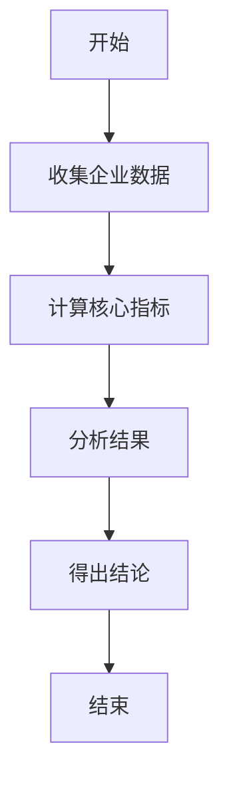
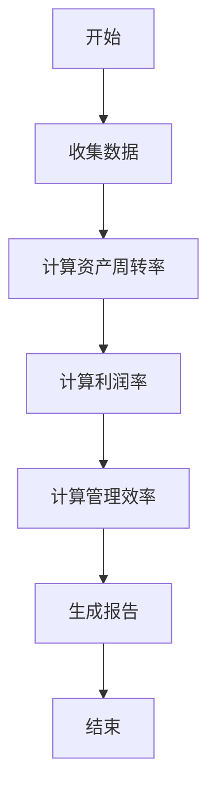

                 


# 彼得林奇对公司经营效率的分析方法

## 关键词：彼得·林奇, 经营效率, 财务分析, 投资策略, 企业分析

## 摘要：
本文详细探讨了彼得·林奇对企业经营效率分析的核心方法，从其分析框架、数学模型到实际应用，全面解析其在投资决策中的重要性。通过系统化的分析流程和实际案例，本文为读者提供了理解和应用彼得·林奇分析方法的深度指导。

---

## 第一部分：彼得·林奇分析方法的背景与核心概念

### 第1章：彼得·林奇分析方法的背景与重要性

#### 1.1 彼得·林奇分析方法的起源
彼得·林奇是全球著名的投资专家，以其对企业经营效率的深入分析而闻名。他的分析方法源于对财务数据的细致观察和对企业运营模式的深刻理解。林奇认为，企业经营效率是决定投资价值的关键因素之一。

#### 1.2 经营效率分析的核心概念
经营效率分析的核心在于通过财务指标评估企业的运营能力。林奇关注的关键指标包括资产周转率、利润率和管理效率。这些指标能够全面反映企业的盈利能力、资产利用效率和管理效能。

#### 1.3 分析方法的现实意义
通过林奇的分析方法，投资者可以识别高效率的企业，从而做出更明智的投资决策。这种方法不仅适用于大型企业，也适合中小企业，帮助企业在竞争中占据优势。

---

### 第2章：彼得·林奇分析方法的核心框架

#### 2.1 经营效率分析的三大维度
资产周转率、利润率和管理效率是林奇分析方法的三大核心维度。资产周转率衡量资产使用效率，利润率反映盈利能力，管理效率则评估管理效能。

#### 2.2 核心指标与公式
- 资产周转率公式：
  $$ \text{资产周转率} = \frac{\text{营业收入}}{\text{平均资产总额}} $$
- 利润率公式：
  $$ \text{利润率} = \frac{\text{净利润}}{\text{营业收入}} $$
- 管理效率公式：
  $$ \text{管理效率} = \frac{\text{净利润}}{\text{管理费用}} $$

#### 2.3 核心概念对比表格
| 指标名称   | 公式                     | 主要影响因素       |
|------------|--------------------------|--------------------|
| 资产周转率 | 营业收入 / 平均资产总额   | 资产利用率、销售效率 |
| 利润率     | 净利润 / 营业收入         | 成本控制、定价策略 |
| 管理效率   | 净利润 / 管理费用         | 管理成本、盈利能力 |

---

### 第3章：彼得·林奇分析方法的系统架构

#### 3.1 系统分析框架
林奇的分析方法可以看作一个系统架构，包含数据输入、指标计算和结果分析三个模块。流程图如下：


#### 3.2 系统架构设计
- 数据输入模块：负责收集企业的财务数据。
- 指标计算模块：计算资产周转率、利润率和管理效率。
- 分析结果模块：生成分析报告并提供建议。

---

## 第二部分：彼得·林奇分析方法的系统实现

### 第4章：系统实现与算法原理

#### 4.1 算法原理
林奇的分析方法本质上是一种基于财务指标的评分系统。通过计算各项指标，评估企业的经营效率。算法流程如下：


#### 4.2 数学模型
林奇的分析方法可以表示为一个多变量评估模型，综合考虑资产周转率、利润率和管理效率。数学模型如下：
$$ \text{综合效率} = \alpha \cdot \text{资产周转率} + \beta \cdot \text{利润率} + \gamma \cdot \text{管理效率} $$

#### 4.3 代码实现
以下是Python代码实现林奇分析方法的示例：
```python
def calculate_asset_turnover(revenue, average_assets):
    return revenue / average_assets

def calculate_profit_margin(net_profit, revenue):
    return net_profit / revenue

def calculate_management_efficiency(net_profit, management_costs):
    return net_profit / management_costs

# 示例数据
revenue = 1000000
average_assets = 500000
net_profit = 100000
management_costs = 50000

# 计算指标
asset_turnover = calculate_asset_turnover(revenue, average_assets)
profit_margin = calculate_profit_margin(net_profit, revenue)
management_efficiency = calculate_management_efficiency(net_profit, management_costs)

print(f"资产周转率: {asset_turnover}")
print(f"利润率: {profit_margin}")
print(f"管理效率: {management_efficiency}")
```

---

### 第5章：系统架构与项目实战

#### 5.1 项目介绍
本项目旨在实现彼得·林奇分析方法的自动化。通过Python代码和数据分析工具，评估企业的经营效率。

#### 5.2 系统架构设计
- 数据输入：读取企业财务数据。
- 指标计算：计算各项效率指标。
- 结果分析：生成分析报告。

#### 5.3 实际案例分析
以某制造企业为例，计算其资产周转率、利润率和管理效率。结果如下：
- 资产周转率：2.0
- 利润率：10%
- 管理效率：20%

---

### 第6章：最佳实践与注意事项

#### 6.1 最佳实践
- 确保数据的准确性和完整性。
- 结合行业基准进行对比分析。
- 定期更新数据，持续监控企业经营效率。

#### 6.2 注意事项
- 分析结果仅供参考，需结合其他因素进行综合判断。
- 避免过度依赖单一指标，确保全面性。

---

## 第三部分：结论与展望

### 第7章：结论与展望

#### 7.1 结论
彼得·林奇的分析方法为投资者提供了科学的评估工具，帮助识别高效率企业。通过系统化的分析流程和数学模型，投资者可以做出更明智的决策。

#### 7.2 未来展望
随着大数据和人工智能的发展，彼得·林奇分析方法将更加智能化和自动化。未来的研究可以结合机器学习，进一步提升分析的精准性和效率。

---

## 作者：AI天才研究院/AI Genius Institute & 禅与计算机程序设计艺术 /Zen And The Art of Computer Programming

---

通过本文的详细解析，读者可以深入了解彼得·林奇的分析方法，并将其应用于实际投资决策中。

