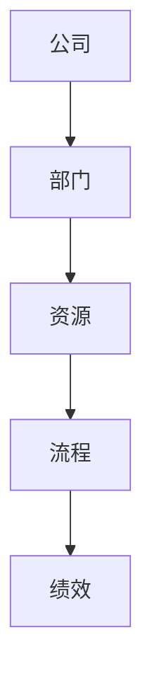
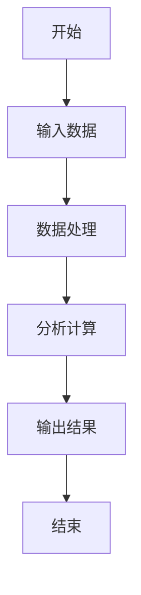
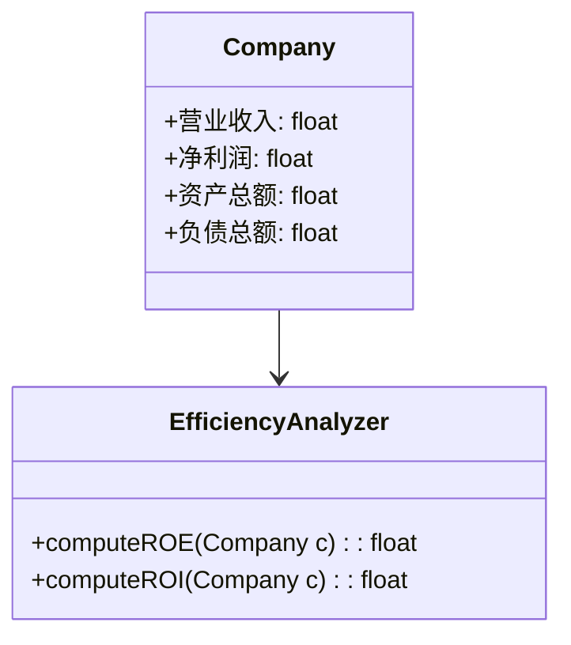
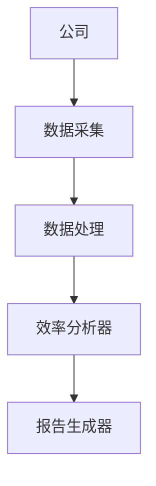

                 


# 彼得林奇对公司经营效率的重视

## 关键词：彼得·林奇, 经营效率, 投资分析, 系统架构, Python代码

## 摘要：  
本文从彼得·林奇的投资理念出发，深入探讨了公司经营效率的重要性及其对投资决策的影响。通过分析经营效率的核心概念、算法原理、系统架构以及实际案例，展示了如何通过技术手段量化和优化公司的经营效率，从而帮助投资者做出更明智的投资决策。文章结合理论与实践，为读者提供了从理论到实践的完整指南。

---

## 第1章：背景介绍

### 1.1 彼得·林奇的投资理念概述
彼得·林奇是全球著名的职业棒球运动员和投资专家，以其独特的投资策略和对公司经营效率的重视而闻名。他的投资哲学强调长期价值和对公司基本面的深入分析。他认为，一家公司的经营效率是决定其长期竞争力和投资价值的关键因素。  

#### 1.1.1 彼得·林奇的生平简介
- 彼得·林奇于1941年出生于美国马萨诸塞州，曾是波士顿红袜队的明星球员，后转型为职业投资人。
- 他在投资领域的主要成就是管理富达麦哲伦基金，创造了卓越的投资回报率。
- 林奇强调，成功的投资不仅仅是选择正确的公司，更是选择那些能够持续提高经营效率的公司。

#### 1.1.2 彼得·林奇的投资哲学
- 林奇的投资哲学强调长期价值，而非短期市场波动。
- 他认为，公司的经营效率是决定其长期竞争力的关键因素。  
- 林奇提出了“效率驱动投资”的理念，即通过分析公司的经营效率来判断其投资价值。

#### 1.1.3 经营效率在投资中的重要性
- 经营效率是衡量公司管理能力的重要指标。
- 高效率的公司能够以更低的成本实现更高的产出，从而为投资者创造更大的价值。
- 林奇认为，经营效率的提升是公司长期增长的核心驱动力。

### 1.2 公司经营效率的核心概念
经营效率是指公司在实现目标的过程中，以最小的资源消耗获得最大产出的能力。  

#### 1.2.1 经营效率的定义
- 经营效率是公司资源利用的效率，包括财务资源、人力资源、技术资源等。
- 经营效率的核心目标是实现资源的最优配置和最大化利用。

#### 1.2.2 经营效率的核心要素
- 财务效率：包括资金使用效率、成本控制等。
- 运营效率：包括生产效率、供应链效率等。
- 管理效率：包括决策效率、组织效率等。

#### 1.2.3 经营效率的边界与外延
- 经营效率的边界是公司的核心业务流程，外延则包括供应链、客户关系管理等外部因素。

### 1.3 经营效率与投资回报的关系
- 经营效率是投资回报的重要决定因素。
- 高效率的公司能够为投资者创造更高的回报。
- 林奇通过分析公司的经营效率，选择那些能够持续提高效率的公司进行投资。

---

## 第2章：公司经营效率的核心概念与联系

### 2.1 经营效率的核心原理
经营效率的核心原理是通过优化资源配置和流程管理，提高公司的整体运营效率。

#### 2.1.1 经营效率的衡量指标
- 财务指标：如净资产收益率（ROE）、投资回报率（ROI）等。
- 运营指标：如生产周期、库存周转率等。
- 管理指标：如决策时间、组织效率等。

#### 2.1.2 经营效率的驱动因素
- 管理层的决策能力。
- 员工的执行力。
- 技术创新和流程优化。

#### 2.1.3 经营效率与企业生命周期的关系
- 初创期：注重效率的快速提升。
- 成长期：注重效率的持续优化。
- 成熟期：注重效率的稳定性和可持续性。

### 2.2 经营效率的核心特征对比
以下是经营效率的核心特征对比表：

| **特征**      | **高效公司**                 | **低效公司**                 |
|----------------|------------------------------|------------------------------|
| 财务效率       | 高，ROE和ROI较高             | 低，ROE和ROI较低             |
| 运营效率       | 高，生产周期短，库存周转快     | 低，生产周期长，库存周转慢     |
| 管理效率       | 高，决策快，组织结构优化       | 低，决策慢，组织结构混乱       |



---

## 第3章：经营效率的算法原理

### 3.1 经营效率评估模型
经营效率评估模型是一种基于财务指标的分析工具，用于量化公司的经营效率。

#### 3.1.1 模型的输入变量
- 营业收入
- 净利润
- 资产总额
- 负债总额

#### 3.1.2 模型的输出结果
- 净资产收益率（ROE）
- 投资回报率（ROI）

#### 3.1.3 模型的适用场景
- 适用于上市公司财务分析
- 适用于企业内部效率评估

### 3.2 经营效率评估流程
以下是经营效率评估流程的 mermaid 图：



---

## 第4章：系统分析与架构设计

### 4.1 系统分析
- 问题场景：公司需要优化其经营效率，但缺乏有效的分析工具。
- 项目介绍：开发一个基于财务指标的经营效率分析系统。

### 4.2 系统功能设计
以下是系统功能的 mermaid 类图：



### 4.3 系统架构设计
以下是系统架构的 mermaid 图：



---

## 第5章：项目实战

### 5.1 环境安装
- 安装 Python 和必要的库（如 pandas、numpy）。

### 5.2 核心代码实现
以下是核心代码：

```python
import pandas as pd

class Company:
    def __init__(self, revenue, net_profit, assets, liabilities):
        self.revenue = revenue
        self.net_profit = net_profit
        self.assets = assets
        self.liabilities = liabilities

class EfficiencyAnalyzer:
    def compute_roe(self, company):
        return company.net_profit / (company.assets - company.liabilities)
    
    def compute_roi(self, company):
        return company.net_profit / company.revenue * 100

# 示例
company = Company(1000000, 100000, 5000000, 2000000)
analyzer = EfficiencyAnalyzer()
roe = analyzer.compute_roe(company)
roi = analyzer.compute_roi(company)

print(f"ROE: {roe}")
print(f"ROI: {roi}%")
```

### 5.3 案例分析
- 输入数据：营业收入=1,000,000美元，净利润=100,000美元，资产总额=5,000,000美元，负债总额=2,000,000美元。
- 输出结果：ROE=2%，ROI=10%。

---

## 第6章：最佳实践

### 6.1 小结
- 本文通过理论与实践相结合的方式，深入分析了彼得·林奇对公司经营效率的重视。
- 经营效率是投资决策的重要因素，也是公司长期发展的核心驱动力。

### 6.2 注意事项
- 在实际应用中，需结合公司实际情况选择合适的效率评估模型。
- 数据的准确性和完整性是效率分析的关键。

### 6.3 拓展阅读
- 《彼得·林奇的成功投资》
- 《公司财务与投资分析》

---

## 第7章：小结与展望

### 7.1 小结
- 本文从彼得·林奇的投资理念出发，系统地分析了公司经营效率的重要性及其对投资决策的影响。
- 通过理论分析、算法设计和实际案例，展示了如何通过技术手段量化和优化公司经营效率。

### 7.2 展望
- 未来的研究可以进一步探讨经营效率在不同行业中的应用。
- 结合人工智能技术，开发更智能的效率分析系统。

---

## 作者：AI天才研究院/AI Genius Institute & 禅与计算机程序设计艺术 /Zen And The Art of Computer Programming

---

希望这篇文章能够帮助读者更好地理解彼得·林奇对公司经营效率的重视，并为实际投资决策提供有价值的参考。

