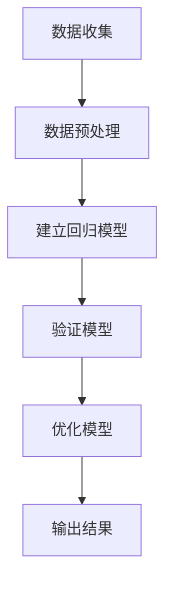
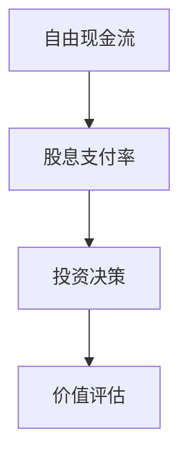
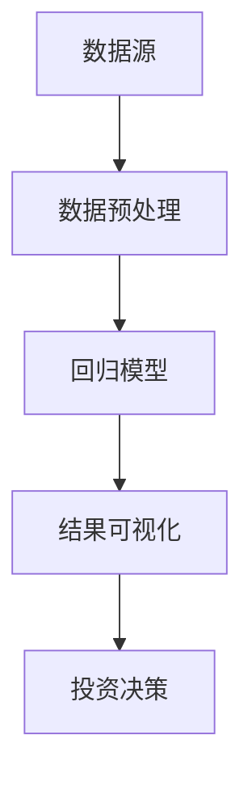
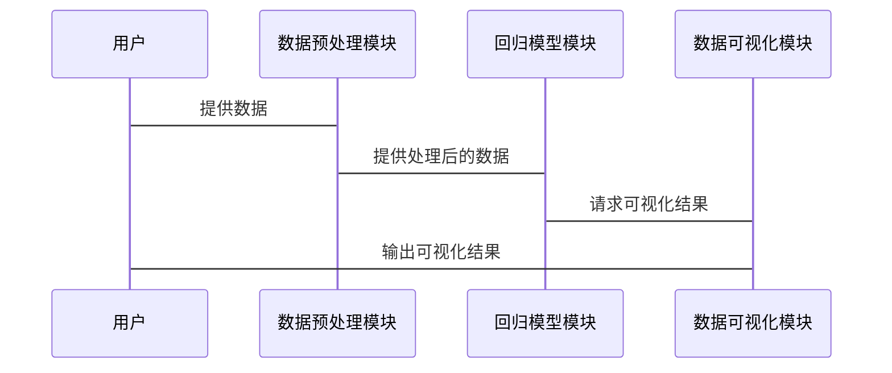

                 


# 彼得林奇对公司自由现金流与股息支付率关系的动态分析

## 关键词：自由现金流，股息支付率，动态关系，彼得林奇，投资分析，财务指标

## 摘要：本文深入分析了彼得林奇在投资分析中对自由现金流与股息支付率动态关系的研究。从核心概念到动态模型构建，从系统架构设计到项目实战，全面探讨了自由现金流与股息支付率的动态关系及其在投资决策中的应用。

---

# 第1章: 自由现金流与股息支付率的核心概念

## 1.1 自由现金流的定义与计算

### 1.1.1 自由现金流的定义
自由现金流（Free Cash Flow，FCF）是指公司在扣除所有运营成本、税费和资本支出后的剩余现金流量。它是衡量公司财务健康状况的重要指标。

### 1.1.2 自由现金流的计算公式
$$\text{FCF} = \text{EBITDA} - \text{利息支出} - \text{税费} - \text{资本支出}$$

### 1.1.3 自由现金流的分类与特征
自由现金流可以分为以下几种：
- **经营性自由现金流**：仅考虑经营活动中产生的现金流。
- **总自由现金流**：包括经营性、投资性和筹资性现金流。
- **净自由现金流**：扣除所有支出后的净现金流。

---

## 1.2 股息支付率的定义与计算

### 1.2.1 股息支付率的定义
股息支付率（Dividend Payout Ratio）是指公司净利润中用于支付股息的比例。

### 1.2.2 股息支付率的计算公式
$$\text{股息支付率} = \frac{\text{股息支付总额}}{\text{净利润}}$$

### 1.2.3 股息支付率的分类与特征
股息支付率可以分为以下几种：
- **高股息支付率**：公司倾向于将大部分净利润用于股息支付。
- **低股息支付率**：公司倾向于保留更多利润用于再投资。
- **零股息支付率**：公司不支付股息。

---

## 1.3 自由现金流与股息支付率的关系

### 1.3.1 两者关系的背景介绍
自由现金流和股息支付率都是衡量公司财务健康和投资价值的重要指标。自由现金流反映了公司产生的“现金能力”，而股息支付率反映了公司分配利润的意愿。

### 1.3.2 两者关系的动态特征
自由现金流和股息支付率之间存在动态关系。当自由现金流充足时，公司可能倾向于提高股息支付率；反之，当自由现金流不足时，公司可能降低股息支付率。

### 1.3.3 两者关系的边界与外延
自由现金流和股息支付率的关系受到公司战略、行业特点和市场环境的影响。例如，成熟行业的公司可能倾向于更高的股息支付率，而成长行业的公司可能更注重再投资。

---

## 1.4 核心概念对比分析

### 1.4.1 自由现金流与股息支付率的属性对比

| 属性            | 自由现金流（FCF）                | 股息支付率（DPR）                |
|-----------------|-----------------------------------|-----------------------------------|
| 定义            | 经营活动中产生的净现金流        | 净利润中用于支付股息的比例      |
| 计算公式        | $$\text{FCF} = \text{EBITDA} - \text{利息支出} - \text{税费} - \text{资本支出}$$ | $$\text{DPR} = \frac{\text{股息支付总额}}{\text{净利润}}$$ |
| 用途            | 评估公司财务健康和流动性        | 评估公司利润分配的意愿          |
| 受影响因素      | 营收、成本、资本支出            | 净利润、股息支付政策              |

### 1.4.2 自由现金流与股息支付率的ER实体关系图
```mermaid
er
  root
    entity(公司) {
      id: 公司ID
      name: 公司名称
      industry: 所属行业
    }
    entity(财务指标) {
      id: 指标ID
      name: 指标名称
      value: 指标值
    }
    relationship(公司-财务指标) {
      company: 公司
      financial_indicator: 财务指标
    }
```

---

# 第2章: 自由现金流与股息支付率的动态分析模型

## 2.1 动态分析模型的构建

### 2.1.1 模型构建的背景与目标
本文旨在构建一个动态分析模型，研究自由现金流与股息支付率之间的动态关系，为投资决策提供支持。

### 2.1.2 模型构建的核心原理
通过分析公司历史财务数据，利用回归分析等方法，建立自由现金流与股息支付率之间的动态关系模型。

### 2.1.3 模型构建的步骤与流程



---

## 2.2 自由现金流与股息支付率的动态关系分析

### 2.2.1 动态关系的数学模型
建立自由现金流与股息支付率之间的回归模型：

$$\text{DPR}_t = \beta_0 + \beta_1 \times \text{FCF}_t + \epsilon_t$$

其中：
- $$\text{DPR}_t$$ 表示第 $$t$$ 期的股息支付率。
- $$\text{FCF}_t$$ 表示第 $$t$$ 期的自由现金流。
- $$\beta_0$$ 和 $$\beta_1$$ 是回归系数。
- $$\epsilon_t$$ 是误差项。

### 2.2.2 动态关系的数学公式
通过回归分析，可以得到 $$\beta_1$$ 的估计值，表示自由现金流对股息支付率的影响程度。

### 2.2.3 动态关系的mermaid流程图


---

## 2.3 自由现金流与股息支付率的动态关系算法

### 2.3.1 算法原理的详细讲解
通过回归分析，计算自由现金流对股息支付率的影响系数。具体步骤如下：
1. 收集公司历史财务数据。
2. 数据预处理：清洗数据，处理缺失值。
3. 建立回归模型。
4. 计算回归系数 $$\beta_0$$ 和 $$\beta_1$$。
5. 验证模型的显著性和准确性。

### 2.3.2 算法实现的Python源代码
```python
import pandas as pd
import numpy as np
from sklearn.linear_model import LinearRegression
import matplotlib.pyplot as plt

# 数据加载
data = pd.read_csv('financial_data.csv')

# 数据预处理
X = data[['自由现金流']]
y = data['股息支付率']

# 建立回归模型
model = LinearRegression()
model.fit(X, y)

# 计算回归系数
beta_0 = model.intercept_
beta_1 = model.coef_[0]

# 可视化
plt.scatter(X, y)
plt.plot(X, beta_0 + beta_1 * X, color='red')
plt.xlabel('自由现金流')
plt.ylabel('股息支付率')
plt.title('自由现金流与股息支付率的回归关系')
plt.show()
```

### 2.3.3 算法实现的数学模型与公式
回归模型的数学公式为：

$$\text{DPR}_t = \beta_0 + \beta_1 \times \text{FCF}_t + \epsilon_t$$

---

# 第3章: 自由现金流与股息支付率动态关系的系统架构设计

## 3.1 系统分析与架构方案

### 3.1.1 问题场景介绍
本文构建了一个基于回归分析的动态关系模型，用于分析自由现金流与股息支付率之间的关系。

### 3.1.2 系统功能设计
系统功能包括：
1. 数据收集与处理。
2. 模型构建与优化。
3. 数据可视化与分析。

### 3.1.3 系统架构设计的mermaid图


---

## 3.2 系统接口与交互设计

### 3.2.1 系统接口设计
系统接口包括：
1. 数据输入接口。
2. 模型计算接口。
3. 结果输出接口。

### 3.2.2 系统交互的mermaid序列图


---

# 第4章: 自由现金流与股息支付率动态关系的项目实战

## 4.1 项目环境与工具安装

### 4.1.1 环境搭建与工具安装
- Python 3.8+
- Jupyter Notebook
- Pandas、NumPy、Scikit-learn

### 4.1.2 数据收集与处理
使用公开的财务数据集，清洗数据，处理缺失值。

## 4.2 核心算法实现

### 4.2.1 Python代码实现
```python
import pandas as pd
import numpy as np
from sklearn.linear_model import LinearRegression
import matplotlib.pyplot as plt

# 数据加载
data = pd.read_csv('financial_data.csv')

# 数据预处理
X = data[['自由现金流']]
y = data['股息支付率']

# 建立回归模型
model = LinearRegression()
model.fit(X, y)

# 计算回归系数
beta_0 = model.intercept_
beta_1 = model.coef_[0]

# 可视化
plt.scatter(X, y)
plt.plot(X, beta_0 + beta_1 * X, color='red')
plt.xlabel('自由现金流')
plt.ylabel('股息支付率')
plt.title('自由现金流与股息支付率的回归关系')
plt.show()
```

### 4.2.2 代码解读与分析
- 数据加载：使用 Pandas 读取 CSV 文件。
- 数据预处理：提取自由现金流和股息支付率数据。
- 建立回归模型：使用 Scikit-learn 的 LinearRegression 模型。
- 可视化：使用 Matplotlib 绘制散点图和回归线。

## 4.3 实际案例分析

### 4.3.1 案例背景与数据来源
以某公司 2010-2020 年的财务数据为例。

### 4.3.2 案例分析与结果解读
通过回归分析，得出自由现金流对股息支付率的影响系数 $$\beta_1$$。

### 4.3.3 案例总结与经验分享
自由现金流与股息支付率之间的动态关系受到多种因素影响，投资决策需结合多方面信息。

## 4.4 项目小结

### 4.4.1 项目成果与收获
构建了一个动态分析模型，能够定量分析自由现金流与股息支付率之间的关系。

### 4.4.2 项目中的问题与解决方案
- 数据缺失：通过数据清洗和补充处理。
- 模型准确性：通过交叉验证和参数调优提高模型性能。

---

# 第5章: 自由现金流与股息支付率动态关系的最优实践

## 5.1 最佳实践 tips

### 5.1.1 数据收集与处理的注意事项
- 确保数据的完整性和准确性。
- 处理缺失值和异常值。

### 5.1.2 模型构建与优化的技巧
- 使用交叉验证评估模型性能。
- 考虑引入其他变量（如行业因素）以提高模型准确性。

### 5.1.3 系统设计与实现的建议
- 采用模块化设计，便于功能扩展。
- 使用可视化工具帮助理解数据和结果。

## 5.2 小结与展望

### 5.2.1 本书内容的总结
本文从核心概念到动态模型构建，从系统设计到项目实战，全面分析了自由现金流与股息支付率的动态关系。

### 5.2.2 未来展望
未来可以进一步研究自由现金流与股息支付率之间的动态关系，结合机器学习算法提高模型预测能力。

---

# 作者：AI天才研究院 & 禅与计算机程序设计艺术

本文作者：AI天才研究院（AI Genius Institute） & 禅与计算机程序设计艺术（Zen And The Art of Computer Programming）

