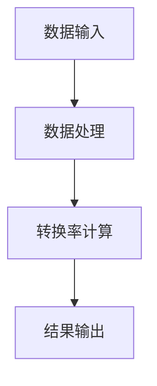
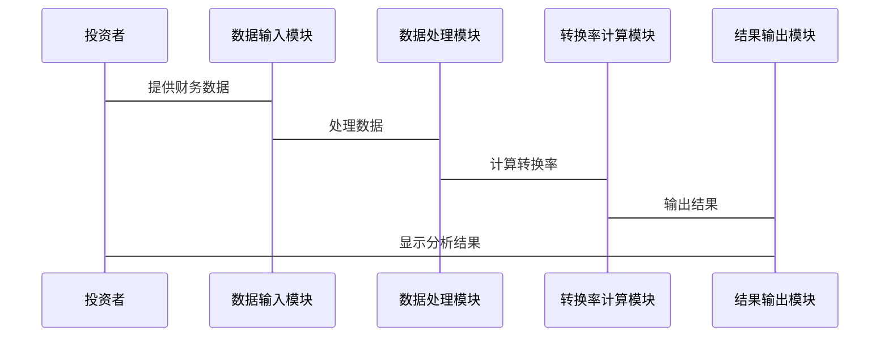

                 


# 彼得·林奇对公司自由现金流转换率的分析

> 关键词：彼得·林奇，自由现金流，转换率，投资分析，企业价值

> 摘要：本文将深入探讨彼得·林奇对公司自由现金流转换率的分析方法，从基本概念到算法原理，再到实际应用，帮助读者全面理解这一重要投资指标。

---

# 第一部分: 公司自由现金流转换率的背景与概念

## 第1章: 自由现金流的基本概念

### 1.1 自由现金流的定义与分类

#### 1.1.1 自由现金流的定义
自由现金流（Free Cash Flow，简称FCF）是指公司在支付了所有运营成本、税费、折旧和偿付债务后的剩余现金。它是公司经营活动中产生的可用于再投资或回报股东的现金流量。

#### 1.1.2 自由现金流的分类
自由现金流主要分为三类：
1. **经营现金流（Operating Cash Flow）**：来自公司日常经营活动中产生的现金流入和流出。
2. **投资现金流（Investing Cash Flow）**：来自公司投资于长期资产或收购其他公司产生的现金流量。
3. **融资现金流（Financing Cash Flow）**：来自公司通过债务或股权融资活动产生的现金流量。

#### 1.1.3 自由现金流在企业价值评估中的重要性
自由现金流是评估企业价值的核心指标，因为它反映了公司创造现金流的能力，而现金流是公司持续经营和成长的基础。

---

### 1.2 转换率的基本概念

#### 1.2.1 转换率的定义
转换率（Conversion Rate）是指公司将净利润转换为自由现金流的能力。它是衡量公司财务健康状况和盈利能力的重要指标。

#### 1.2.2 转换率的计算公式
转换率的计算公式为：
$$
\text{转换率} = \frac{\text{自由现金流}}{\text{净利润}}
$$

#### 1.2.3 转换率在投资分析中的作用
转换率帮助投资者评估公司净利润中有多大比例能够转化为实际的现金流。高转换率意味着公司能够有效地将利润转化为现金，从而支持其业务扩展和股东回报。

---

### 1.3 彼得·林奇投资分析方法概述

#### 1.3.1 彼得·林奇的投资者理念
彼得·林奇是美国著名的投资专家，他认为投资者应该选择那些具有持续增长潜力的公司，并且关注公司的基本面，尤其是现金流。

#### 1.3.2 林奇对自由现金流的关注点
林奇认为，自由现金流是衡量公司财务健康状况的核心指标。他特别关注公司是否能够通过经营活动产生足够的现金流来支持其业务增长。

#### 1.3.3 林奇分析方法的核心思想
林奇的投资分析方法以基本面分析为核心，重点关注公司的财务报表，尤其是现金流和利润表。他认为，只有那些能够持续产生自由现金流的公司才具有长期投资价值。

---

## 第2章: 自由现金流转换率的核心概念

### 2.1 自由现金流转换率的定义

#### 2.1.1 自由现金流转换率的公式
自由现金流转换率的计算公式为：
$$
\text{自由现金流转换率} = \frac{\text{自由现金流}}{\text{营业收入}}
$$

#### 2.1.2 自由现金流转换率的计算方法
自由现金流转换率的计算需要结合公司的财务报表，特别是利润表和现金流量表。以下是具体的计算步骤：
1. 计算公司经营活动产生的现金流（从现金流量表中获取）。
2. 计算公司的营业收入（从利润表中获取）。
3. 将经营活动现金流除以营业收入，得到自由现金流转换率。

---

### 2.2 自由现金流转换率的关键属性

#### 2.2.1 转换率的敏感性分析
自由现金流转换率对公司的业务模式和行业特点高度敏感。例如，制造行业的公司通常具有较高的转换率，而科技行业的公司可能由于研发投入较高而转换率较低。

#### 2.2.2 转换率的行业差异性
不同行业的自由现金流转换率差异较大。例如，零售行业的公司通常具有较高的转换率，而软件行业的公司可能由于前期研发投入较大而转换率较低。

#### 2.2.3 转换率的周期性特征
自由现金流转换率会受到经济周期的影响。在经济繁荣时期，公司通常具有较高的转换率；而在经济衰退时期，公司可能面临现金流减少的问题。

---

### 2.3 自由现金流转换率与企业价值的关系

#### 2.3.1 转换率对企业价值的影响
自由现金流转换率越高，公司创造现金流的能力越强，从而企业的整体价值也越高。

#### 2.3.2 转换率与股价的关系
高转换率通常意味着公司具有较强的盈利能力，这会吸引更多的投资者，从而推高股价。

#### 2.3.3 转换率在投资决策中的应用
投资者可以通过分析公司的自由现金流转换率，评估其财务健康状况和投资价值。对于那些转换率持续增长的公司，投资者可以长期持有；而对于转换率持续下降的公司，投资者需要警惕潜在的风险。

---

## 第3章: 自由现金流转换率的算法原理

### 3.1 自由现金流转换率的计算公式

#### 3.1.1 自由现金流转换率的数学模型
自由现金流转换率的数学模型可以表示为：
$$
\text{转换率} = \frac{\text{自由现金流}}{\text{营业收入}}
$$

#### 3.1.2 自由现金流转换率的公式推导
自由现金流的计算公式为：
$$
\text{自由现金流} = \text{营业收入} - \text{运营成本} - \text{税费} - \text{折旧与摊销}
$$

因此，自由现金流转换率可以进一步表示为：
$$
\text{转换率} = \frac{\text{营业收入} - \text{运营成本} - \text{税费} - \text{折旧与摊销}}{\text{营业收入}}
$$

---

### 3.2 自由现金流转换率的算法流程

#### 3.2.1 数据输入与处理
1. 收集公司最近几年的财务报表，包括利润表和现金流量表。
2. 提取经营活动现金流和营业收入数据。

#### 3.2.2 转换率计算步骤
1. 计算自由现金流：经营活动现金流减去运营成本、税费、折旧与摊销。
2. 计算转换率：将自由现金流除以营业收入。

#### 3.2.3 结果输出与分析
1. 将计算结果与行业平均水平进行对比。
2. 分析转换率的变化趋势，判断公司的财务健康状况。

---

### 3.3 自由现金流转换率的优化算法

#### 3.3.1 数据预处理方法
1. 确保财务数据的准确性。
2. 处理异常值或缺失值。

#### 3.3.2 算法优化策略
1. 使用加权平均法计算自由现金流。
2. 考虑通货膨胀对现金流的影响。

#### 3.3.3 算法的复杂度分析
自由现金流转换率的计算过程相对简单，时间复杂度为O(1)，空间复杂度为O(1)。

---

## 第4章: 自由现金流转换率的系统分析与架构设计

### 4.1 系统分析与需求定义

#### 4.1.1 问题场景介绍
投资者需要一种高效的方法来计算和分析公司的自由现金流转换率，以评估其投资价值。

#### 4.1.2 项目目标与范围
开发一个基于财务数据的自由现金流转换率分析系统，帮助投资者快速获取和分析相关数据。

#### 4.1.3 系统功能需求
1. 数据输入与处理模块。
2. 自由现金流转换率计算模块。
3. 结果输出与可视化模块。

---

### 4.2 系统架构设计

#### 4.2.1 系统模块划分
1. 数据输入模块。
2. 数据处理模块。
3. 转换率计算模块。
4. 结果输出模块。

#### 4.2.2 系统架构图（Mermaid）


#### 4.2.3 系统交互序列图（Mermaid）


---

## 第5章: 自由现金流转换率的项目实战

### 5.1 环境安装与配置

#### 5.1.1 系统环境
1. 操作系统：Windows/Mac/Linux。
2. 开发工具：Python、Jupyter Notebook。
3. 数据库：MySQL/SQLite。

#### 5.1.2 安装依赖包
1. Python库：pandas、numpy、matplotlib。
2. 数据处理工具：Excel、CSV文件。

---

### 5.2 系统核心实现源代码

#### 5.2.1 数据处理代码
```python
import pandas as pd

# 读取CSV文件
df = pd.read_csv('financial_data.csv')

# 提取经营活动现金流和营业收入
operating_cash_flow = df['Operating Cash Flow'].values[0]
revenue = df['Revenue'].values[0]

# 计算自由现金流转换率
free_cash_flow_conversion_rate = operating_cash_flow / revenue

print(f"自由现金流转换率：{free_cash_flow_conversion_rate}")
```

#### 5.2.2 转换率计算代码
```python
import pandas as pd
import matplotlib.pyplot as plt

# 读取CSV文件
df = pd.read_csv('financial_data.csv')

# 计算自由现金流转换率
df['Free Cash Flow Conversion Rate'] = df['Operating Cash Flow'] / df['Revenue']

# 可视化结果
plt.figure(figsize=(10, 6))
df['Free Cash Flow Conversion Rate'].plot.line()
plt.title('自由现金流转换率趋势图')
plt.xlabel('年份')
plt.ylabel('转换率')
plt.show()
```

---

### 5.3 实际案例分析与解读

#### 5.3.1 案例背景
以苹果公司为例，分析其自由现金流转换率。

#### 5.3.2 数据来源
使用苹果公司最近几年的财务报表数据。

#### 5.3.3 计算与分析
通过代码计算苹果公司的自由现金流转换率，并绘制趋势图，分析其变化趋势。

---

## 第6章: 自由现金流转换率的最佳实践与总结

### 6.1 最佳实践

#### 6.1.1 数据质量检查
确保财务数据的准确性和完整性。

#### 6.1.2 定期更新分析
根据最新的财务报表，定期更新转换率计算和分析。

#### 6.1.3 结合其他指标分析
将自由现金流转换率与其他财务指标（如ROE、ROA）结合分析，以全面评估公司价值。

---

### 6.2 小结

自由现金流转换率是衡量公司财务健康状况和投资价值的重要指标。通过本文的分析，读者可以深入了解彼得·林奇的投资分析方法，并将其应用于实际投资决策中。

---

### 6.3 注意事项

1. 财务数据可能存在滞后性，投资者需注意数据的时间范围。
2. 转换率的行业差异较大，投资者需结合行业特点进行分析。
3. 转换率分析应结合其他财务指标，以全面评估公司价值。

---

### 6.4 拓展阅读

1. 彼得·林奇的《投资最重要的事情》。
2. 股权投资经典书籍：《价值投资入门》。
3. 公司财务报表分析的相关书籍和课程。

---

作者：AI天才研究院/AI Genius Institute & 禅与计算机程序设计艺术 /Zen And The Art of Computer Programming

