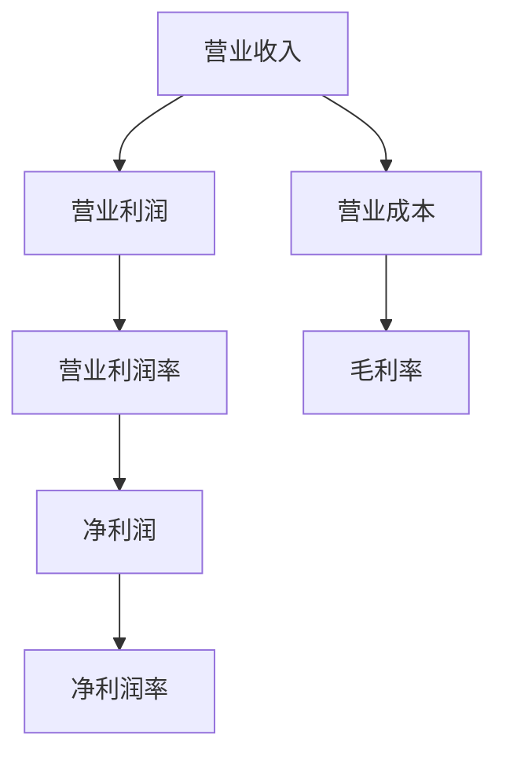
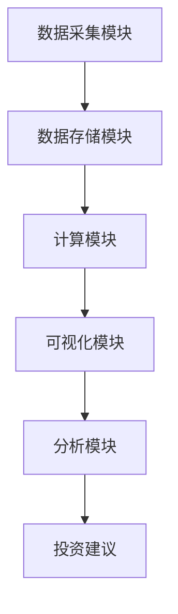
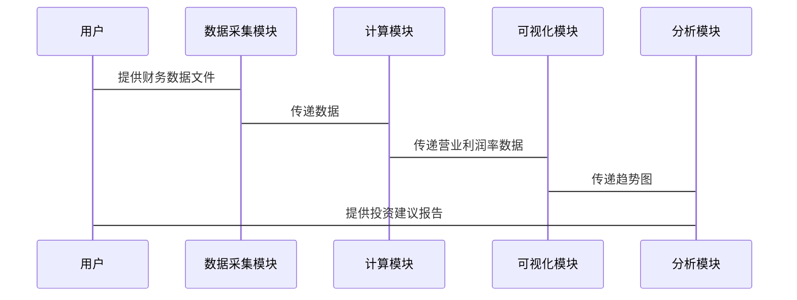

                 


# 彼得林奇对公司营业利润率趋势的分析

## 关键词：彼得林奇，营业利润率，财务分析，投资策略，趋势分析

## 摘要：本文详细探讨了彼得·林奇如何通过分析公司的营业利润率趋势来评估其投资价值。文章从定义和重要性入手，结合其他财务指标对比，系统分析了营业利润率的计算方法和应用场景，并通过实际案例展示其在投资决策中的应用。最后，本文总结了最佳实践和注意事项，帮助投资者更好地理解和应用这一关键指标。

---

## 第一部分: 背景介绍

### 第1章: 营业利润率的定义与重要性

#### 1.1 营业利润率的定义
营业利润率是衡量公司盈利能力的重要指标，表示公司每单位收入中能够转化为营业利润的比例。其计算公式为：

$$\text{营业利润率} = \frac{\text{营业利润}}{\text{营业收入}}$$

营业利润包括公司日常运营中的收入和支出，但不包括非经营性损益，如投资收益或损失。因此，营业利润率更能反映公司主营业务的盈利能力。

#### 1.2 营业利润率的重要性
- **反映公司运营效率**：营业利润率高的公司通常具有较强的议价能力或成本控制能力。
- **预测公司未来表现**：通过分析营业利润率的趋势，投资者可以判断公司主营业务的盈利能力是否稳定或改善。
- **与股东价值密切相关**：公司通过提高营业利润率，可以增加净利润，从而提升股东价值。

#### 1.3 彼得林奇对营业利润率的关注
彼得·林奇是价值投资的代表人物，他强调对公司基本面的深入分析。他认为，营业利润率是衡量公司盈利能力的关键指标，能够帮助投资者识别那些具有持续竞争优势的公司。

---

### 第2章: 营业利润率与其他财务指标的对比

#### 2.1 净利润率
净利润率是衡量公司整体盈利能力的指标，计算公式为：

$$\text{净利润率} = \frac{\text{净利润}}{\text{营业收入}}$$

与营业利润率不同，净利润率考虑了税后利润，但同时也受到公司非经营性因素（如税收政策、利息支出）的影响。

#### 2.2 毛利率
毛利率是衡量公司产品或服务盈利能力的指标，计算公式为：

$$\text{毛利率} = \frac{\text{营业收入} - \text{营业成本}}{\text{营业收入}}$$

毛利率与营业利润率的区别在于，毛利率只考虑了营业成本，而营业利润率还包括了其他运营费用。

#### 2.3 营业利润率与ROE的对比
ROE（净资产收益率）是衡量公司使用股东资金效率的指标，计算公式为：

$$\text{ROE} = \frac{\text{净利润}}{\text{股东权益}}$$

与营业利润率相比，ROE更关注公司使用股东资金创造利润的能力，而营业利润率更关注公司主营业务的盈利能力。

---

## 第二部分: 核心概念与联系

### 第3章: 营业利润率的核心概念

#### 3.1 核心概念的属性特征对比
下表展示了营业利润率与其他关键财务指标的对比：

| 指标名称   | 定义                                                                 | 公式                                                                 |
|------------|----------------------------------------------------------------------|----------------------------------------------------------------------|
| 营业利润率  | 营业利润与营业收入的比率                                             | $$\text{营业利润率} = \frac{\text{营业利润}}{\text{营业收入}}$$ |
| 毛利率      | 营业收入减去营业成本的比率                                           | $$\text{毛利率} = \frac{\text{营业收入} - \text{营业成本}}{\text{营业收入}}$$ |
| 净利润率    | 净利润与营业收入的比率                                               | $$\text{净利润率} = \frac{\text{净利润}}{\text{营业收入}}$$         |

#### 3.2 营业利润率的实体关系图
下图展示了营业利润率与其他财务指标的关系：



---

## 第三部分: 算法原理

### 第4章: 营业利润率的计算与趋势分析

#### 4.1 算法原理
营业利润率的计算过程如下：

1. 计算营业利润：营业利润 = 营业收入 - 营业成本 - 营业费用
2. 计算营业利润率：$$\text{营业利润率} = \frac{\text{营业利润}}{\text{营业收入}}$$

趋势分析步骤如下：

1. 收集公司过去5年的营业利润率数据。
2. 绘制趋势图：使用折线图展示营业利润率的变化趋势。
3. 分析趋势：判断营业利润率是否呈现上升、下降或稳定趋势。

#### 4.2 算法实现

```python
import pandas as pd
import matplotlib.pyplot as plt

# 示例数据：假设我们有一个包含营业收入和营业利润的DataFrame
data = {
    'year': [2018, 2019, 2020, 2021, 2022],
    'revenue': [100, 120, 140, 160, 180],
    'operating_profit': [20, 24, 28, 32, 36]
}
df = pd.DataFrame(data)

# 计算营业利润率
df['operating_margin'] = df['operating_profit'] / df['revenue']

# 绘制趋势图
plt.figure(figsize=(10, 6))
plt.plot(df['year'], df['operating_margin'], 'b-', marker='o')
plt.title('营业利润率趋势图')
plt.xlabel('年份')
plt.ylabel('营业利润率')
plt.grid(True)
plt.show()
```

#### 4.3 趋势分析案例
以某公司为例，假设其过去5年的营业利润率为：15%、18%、16%、20%、22%。从趋势图可以看出，营业利润率整体呈上升趋势，但中间有一年（2020年）出现了小幅下降，可能是因为市场竞争加剧或成本上升所致。

---

## 第四部分: 系统分析与架构设计

### 第5章: 营业利润率分析系统的设计

#### 5.1 系统功能设计
- 数据采集模块：从财务报表中提取营业收入和营业利润数据。
- 计算模块：计算营业利润率。
- 可视化模块：生成趋势图。
- 分析模块：判断趋势并给出投资建议。

#### 5.2 系统架构设计



#### 5.3 系统接口设计
- 输入接口：财务数据文件（如Excel或CSV格式）。
- 输出接口：趋势图和投资建议报告。

#### 5.4 系统交互流程



---

## 第五部分: 项目实战

### 第6章: 营业利润率分析的实战应用

#### 6.1 案例分析：以微软为例
- 数据来源：微软过去5年的财务报表。
- 计算过程：
  - 营业收入：逐年增长。
  - 营业利润：逐年增长且利润率稳步提升。
- 趋势图：显示微软的营业利润率呈上升趋势。

#### 6.2 投资建议
- 如果营业利润率持续上升，建议增持或买入。
- 如果营业利润率出现大幅下降，建议进一步调查原因或考虑卖出。

---

## 第六部分: 最佳实践与注意事项

### 第7章: 总结与注意事项

#### 7.1 总结
营业利润率是衡量公司主营业务盈利能力的关键指标，通过分析其趋势，投资者可以更好地评估公司的财务健康状况和投资价值。

#### 7.2 注意事项
- 数据来源的可靠性：确保数据准确无误。
- 趋势分析的周期：选择适当的周期长度进行分析。
- 结合其他指标：营业利润率应与其他财务指标结合使用，以全面评估公司财务状况。

#### 7.3 投资建议
- 对于长期投资者，建议关注营业利润率的长期趋势。
- 对于短期投资者，建议结合市场环境和行业趋势进行判断。

---

## 小结

彼得·林奇通过深入分析公司的营业利润率趋势，识别出那些具有持续竞争优势的公司。本文详细介绍了营业利润率的定义、计算方法、与其他指标的对比，以及如何通过系统设计和实战案例来分析和应用这一指标。希望读者能够通过本文，更好地理解和应用营业利润率的分析方法，从而在投资决策中做出更明智的选择。

---

## 作者

作者：AI天才研究院/AI Genius Institute & 禅与计算机程序设计艺术 /Zen And The Art of Computer Programming

