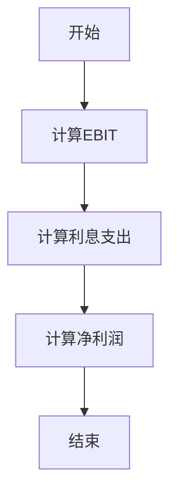
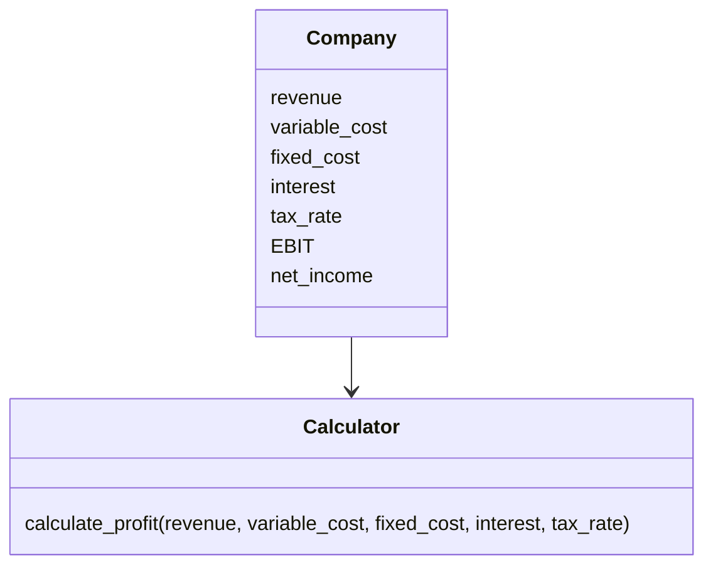
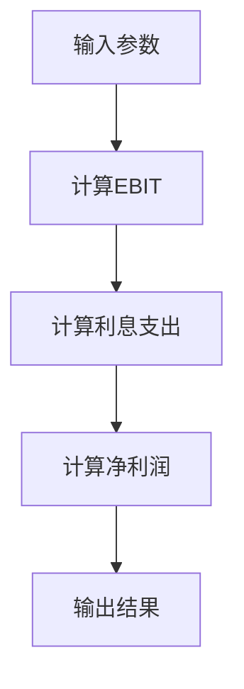

                 


# 彼得林奇对公司营运杠杆与财务杠杆组合效应的分析

## 关键词：公司杠杆，财务杠杆，营运杠杆，组合效应，投资分析

## 摘要：本文分析彼得·林奇如何阐述和应用营运杠杆与财务杠杆的组合效应，展示这些杠杆如何影响公司的财务表现和投资价值，结合数学模型、算法原理和系统架构，提供深入的技术分析和实际应用案例。

---

# 第一部分: 背景介绍

## 第1章: 营运杠杆与财务杠杆的基本概念

### 1.1 杠杆的基本概念

#### 1.1.1 营运杠杆的定义与特点
- **定义**：营运杠杆衡量公司通过固定成本资产使用效率来影响利润的能力。
- **特点**：
  - 固定成本的存在导致边际收益增加。
  - 销量变化直接影响利润变化。

#### 1.1.2 财务杠杆的定义与特点
- **定义**：财务杠杆衡量公司使用债务融资以提高股东权益回报的能力。
- **特点**：
  - 利息税盾效应。
  - 增加财务风险。

#### 1.1.3 营运杠杆与财务杠杆的区别与联系
- **区别**：营运杠杆涉及运营效率，财务杠杆涉及资本结构。
- **联系**：两者共同影响公司资本成本和风险。

### 1.2 问题背景与问题描述

#### 1.2.1 公司杠杆效应的背景介绍
- 经济波动中，杠杆效应放大收益和亏损。

#### 1.2.2 营运杠杆与财务杠杆的组合效应
- 组合使用可放大收益，但也增加风险。

#### 1.2.3 问题的边界与外延
- 营运杠杆受行业影响，财务杠杆受资本结构影响。

### 1.3 问题解决与概念结构

#### 1.3.1 营运杠杆与财务杠杆的组合模型
- 模型结合固定成本和债务融资。

#### 1.3.2 杠杆效应的核心要素组成
- 营运杠杆：固定成本和边际成本。
- 财务杠杆：债务利息和税盾效应。

#### 1.3.3 杠杆效应的数学模型与公式
- 利润公式：`净利润 = (EBIT - 利息支出) * (1 - 税率)`

---

# 第二部分: 核心概念与联系

## 第2章: 营运杠杆与财务杠杆的组合效应分析

### 2.1 营运杠杆与财务杠杆的组合模型

#### 2.1.1 营运杠杆对财务杠杆的影响
- 边际收益增加，财务杠杆效应增强。

#### 2.1.2 财务杠杆对营运杠杆的影响
- 增加固定成本，提升边际收益。

#### 2.1.3 组合效应的数学模型
- `EBIT = (销售收入 - 变动成本 - 固定成本)`
- `净利润 = (EBIT - 利息支出) * (1 - 税率)`

### 2.2 营运杠杆与财务杠杆的协同作用

#### 2.2.1 营运杠杆对财务杠杆的影响
- 提高EBIT，增强财务杠杆效果。

#### 2.2.2 财务杠杆对营运杠杆的影响
- 增加固定成本，提升EBIT。

#### 2.2.3 组合效应的优化策略
- 平衡杠杆比例，降低风险。

### 2.3 组合效应的边界条件与限制

#### 2.3.1 营运杠杆的局限性
- 销量下降可能导致亏损。

#### 2.3.2 财务杠杆的局限性
- 高负债增加破产风险。

#### 2.3.3 组合效应的风险与挑战
- 经济衰退时风险放大。

---

# 第三部分: 算法原理

## 第3章: 营运杠杆与财务杠杆的组合效应分析算法

### 3.1 算法流程图


### 3.2 Python代码实现

```python
# 计算EBIT和净利润
def calculate_profit(revenue, variable_cost, fixed_cost, interest, tax_rate):
    EBIT = revenue - variable_cost - fixed_cost
    net_income = (EBIT - interest) * (1 - tax_rate)
    return EBIT, net_income

revenue = 1000
variable_cost = 600
fixed_cost = 200
interest = 100
tax_rate = 0.3

EBIT, net_income = calculate_profit(revenue, variable_cost, fixed_cost, interest, tax_rate)
print(f"EBIT: {EBIT}, 净利润: {net_income}")
```

### 3.3 代码解读与分析
- 函数`calculate_profit`计算EBIT和净利润。
- 参数包括收入、可变成本、固定成本、利息和税率。
- 返回EBIT和净利润，展示杠杆效应的实际计算。

---

# 第四部分: 数学模型

## 第4章: 营运杠杆与财务杠杆的数学模型

### 4.1 营运杠杆的数学模型

#### 4.1.1 营运杠杆系数公式
$$\text{营运杠杆系数} = \frac{\text{边际收入}}{\text{边际成本}}$$

#### 4.1.2 举例分析
假设边际收入为100，边际成本为50，营运杠杆系数为2。

### 4.2 财务杠杆的数学模型

#### 4.2.1 财务杠杆系数公式
$$\text{财务杠杆系数} = \frac{\text{净利润变动率}}{\text{EBIT变动率}}$$

#### 4.2.2 举例分析
假设EBIT变化10%，净利润变化20%，财务杠杆系数为2。

### 4.3 组合效应的数学模型

#### 4.3.1 组合杠杆系数公式
$$\text{组合杠杆系数} = \text{营运杠杆系数} \times \text{财务杠杆系数}$$

#### 4.3.2 举例分析
营运杠杆系数为2，财务杠杆系数为2，组合杠杆系数为4。

---

# 第五部分: 系统分析与架构设计

## 第5章: 问题场景介绍

### 5.1 系统功能设计

#### 5.1.1 领域模型类图


### 5.2 系统架构设计

#### 5.2.1 系统架构流程图


### 5.3 系统接口设计

#### 5.3.1 输入接口
- 输入：收入、可变成本、固定成本、利息、税率。

#### 5.3.2 输出接口
- 输出：EBIT、净利润。

---

# 第六部分: 项目实战

## 第6章: 环境安装与系统实现

### 6.1 环境安装
- 安装Python和必要的库（如mermaid）。

### 6.2 核心代码实现

#### 6.2.1 安装依赖
```bash
pip install mermaid
```

#### 6.2.2 实现代码
```python
from mermaid import Diagram

with Diagram("杠杆分析") as diag:
   开始 --> 计算EBIT
    计算EBIT --> 计算利息支出
    计算利息支出 --> 计算净利润
    计算净利润 --> 结束
```

### 6.3 案例分析与解读

#### 6.3.1 案例分析
公司A：收入1000，可变成本600，固定成本200，利息100，税率30%。
计算EBIT=200，净利润= (200-100)*0.7=70。

#### 6.3.2 结果解读
EBIT=200，净利润=70，显示杠杆效应的实际影响。

### 6.4 项目小结
项目通过代码实现分析了杠杆效应，展示了组合效应的实际应用。

---

# 第七部分: 最佳实践

## 第7章: 总结与注意事项

### 7.1 总结
- 营运杠杆和财务杠杆的组合效应放大收益和风险。
- 平衡杠杆比例，降低整体风险。

### 7.2 注意事项
- 避免过度杠杆，防止财务危机。
- 定期评估杠杆效应，适应市场变化。

### 7.3 拓展阅读
- 彼得·林奇的其他著作，深入理解杠杆应用。

---

作者：AI天才研究院/AI Genius Institute & 禅与计算机程序设计艺术 /Zen And The Art of Computer Programming

